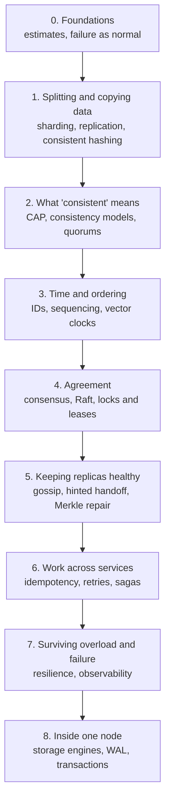

# Distributed Systems Learning Path

> **What this page is:** the distributed-systems concept files in this repo, in the order to read them, with one line on why each comes next. It doesn't add new material; it gives you a route through what's already here.
>
> 💡 **Distributed system:** a program that runs on several machines that talk over a network and have to act like one system. Almost everything hard about it comes from two facts: **the network can lose or delay messages**, and **machines can fail independently** (one dies while the others keep going).

## How to use it

- Read the stages in order. Inside a stage, the order matters less.
- For each file, read sections 1–4 (summary, problem, how it works, when to use) first. Come back for the rest later.
- After each stage, open the interview listed under **"See it in a design"** and find where the idea shows up. That's where it sticks.
- Expect 1–2 evenings per stage. Stage 4 (consensus) is the hardest; it's fine to read it twice.

---

## Stage 0: Foundations

| Read | Why now |
|---|---|
| [Back-of-the-envelope](HLD/concepts/back-of-the-envelope.md) | You can't tell if you need more than one machine until you can estimate load and data size. Every design starts here. |

**The mindset to take away:** at 100+ machines, *something is always broken*. Distributed design is about making that normal case boring.

**See it in a design:** the node-count estimate in [Distributed KV Store L4 §2](HLD/interviews/distributed-kv-store/L4-mid.md#2-back-of-the-envelope-estimates).

---

## Stage 1: Splitting and copying data

| Read | Why now |
|---|---|
| [Sharding & replication](HLD/concepts/sharding-and-replication.md) | The two basic moves: **split** data across machines so it fits (sharding), **copy** it so it survives (replication). Everything later refines these two. |
| [Consistent hashing](HLD/concepts/consistent-hashing.md) | Once data is split, you need a way to find which machine has a key that doesn't reshuffle everything when a machine joins or leaves. |

**See it in a design:** [URL Shortener](HLD/interviews/url-shortener/README.md) (simple sharding) → [Distributed KV Store L4 §4](HLD/interviews/distributed-kv-store/L4-mid.md#4-high-level-design) (ring + 3 replicas).

---

## Stage 2: What "consistent" actually means

| Read | Why now |
|---|---|
| [CAP & consistency](HLD/concepts/cap-and-consistency.md) | As soon as there are copies, they can disagree. This file names the possible promises (strong, eventual, read-your-writes…) and explains why a network partition forces you to choose between consistency and availability. |
| [Caching strategies](HLD/concepts/caching-strategies.md) | A cache is just another copy of the data, so it has the same staleness problem. A familiar example of stage-2 thinking. |

**The key idea:** "consistent" is not one thing. Always ask *"which guarantee, for which data?"*

**See it in a design:** quorum reads/writes (R + W > N) in [Distributed KV Store L4 §4.3](HLD/interviews/distributed-kv-store/L4-mid.md#43-quorum-reads-and-writes).

---

## Stage 3: Time and ordering

| Read | Why now |
|---|---|
| [ID generation](HLD/concepts/id-generation.md) | First taste of the time problem: Snowflake-style IDs use the machine clock, and clocks on different machines drift apart. |
| [Message ordering & sequencing](HLD/concepts/message-ordering-and-sequencing.md) | You can't trust wall clocks to order events across machines, so you assign sequence numbers from one place per conversation/partition. |
| [Vector clocks & conflict resolution](HLD/concepts/vector-clocks-and-conflict-resolution.md) | When two machines accept writes at the same time with no single sequencer, you need a way to tell "this came after that" from "these happened concurrently", and then merge. |

**The key idea:** there is no global "now". Order comes from a single sequencer, from logical clocks, or from agreement (next stage).

**See it in a design:** per-chat sequence numbers in [Chat System L5](HLD/interviews/chat-system/L5-senior.md); the shopping-cart sibling example in [Distributed KV Store L5 §3.3](HLD/interviews/distributed-kv-store/L5-senior.md#33-conflicts-lww-vs-vector-clocks).

---

## Stage 4: Agreement (consensus)

| Read | Why now |
|---|---|
| [Consensus & Raft](HLD/concepts/consensus-and-raft.md) | Stages 2–3 showed what goes wrong when replicas disagree. Consensus is how a group of machines agrees on one order of operations even when some fail. It's the base of etcd, ZooKeeper, Kafka's controller and CockroachDB. |
| [Distributed locks & leases](HLD/concepts/distributed-locks-and-leases.md) | The most common thing people build on top of consensus, and the most commonly broken: a lock is only safe with leases (a lock with an expiry) and **fencing tokens** (an increasing number that lets storage reject a stale lock holder). |

**The key idea:** majority agreement gives one truth, but the minority side of a network split must stop. That's the price of strong consistency.

**See it in a design:** multi-Raft ranges in [Distributed KV Store L6 §2](HLD/interviews/distributed-kv-store/L6-staff.md#2-the-cp-alternative-multi-raft-ranges); driver leases in [Ride-Sharing](HLD/interviews/ride-sharing/README.md). **Run it:** [Raft leader election](see-it-work/raft-leader-election/README.md): freeze a leader, partition the cluster, watch terms decide who's in charge.

---

## Stage 5: Keeping replicas healthy without a leader

| Read | Why now |
|---|---|
| [Gossip & failure detection](HLD/concepts/gossip-and-failure-detection.md) | Without a central registry, how does each machine learn who's alive? Gossip spreads membership; the phi accrual detector says "probably dead" instead of a yes/no timeout. |
| [Hinted handoff & sloppy quorum](HLD/concepts/hinted-handoff-and-sloppy-quorum.md) | When a replica is down, another node holds its writes temporarily. Buys availability; costs the clean R + W > N guarantee from stage 2. |
| [Merkle trees & anti-entropy](HLD/concepts/merkle-trees-and-anti-entropy.md) | Replicas still drift. Merkle trees (trees of hashes) find the few differing keys among billions cheaply, so background repair can fix them. |

**The key idea:** leaderless systems (stage 5) and leader-based systems (stage 4) are the two big families. Leaderless = always writable, but you must clean up afterwards.

**See it in a design:** all of [Distributed KV Store L5](HLD/interviews/distributed-kv-store/L5-senior.md). **Run it:** [hash ring + quorums + hinted handoff](see-it-work/hash-ring-quorum/README.md), a small simulation where you kill nodes and watch a sloppy quorum produce a stale read.

---

## Stage 6: Work that spans several services

| Read | Why now |
|---|---|
| [Idempotency & delivery semantics](HLD/concepts/idempotency-and-delivery-semantics.md) | Networks retry, so messages arrive twice. "Exactly once" is really *at-least-once delivery + idempotent processing* (doing it twice has the same effect as once). |
| [Retries, backoff & DLQ](HLD/concepts/retries-backoff-and-dlq.md) | How to retry without making an outage worse, and where to park messages that keep failing (a dead-letter queue). |
| [Sagas & distributed transactions](HLD/concepts/sagas-and-distributed-transactions.md) | When one business action touches several services (book a ride, charge a card), you can't use one database transaction. Sagas run steps with "undo" steps for failure. Also explains why two-phase commit (2PC) is rarely used across services. |

**See it in a design:** [Notification System](HLD/interviews/notification-system/README.md) (retries, idempotency) → [Ride-Sharing](HLD/interviews/ride-sharing/README.md) (sagas).

---

## Stage 7: Surviving overload and partial failure

| Read | Why now |
|---|---|
| [Resilience patterns](HLD/concepts/resilience-patterns.md) | Timeouts, circuit breakers, bulkheads, load shedding: what stops one slow dependency from taking everything down (a **cascading failure**). |
| [Service discovery](HLD/concepts/service-discovery.md) | How services find healthy instances of each other while instances come and go. Very close to what you do with k8s Services and endpoints. |
| [Presence & heartbeats](HLD/concepts/presence-and-heartbeats.md) | The same "is it alive?" problem as stage 5, but for millions of users instead of hundreds of nodes. |
| [Observability](HLD/concepts/observability.md) | You can't fix what you can't see across 50 services: metrics, logs, and traces (following one request across services). |

**See it in a design:** [API Gateway](HLD/interviews/api-gateway/README.md).

---

## Stage 8: Inside one node

Distributed systems are built from single machines. These explain what each node does with the data it receives, and why durability is hard even on one machine.

| Read | Why now |
|---|---|
| [LSM trees & storage engines](HLD/concepts/lsm-trees-and-storage-engines.md) | Why Cassandra/RocksDB write so fast (append-only files, merged later) and why Postgres uses B-trees instead. |
| [Durability: WAL & snapshots](LLD/concepts/durability-wal-and-snapshots.md) | The write-ahead log (WAL): write the change to a log on disk *before* applying it, so a crash can be replayed. Raft's log in stage 4 is the same idea, replicated. |
| [Undo logs & redo logs](LLD/concepts/undo-logs-and-redo-logs.md) | How a single node rolls back a transaction (undo) or recovers after a crash (redo). |
| [Transactions & isolation](LLD/concepts/transactions-and-isolation.md) | What a database promises when two transactions run at once, and which anomalies each isolation level allows. |
| [Optimistic vs pessimistic locking](LLD/concepts/optimistic-vs-pessimistic-locking.md) | The two ways to handle concurrent updates to the same row; the same choice reappears across machines as leases vs compare-and-set. |

**See it in a design:** [LLD KV store](LLD/interviews/kv-store/README.md) builds a WAL and crash recovery you can run.

---

## What's not covered yet (and where it's coming)

| Topic | Where it will appear |
|---|---|
| Replicated logs at scale (partitions, in-sync replicas, consumer groups) | Roadmap #15, Distributed Message Queue |
| Leader election for job scheduling, exactly-once execution | Roadmap #16, Distributed Job Scheduler |
| CRDTs and operational transforms in depth | Roadmap #12, Collaborative Editor |
| Time-series storage and compression | Roadmap #11, Metrics & Monitoring |
| Physical clock bounds (Spanner's TrueTime) | Mentioned in [Distributed KV Store L6](HLD/interviews/distributed-kv-store/L6-staff.md#3-multi-region); a dedicated page may follow |

## Books and papers for going deeper (optional)

- *Designing Data-Intensive Applications*, Martin Kleppmann (2017). Chapters 5–9 cover stages 1–6 of this page. The best single book on this topic.
- *Dynamo: Amazon's Highly Available Key-value Store* (2007 paper). The source for stage 5.
- *In Search of an Understandable Consensus Algorithm* (the Raft paper, 2014), plus the visualisation at <https://raft.github.io>. The source for stage 4.

⬅️ Back to the [ROADMAP](ROADMAP.md) · 🏠 [Home](README.md)
