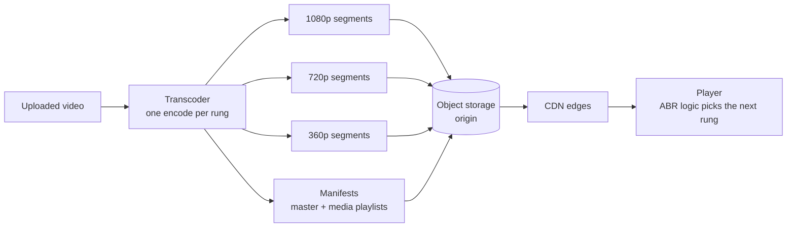
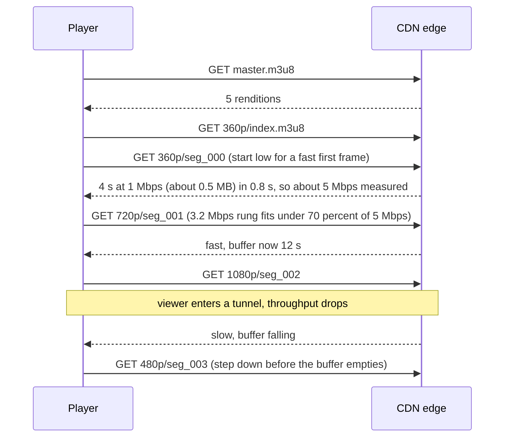

# Adaptive Bitrate Streaming (HLS, DASH, CMAF)

## 1. One-line summary

**Adaptive bitrate streaming (ABR)** cuts a video into short **segments** (2–10 s each), encodes every segment at several qualities (a **bitrate ladder**), lists them in a small text **manifest**, and lets the *player* pick, segment by segment, the best quality the viewer's network can sustain right now; since every segment is a plain static file fetched over HTTP, a [CDN](../technologies/cdn.md) can cache and serve it like any image.

💡 **Bitrate** = how many bits of video are needed per second of playback, in kbps (thousands of bits per second) or Mbps (millions). Higher bitrate means more detail and more bandwidth. A 5 Mbps stream needs at least 5 Mbps of network to play without pausing.

---

## 2. The problem it solves

**The pain:** the simplest way to play video on the web is **progressive download**: one big MP4 file, fetched with an HTTP `GET`, played while it downloads. It works on a stable office connection. It breaks for real viewers:

- **One quality for everyone.** You pick 1080p at 5 Mbps. A phone on a 2 Mbps train connection downloads 2 s of video every 5 s, so the video stalls (**rebuffering**: the player ran out of downloaded video and shows a spinner).
- **Networks change mid-video.** A viewer walks from Wi-Fi to 4G. The file's bitrate can't change, so the player either stalls or you encoded everything at a low quality "to be safe".
- **Wasted bytes.** Viewers who stop after 30 s of a 2-hour film may already have downloaded several minutes ahead.
- **Live is impossible.** A live event has no "whole file" yet.

**The fix:** make quality a per-segment decision taken by the player. If the last segments downloaded slowly, ask for the next one at a lower rung; if the buffer is full and the network is fast, step up.

💡 The **buffer** is the video the player has downloaded but not shown yet, measured in seconds. 20 s of buffer means the network can vanish for 20 s before the viewer notices.

> Infra analogy: it's like a client-side load balancer with health checks. The player keeps measuring "how fast did that last request complete?" and routes the next request to the rendition that will finish in time, the way a client library drains traffic from a slow backend.

---

## 3. How it works



Producing the renditions is the [video transcoding pipeline](video-transcoding-pipeline.md); the files live in [object storage](../technologies/object-storage.md).

### 3.1 Segments, renditions and the bitrate ladder

- A **rendition** is one complete encode of the video at one resolution and bitrate (e.g. "720p at 2.8 Mbps").
- Every rendition is cut at the **same timestamps** into segments. Segment 17 of the 360p rendition covers exactly the same seconds as segment 17 of 1080p, so the player can switch between them at any segment boundary.
- To switch cleanly, each segment must start with a **keyframe** (a full picture that can be decoded without earlier frames; explained in [transcoding](video-transcoding-pipeline.md)).
- The set of renditions is the **bitrate ladder**.

An **illustrative** H.264 ladder (real ladders vary by service and by title):

| Rung | Resolution | Video bitrate |
|---|---|---|
| 240p | 426 × 240 | 400 kbps |
| 360p | 640 × 360 | 800 kbps |
| 480p | 854 × 480 | 1,400 kbps |
| 720p | 1280 × 720 | 2,800 kbps |
| 1080p | 1920 × 1080 | 5,000 kbps |

Rungs are spaced so each step is roughly 1.5–2× the previous one: close enough that a switch isn't jarring, far enough apart to be worth storing.

### 3.2 Manifests: HLS and DASH

The **manifest** is a small text file that tells the player which renditions exist and where each segment is. Two formats dominate:

- **HLS (HTTP Live Streaming)**, created by Apple (2009). Manifests are `.m3u8` text playlists. Required on Apple devices, supported nearly everywhere.
- **MPEG-DASH (Dynamic Adaptive Streaming over HTTP)**, an ISO standard (2012). Manifests are XML `.mpd` files. Common on Android, smart TVs, browsers via `dash.js`.

HLS uses two levels. The **master playlist** lists the renditions. This one was produced by the `ffmpeg` command in [video transcoding pipeline](video-transcoding-pipeline.md) (real output, blank lines removed):

```text
#EXTM3U
#EXT-X-VERSION:3
#EXT-X-STREAM-INF:BANDWIDTH=5640800,RESOLUTION=1920x1080,CODECS="avc1.640028,mp4a.40.2"
v0/index.m3u8
#EXT-X-STREAM-INF:BANDWIDTH=3220800,RESOLUTION=1280x720,CODECS="avc1.64001f,mp4a.40.2"
v1/index.m3u8
#EXT-X-STREAM-INF:BANDWIDTH=1020800,RESOLUTION=640x360,CODECS="avc1.64001e,mp4a.40.2"
v2/index.m3u8
```

`BANDWIDTH` is the peak bits per second (video + audio + overhead), `CODECS` tells the player whether it can decode the stream before downloading anything. Each **media playlist** lists one rendition's segments:

```text
#EXTM3U
#EXT-X-VERSION:3
#EXT-X-TARGETDURATION:4
#EXT-X-MEDIA-SEQUENCE:0
#EXT-X-PLAYLIST-TYPE:VOD
#EXTINF:4.000000,
seg_000.ts
#EXTINF:4.000000,
seg_001.ts
...
#EXT-X-ENDLIST
```

`#EXTINF` is each segment's duration, `#EXT-X-ENDLIST` says "this is complete" (VOD). A live playlist has no `ENDLIST`: the player re-fetches it every few seconds to see new segments, and old ones slide off the top.

💡 **VOD** = video on demand: a finished file you can seek around in. **Live** = being produced right now.

A DASH `.mpd` carries the same information as XML: `Period` (a stretch of time) → `AdaptationSet` (e.g. "the video") → `Representation` (one rendition with `bandwidth`, `width`, `height`), plus a `SegmentTemplate` like `media="video_$RepresentationID$_$Number$.m4s"` so the player computes segment URLs instead of reading a list.

### 3.3 CMAF: one set of segments for both

Historically HLS used **MPEG-TS** segments (`.ts`, a container format from broadcast TV) and DASH used **fragmented MP4** (`.m4s`, an MP4 split into small self-contained pieces), so services stored and cached everything twice. **CMAF** (Common Media Application Format, ISO 2018) standardises fragmented-MP4 segments that both HLS (since Apple added fMP4 support in 2016) and DASH can reference. You write two small manifests pointing at **one** set of segments: half the storage, and twice the CDN cache hit rate for the same bytes.

An fMP4 HLS playlist adds one line pointing to an **init segment** (codec setup data shared by all segments), real `ffmpeg` output:

```text
#EXT-X-VERSION:7
#EXT-X-MAP:URI="init.mp4"
#EXTINF:4.000000,
seg_000.m4s
```

### 3.4 The player's ABR logic



Two families of rules (real players mix them):

| | **Throughput-based** | **Buffer-based** |
|---|---|---|
| Rule | estimate bandwidth from recent segment downloads (bytes ÷ seconds), pick the highest rung below ~70–80% of it | choose the rung from how full the buffer is: low buffer → low rung, full buffer → high rung |
| Strength | reacts quickly at startup when there's no buffer yet | stable, avoids flapping, fewer stalls |
| Weakness | noisy estimates (one slow request, Wi-Fi blips) cause up/down flapping | slow to climb at startup |
| Known work | classic HLS/DASH players | Netflix's BBA paper (Huang et al., SIGCOMM 2014), BOLA (used in `dash.js`) |

Common behaviours:

- **Start low** (or at a rung guessed from the last session): the first segment arrives fast, so time-to-first-frame is short. Then climb.
- **Switch only at segment boundaries**, and prefer stepping one rung at a time upward (big jumps down are fine: a stall is worse than blur).
- **Safety margin**: pick a rung that uses ~70–80% of the measured bandwidth, never 100%.

### 3.5 Latency: VOD vs live vs low-latency

**Latency** here means "glass to glass": how far behind the real event the viewer is.

```
classic live HLS: segment 6 s, player holds ~3 segments before starting
encoder must finish a segment before publishing it      ≈ 6 s
player buffer 3 × 6 s                                     = 18 s
+ CDN, playlist refresh, encoding delay                   ≈ a few s
total                                                     ≈ 20–30 s behind live
```

- **VOD:** latency doesn't matter; longer segments (6–10 s) mean fewer requests and better compression.
- **Live sports / events:** shorter segments (2 s) cut latency to ~6–10 s at the cost of more requests.
- **Low-Latency HLS** (Apple, announced 2019) publishes **partial segments** (fractions of a second) and lets the player hold a request open until the next part is ready ("blocking playlist reload"), reaching roughly 2–5 s. **Low-latency DASH** uses CMAF **chunked transfer** (sending a segment while it's still being encoded). (Latency figures are typical, not guaranteed.)
- Anything needing < 1 s (video calls) uses **WebRTC** (a real-time peer-to-peer media protocol), not segment-based streaming.

### 3.6 Why it is so CDN-friendly

Every segment is an **immutable static file** with a unique URL. A [CDN](../technologies/cdn.md) can cache it with a long TTL (time-to-live, how long a cached copy is valid), e.g. `Cache-Control: max-age=31536000, immutable`. Only live media playlists change, so they get a TTL of about one segment duration ([caching strategies](caching-strategies.md)). No special streaming servers: plain HTTP, the same caches, load balancers and TLS (HTTPS encryption) you already run. The bucket behind the CDN is the **origin**: the source of truth the edges fetch from on a cache miss.

### 3.7 Arithmetic: bytes and requests

Bytes per segment at the top rung:

```
5 Mbps × 6 s = 30 Mbit = 30,000,000 / 8 bytes = 3,750,000 B ≈ 3.75 MB
```

Measured on the `ffmpeg` ladder above: 4 s at 5,000 kbps video + 128 kbps audio produced `.ts` files of ~2.6–2.7 MB, versus `(5,000 + 128) kbps × 4 s / 8 = 2.56 MB`; the extra few percent is MPEG-TS packaging overhead.

Requests per viewer per hour (VOD, 6 s segments):

```
video segments: 3,600 s / 6 s = 600
audio segments (if separate):    600
playlists: a handful (VOD) | live: one refresh per ~6 s = 600 more
total ≈ 600–1,800 requests per viewer-hour
```

At scale, with 1M concurrent viewers on 6 s segments:

```
1,000,000 viewers / 6 s = ~167,000 segment requests/s (video only)
bandwidth: 1,000,000 × 5 Mbps = 5 Tbps at the top rung  → only a CDN can serve this
data per viewer-hour at 5 Mbps: 5,000,000 × 3,600 / 8 = 2.25 GB
```

See [back-of-the-envelope](back-of-the-envelope.md) for the method.

### 3.8 Try it yourself

- Apple publishes sample HLS streams at `https://developer.apple.com/streaming/examples/`. Copy a "View example" playlist URL from that page (the hosts have changed over the years, so take the current link) and run:

  ```bash
  curl -s "<master.m3u8 URL>" | head -20       # see the renditions
  ffprobe -hide_banner "<master.m3u8 URL>"     # ffprobe lists each variant as a "Program"
  ```

- Or make your own with the `ffmpeg` ladder command in [video transcoding pipeline](video-transcoding-pipeline.md), then `ffprobe master.m3u8`. Run here, it printed three programs: `h264 1920x1080`, `1280x720`, `640x360`, each with an `aac` audio stream.
- In a browser, open any big video site, DevTools → Network, filter by `m3u8`, `mpd` or `m4s`: you'll see segments arrive every few seconds and their path change when you throttle the network.

---

## 4. When to use it

- **Any VOD or live video to the public internet**: viewers on unknown, changing networks.
- **Large audiences**: segment files make the CDN do almost all the work.
- **Long content** where you want to start fast and stop downloading when the viewer stops.
- Audio streaming with several qualities (podcasts, music) uses the same idea.

## 5. When NOT to use it (and why it's a mistake)

| Situation | Why |
|---|---|
| Video calls, cloud gaming, auctions (< 1 s latency) | Segments add seconds of delay by design. Use WebRTC. |
| Short clips (< ~10 s) like stickers or previews | One small MP4 is simpler; a manifest plus segments only adds round trips. |
| Internal training videos to 20 people on a LAN | One progressive MP4 on object storage is enough. |
| Download-to-own files | The user wants one file, not thousands of segments. |

---

## 6. Commonly confused with

| | **Progressive download** | **ABR (HLS / DASH)** | **WebRTC** | **RTMP / SRT ingest** |
|---|---|---|---|---|
| What moves | one big file | many small segments + manifest | continuous real-time packets | continuous stream from broadcaster to server |
| Quality changes | never | per segment, by player | continuously, by sender | fixed by broadcaster |
| Latency | n/a (VOD) | ~2–30 s | < 1 s | n/a (upstream leg) |
| CDN cacheable | yes | yes, ideal | no (needs media servers) | no |
| Typical use | small clips | Netflix, YouTube, live sports | calls, conferencing | streamer → platform |

**HLS vs DASH:** same idea, different manifest syntax. **CMAF** is not a third protocol; it's the shared segment format both can point at.

---

## 7. Common mistakes / misuse

1. **Keyframes not aligned across renditions**: segment 17 of 720p and 1080p cover different times, so switching causes a visible jump or a decode error. Force a fixed keyframe interval in every encode.
2. **Starting at the top rung**: the first segment takes seconds, the viewer stares at black. Start low or from history.
3. **Trusting a single throughput sample**: one fast cache hit → jump to 4K → stall. Smooth the estimate and keep a margin.
4. **Long TTL on live playlists**: viewers see an old playlist and fall behind or get 404s. Segments: long TTL. Live playlists: about one segment duration.
5. **Storing TS and fMP4 copies separately** when CMAF would serve both HLS and DASH.
6. **Saying "the server picks the quality"**: in HLS/DASH the *client* decides; the server only offers choices.
7. **Ignoring request count**: 1-second segments triple request load and per-request cost versus 3-second segments for little gain in VOD.

---

## 8. Interview cheat-sheet

> "We transcode each video into a bitrate ladder, say 240p up to 1080p, cut every rendition at the same keyframe-aligned boundaries into 4 to 6 second segments, and publish an HLS master playlist plus one media playlist per rendition, ideally CMAF segments so DASH can reuse them. The player measures throughput and buffer level and picks the rung for each next segment, starting low for a fast first frame. Segments are immutable static files, so the CDN caches them with long TTLs and the origin is just object storage. A 6-second segment at 5 Mbps is about 3.75 MB, and a viewer makes around 600 segment requests an hour. For live, latency is roughly three segments, so 6-second segments give 20 to 30 seconds and Low-Latency HLS with partial segments gets to a few seconds."

---

## 9. Used in

- [Video Streaming](../interviews/video-streaming/README.md): the playback path, choosing segment length and the bitrate ladder, CDN offload and the requests/bandwidth estimates.
- [Case study: video upload, transcode and storage](../../case-studies/video-upload-transcode-and-storage.md): how real services produce and serve their renditions.
- 🔍 [Under the Hood: the player's decision logic](../../under-the-hood/adaptive-bitrate-player.md): naive vs EWMA vs min(fast, slow EWMA) vs buffer-based, simulated on a trace with a tunnel and bursts, with real stall and switch counts.
- 🔍 Under the Hood: [Video compression](../../under-the-hood/video-compression.md) (what the encoder does inside: DCT, quantisation, I/P/B frames) · [Upscaling & super-resolution](../../under-the-hood/upscaling-and-super-resolution.md).
- Related: [video transcoding pipeline](video-transcoding-pipeline.md), [resumable and chunked uploads](resumable-and-chunked-uploads.md), [CDN](../technologies/cdn.md), [object storage](../technologies/object-storage.md), [caching strategies](caching-strategies.md), [back-of-the-envelope](back-of-the-envelope.md).
