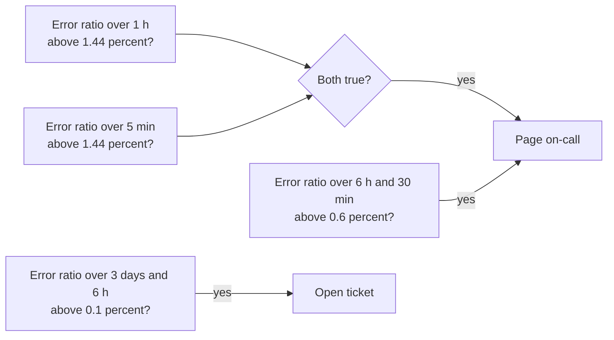
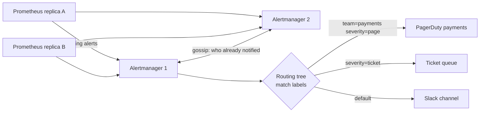

# Alerting and SLOs

## 1. One-line summary

Good alerting pages a human **only when users are being hurt, or soon will be, and someone can act**: you define what "working" means as an **SLI** (a measured ratio), set a target **SLO** (e.g. 99.9% over 30 days), treat the allowed failures as an **error budget**, and alert on how fast that budget is burning (**multi-window, multi-burn-rate alerts**), with a router like **Alertmanager** grouping, deduplicating and silencing notifications so on-call stays sane.

💡 **Paging** = an alert that wakes someone up (phone call/push via PagerDuty, Opsgenie). A **ticket** = an alert that can wait for working hours.

> Infra analogy: you've probably been paged for "CPU > 80% on node-17" at 3 a.m., checked, and found users were fine. This file is about replacing that kind of alert. The basics of SLIs and percentiles are in [observability](observability.md); this goes deeper.

---

## 2. The problem it solves

**The pain:**

- 300 alert rules, most on **causes** (CPU, GC pauses, disk 85%, one pod restarted). On-call gets 40 pages a week; 35 need no action. People start ignoring them (**alert fatigue**), and the one real page is missed.
- Meanwhile a slow 0.5% error rate on checkout runs for 3 days unnoticed because no single metric crossed a threshold.
- "Is this bad enough to wake someone?" is answered by gut feeling, and teams argue about whether to freeze deploys.

**The fix:** measure what users experience, agree on how much failure is acceptable, and alert on the **rate of failure relative to that allowance**.

---

## 3. How it works

### 3.1 SLI, SLO, SLA

| Term | Meaning | Example |
|---|---|---|
| **SLI** (service level indicator) | A ratio of good events to all events | `requests answered with non-5xx in < 300 ms / all requests` |
| **SLO** (objective) | Internal target for the SLI over a window | 99.9% over a rolling 30 days |
| **SLA** (agreement) | Contract with customers, with penalties (refunds, credits) | 99.5% monthly, else 10% credit |
| **Error budget** | `1 − SLO`: the failure you're allowed | 0.1% of requests, or the equivalent time |

The SLA is set **looser** than the SLO so you notice and fix trouble before it costs money.

### 3.2 Error budget arithmetic

```
SLO 99.9% over 30 days
30 days = 30 × 24 × 60 = 43,200 minutes
budget  = 0.1% × 43,200 = 43.2 minutes of full outage per 30 days

request-based: 100 req/s × 86,400 s × 30 = 259.2 M requests/month
budget         = 0.001 × 259.2 M        = 259,200 failed requests allowed
```

| SLO | Budget per 30 days |
|---|---|
| 99% | 432 min = 7.2 h |
| 99.9% | 43.2 min |
| 99.99% | 4.32 min |

Each extra nine is 10× less room, so 99.99% means automation must fix things, because a human can't even get logged in within 4 minutes. **Budget policy:** if the budget is spent, pause risky launches and spend time on reliability; if plenty is left, ship faster.

### 3.3 Symptoms vs causes

| Symptom alerts (page on these) | Cause alerts (dashboard or ticket) |
|---|---|
| Error rate / latency SLO burning | CPU 90%, GC time high |
| Checkout success ratio dropped | One pod restarted |
| Queue age > 10 min (users waiting) | Queue depth 10,000 (maybe fine) |
| Certificate expires in 7 days (ticket) | Disk 85% on a node that auto-scales |

Exception: page on a cause when it **predicts** a symptom with no other warning and needs a human, e.g. "disk full in 4 h at the current growth rate" on a database.

### 3.4 Burn rate and multi-window, multi-burn-rate alerts

**Burn rate** = how fast you spend the budget compared with spending it evenly over the whole window. Burn rate 1 means the budget runs out exactly at the end of 30 days; burn rate 10 means it's gone in 3 days.

```
budget consumed = burn rate × alert window / SLO period
error rate that equals burn rate B = B × (1 − SLO)
```

The Google **SRE Workbook** ("Alerting on SLOs" chapter) recommends, for a 30-day SLO:

| Severity | Budget consumed | Long window | Short window | Burn rate | Check |
|---|---|---|---|---|---|
| Page | 2% | 1 h | 5 min | 14.4 | `14.4 × 1 h / 720 h = 2%` |
| Page | 5% | 6 h | 30 min | 6 | `6 × 6 h / 720 h = 5%` |
| Ticket | 10% | 3 days | 6 h | 1 | `1 × 72 h / 720 h = 10%` |

For a 99.9% SLO, burn rate 14.4 means an error rate above `14.4 × 0.1% = 1.44%`, and at that pace the whole budget is gone in `720 h / 14.4 = 50 h`.

**Why two windows?** The **long** window (1 h) proves the problem is big and real, not a 30-second blip. But a long window also keeps the alert firing for up to an hour *after* you've fixed it. The **short** window (5 min, 1/12 of the long one) must *also* be over the threshold, which means "still happening right now", so the alert resolves within minutes of the fix.



As a Prometheus rule, using [recording rules](../technologies/prometheus-and-time-series-databases.md) that precompute the error ratio per window:

```yaml
- alert: CheckoutErrorBudgetFastBurn
  expr: |
    job:slo_errors_per_request:ratio_rate1h{job="checkout"} > (14.4 * 0.001)
    and
    job:slo_errors_per_request:ratio_rate5m{job="checkout"} > (14.4 * 0.001)
  labels: { severity: page }
  annotations:
    runbook_url: https://wiki.example.internal/runbooks/checkout-errors
```

### 3.5 `for:` durations

A rule with `for: 5m` must be true at **every evaluation** for 5 minutes before it fires; until then it is **pending**. It filters blips, but it delays every alert by that much and a flapping signal (true, false, true) never fires at all. Burn-rate windows already smooth noise, so they usually need little or no `for:`. Use `for:` on simple threshold alerts (e.g. `up == 0 for 2m`).

### 3.6 Alertmanager: from "rule fired" to "phone rang"

Prometheus only **evaluates** rules and sends firing alerts. **Alertmanager** decides who hears about them and how.



| Concept | What it does | Example |
|---|---|---|
| **Grouping** | Bundles related alerts into one notification (`group_by`), waits `group_wait` (default 30 s) to collect them | 200 pods failing in one cluster → **1** page "200 alerts for cluster=eu-1", not 200 |
| **Routing** | A tree of label matchers picks the receiver | `team=payments, severity=page` → payments PagerDuty |
| **Inhibition** | A firing alert suppresses others | "datacenter unreachable" mutes every "service down" alert in that datacenter |
| **Silences** | Time-boxed mute by label match, set by a human | planned DB maintenance 02:00–03:00 |
| **Dedup across HA** (high-availability pairs) | Two Prometheus replicas send the same alert; Alertmanager instances gossip notification state so it's sent once | the same alert from replica A and B → one page |
| **Repeat** | Re-notify an unresolved alert every `repeat_interval` (default 4 h) | stops the "it fired once at 3 a.m. and everyone forgot" case |

💡 **Gossip** here means the Alertmanager instances periodically exchange state with each other peer-to-peer, without a leader (see [gossip and failure detection](gossip-and-failure-detection.md)).

### 3.7 Rule evaluation at scale

Each rule group is evaluated on a fixed schedule (Prometheus `evaluation_interval`, default 1 min); rules in a group run in order. With thousands of teams on a shared platform (Mimir, Cortex, Thanos ruler), rule evaluation becomes a **scheduled distributed job**:

- Rule groups are **sharded across ruler instances** by hashing the group (tenant + name) onto a ring ([consistent hashing](consistent-hashing.md)); if a ruler dies its groups move.
- Each evaluation is a query against the TSDB, so 10,000 groups × 1 query/min = ~167 queries/s of steady load. Heavy expressions should read **recording rules**, not raw series.
- Watch **missed or slow evaluations** (Prometheus exposes `prometheus_rule_group_iterations_missed_total` and the last evaluation duration): an alert that can't evaluate in its interval silently never fires.
- **Meta-monitoring:** something outside the system must alert if the alerting pipeline itself is down. A common pattern is a **dead man's switch**: an always-firing "Watchdog" alert sent to an external service that pages if it *stops* arriving.

### 3.8 Runbooks and on-call ergonomics

Every page should answer, in the notification itself: **what's broken for users, how bad, where to look, what to do first.**

- **Runbook link** in every alert: symptoms, dashboards, first commands, who to escalate to, how to roll back.
- **Actionable or delete it:** review every page weekly; an alert that needed no action gets fixed, downgraded to a ticket, or deleted.
- **Targets:** the SRE Book suggests at most about two incidents per 12-hour on-call shift so each one gets a proper follow-up.
- **Labels carry routing:** `team`, `service`, `severity`, so ownership is in config, not in someone's head (like k8s labels selecting pods).

---

## 4. When to use it

- Any user-facing service with on-call: define 1–3 SLIs (availability, latency, maybe freshness) and burn-rate alerts.
- Internal platforms too (a metrics pipeline's SLO: "99.9% of samples queryable within 2 min").
- Release decisions: error budget left vs spent.

## 5. When NOT to use it (and why it's a mistake)

| Situation | Why it's a mistake |
|---|---|
| Very low traffic (10 requests/hour) | One failure is 10% errors; burn rates are pure noise. Use synthetic probes or longer windows. |
| 100% SLO | No budget, so every blip is a breach and you can never deploy. Nothing is 100%, including your users' Wi-Fi. |
| Page on every cause metric | Alert fatigue; real pages get ignored. |
| SLO copied from the SLA | No early warning before penalties. |

---

## 6. Commonly confused with

| | **SLI** | **SLO** | **SLA** | **Error budget** |
|---|---|---|---|---|
| Is | a measurement | a target | a contract | the allowance `1 − SLO` |
| Owner | engineering | engineering + product | legal / business | the team |
| Breach means | – | slow down, fix reliability | refunds, credits | stop risky launches |

Also: **burn-rate alert vs threshold alert** ("error rate > 1% for 5m" fires the same for a 99% and a 99.99% service; burn rate scales with the SLO), and **Prometheus vs Alertmanager** (evaluates rules vs routes notifications).

---

## 7. Common mistakes / misuse

1. **Alerting on causes** (CPU, memory) instead of symptoms.
2. **Single short window**: pages on blips. **Single long window**: slow to fire, slow to resolve.
3. **Counting 4xx (client errors) as SLO failures**: users sending bad requests isn't your outage.
4. **One Alertmanager**, or two not clustered, giving either a single point of failure or duplicate pages.
5. **No grouping**: one network blip sends 500 pages.
6. **No runbook**, or a runbook last updated two years ago.
7. **No meta-monitoring**: the alerting pipeline fails silently and everything looks green.

---

## 8. Interview cheat-sheet

> "I'd define SLIs as good-events over all-events, say non-5xx responses under 300 milliseconds, with an SLO of 99.9% over 30 days, which gives an error budget of 43.2 minutes. Pages are on symptoms only, using the SRE Workbook's multi-window burn rates: a 14.4× burn over 1 hour, confirmed by the last 5 minutes, means 2% of the monthly budget is gone and pages; 6× over 6 hours pages too; 1× over 3 days opens a ticket. Rules are evaluated by a sharded ruler on a schedule against recording rules, and firing alerts go to a clustered Alertmanager that groups by cluster and service, inhibits downstream alerts when an upstream one fires, dedups between the two Prometheus replicas, and routes by team and severity. Every page carries a runbook link, and a watchdog alert to an external service tells us if the alerting pipeline itself dies."

---

## 9. Used in

- [Metrics & Monitoring](../interviews/metrics-monitoring/README.md): the alerting half of the design: rule evaluation as a scheduled, sharded job, notification routing, grouping, dedup and silences, SLO burn-rate alerts, and how to avoid paging the on-call for noise.
- [Payment system](../interviews/payment-system/README.md): alerting on PENDING payments older than 5 minutes per PSP, outbox lag, and unmatched reconciliation value.
- [Distributed message queue](../interviews/distributed-message-queue/README.md): consumer lag in time, under-replicated and offline partitions, ISR shrink rate as platform SLIs (L6 §5).
- Related: [observability](observability.md), [Prometheus and TSDBs](../technologies/prometheus-and-time-series-databases.md), [time-series compression and downsampling](time-series-compression-and-downsampling.md), [resilience patterns](resilience-patterns.md), [retries, backoff and DLQ](retries-backoff-and-dlq.md) (re-sending failed notifications).
