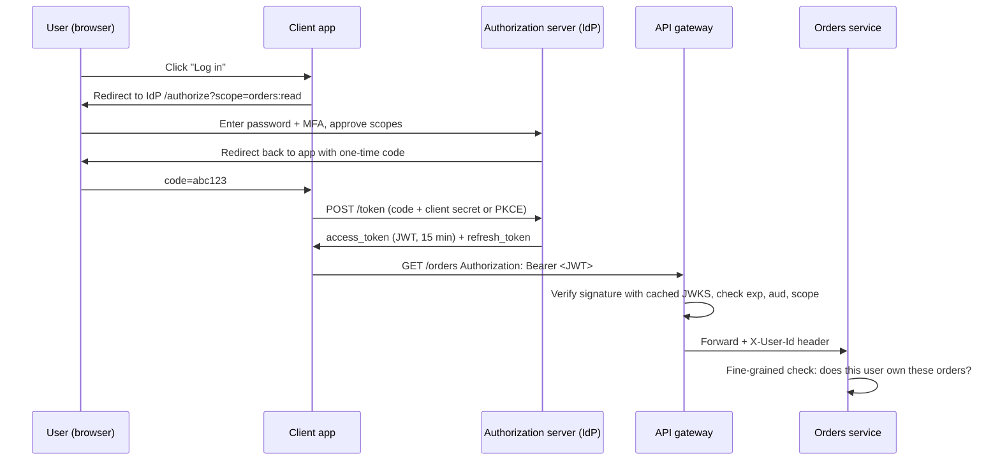

# Authentication, OAuth 2.0 and JWT

## 1. One-line summary

**Authentication** answers "who is calling?", **authorization** answers "are they allowed to do this?"; **OAuth 2.0** is the standard way an app gets a token to call an API on a user's behalf, and a **JWT** is a signed, self-contained token that any server can verify locally with a public key, without calling the login service.

---

## 2. The problem it solves

**The pain:** a mobile app calls 40 backend services through a gateway at 50,000 requests/s. Each request must prove who the user is.

- Option A: send the password on every call. Every service sees passwords; one leaky log line exposes them all.
- Option B: a random **session ID** (an opaque string that means nothing by itself) that each service looks up in a session store. That's 50,000 lookups/s against one store; if it is slow or down, **every** API is down.
- Partners (other companies' servers) also call your API. They have no user and no browser to log in with.
- A third-party app ("connect your Google Calendar") needs limited access to a user's data **without** ever seeing the user's password.

**The fix:**
- Users log in once at an **identity provider (IdP)**, the one service that checks passwords and MFA (multi-factor auth: a second proof like an OTP, a one-time code sent to your phone). It issues a short-lived signed token (**JWT**).
- The gateway **verifies the signature locally** with cached public keys: ~tens of microseconds of CPU, no network call.
- **OAuth 2.0** standardises how apps obtain those tokens, including on a user's behalf with limited **scopes** (permissions like `orders:read`).
- Machine clients use **API keys** (or OAuth client credentials).

> Infra analogy: a k8s ServiceAccount token is a JWT. The API server verifies its signature with the cluster's public key; RBAC (role-based access control) then decides what that identity may do. Verify = authentication, RBAC = authorization.

---

## 3. How it works

### 3.1 Authentication vs authorization

| | **Authentication (AuthN)** | **Authorization (AuthZ)** |
|---|---|---|
| Question | Who are you? | May you do *this* to *that*? |
| Fails with | `401 Unauthorized` (really "unauthenticated") | `403 Forbidden` |
| Data needed | Credentials, token signature | Roles, scopes, ownership ("is order 42 yours?") |
| Typical place | Gateway / IdP | Coarse at gateway, fine-grained in the service |

### 3.2 Sessions vs tokens

| | **Server-side session** | **Self-contained token (JWT)** |
|---|---|---|
| Client holds | Random ID in a cookie | Signed JSON with user ID, scopes, expiry |
| Server checks | Lookup in a session store ([Redis](../technologies/redis.md)) | Verify signature with public key, check `exp` |
| Cost per request | ~0.5–1 ms network round trip | ~20–50 µs CPU (µs = microsecond, a millionth of a second) |
| Logout / revoke | Delete the session: instant | Hard: the token stays valid until it expires (see 3.6) |
| Good for | A single web app | Many services, gateways, mobile clients |

### 3.3 OAuth 2.0 roles and the authorization-code flow

Four roles: the **resource owner** (the user), the **client** (the app wanting access), the **authorization server** (the IdP: Auth0, Okta, Keycloak, Google), and the **resource server** (your API, behind the gateway).



In plain words: the app never sees the password; it gets a **one-time code** through the browser and swaps it server-to-server for tokens. **PKCE** (Proof Key for Code Exchange) is an extra one-time secret that stops someone who intercepts the code from using it; mobile and single-page apps must use it because they can't keep a client secret.

Other grant types, one line each: **client credentials** = a machine logs in as itself (service-to-service, partners); **refresh token** grant = swap a refresh token for a new access token; the old "implicit" and "password" grants are deprecated.

**OpenID Connect (OIDC)** is a thin layer on top of OAuth 2.0 that adds an **ID token** (a JWT saying who the user is) for login. OAuth alone is about *access*, not identity.

### 3.4 JWT structure

A JWT is three Base64URL-encoded parts (Base64URL = binary-to-text encoding safe for URLs) joined by dots: `header.payload.signature`.

```
header:   {"alg":"RS256","kid":"key-2026-10"}
payload:  {"sub":"user_42","iss":"https://auth.shop.com","aud":"api.shop.com",
           "scope":"orders:read","exp":1791500000,"iat":1791499100}
signature: RSA-sign(header + "." + payload, IdP private key)
```

- RSA and ECDSA (behind `RS256` / `ES256`) are public-key signature algorithms, explained in 3.5.
- `sub` = subject (user ID), `iss` = issuer, `aud` = audience (which API it is for), `exp` / `iat` = expiry / issued-at (Unix seconds).
- The payload is **encoded, not encrypted**: anyone can read it. Never put secrets or PII (personally identifiable information) in it.
- Typical size: 700 bytes to 1.5 KB, sent on every request.

### 3.5 Verifying with public keys (JWKS)

`RS256`/`ES256` are **asymmetric** algorithms: the IdP signs with a **private key** only it has; anyone verifies with the matching **public key**. The IdP publishes its public keys as a **JWKS** (JSON Web Key Set) at a URL like `/.well-known/jwks.json`.

Gateway check, all in memory:
1. Read `kid` (key ID) from the header, find that key in the cached JWKS (refresh every ~5–10 min, or on an unknown `kid`).
2. Verify the signature. Reject `alg: none` and anything not on an allow-list.
3. Check `exp` (allow ~30–60 s clock skew), `iss`, `aud`.
4. Check coarse scope for the route (`POST /orders` needs `orders:write`).

**Key rotation:** the IdP publishes the new key in the JWKS **before** signing with it, and keeps the old key until all old tokens expire. That's why `kid` exists.

`HS256` (a shared secret, symmetric) means every verifier could also *mint* tokens; avoid it across services.

### 3.6 Expiry and why revocation is hard

A JWT is valid until `exp`, and nobody is asked. If a user logs out or a token is stolen, every gateway node will still accept it. Mitigations:

- **Short-lived access tokens** (5–15 min) + **refresh tokens** (days–weeks, opaque, stored server-side, checked and **rotated** on each use). Revoking the refresh token means the user is locked out within ≤15 min.
- **Deny list** for urgent cases: store revoked `jti` (token ID) or "user X revoked before time T" in Redis with TTL = remaining lifetime; the gateway checks it (or a locally replicated copy). Small, because tokens are short-lived.
- **Token introspection** (ask the IdP "is this token still valid?") on sensitive routes only, since it brings back the per-request network call.

### 3.7 API keys for machine clients

Partners' servers get a long random key (e.g. `sk_live_` + 32 random bytes ≈ 256 bits).
- **Hash it** (SHA-256, a one-way function: easy to compute, impossible to reverse) before storing, like a password; show it once at creation. A DB leak then leaks no usable keys. A fast hash is fine here because the key is random, not human-chosen.
- **Prefix** (`sk_live_`, `pk_test_`) so leaked keys are recognisable by secret scanners.
- **Scope it** (which APIs, read vs write), tie it to a plan with [rate limits](../../LLD/interviews/rate-limiter/README.md).
- **Rotate**: allow two active keys per client so they can switch without downtime; revoke instantly (the gateway caches key → client lookups for ~30–60 s).

---

## 4. When to use it

- JWT access tokens validated at the gateway: many services, high QPS (queries per second), mobile/web clients.
- OAuth authorization code + PKCE: any user login through an app, and any third-party access to user data.
- Client credentials or API keys: partners and service-to-service (or mTLS, see [TLS and mTLS](tls-and-mtls.md)).
- Server-side sessions: a single monolithic web app where instant logout matters most.

## 5. When NOT to use it (and why it's a mistake)

| Situation | Why it's a mistake |
|---|---|
| Long-lived JWTs (24 h, 30 days) | Can't be revoked; a stolen token works for a month. |
| Authorizing *everything* at the gateway | The gateway can't know "does order 42 belong to user 7" without loading data; that's the service's job. |
| Putting roles for 500 resources in the JWT | Token bloats to many KB on every request and goes stale; keep coarse claims only. |
| Storing API keys in plaintext | One DB dump exposes every partner. |
| Rolling your own crypto or token format | Easy to get `alg` confusion, timing bugs. Use a library (Nimbus JOSE, jjwt, `jose` in Node). |

---

## 6. Commonly confused with

| | **Session cookie** | **JWT access token** | **Refresh token** | **API key** |
|---|---|---|---|---|
| What it is | Opaque ID | Signed claims | Opaque long-lived credential | Opaque long-lived secret |
| Who holds it | Browser | App / client | App (secure storage) | Partner server |
| Lifetime | Hours | 5–15 min | Days–weeks, rotated | Months, until rotated |
| Verified by | Store lookup | Signature (local) | IdP lookup | Hash lookup (cached) |
| Revocation | Instant | Hard (expiry / deny list) | Instant | Instant |

Also: **OAuth vs OIDC** (access vs identity); **authentication vs authorization** (who vs allowed).

---

## 7. Common mistakes / misuse

1. **Saying "OAuth is for login."** OAuth grants access; OIDC adds login.
2. **Not validating `aud` and `iss`**: a token issued for another API is accepted.
3. **Accepting `alg: none`** or letting the token choose the algorithm.
4. **Calling the IdP on every request** instead of caching JWKS: the IdP becomes a SPOF (single point of failure) and adds ~5–20 ms per call.
5. **Trusting `X-User-Id` from the internet.** The gateway must strip incoming copies and set it itself; backends trust it only over mTLS from the gateway.
6. **JWT in `localStorage`** in browsers: readable by any injected script (XSS). Prefer HttpOnly cookies or a BFF that holds tokens server-side.

---

## 8. Interview cheat-sheet

> "Users log in through an OAuth authorization-code flow with PKCE against our identity provider, which issues a 15-minute JWT access token and a rotating refresh token. The gateway validates every JWT locally: it caches the IdP's JWKS public keys, picks the key by `kid`, checks the signature, `exp`, `iss`, `aud` and the coarse scope for the route, so there's no network call on the hot path. Revocation is the weak spot of JWTs, so access tokens are short-lived, refresh tokens are revocable, and for emergencies there's a small Redis deny list. Partners use API keys that we store hashed, scope to specific APIs and plans, and let them rotate with two active keys. The gateway answers 'who are you'; each service still decides 'may you touch this specific resource'."

---

## 9. Used in

- [API gateway](../interviews/api-gateway/README.md): **authentication at the edge** (local JWT validation with cached JWKS, API keys for partners), coarse authorization by scope, forwarding identity headers to backends, revocation trade-offs.
- Related: [Redis](../technologies/redis.md) (deny list, sessions, API key cache), [TLS and mTLS](tls-and-mtls.md), [caching strategies](caching-strategies.md) (JWKS and key caches), [rate limiter (LLD)](../../LLD/interviews/rate-limiter/README.md) (per-API-key quotas), [end-to-end encryption](end-to-end-encryption.md) (public/private key basics).
