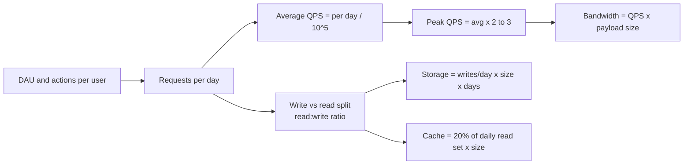

# Back-of-the-Envelope Estimation

## 1. One-line summary

Quick, rounded arithmetic (QPS, storage, bandwidth, memory) done in the first few minutes of an HLD interview to find out **which parts of the design will actually be under pressure**.

## 2. The problem it solves

Without numbers, every design looks the same: "a service, a database, maybe a cache." You can't tell whether you need one Postgres box or a 50-node Cassandra cluster, whether the cache fits on one Redis node, or whether bandwidth matters at all.

You already do this in infra work: before sizing a k8s node pool you ask "how many pods, how much memory each, what's the peak?" Back-of-the-envelope (BOTE) is the same habit, applied to a whiteboard design.

The fix: a small toolkit of memorised constants plus a fixed recipe (users → requests/sec → storage → bandwidth → cache). The goal is **order of magnitude** (is it 10, 1,000 or 100,000 QPS?), not precision.

## 3. How it works

### 3.1 Constants to memorise

**Powers of 2 vs powers of 10** (treat them as equal — the 2–7% error never matters):

| Power of 2 | Exact value | ≈ Power of 10 | Name | Bytes unit |
|---|---|---|---|---|
| 2^10 | 1,024 | 10^3 | thousand | 1 KB |
| 2^20 | 1,048,576 | 10^6 | million | 1 MB |
| 2^30 | ~1.07 billion | 10^9 | billion | 1 GB |
| 2^40 | ~1.1 trillion | 10^12 | trillion | 1 TB |
| 2^50 | ~1.13 quadrillion | 10^15 | quadrillion | 1 PB |

Handy byte sizes: `int` = 4 B, `long` / timestamp = 8 B, UUID = 16 B (36 as a string), a typical URL ≈ 100 B, a tweet-sized text row ≈ 300 B–1 KB, a thumbnail ≈ 10–50 KB, a photo ≈ 200 KB–2 MB, 1 minute of HD video ≈ 50–100 MB.

**Time:**

| Fact | Value | Rounded for interviews |
|---|---|---|
| Seconds per day | 24 × 60 × 60 = 86,400 | **~10^5** (100K) |
| Seconds per month | 86,400 × 30 = 2,592,000 | **~2.5 × 10^6** |
| Seconds per year | 86,400 × 365 ≈ 31.5M | **~3 × 10^7** |

Shortcut: **1 million requests/day ≈ 12 requests/sec** (10^6 / 86,400 ≈ 11.6). So 100M/day ≈ 1,200/s, 1B/day ≈ 12,000/s.

### 3.2 Latency numbers every engineer should know

Classic numbers (originally from Jeff Dean / Peter Norvig, rounded; hardware has improved but the *ratios* are what matter):

| Operation | Approx. latency | What it means (plain words) |
|---|---|---|
| L1 cache reference | 0.5 ns | CPU reads data from its own tiniest, fastest memory. Basically free |
| Branch mispredict | 5 ns | CPU guessed which way an `if` would go, guessed wrong, and has to redo some work |
| L2 cache reference | 7 ns | CPU reads from its second, bigger, slightly slower cache |
| Main memory (RAM) reference | 100 ns | Data wasn't in any CPU cache, so fetch it from RAM. ~200× slower than L1 |
| Compress 1 KB (Snappy/LZ4) | ~2–3 µs | Fast compression libraries used by Kafka, Cassandra, etc. |
| Send 1 KB over 1 Gbps network | 10 µs | Just putting the bytes on the wire, not the full round trip |
| Random read 4 KB from SSD | ~100–150 µs | Reading one small block from a random place on an SSD |
| Read 1 MB sequentially from RAM | ~250 µs | Scanning a big chunk of memory in order |
| Round trip inside one datacenter | ~500 µs | **0.5 ms**: a request to another server in the same DC and back (e.g. a Redis GET) |
| Read 1 MB sequentially from SSD | ~1 ms | Reading a file in order from SSD |
| HDD disk seek | ~10 ms | A spinning disk physically moving its head to a new position |
| Read 1 MB sequentially from HDD | ~20 ms | Reading a file in order from a spinning disk |
| Round trip California → Europe → California | ~150 ms | A cross-region call. Mostly the speed of light in fibre |

> 💡 **What are L1 / L2 / L3 caches?** Small, very fast memories **built into the CPU chip**, sitting between the CPU and RAM. **L1** is the smallest (tens of KB per core) and fastest, **L2** is bigger and a bit slower (hundreds of KB to a few MB per core), and **L3** is bigger still (tens of MB), shared by all cores. The CPU checks L1 → L2 → L3 → RAM, in that order, and keeps recently used data close. You never manage them directly. They're why reading data **in order** (arrays, sequential files) is so much faster than jumping around. In system design the names are often **borrowed** for software cache layers: "L1" = a cache inside each app server, "L2" = a shared cache like Redis (see [caching strategies](caching-strategies.md)).
>
> `ns` = nanosecond (a billionth of a second), `µs` = microsecond (a millionth), `ms` = millisecond (a thousandth). 1 ms = 1,000 µs = 1,000,000 ns.

Lessons to say out loud:
- **Memory is ~1,000x faster than SSD random reads, which are ~100x faster than HDD seeks.** That's why caches exist.
- **A same-DC network hop (~0.5 ms) is cheap; a cross-region hop (~150 ms) is not.** Never put a synchronous cross-region call in the hot path of a user request.
- Sequential reads are much faster than random reads → why Kafka and LSM-tree databases (Cassandra) append to logs.

### 3.3 The recipe



1. **QPS from DAU.** `requests/day = DAU × actions per user per day`. `avg QPS = requests/day ÷ 86,400 (≈10^5)`. **Peak** = 2–3× average (10× for spiky events like flash sales).
2. **Read:write ratio.** Most consumer systems are read-heavy (social feed 100:1, URL shortener 100:1). Write-heavy ones exist too (metrics/logging, IoT, chat). The ratio tells you whether to optimise with caches/replicas (read-heavy) or with partitioning/append-only storage (write-heavy).
3. **Storage over N years.** `writes/day × bytes per record × 365 × N`. Add ~2–3× for replication (e.g., replication factor 3) and indexes if relevant.
4. **Bandwidth.** `QPS × payload size`, separately for ingress (writes) and egress (reads).
5. **Cache memory (80/20 rule).** Traffic is skewed: roughly 20% of items get 80% of requests. Caching 20% of a day's read set usually gives a very high hit rate. `cache = 0.2 × daily reads × bytes per item` (this over-counts because the same hot item is read many times — a safe upper bound).

### 3.4 Fully worked example — URL shortener

Requirements: **100M new URLs per month**, **read:write = 100:1**, keep data **5 years**, each record ~**500 bytes** (short code 7 B, long URL up to ~2 KB but average ~100 B, user id, created_at, expiry, plus overhead — round to 500 B).

**Write QPS**

```
100M / month ÷ (30 days × 86,400 s) = 10^8 ÷ 2.6 × 10^6 ≈ 40 writes/s
Peak (×2–3)                                              ≈ 100 writes/s
```

**Read QPS**

```
40 writes/s × 100 = 4,000 reads/s
Peak (×2–3)       ≈ 10,000 reads/s
```

**Storage over 5 years**

```
URLs:    100M/month × 12 × 5 = 6 × 10^9 = 6 billion records
Bytes:   6 × 10^9 × 500 B   = 3 × 10^12 B = 3 TB
With replication factor 3   ≈ 9 TB raw disk
```

**Key space check** (feeds into [ID generation](id-generation.md)):

```
Need ≥ 6 billion codes.
62^6 ≈ 56.8 billion  → 6 chars is already enough (~9x headroom)
62^7 ≈ 3.5 trillion  → 7 chars gives ~580x headroom; pick 7.
```

**Bandwidth**

```
Ingress: 40 writes/s × 500 B  = 20 KB/s      (trivial)
Egress:  4,000 reads/s × 500 B = 2 MB/s      (trivial; a 302 redirect is tiny)
```

**Cache (80/20)**

```
Reads/day: 4,000/s × 86,400 ≈ 3.5 × 10^8 = 350M reads/day
Cache 20%: 0.2 × 350M × 500 B = 3.5 × 10^10 B = 35 GB
```

35 GB fits in one large Redis node (or a small 3-shard cluster for headroom and HA).

**What the numbers tell us about the design:**
- 40 writes/s is tiny → a single Postgres primary handles writes easily. No need to shard for write throughput.
- 4K–10K reads/s is moderate → cache in front of the DB and/or read replicas.
- 3 TB over 5 years → fits on one big DB server, but sharding or a horizontally scalable store (Cassandra/DynamoDB) becomes reasonable at L5/L6 for growth and ops.
- Bandwidth is irrelevant here — say so and move on.

That conclusion ("writes are trivial, reads need a cache, storage is moderate") is the *point* of the exercise.

## 4. When to use it

- At the start of every HLD interview, right after clarifying requirements — usually 3–5 minutes.
- Whenever you're about to make a sizing decision: "Do we need to shard?" "Does this fit in memory?" "Can one Kafka partition keep up?"
- In real work: capacity planning, choosing instance sizes, estimating cloud cost.

## 5. When NOT to use it (or not much of it)

- **When the interviewer says "skip the estimates"** — some do. Pushing on wastes their time.
- **LLD interviews** — class design rarely needs QPS math.
- **When the number won't change the design.** If you've shown writes are 40/s, computing peak writes to three significant figures is pointless. Precision that doesn't change a decision is a mistake because it eats time that should go to the deep dives, where most of the signal (and the leveling decision) comes from.

## 6. Commonly confused with

| | Back-of-the-envelope | Capacity planning | Load testing |
|---|---|---|---|
| Goal | Find the order of magnitude and the bottleneck | Decide how many machines / how much budget | Verify the real system handles the load |
| Precision | ±10x is fine | ±20–30% | Measured |
| When | Interview / early design | Before launch, quarterly | Before launch, after big changes |
| Input | Assumptions | Real traffic data + growth forecast | Real system |

| | Average QPS | Peak QPS |
|---|---|---|
| Meaning | Total per day ÷ 86,400 | Highest sustained rate (e.g., evening, events) |
| Use for | Storage, daily cost | Sizing servers, DB connections, autoscaling limits |

## 7. Common mistakes / misuse

- **Spending 15 minutes on math.** The interviewer wants to see you can do it and *use* it. Aim for 3–5 minutes, round aggressively (86,400 → 10^5), and write results on the board.
- **Computing numbers and then ignoring them.** Always end with "so this means…" (e.g., "40 writes/s means one DB is fine").
- **False precision.** "3,858 writes per second" signals you don't understand the purpose. Say "~4K".
- **Forgetting peak.** Systems fall over at peak, not average.
- **Mixing bits and bytes.** Network is in bits per second (1 Gbps ≈ 125 MB/s); storage is in bytes.
- **Forgetting replication and indexes** when sizing storage (×3 for RF=3 is common).
- **Assuming everything is read-heavy.** Logging, metrics, chat, IoT are write-heavy and lead to completely different designs.

## 8. Interview cheat-sheet

> "Let me do quick estimates. 100M new URLs per month is about 10^8 divided by 2.5 × 10^6 seconds, so ~40 writes per second; at 100:1 that's ~4K reads per second, maybe 10K at peak. Over 5 years that's 6 billion URLs at ~500 bytes, so ~3 TB. With the 80/20 rule, caching 20% of a day's reads is ~35 GB — one Redis node. So writes are easy, reads need a cache, and 7 Base62 characters (3.5 trillion codes) is plenty of key space."

## 9. Used in

- [URL Shortener](../interviews/url-shortener/README.md) — the estimates section (QPS, 5-year storage, cache sizing, key-space length for the short code). The worked example above is the same one.
- [Notification system](../interviews/notification-system/README.md) — the estimates section: notifications/day → peak QPS per channel, broadcast duration under provider rate limits, SMS vs email vs push cost, inbox storage.
- [Chat system](../interviews/chat-system/README.md): the estimates section: messages/day → peak messages/s, concurrent connections → gateway count, message and media storage per day/year, heartbeat load on the presence store.
- [News feed](../interviews/news-feed/README.md): the estimates section: DAU → feed reads/s and posts/s, fan-out writes/s (posts × average followers), feed cache memory (users × ~500 IDs × 8 bytes), media storage and CDN bandwidth.
- [Ride-sharing](../interviews/ride-sharing/README.md): the estimates section: online drivers ÷ 4 s → location writes/s, ride requests/s at peak, in-memory size of the location index, location-history storage per day, WebSocket connections for live tracking.
- Related: [ID generation](id-generation.md) (key space), [Caching strategies](caching-strategies.md) (cache sizing), [Sharding and replication](sharding-and-replication.md) (when storage/QPS forces a split), [Redis](../technologies/redis.md).
