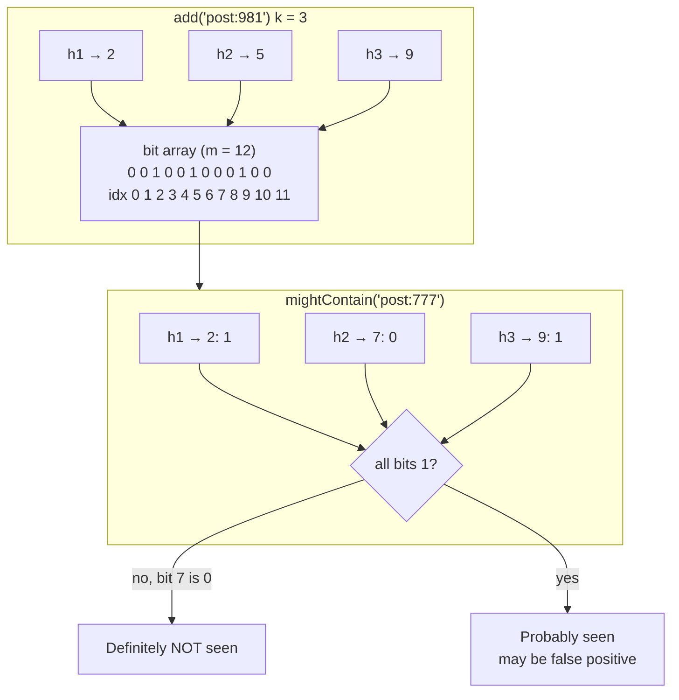

# Bloom filters

## 1. One-line summary

A **Bloom filter** is a tiny, fixed-size bit array that answers "have I seen this item?" with either **"definitely not"** or **"probably yes"**. It never gives a false "no", sometimes gives a false "yes", and uses ~10 bits per item instead of storing the items themselves.

💡 A **bit array** is a long row of 0/1 values; 8 bits = 1 byte. A **hash function** turns any input (a post ID, a URL) into a number that looks random but is always the same for the same input.

---

## 2. The problem it solves

**The pain:** the feed must not show posts the user has already seen. A heavy user has seen ~50,000 posts in the last 30 days. Storing exact sets:

```
50,000 post ids × 8 bytes = 400 KB per user (plus set overhead, realistically ~2–3 MB in a Java HashSet or Redis set)
100M daily users × 400 KB = 40 TB   just for "seen" sets
```

And checking 1,000 feed candidates against a remote set on every feed load is 1,000 lookups.

A second pain: [Cassandra](../technologies/cassandra.md) stores data in many immutable files on disk (**SSTables**). To read key `X`, it might have to open 10 files to find out 9 of them don't have it. Each pointless disk read costs ~0.1–10 ms.

**The fix:** keep a compact probabilistic summary. For the seen-posts case, 50,000 items at 1% false positives need ~60 KB (math below), about **7× smaller than even the raw 400 KB of IDs** and checkable in memory in nanoseconds. A 1% false-positive rate means 1 in 100 unseen posts is wrongly hidden, which nobody notices in a feed of thousands of candidates.

> Infra analogy: like a negative cache in DNS ("this name doesn't exist") but for an entire set, compressed. You skip the expensive lookup whenever the cheap check says "definitely not".

---

## 3. How it works

### 3.1 Add and check

Start with `m` bits, all 0, and `k` hash functions.

- **Add(x):** compute `k` hashes of `x`, each giving a position in `[0, m)`. Set those `k` bits to 1.
- **MightContain(x):** compute the same `k` positions. If **any** bit is 0, `x` was **definitely never added**. If **all** are 1, `x` was **probably** added (or other items happened to set those same bits: a false positive).



Why no false negatives: adding only ever turns bits **on**, so an added item's bits stay 1 forever.

### 3.2 Sizing: false positive rate intuition

More items in the same bits → more 1s → more accidental "all ones" → more false positives. Standard formulas for `n` items and target false-positive rate `p`:

```
m = -n × ln(p) / (ln 2)^2        bits needed
k = (m / n) × ln 2               hash functions
```

Worked example: **1M items at 1% FPR**

```
ln(0.01) = -4.605,  (ln 2)^2 = 0.4805
m = 1,000,000 × 4.605 / 0.4805 ≈ 9,585,000 bits
  ÷ 8 = 1,198,000 bytes ≈ 1.2 MB
k = 9.585 × 0.693 ≈ 6.6 → 7 hash functions
```

Rule of thumb: **~9.6 bits per item for 1%**, ~14.4 bits for 0.1%. Each 10× better FPR costs ~4.8 more bits per item. Compare: 1M 8-byte IDs stored exactly = 8 MB (raw) or ~50+ MB in a `HashSet<Long>`.

For the feed: 50,000 seen posts × 9.6 bits = 480,000 bits ≈ **60 KB per user**. 100M users × 60 KB = **6 TB** vs 40 TB raw; and in practice you keep filters only for active users and rotate them (see 3.4).

### 3.3 A small Java implementation

```java
import java.util.BitSet;

public class BloomFilter {
    private final BitSet bits;
    private final int m;   // number of bits
    private final int k;   // number of hash functions

    public BloomFilter(int expectedItems, double fpr) {
        this.m = (int) Math.ceil(-expectedItems * Math.log(fpr) / (Math.log(2) * Math.log(2)));
        this.k = Math.max(1, (int) Math.round((double) m / expectedItems * Math.log(2)));
        this.bits = new BitSet(m);
    }

    // Double hashing: derive k positions from two base hashes (h1 + i*h2)
    private int position(String item, int i) {
        long x = item.hashCode() * 0x9E3779B97F4A7C15L;   // spread the bits (mixing step)
        x ^= (x >>> 33); x *= 0xFF51AFD7ED558CCDL; x ^= (x >>> 33);
        int h1 = (int) x, h2 = (int) (x >>> 32) | 1;       // two base hashes from one 64-bit mix
        return Math.floorMod(h1 + i * h2, m);
    }

    public void add(String item) {
        for (int i = 0; i < k; i++) bits.set(position(item, i));
    }

    public boolean mightContain(String item) {
        for (int i = 0; i < k; i++) if (!bits.get(position(item, i))) return false;
        return true;
    }

    public static void main(String[] args) {
        BloomFilter seen = new BloomFilter(1_000_000, 0.01);
        System.out.println("m=" + seen.m + " bits (" + seen.m / 8 / 1024 + " KB), k=" + seen.k);
        for (int i = 0; i < 1_000_000; i++) seen.add("post:" + i);
        int fp = 0;
        for (int i = 1_000_000; i < 1_100_000; i++) if (seen.mightContain("post:" + i)) fp++;
        System.out.println("added post:5 seen? " + seen.mightContain("post:5"));   // always true
        System.out.printf("false positive rate ≈ %.2f%%%n", fp / 1000.0);
    }
}
```

`String.hashCode()` is only 32 bits and weak on its own, hence the mixing step; production code uses MurmurHash3 via Guava's `com.google.common.hash.BloomFilter`. 💡 **Double hashing** builds k hash positions from 2 real hashes, a standard trick that keeps the math valid and is much cheaper than k independent hash functions.

### 3.4 Limitations

- **No deletes.** Clearing an item's bits may clear bits shared with other items, creating false negatives. Options: a **counting Bloom filter** (each slot is a small counter, ~4 bits, instead of a bit: 4× memory, supports remove), a **Cuckoo filter** (supports delete, similar size), or **rotate**: keep one filter per week, check the last 4, drop the oldest.
- **Must size upfront.** Overfill a filter and its FPR climbs fast (at 2× the planned items, 1% becomes ~15%). Scalable Bloom filters chain new filters as old ones fill.
- **Can't list members**, and can't count.

### 3.5 Redis Bloom module

[Redis](../technologies/redis.md) Stack / the RedisBloom module provides it server-side:

```
BF.RESERVE seen:42 0.01 50000      # 1% FPR, 50k capacity
BF.MADD    seen:42 post:981 post:982
BF.MEXISTS seen:42 post:981 post:777   → 1 0
```

`BF.MEXISTS` checks all 1,000 feed candidates in one round trip.

---

## 4. When to use it

- **"Already seen" filtering** in feeds and recommendations (Medium and others use it to avoid re-recommending articles).
- **Avoiding lookups for keys that don't exist:** Cassandra, HBase, RocksDB/LevelDB keep a Bloom filter per SSTable so reads skip files that can't contain the key.
- **Malicious URL / password lists:** Chrome historically used a local Bloom-style filter of bad URLs, only asking the server when the filter said "maybe".
- **Cache penetration protection:** check "does this ID exist at all?" before hitting the DB for random/invalid keys.
- **Distributed joins / dedup in big data:** ship a small filter instead of a big key list.

## 5. When NOT to use it (and why it's a mistake)

| Situation | Why |
|---|---|
| False positives are unacceptable (e.g. "has this payment been processed?") | "Probably yes" would wrongly skip a real payment. Use an exact store / idempotency key table. |
| Small sets (a few thousand items) | A `HashSet` is simple, exact and small enough. |
| You must delete items often | Use counting/Cuckoo filters or rotation. |
| You need the list of items or a count | Bloom filters only answer membership. Use a set or [HyperLogLog](counters-at-scale.md). |

---

## 6. Commonly confused with

| | **Bloom filter** | **HashSet / Redis set** | **HyperLogLog** | **Cache** | **Counting Bloom / Cuckoo filter** |
|---|---|---|---|---|---|
| Question | Is X in the set? | Is X in the set? | How many distinct? | What's the value of X? | Is X in the set? |
| Errors | False positives only | None | ~0.8% count error | Staleness | False positives only |
| Memory (1M items) | ~1.2 MB @1% | 8–50+ MB | 12 KB | Depends | ~2–5 MB |
| Delete | No | Yes | No | Yes | Yes |

---

## 7. Common mistakes / misuse

1. **Saying it has false negatives.** It doesn't; that's the whole point.
2. **Not sizing it**, then overfilling it until everything returns "probably yes".
3. **Deleting by clearing bits** in a plain Bloom filter.
4. **Using it where a false positive is harmful** (security allow-lists, payments).
5. **One forever-growing filter per user** instead of time-bucketed filters that expire.
6. **Forgetting persistence:** an in-process filter is lost on restart; store it in Redis or rebuild from logs.

---

## 8. Interview cheat-sheet

> "To avoid showing posts a user already saw, I keep a Bloom filter of seen post IDs per user. It's a bit array with k hash functions: adding sets k bits, and checking says 'definitely not seen' if any bit is zero, or 'probably seen' otherwise, so there are no false negatives and a tunable false-positive rate. At 1% it costs about 10 bits per item, so 50,000 seen posts is around 60 KB per user, versus megabytes for an exact set. A 1% false positive just hides one unseen post in a hundred, which is invisible in a feed. Plain Bloom filters can't delete, so I rotate weekly filters and check the last few, and I'd store them in Redis with the Bloom module so one BF.MEXISTS checks all 1,000 candidates. Cassandra uses the same trick per SSTable to skip disk reads."

---

## 9. Used in

- [News feed](../interviews/news-feed/README.md): **"seen" filtering** during candidate generation so the feed doesn't repeat posts (per-user Bloom filter, time-rotated, in Redis).
- [Distributed key-value store](../interviews/distributed-kv-store/README.md): **per-SSTable Bloom filters** on the storage-engine read path, so a point read skips files that can't contain the key ([LSM trees and storage engines](lsm-trees-and-storage-engines.md)).
- Related: [Cassandra](../technologies/cassandra.md) (Bloom filter per SSTable), [Redis](../technologies/redis.md) (RedisBloom), [counters at scale](counters-at-scale.md) (HyperLogLog), [caching strategies](caching-strategies.md) (cache penetration), [feed ranking](feed-ranking.md).
