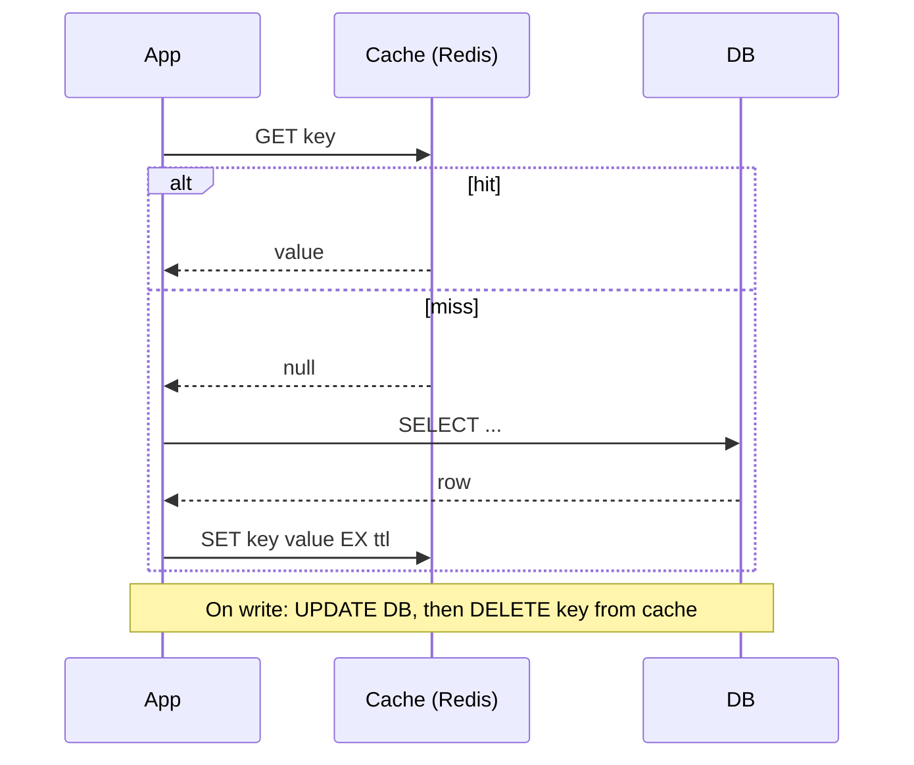
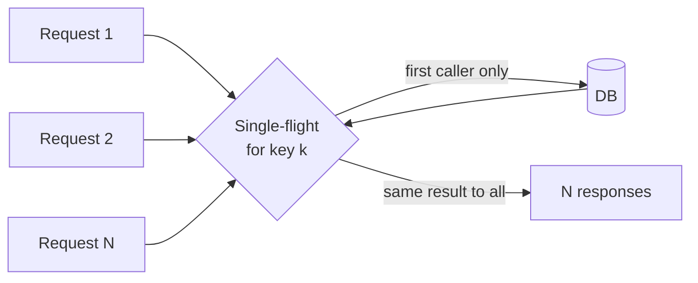
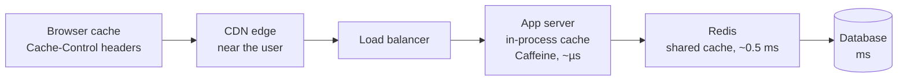

# Caching Strategies

## 1. One-line summary

Keeping a copy of frequently-read data in a faster place (memory, closer to the user) — plus the rules for **how it gets in, how it stays correct, and how it gets out**.

## 2. The problem it solves

From the [latency numbers](back-of-the-envelope.md#32-latency-numbers-every-engineer-should-know): a RAM read is ~100 ns, a Redis GET over the network ~0.5 ms, a database query that touches disk 1–10+ ms. Read-heavy systems (URL shortener at 100:1) send the same hot data to the DB over and over. The DB burns CPU and connections answering identical questions, and latency stays high.

A cache absorbs the repeated reads. But the moment you have two copies of data, you have new problems: **stale data**, **what happens on a miss storm**, **what to evict when memory is full**. "Add Redis" is the easy part; the strategy is what interviewers probe.

## 3. How it works

### 3.1 Read/write patterns

**Cache-aside (lazy loading)** — the application talks to both cache and DB. The most common pattern.

- Only data that's actually read gets cached. A cache outage degrades to "slower", not "down".
- On write, **delete** the key (don't update it) — a delete is idempotent and avoids racing two writers that set different values.
- First read of each key is always a miss.

**Read-through** — the app only talks to the cache; on a miss, the *cache layer itself* loads from the DB (via a configured loader). Same behaviour as cache-aside, but the logic lives in a library/proxy (e.g., Caffeine `LoadingCache`, Hazelcast/Ehcache with a `CacheLoader`). Cleaner app code; less flexibility.

**Write-through** — every write goes to the cache **and** synchronously to the DB before acknowledging. Cache is always fresh for written keys. Cost: every write pays both latencies, and you cache data that may never be read.

**Write-behind (write-back)** — write to cache, acknowledge immediately, flush to the DB asynchronously in batches. Very fast writes, absorbs bursts. Cost: **data loss** if the cache dies before flushing, and the DB is temporarily behind. Used for counters, analytics, view counts — data where losing a few seconds is acceptable.

**Refresh-ahead** — before a hot key's TTL expires, refresh it in the background (e.g., when a read finds less than 20% of TTL left). Hot keys never expire on a user's request, so no latency spike. Cost: wasted refreshes for keys that wouldn't have been read again.

| Pattern | Who loads on miss | Write path | Freshness | Risk |
|---|---|---|---|---|
| Cache-aside | App | DB, then invalidate cache | Stale up to TTL / until invalidation | Race conditions if done carelessly |
| Read-through | Cache library | (usually combined with another) | Same as cache-aside | Library lock-in |
| Write-through | Cache library | Cache + DB synchronously | Fresh | Slower writes, caches cold data |
| Write-behind | Cache library | Cache now, DB later | Cache fresh, DB lags | Data loss on crash |
| Refresh-ahead | Background job | n/a | Fresh for hot keys | Wasted work |

### 3.2 Eviction policies

When memory is full, something has to go.

- **LRU (Least Recently Used)** — evict the key untouched for the longest. Good default. (Java: `LinkedHashMap` with `accessOrder=true` + `removeEldestEntry`.) Redis: `maxmemory-policy allkeys-lru` (approximated by sampling).
- **LFU (Least Frequently Used)** — evict the key with the fewest hits. Better when popularity is stable (a viral link stays popular), resistant to one-off scans pushing out hot keys. Redis: `allkeys-lfu`. Caffeine's W-TinyLFU combines both ideas.
- **TTL (time to live)** — every key expires after a fixed time regardless of memory. Not an eviction policy for memory pressure, but a **correctness backstop**: even if invalidation fails, staleness is bounded.
- FIFO / random — rarely the right answer, but cheap.

### 3.3 Cache stampede (thundering herd)

A very hot key expires (or the cache restarts). In the next millisecond, 5,000 requests all miss, all query the DB for the same row, and all write it back. The DB sees a sudden spike and may tip over — which makes the misses last longer, which makes it worse.

Fixes:
1. **Request coalescing (single-flight):** only one request per key goes to the DB; the others wait for its result. In-process: a `ConcurrentHashMap<String, CompletableFuture<V>>` with `computeIfAbsent`. Caffeine's `LoadingCache` does this automatically.
2. **Distributed lock on rebuild:** `SET lock:key 1 NX EX 5` in Redis — the winner rebuilds; losers briefly wait and retry the cache, or serve a stale value.
3. **Jittered TTL:** instead of `TTL = 3600`, use `3600 + random(0, 300)`. Keys written together (e.g., after a deploy or cache warm-up) don't all expire in the same second.
4. **Refresh-ahead / stale-while-revalidate:** serve the slightly stale value while one background task refreshes it.

### 3.4 Negative caching

If someone requests a key that doesn't exist (`/doesNotExist`), cache-aside misses every time and hits the DB every time. A bot scanning random short codes can hammer your DB this way.

Fix: cache the **"not found"** result too, with a **short TTL** (e.g., 30–60 s): `SET url:xyz "__NONE__" EX 60`. Keep the TTL short so a newly created key becomes visible quickly (or delete the negative entry on create). For huge scan attacks, a **Bloom filter** of existing keys in front of the DB answers "definitely not present" without touching the DB.

### 3.5 Cache invalidation

"There are only two hard things in computer science: cache invalidation and naming things."

Options, from simplest to most robust:
- **TTL only** — accept up to TTL staleness. Great for immutable or rarely-changing data.
- **Delete on write** (cache-aside) — app updates DB then deletes the key. Edge case: a concurrent reader that loaded the old value can write it back *after* your delete. Mitigate with short TTLs or a delayed second delete.
- **Event-driven invalidation** — DB changes are published (e.g., via change data capture to [Kafka](../technologies/kafka.md)), and a consumer deletes the matching cache keys. Works across many services and caches.
- **Versioned keys** — `user:42:v7`; bump the version on write, old entries simply age out.

URL shortener note: a short-code → long-URL mapping is (usually) **immutable**, which makes caching nearly free of invalidation pain. Only deletes/expirations need handling.

### 3.6 Multi-layer caching

| Layer | Latency | Shared by | Invalidation difficulty |
|---|---|---|---|
| Browser | 0 (no request) | One user | Hardest — you can't reach it; only TTL |
| [CDN](../technologies/cdn.md) | ~10–50 ms (near user) | Users in a region | Purge API, TTL |
| In-process (Caffeine / `ConcurrentHashMap`) | ~µs | One app instance | Each pod has its own copy → short TTL |
| [Redis](../technologies/redis.md) | ~0.5 ms | All app instances | Delete key |
| DB buffer pool | ms | Everything | Automatic |

Each outer layer removes load from inner layers but is harder to invalidate. For a URL shortener: a **301** redirect lets the browser cache forever (cheap, but you lose click analytics and can't change the target); a **302** forces every click through your servers.

## 4. When to use it

- **Read-heavy** data with a skewed access pattern (80/20) — feeds, profiles, product pages, short-URL lookups.
- **Expensive-to-compute** results (aggregations, rendered pages, ML features).
- Data that can tolerate **some staleness**, or is immutable.
- Protecting a DB from **predictable spikes** (launches, viral content).

## 5. When NOT to use it

- **Write-heavy data that's rarely re-read** (logs, metrics, audit events). Every write invalidates or updates the cache, the hit rate is near zero, and you pay for memory, an extra network hop and consistency bugs for nothing.
- **Data that must be strongly consistent** on every read (account balances during a transfer, inventory at checkout, short-code *uniqueness checks*). A stale read here is a correctness bug, not a slow page.
- **Before measuring.** If the DB handles the load at acceptable latency, a cache adds a second source of truth, a new failure mode and cold-start behaviour. Add one when metrics (p99 latency, DB CPU, QPS) show you need it — "caching before measuring" is a classic premature optimisation.
- **Low-reuse data** (each key read once): the hit rate will be poor.

## 6. Commonly confused with

| | Cache | Database replica | CDN |
|---|---|---|---|
| Holds | Subset (hot data) | Full copy | Static/edge-cacheable responses |
| Can lose data safely? | Yes (rebuildable) | No | Yes |
| Consistency | Whatever your invalidation gives | Replication lag | TTL / purge |
| Query capability | Key lookup | Full SQL | URL lookup |

| | Write-through | Write-behind |
|---|---|---|
| Ack after | Cache **and** DB written | Cache written |
| Write latency | Higher | Lowest |
| Durability | Same as DB | Risk of loss |

## 7. Common mistakes / misuse

- **No TTL.** A missed invalidation means stale data forever, and memory fills with dead keys. Always set a TTL, even a long one.
- **Caching write-heavy data** (see section 5).
- **Caching before measuring.**
- **Ignoring the stampede** on hot-key expiry or cache restart ("cold cache" after a deploy can be an outage).
- **Updating the cache on write instead of deleting** → racing writers leave the wrong value.
- **Treating the cache as the source of truth** (with eviction on, data *will* disappear).
- **No negative caching** → random-key scans go straight to the DB.
- **Huge values** (multi-MB) in Redis → network and single-thread latency spikes.
- **Forgetting in-process caches differ per pod** → users see different values depending on which pod they hit.

## 8. Interview cheat-sheet

> "Reads outnumber writes 100 to 1 and mappings are immutable, so I'll use cache-aside with Redis: check the cache, on a miss read the DB and populate with a TTL. By the 80/20 rule, ~35 GB holds the hot set. I'll evict with LRU (or LFU for stable popularity), add jitter to TTLs and single-flight the DB load to avoid a stampede on hot keys, and cache 'not found' for a minute so scanners can't hammer the DB. If a link is deleted I delete the cache key, and the TTL bounds any staleness. In front of that, a CDN or browser caching of the redirect removes even more load, at the cost of analytics."

## 9. Used in

- [URL Shortener](../interviews/url-shortener/README.md) — the read path: Redis cache-aside for short-code lookups, cache sizing via 80/20, negative caching for unknown codes, hot-link stampedes, and 301 vs 302 (browser/CDN caching).
- [Notification system](../interviews/notification-system/README.md) — caching **user preferences, contact info and rendered templates** on the send path so each notification doesn't hit the DB.
- Related: [Redis](../technologies/redis.md), [CDN](../technologies/cdn.md), [Kafka](../technologies/kafka.md) (event-driven invalidation), [Back-of-the-envelope](back-of-the-envelope.md) (cache sizing), [Consistent hashing](consistent-hashing.md) (when the cache outgrows one node).
