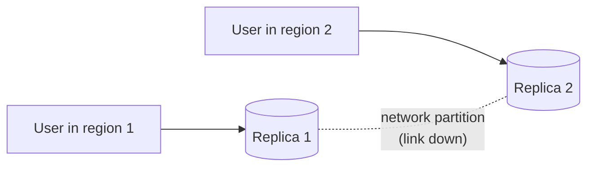
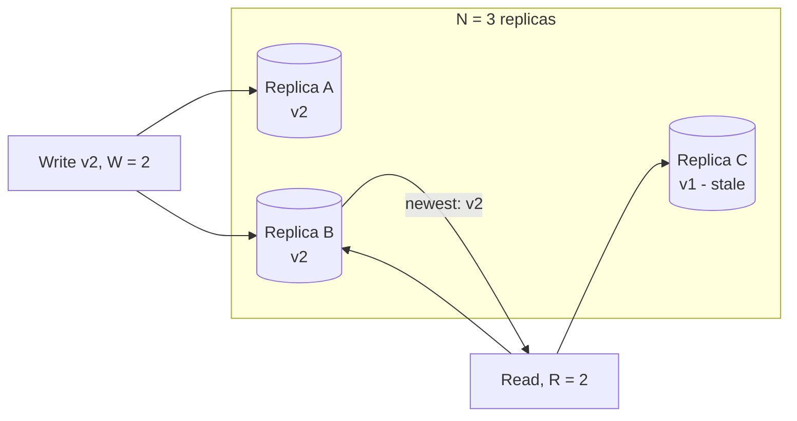

# CAP Theorem and Consistency Models

## 1. One-line summary

When the network between your replicas breaks, a distributed system must choose between **answering anyway (maybe with stale data)** or **refusing to answer until it can be sure** — and even without failures, it trades **latency against consistency**.

## 2. The problem it solves

As soon as data lives on more than one machine (see [replication](sharding-and-replication.md)), copies can disagree. Two users reading the same key from two replicas might see different values. You need a vocabulary to decide, per feature, **how wrong is acceptable** and **what happens during failures**:

- Can a user see a like count that's 2 seconds old? Sure.
- Can two users be handed the same short code? Absolutely not.
- Can a bank balance go negative because two replicas each approved a withdrawal? No.

CAP, PACELC and consistency models are that vocabulary. In an interview, they let you justify "this part can be eventually consistent, this part must be strongly consistent" instead of hand-waving.

## 3. How it works

### 3.1 CAP in plain words

- **C — Consistency** (here: *linearizability*): every read sees the most recent completed write, as if there were one copy of the data.
- **A — Availability**: every request to a non-failed node gets a (non-error) response.
- **P — Partition tolerance**: the system keeps operating when the network drops or delays messages between nodes.

The theorem: **during a network partition, you cannot have both C and A.**

A write arrives at Replica 1 while the link is down. A read for the same key arrives at Replica 2. Replica 2 has two options:
- **Answer with what it has** (possibly stale) → available, not consistent. **AP.**
- **Refuse / time out** until it can confirm with Replica 1 → consistent, not available. **CP.**

There is no third option. That's all CAP says.

### 3.2 Why "pick 2 of 3" is misleading

- **P is not optional.** Networks *will* partition (switch failure, a misconfigured security group, a GC pause long enough to look like a dead node). A "CA" system just means "a system that breaks in undefined ways when the network fails" — or a single-node system, which isn't distributed.
- So the real choice is **C or A *during a partition*.** When the network is healthy, you can have both.
- It's not a whole-system switch. Different operations in the same product can choose differently (the URL shortener does — see 3.6), and many databases let you choose per query (Cassandra consistency levels, DynamoDB `ConsistentRead`).
- "Consistency" in CAP is very strict (linearizability); "availability" is very strict (every node answers). Real systems sit in between.

Infra analogy: etcd in your k8s cluster is **CP** — if the control plane loses quorum, `kubectl apply` fails rather than risk two conflicting states. DNS is **AP** — it'll happily serve you a cached, stale record rather than fail.

### 3.3 PACELC

CAP only talks about partitions, which are rare. PACELC adds the everyday trade-off:

> **If Partition**: choose **A**vailability or **C**onsistency; **Else** (normal operation): choose **L**atency or **C**onsistency.

Why "else latency": to be strongly consistent, a write must reach other replicas (maybe in other regions) before acknowledging. That's extra round trips — 0.5 ms in one DC, ~100+ ms across regions (see [latency numbers](back-of-the-envelope.md#32-latency-numbers-every-engineer-should-know)). You pay that on *every* request, not just during failures.

| System | Partition → | Else → | Label |
|---|---|---|---|
| Cassandra, DynamoDB (default) | A | L | PA/EL |
| Postgres / MySQL single leader with sync standby | C | C | PC/EC |
| etcd, ZooKeeper, Spanner | C | C | PC/EC |
| MongoDB (majority read/write concerns) | C | C | PC/EC (tunable) |

### 3.4 Strong vs eventual consistency (and in between)

- **Strong (linearizable):** behaves like a single copy. After a write is acknowledged, every subsequent read anywhere sees it. Needs coordination (leader, consensus like Raft/Paxos, or quorums).
- **Eventual:** if writes stop, all replicas *eventually* converge. Meanwhile, reads may be stale or out of order. Cheap, fast, highly available.
- **In between** (often what users actually need):
  - **Read-your-writes** — you always see your own writes.
  - **Monotonic reads** — you never see time go backwards.
  - **Causal** — if B was caused by A (reply to a comment), everyone sees A before B.

### 3.5 Quorums: R + W > N

In a leaderless store with replication factor **N** (each key on N nodes):
- A write is acknowledged after **W** replicas confirm.
- A read queries **R** replicas and takes the newest version.

If **R + W > N**, the read set and the write set **must overlap in at least one node**, so a read always contacts at least one replica that has the latest acknowledged write.

Write hit A and B; read hit B and C. They overlap at B, so the read sees v2. (Then *read repair* updates C.)

| N | W | R | R + W > N? | Behaviour |
|---|---|---|---|---|
| 3 | 2 | 2 | 4 > 3 yes | Common "QUORUM" setting; tolerates 1 node down for both reads and writes |
| 3 | 3 | 1 | 4 > 3 yes | Fast reads, but any one node down blocks writes |
| 3 | 1 | 3 | 4 > 3 yes | Fast writes, any node down blocks reads |
| 3 | 1 | 1 | 2 > 3 no | Fastest, most available, **eventual** — reads may be stale |

Caveat: quorum overlap gives "newest acknowledged value" in the simple case, but edge cases (sloppy quorums, concurrent writes resolved by last-write-wins with skewed clocks) mean it's not full linearizability. Say "R + W > N gives strong-ish consistency" and mention LWW conflicts if pushed. See [Cassandra](../technologies/cassandra.md).

### 3.6 URL shortener: where eventual is fine, where it isn't

| Operation | Consistency needed | Why |
|---|---|---|
| Redirect lookup `GET /abc1234` | **Eventual is fine** | Mapping is immutable once created. A new link might 404 for a few hundred ms on a lagging replica/cache — acceptable, and fixable with read-your-writes for the creator. |
| Click counts / analytics | **Eventual is fine** | Nobody notices a count that's 5 s behind. Batch via [Kafka](../technologies/kafka.md). |
| Link deletion / expiry | Eventual, bounded | Cache TTL bounds how long a deleted link keeps working. Tighten for abuse takedowns (explicit cache delete). |
| **Short code uniqueness** | **Strong** | If two replicas each accept `abc1234` for different long URLs during a partition, one user's link silently points somewhere else. That's a correctness and potentially security bug. |
| Custom alias claim ("/my-brand") | **Strong** | Same: two users must not both "win" the same alias. |

How to get strong uniqueness without making *everything* strong:
- **Avoid the race entirely**: generate codes from non-overlapping ranges (counter + Base62, range allocation via a CP store like [etcd/ZooKeeper](../technologies/zookeeper-etcd.md) or a DB ticket table). Each server owns its range, so uniqueness needs no per-write coordination. See [ID generation](id-generation.md).
- For custom aliases / hash-based codes: a single-leader DB with a **unique constraint** ([Postgres](../technologies/postgresql.md)), or a conditional write (`INSERT ... IF NOT EXISTS` in Cassandra uses Paxos — lightweight transactions; DynamoDB `attribute_not_exists` condition).

So the system is **CP for writes of new codes, AP for reads** — which is exactly the "it's per operation, not per system" point.

## 4. When to use it (strong vs eventual)

**Choose strong consistency** for: uniqueness (usernames, short codes, aliases), money and inventory, locks and leader election, anything where a stale read causes an irreversible wrong action.

**Choose eventual consistency** for: feeds, likes, view counts, recommendations, caches, search indexes, analytics, DNS-style lookups of immutable data — anything where stale-for-a-second is invisible or harmless, and availability/latency matter more.

## 5. When NOT to use it

- **Don't demand strong consistency everywhere.** It costs latency on every request (PACELC) and availability during partitions. Making a like counter linearizable across regions is a mistake: users pay ~100+ ms per click for a guarantee nobody can perceive.
- **Don't accept eventual consistency where duplicates or lost updates break invariants.** "It'll converge" doesn't help when two people were already given the same code or the same seat.
- **Don't invoke CAP for single-node systems** or when there's no partition scenario under discussion — it adds jargon without content. Talk about replication lag or isolation levels instead.
- **Don't confuse with ACID "C"** (see below) — it's a different concept.

## 6. Commonly confused with

| Term | Means | Not to be confused with |
|---|---|---|
| CAP "Consistency" | Linearizability across replicas | ACID "Consistency" (DB constraints/invariants hold after a transaction) |
| CAP "Availability" | Every live node responds | "99.99% uptime" SLA availability |
| Eventual consistency | Replicas converge if writes stop | "Eventually correct" — it doesn't fix logic bugs or conflicts by itself |
| Strong consistency | Single-copy illusion across replicas | Serializable isolation (about concurrent *transactions*, can exist on one node) |

| | CAP | PACELC |
|---|---|---|
| Covers | Behaviour during a partition | Partition **and** normal operation |
| Trade-off | C vs A | C vs A (partition), L vs C (else) |
| Usefulness in interviews | Name-drop, then clarify | More realistic — explains why strong consistency is slow |

## 7. Common mistakes / misuse

- Saying "**we choose CA**" for a distributed system.
- "MongoDB is CP, Cassandra is AP" **as if fixed** — both are tunable per operation.
- Treating CAP as a design decision for the whole system rather than per operation/data type.
- Quoting R + W > N but setting `R = W = 1` in the design.
- Saying "eventual consistency" without saying **how long** (ms? minutes?) and **what the user sees** meanwhile.
- Forgetting **read-your-writes**: the most common user-visible eventual-consistency bug ("I just created it, where is it?").
- Using last-write-wins without noting it **silently drops** one of two concurrent writes, and depends on clocks.

## 8. Interview cheat-sheet

> "CAP says that during a network partition a replicated system must either refuse requests to stay consistent or answer with possibly stale data to stay available; partitions are unavoidable, so the real choice is C or A when one happens. PACELC adds that even without partitions, stronger consistency costs latency. I decide per operation: redirect lookups are immutable mappings, so eventual consistency from replicas and caches is fine, with read-your-writes for the link creator. Short-code uniqueness must be strong, so I avoid the race by giving each server a disjoint ID range from a CP store, and use a unique constraint or conditional write for custom aliases. In a leaderless store I'd use N=3, W=2, R=2 so R + W > N."

## 9. Used in

- [URL Shortener](../interviews/url-shortener/README.md) — consistency requirements: eventually consistent redirects and analytics vs strongly consistent short-code / custom-alias uniqueness; choice of store (Postgres vs Cassandra/DynamoDB) and quorum settings.
- [Ride-sharing](../interviews/ride-sharing/README.md): **strong consistency for driver assignment and payments** (one driver per trip, no double charge) vs **eventual consistency for locations, ETAs and surge** (a few seconds stale is fine).
- Related: [Sharding and replication](sharding-and-replication.md) (replication lag, leaderless quorums), [ID generation](id-generation.md) (coordination-free uniqueness), [ZooKeeper / etcd](../technologies/zookeeper-etcd.md) (CP coordination), [Cassandra](../technologies/cassandra.md) (tunable consistency, LWT), [PostgreSQL](../technologies/postgresql.md) (unique constraints, sync replication), [Caching strategies](caching-strategies.md) (cache as an eventually consistent copy).
