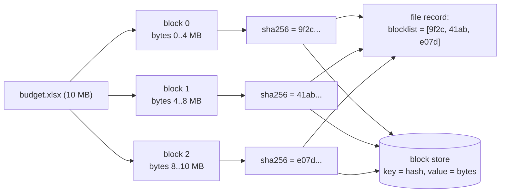
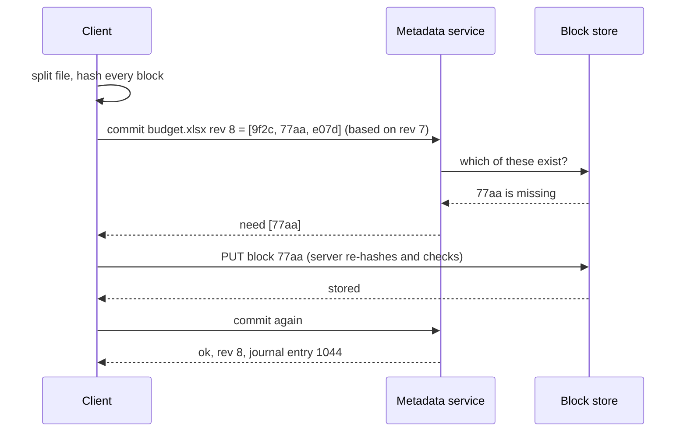

# Chunking and Block-Level Dedup

## 1. One-line summary

Split every file into **blocks** (for example 4 MB each), name each block by the **hash of its bytes**, and describe a file as the **ordered list of its block hashes**; then a client uploads only the blocks the server doesn't already have, so editing one byte of a 1 GB file sends about 4 MB instead of 1 GB, and identical blocks (across versions, files, or even users) are stored once.

💡 **Hash** = a short fixed-size fingerprint computed from data. With **SHA-256** (32 bytes), any change to the input changes the output completely, and finding two different inputs with the same output is practically impossible, so the hash can safely serve as the block's **address** (its storage key). Exact-hash and near-duplicate fingerprints are covered in [content fingerprinting and dedup](content-fingerprinting-and-dedup.md); this file is about **blocks inside files**.

> Infra analogy: Docker images. An image is a list of layer digests (`sha256:...`); `docker push` asks the registry which layers it already has and uploads only the rest. Blocks are the same idea at a finer grain, inside one file.

---

## 2. The problem it solves

**The pain:** Ben's sync client watches a 1 GB video project file. He changes one title card, which rewrites a few bytes.

```
whole-file upload:     1 GB on a 10 Mbps uplink
                       = 8,000 Mbit / 10 Mbps = 800 s ≈ 13 minutes, for a few bytes changed
```

And at the server: 1,000 users each upload the same 200 MB installer, so it is stored 1,000 times = 200 GB for 200 MB of distinct data. Each new version of a file also stores a full copy even when 99% is unchanged.

**The fix:** content-addressed blocks.

```
1 GB file / 4 MB blocks = 1,024 MB / 4 MB = 256 blocks
edit 1 byte in the middle  → 1 block's hash changes → upload 4 MB, not 1,024 MB  (256× less)
4 MB on 10 Mbps            = 32 Mbit / 10 Mbps = 3.2 s instead of ~13 minutes
same installer × 1,000 users → stored once (if dedup is cross-user, see 3.5)
```

---

## 3. How it works

### 3.1 A file is a list of block hashes



Two separate stores:
- **Metadata** (in a database such as [PostgreSQL](../technologies/postgresql.md) or [Cassandra](../technologies/cassandra.md)): `file ID → revision → [hash0, hash1, ...]`, plus size, path, owner.
- **Block store** (usually [object storage](../technologies/object-storage.md)): `hash → bytes`. A block is **immutable** (never modified after it's written): if the bytes changed, it's a different hash, so a different block. That makes blocks trivially cacheable and safe to replicate.

**Dropbox's numbers.** Dropbox's "Streaming File Synchronization" post (2014) describes splitting files into **4 MB blocks**, hashing each with **SHA-256**, and identifying a file by its **blocklist**. Dropbox's public API still exposes a `content_hash` built the same way: SHA-256 of each 4 MB block, then SHA-256 of the concatenated block hashes. The 2011 "Dark Clouds on the Horizon" paper (Mulazzani et al., USENIX Security) also observed 4 MB chunks hashed with SHA-256.

### 3.2 The upload protocol: "which of these do you need?"



Properties worth naming in an interview:
- **Idempotent**: uploading a block twice is harmless, its key is its content ([idempotency](idempotency-and-delivery-semantics.md)). Retries after a dropped connection are free; blocks double as resume points ([resumable and chunked uploads](resumable-and-chunked-uploads.md)).
- **Server verifies the hash**: never trust the client's claim that "these bytes hash to 77aa", or one bad client corrupts every file that references 77aa.
- **Commit is atomic** at the metadata level: the new revision becomes visible only when every block exists. Readers never see half a file.
- **Downloads** work the same way in reverse: the device compares the new blocklist with blocks it already has locally and fetches only the missing ones.

### 3.3 Choosing the block size

Smaller blocks find more duplicates but cost more metadata and more requests. For a user with 1 TB:

| block size | blocks for 1 TB | hash metadata (32 B each) | upload after a 1-byte edit |
|---|---|---|---|
| 64 KB | 1 TB / 64 KB = 16.8 M | 16.8 M × 32 B ≈ 512 MB | 64 KB |
| 1 MB | 1 TB / 1 MB = 1.05 M | 1.05 M × 32 B ≈ 32 MB | 1 MB |
| 4 MB | 1 TB / 4 MB = 262,144 | 262,144 × 32 B = 8 MB | 4 MB |
| 64 MB | 16,384 | 512 KB | 64 MB |

Per-request overhead (a **round trip**, 💡 one request-and-response over the network, plus auth, an object-store `PUT` that costs money) also pushes toward bigger blocks; small files are a single short block anyway. Several MB is a common middle ground for consumer sync.

### 3.4 The one-byte-insert problem: fixed vs content-defined chunking

Fixed-size chunking cuts at byte 0, 4 MB, 8 MB, ... no matter what the bytes are. **Overwriting** a byte changes one block. But **inserting** a byte at the front shifts every later byte by one, so every block boundary now falls on different content and **every hash changes**.

**Content-defined chunking (CDC)** puts boundaries where the *content* says so: slide a small window over the bytes, compute a cheap **rolling hash** (💡 a hash you can update in O(1) as the window moves one byte, instead of recomputing it), and cut wherever the hash matches a pattern (e.g. its low 20 bits are zero, which happens on average every 2²⁰ bytes = 1 MB). An insert only changes the chunk it lands in; the next boundary is found at the same content as before, and the chunker "resynchronizes". LBFS (Muthitacharoen, Chen and Mazières, SOSP 2001) used Rabin fingerprints this way; FastCDC (Xia et al., USENIX ATC 2016) is a faster modern variant. The mechanism is explained step by step in [content-defined chunking](../../under-the-hood/content-defined-chunking.md); the related rsync trick in [rsync's rolling hash](../../under-the-hood/rsync-rolling-hash.md).

Runnable demo (Node 22, no dependencies): a 40 MB pseudo-random file, three edits, fixed 4 MB blocks vs a toy CDC.

```js
import { createHash } from 'node:crypto';

const MB = 1024 * 1024;
const BLOCK = 4 * MB;                       // fixed block size (Dropbox-style 4 MB)
const sha = (b) => createHash('sha256').update(b).digest('hex');

// Deterministic pseudo-random "file" (xorshift), so every run gives the same bytes.
function makeFile(size) {
  const buf = Buffer.alloc(size);
  let x = 2463534242;
  for (let i = 0; i < size; i++) { x ^= x << 13; x ^= x >>> 17; x ^= x << 5; buf[i] = x & 0xff; }
  return buf;
}

// Fixed-size chunking: cut every BLOCK bytes, no matter what the bytes are.
function fixedChunks(buf) {
  const out = [];
  for (let off = 0; off < buf.length; off += BLOCK) out.push(sha(buf.subarray(off, off + BLOCK)));
  return out;
}

// Toy content-defined chunking: cut where a rolling "gear" hash of the last
// bytes has its low 20 bits all zero (~1 MB average). Boundaries follow content.
const GEAR = Array.from({ length: 256 }, (_, i) => sha(Buffer.from([i])).slice(0, 8)).map((h) => parseInt(h, 16) >>> 0);
function cdcChunks(buf, mask = (1 << 20) - 1) {
  const out = []; let start = 0, h = 0;
  for (let i = 0; i < buf.length; i++) {
    h = ((h << 1) + GEAR[buf[i]]) >>> 0;     // older bytes shift out after 32 steps
    if ((h & mask) === 0 && i + 1 - start >= 64 * 1024) { out.push(sha(buf.subarray(start, i + 1))); start = i + 1; }
  }
  if (start < buf.length) out.push(sha(buf.subarray(start)));
  return out;
}

function compare(name, chunker, a, b) {
  const before = chunker(a), after = chunker(b);
  const known = new Set(before);
  const reused = after.filter((h) => known.has(h)).length;
  console.log(`${name.padEnd(28)} chunks before=${before.length} after=${after.length} ` +
              `reused=${reused} must upload=${after.length - reused}`);
}

const original = makeFile(40 * MB);
const edits = {
  'insert 1 byte at front': Buffer.concat([Buffer.from([0x41]), original]),
  'overwrite 1 byte at 10 MB': (() => { const c = Buffer.from(original); c[10 * MB] ^= 0xff; return c; })(),
  'append 1 byte at end': Buffer.concat([original, Buffer.from([0x41])]),
};
for (const [edit, file] of Object.entries(edits)) {
  console.log(`--- ${edit}`);
  compare('fixed 4 MB', fixedChunks, original, file);
  compare('content-defined (~1 MB avg)', cdcChunks, original, file);
}
```

Real output of `node chunks.mjs` (about 6 s):

```
--- insert 1 byte at front
fixed 4 MB                   chunks before=10 after=11 reused=0 must upload=11
content-defined (~1 MB avg)  chunks before=44 after=44 reused=43 must upload=1
--- overwrite 1 byte at 10 MB
fixed 4 MB                   chunks before=10 after=10 reused=9 must upload=1
content-defined (~1 MB avg)  chunks before=44 after=44 reused=43 must upload=1
--- append 1 byte at end
fixed 4 MB                   chunks before=10 after=11 reused=10 must upload=1
content-defined (~1 MB avg)  chunks before=44 after=44 reused=43 must upload=1
```

Read it: with fixed blocks, one inserted byte at the front means **0 of 11** blocks match, so the whole 40 MB goes up again (the 11th block is the single leftover byte at the end). Overwrites and appends are fine with fixed blocks. CDC handles all three with one changed chunk. That's why backup tools that see lots of inserts (restic, Borg) use CDC, while many sync products keep fixed blocks for simplicity: most real edits to big binary files (databases, VM images, media) are in-place overwrites or appends.

### 3.5 Cross-user dedup and its privacy problem

If the block store is shared by all users, the 1,000 copies of the installer cost one copy. But **client-side** cross-user dedup leaks information:

- **Confirmation-of-file attack**: an attacker hashes a guessed file ("salary letter for employee 4711, amount = X") and asks the server "do you have this block?". If the upload is skipped, someone has that exact file. Repeat for every plausible X. Harnik, Pinkas and Shulman-Peleg described this side channel in 2010 (IEEE Security & Privacy). In 2011 Ashkan Soltani observed it on Dropbox by watching network traffic: a previously-uploaded 6.4 MB file caused only ~16 KB of traffic (reported by the EFF).
- **Hash-as-password**: if knowing a block's hash is enough to get it attached to your account, the hash *is* the file. Mulazzani et al. (USENIX Security 2011) showed this against Dropbox's client of the time; the authors report Dropbox fixed it after disclosure. *Unverified: commonly reported that Dropbox then stopped client-side cross-user dedup; I couldn't find a primary source.*

Mitigations:

| Option | Leak closed? | Cost |
|---|---|---|
| Dedup **per user** only | yes | lose cross-user savings |
| Client always uploads, server dedups **after** receiving | yes (no observable difference) | upload bandwidth for duplicates |
| **Proof of ownership**: server challenges the client with random byte ranges (Halevi et al., CCS 2011) | mostly | protocol complexity |
| **Convergent encryption**: key = hash(content), so identical plaintext gives identical ciphertext (Douceur et al., 2002) | server can't read files, but confirmation attack still works | weaker than [end-to-end encryption](end-to-end-encryption.md) |

With true end-to-end encryption (each user's own key), identical files encrypt differently, so cross-user dedup is impossible by design.

### 3.6 Reference counting and garbage collection

Blocks are shared, so you can't delete a block when one file is deleted. Track **references**: each blocklist that mentions a hash is one reference.

- **Reference counts** (`hash → count`): decrement on delete, delete the block at 0. Simple, but every file write updates many counters, and a crash between "decrement" and "delete" leaks or loses blocks.
- **The dangerous race**: block `77aa` hits count 0 and is scheduled for deletion; at the same moment a client's commit sees "77aa exists, no need to upload". The commit succeeds, then the block is deleted: **the new file is corrupt**.
- **Mark and sweep with a grace period** (what most large systems do): periodically mark every hash reachable from live file versions (including trash and version history), then delete unmarked blocks **only if they are older than, say, 7 days**. Fresh uploads are never collected mid-commit. This is the same idea as `git gc` pruning only unreachable objects older than two weeks by default ([Git's object store](../../under-the-hood/git-object-store.md)).
- Version history and trash keep blocks alive: "deleted" files still cost storage until retention expires.

---

## 4. When to use it

- **File sync and backup** (Dropbox-style clients, restic, Borg, Time Machine-like tools): upload and store only changed blocks.
- **Container registries and package caches**: layers or blobs by digest.
- **Version history** where each version shares unchanged blocks with the previous one.
- **Large files edited in place** (VM disk images, databases, media projects).

## 5. When NOT to use it

| Situation | Why it's a mistake |
|---|---|
| Mostly small files (< 1 block) | Every file is one block; you add a metadata hop for nothing beyond whole-file dedup |
| Compressed or encrypted files that change wholesale (`.zip` re-created, or encryption with a random IV, 💡 a random starting value that makes each encryption of the same file look different) | One edit changes every byte; no block survives |
| Fixed-size blocks for text-like data with many inserts | Boundaries shift; use CDC (3.4) |
| Cross-user client-side dedup of sensitive data | Confirmation-of-file attack (3.5) |
| Tiny blocks "to maximise dedup" | Metadata and request overhead explode (3.3 table) |

## 6. Commonly confused with

| | **Block-level dedup (this)** | **Whole-file dedup** | **Multipart upload** | **Delta sync (rsync)** |
|---|---|---|---|---|
| Unit | block (fixed or CDC) | file | upload part | byte ranges |
| Goal | store/transfer each distinct block once | store each distinct file once | survive network failures | transfer only differences |
| Parts named by | content hash | content hash | part number | offsets + rolling hash |
| Server keeps parts separately? | yes, forever (shared) | n/a | no, assembled into one object | no |
| Detail | here | [content fingerprinting](content-fingerprinting-and-dedup.md) | [resumable uploads](resumable-and-chunked-uploads.md) | [rsync rolling hash](../../under-the-hood/rsync-rolling-hash.md) |

## 7. Common mistakes / misuse

1. **Trusting the client's hash** without re-hashing on the server.
2. **Deleting blocks by refcount without a grace period**: races with concurrent commits.
3. **Forgetting version history and trash** when computing which blocks are live.
4. **Non-cryptographic or short hashes** as block addresses: a collision means two files share wrong bytes (see the birthday arithmetic in [content fingerprinting](content-fingerprinting-and-dedup.md)).
5. **Claiming fixed blocks handle inserts**: they handle overwrites and appends only.
6. **Ignoring the privacy cost** of global client-side dedup.
7. **Committing metadata before all blocks are stored**: readers see a file with missing blocks.

## 8. Interview cheat-sheet

> "I split files into 4 MB blocks and address each block by its SHA-256 hash. A file version is just the ordered list of block hashes. To upload, the client sends the list, the server answers which hashes it's missing, and the client uploads only those; the server re-hashes them, and the commit becomes visible atomically once all blocks exist. A 1 GB file is 256 blocks, so a one-byte edit uploads 4 MB instead of 1 GB. Fixed-size blocks break on inserts because every boundary shifts; content-defined chunking with a rolling hash fixes that. I'd dedup per user, or server-side only, because global client-side dedup lets anyone test whether a file exists. Blocks are shared, so deletion is mark-and-sweep over all live versions with a grace period, never an immediate refcount delete."

## 9. Used in

- [File storage and sync (Dropbox / Google Drive)](../interviews/file-storage-sync/README.md): blocklists in the metadata DB, "which blocks are missing?" uploads, block store on object storage, dedup scope, garbage collection of unreferenced blocks.
- Related: [file sync and conflict resolution](file-sync-and-conflict-resolution.md), [resumable and chunked uploads](resumable-and-chunked-uploads.md), [content fingerprinting and dedup](content-fingerprinting-and-dedup.md), [content-defined chunking](../../under-the-hood/content-defined-chunking.md), [rsync's rolling hash](../../under-the-hood/rsync-rolling-hash.md), [Git's object store](../../under-the-hood/git-object-store.md), [object storage](../technologies/object-storage.md), [end-to-end encryption](end-to-end-encryption.md).

**Sources:** Dropbox tech blog, "Streaming File Synchronization" (2014); Dropbox API docs, content hash; Mulazzani et al., "Dark Clouds on the Horizon", USENIX Security 2011; Harnik, Pinkas, Shulman-Peleg, "Side channels in cloud services: deduplication in cloud storage", IEEE S&P magazine 2010; Halevi et al., "Proofs of ownership in remote storage systems", ACM CCS 2011; Douceur et al., "Reclaiming space from duplicate files in a serverless distributed file system", ICDCS 2002; Muthitacharoen, Chen, Mazières, "A low-bandwidth network file system" (LBFS), SOSP 2001; Xia et al., "FastCDC", USENIX ATC 2016.
