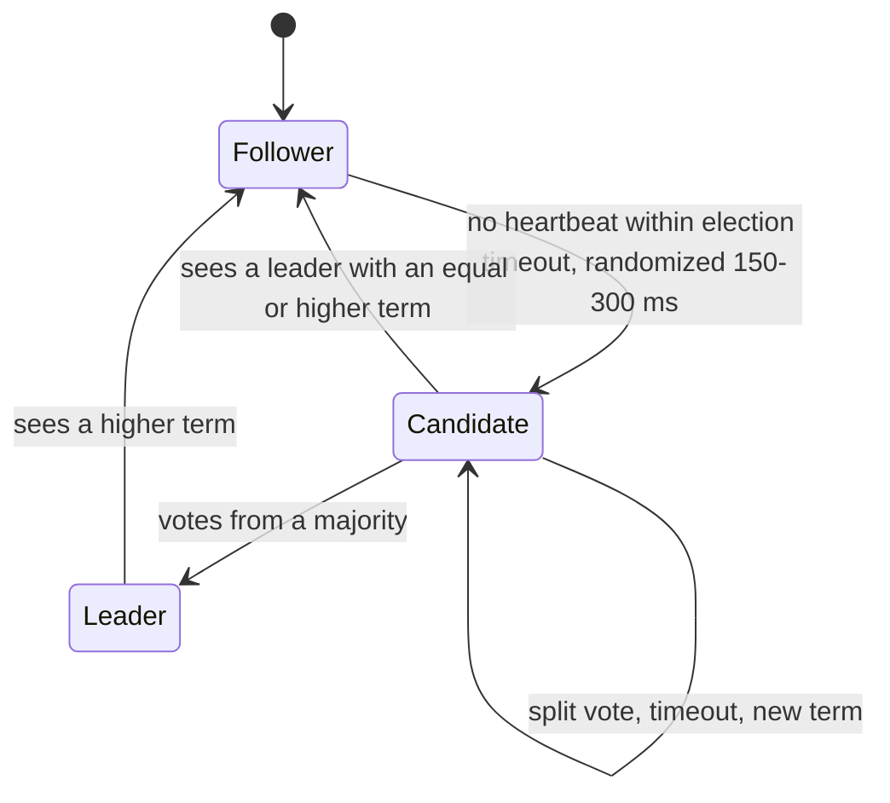
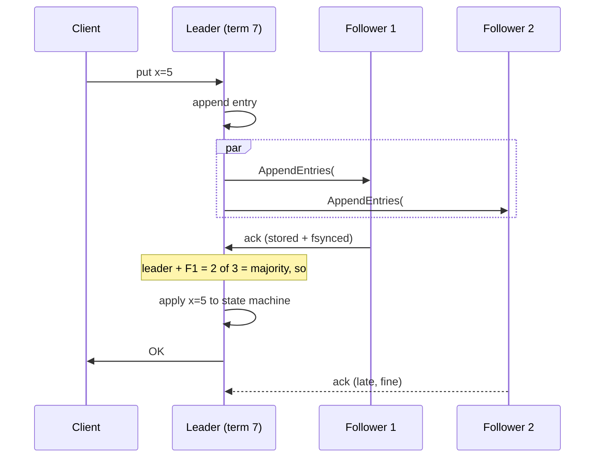

# Consensus and Raft

## 1. One-line summary

**Consensus** = getting a group of machines to agree on **one value, or one order of operations**, even when some of them crash or the network drops messages; **Raft** is the most widely used consensus algorithm: elect one leader, the leader appends every write to a replicated log, and a write is **committed once a majority has stored it**.

## 2. The problem it solves

Say three replicas hold `balance = 100`. Two clients send `withdraw 80` at the same time to different replicas. If each replica applies whatever arrives first, replica A might approve one withdrawal and replica B the other: the balance goes to −60. Leaderless stores (Dynamo, [Cassandra](../technologies/cassandra.md)) accept this and resolve conflicts later ([vector clocks / LWW](vector-clocks-and-conflict-resolution.md)). Some data can't tolerate that:

- uniqueness ("only one user gets this username"), locks and leader election, money, config, schema, "which node owns which shard".

What we want is a **replicated state machine**: every replica applies **the same operations in the same order**, so they all compute the same state, like replaying the same WAL (write-ahead log, see [LSM trees](lsm-trees-and-storage-engines.md)) on every node. The hard part is agreeing on that order when nodes crash, restart, and the network loses or delays messages, without ever having two "truths" (**split brain**: two nodes both acting as leader and accepting conflicting writes).

Infra analogy: this is exactly what etcd does under your k8s control plane. Every `kubectl apply` becomes one entry in etcd's Raft log; if the API server could write to two etcd nodes that disagreed, your Deployment would have two different specs.

## 3. How it works

### 3.1 Majorities (quorums) are the whole trick

Any two majorities of the same group **overlap in at least one node**. With 5 nodes, any 3 and any other 3 share at least 1. So if a decision needed a majority, any later majority contains someone who knows about it.

| Cluster size | Majority | Failures tolerated | Note |
|---|---|---|---|
| 1 | 1 | 0 | No fault tolerance |
| 3 | 2 | **1** | Common default |
| 4 | 3 | 1 | No better than 3, and slower |
| 5 | 3 | **2** | Survives 1 planned + 1 unplanned outage |
| 7 | 4 | 3 | Rare; every write waits on 4 nodes |

Formula: N nodes tolerate ⌊(N − 1) / 2⌋ failures. That's why consensus groups are 3 or 5 nodes, odd-sized (see also [ZooKeeper / etcd](../technologies/zookeeper-etcd.md)).

### 3.2 Roles and terms

Each node is a **Follower**, **Candidate** or **Leader**. Time is divided into **terms** (numbered 1, 2, 3...); each term has at most one leader. A term number is like a "generation" or epoch: any message carrying an older term is rejected, so a deposed leader that wakes up after a long GC pause (💡 the JVM freezing all threads to clean memory) can't do damage.

### 3.3 Leader election

1. The leader sends **heartbeats** (empty append messages) every ~50–100 ms.
2. A follower that hears nothing for its **election timeout** becomes a candidate: increments the term, votes for itself, asks others for votes.
3. Each node grants **one vote per term**, and only to a candidate whose log is **at least as up to date** as its own (this rule is what keeps committed data safe, see 3.5).
4. A majority of votes → leader for that term.

**Randomized timeouts** (e.g. each follower picks 150–300 ms at random) make it likely that one follower times out first and wins before others start, avoiding endless split votes. etcd defaults: heartbeat 100 ms, election timeout 1,000 ms, so failover takes ~1–2 s.

### 3.4 Log replication and commit

- Each entry has an index and the term in which it was created.
- **Committed** = stored on a majority. Committed entries are never lost, and followers apply them in index order.
- A follower whose log diverges (e.g. it was the old leader and has uncommitted entries) gets them **overwritten** by the current leader's log.

### 3.5 Why it's safe (in plain words)

A committed entry is on a majority. A new leader needs votes from a majority. Those majorities overlap, and the overlapping voter refuses any candidate whose log is behind its own. So **every new leader already has every committed entry**. Uncommitted entries may be lost on failover; the client never got an OK for them, so it retries (use [idempotency keys](idempotency-and-delivery-semantics.md) so a retry doesn't apply twice).

A partitioned minority (say 2 of 5) can't elect a leader or commit anything, so it refuses writes: Raft chooses **C over A** in [CAP](cap-and-consistency.md) terms.

### 3.6 Cost: every write is a round trip to a majority

Write latency ≈ leader fsync + one network round trip (RTT) to the fastest majority + their fsync (💡 *fsync* = forcing data from OS memory onto the physical disk, ~0.1–2 ms on SSD; *RTT* = time for a message to go there and back).

| Deployment | RTT to majority | Approx. write latency |
|---|---|---|
| 3 nodes, one data center | ~0.5 ms | **~2–5 ms** |
| 3 availability zones, one region | ~1–2 ms | ~3–8 ms |
| 3 regions (e.g. US-East, US-West, EU) | ~70 ms to nearest other region | **~70–100 ms** |

Throughput: one leader orders everything, so a single group tops out around **~10k–30k writes/s** with batching (etcd: thousands to ~10k+). Reads must also be careful: a leader that was just partitioned away might not know it was replaced, so linearizable reads (💡 reads guaranteed to see the latest committed write) either confirm leadership with a quorum round (**ReadIndex**) or rely on a time-based **leader lease**.

### 3.7 Multi-Raft: one Raft group per partition

One Raft group can't hold 10 TB or do 500k writes/s. So TiKV, CockroachDB, YugabyteDB split the key space into ranges and run **a separate Raft group per range**:

- CockroachDB: ranges of up to **512 MB**; TiKV: "regions" of ~96–256 MB depending on version. Each range has 3 (or 5) replicas on different nodes.
- Example: 10 TB ÷ 256 MB ≈ **40,000 ranges** × 3 replicas = 120,000 replicas over 50 nodes ≈ 2,400 replicas and ~800 leaderships per node. Leaders are spread out, so writes scale with nodes.
- Ranges split when they grow and move when nodes join, coordinated by a placement driver (TiDB's PD) or the cluster itself.
- Overhead: tens of thousands of groups heartbeating; real systems batch heartbeats per node pair and put idle ranges to sleep ("quiescing").
- Cross-range transactions then need a commit protocol on top (two-phase commit, 2PC: a coordinator asks every participant "can you commit?" and only then tells all to commit; here each participant is a Raft group. See [sagas and distributed transactions](sagas-and-distributed-transactions.md)).

### 3.8 Paxos, ZAB and friends

- **Paxos** (Lamport, 1989/1998): the original; proven correct, notoriously hard to implement fully. **Multi-Paxos** (with a stable leader) is equivalent in practice to Raft. Used by Google Spanner and Chubby; Cassandra's lightweight transactions (`IF NOT EXISTS`) run a Paxos round per operation (~4 round trips).
- **ZAB** (ZooKeeper Atomic Broadcast): ZooKeeper's leader-based protocol, very similar shape to Raft.
- **Raft** (Ongaro & Ousterhout, 2014): designed to be understandable. Used by etcd (Kubernetes), Consul servers, TiKV, CockroachDB, Kafka KRaft (replaced ZooKeeper in Kafka).

## 4. When to use it

- Metadata and coordination: leader election, locks/leases, config, membership, shard maps ([etcd / ZooKeeper](../technologies/zookeeper-etcd.md), [distributed locks and leases](distributed-locks-and-leases.md)).
- A **strongly consistent KV store or SQL database**: Raft per partition (TiKV, CockroachDB, etcd for small data).
- Anything needing invariants: uniqueness, no double-spend, compare-and-set, linearizable reads.

## 5. When NOT to use it

- **Highest write availability across regions** (shopping cart, sessions, telemetry): consensus refuses writes in a minority partition and pays a majority RTT on every write. Dynamo-style leaderless replication is the better fit.
- **Large clusters in one group**: 7+ voting members make every write slower. Shard into many small groups instead.
- **Rolling your own** Raft/Paxos in production: subtle bugs (membership changes, log compaction, snapshotting). Use etcd, a Raft library (etcd/raft, hashicorp/raft, Apache Ratis for Java), or a database built on it.
- **Data that's naturally conflict-free** (append-only events, CRDT counters): you'd pay coordination for nothing.

## 6. Commonly confused with

| | Raft per partition (TiKV, CockroachDB) | Dynamo-style leaderless (Cassandra, Riak) |
|---|---|---|
| Who accepts writes | The partition's leader only | Any replica / any coordinator |
| Ordering | One log order per partition | None; conflicts resolved by LWW or vector clocks |
| Consistency | Linearizable per key/range | Tunable (R + W > N), eventual by default |
| During partition | Minority side refuses writes (CP) | Both sides accept writes (AP), [sloppy quorum](hinted-handoff-and-sloppy-quorum.md) |
| Failover | Election, ~1–10 s of unavailability for that range | None needed; slow replica is just skipped |
| Write latency | Majority RTT + fsync | W replicas' RTT; with W=1 one replica |
| Repair | Followers catch up from the leader's log | Hinted handoff, read repair, [Merkle anti-entropy](merkle-trees-and-anti-entropy.md) |

Also confused: **consensus vs two-phase commit (2PC)**. Consensus replicates *one* log across copies and tolerates a minority failing; 2PC makes *different* participants all commit or all abort, and blocks if the coordinator dies. Systems like Spanner run 2PC across Paxos groups. And **quorum reads/writes (R + W > N) are not consensus**: they don't give one agreed order of operations.

## 7. Common mistakes / misuse

- Even-sized clusters ("4 nodes for safety") or 2-node clusters (a 2-node group tolerates **zero** failures).
- Spreading a 3-node group across 2 data centers: losing the DC with 2 nodes kills the group. Use 3 sites.
- Thinking reads from any follower are linearizable: they can be stale unless using ReadIndex/leases.
- Putting high-volume data in etcd/ZooKeeper (they're for KB–MB of metadata, a few GB max).
- Ignoring that uncommitted writes can be lost on failover and clients must retry idempotently.

## 8. Interview cheat-sheet

> "If the store must be strongly consistent, I'd split the key space into ranges of a few hundred MB and run a Raft group of three replicas per range, like TiKV or CockroachDB. Each group elects a leader with randomized election timeouts and term numbers; the leader appends each write to its log, replicates it, and commits once a majority, 2 of 3, has fsynced it, so a single node failure loses nothing and a minority partition can't accept conflicting writes. The cost is one majority round trip per write, a few ms in one region and ~100 ms across regions, plus a second or so of unavailability for a range during leader election. Compared to the Dynamo design, I trade write availability during partitions for linearizable reads and no conflict resolution. Three nodes tolerate one failure, five tolerate two; even sizes add nothing."

## 9. Used in

- [Distributed key-value store](../interviews/distributed-kv-store/README.md): the **strongly consistent alternative design**: Raft per partition (multi-Raft, as in etcd / TiKV / CockroachDB), contrasted with the Dynamo-style leaderless design.
- 🔬 [See it work: Raft leader election](../../see-it-work/raft-leader-election/README.md): a runnable simulation of terms, votes and randomized timeouts, a frozen leader stepping down, a partition with a powerless minority leader, and split votes when timeouts aren't random.
- [Payment system](../interviews/payment-system/README.md): consensus-based SQL databases as one way to get RPO 0 for the ledger (L6 §5).
- [Distributed message queue](../interviews/distributed-message-queue/README.md): the KRaft controller quorum, and Kafka's ISR replication compared with Raft majorities (L5 §3.1–3.2).
- Related: [ZooKeeper / etcd](../technologies/zookeeper-etcd.md), [CAP and consistency](cap-and-consistency.md), [sharding and replication](sharding-and-replication.md), [distributed locks and leases](distributed-locks-and-leases.md), [sagas and distributed transactions](sagas-and-distributed-transactions.md), [gossip and failure detection](gossip-and-failure-detection.md), [Kafka](../technologies/kafka.md) (KRaft).
