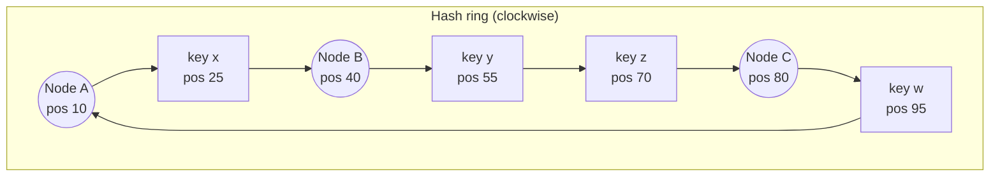
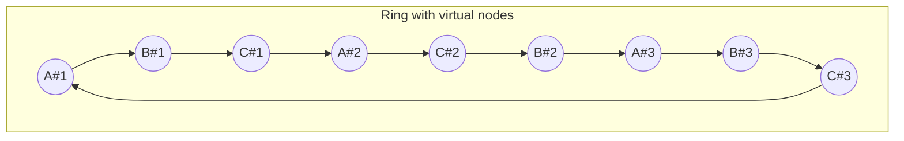

# Consistent Hashing

## 1. One-line summary

A way to spread keys across a changing set of servers so that **adding or removing a server moves only ~1/N of the keys**, instead of nearly all of them.

## 2. The problem it solves

The naive way to pick a server for a key is:

```
server = hash(key) % N
```

It spreads keys evenly — until N changes. Say you have 4 cache nodes and add a 5th:

```
hash("user:42") = 1234
  before: 1234 % 4 = 2  → node 2
  after:  1234 % 5 = 4  → node 4   (moved!)
```

For a key to stay put, `hash % 4` must equal `hash % 5`, which is true for only about **1 in 5** keys. So **~80% of keys move** when going from 4 to 5 nodes (in general, ~N/(N+1) of keys move).

What that means in practice:
- **Cache cluster:** 80% of lookups suddenly miss → all that traffic falls through to the database at once → the DB falls over. Scaling up the cache *caused* an outage.
- **Data store:** 80% of the data has to be copied between machines just to add one node.

Infra analogy: imagine a load balancer with sticky sessions where adding one backend re-shuffled almost every user to a different backend and blew away their in-memory sessions. Consistent hashing is the fix for that shape of problem.

## 3. How it works

### 3.1 The hash ring

1. Imagine the hash output space (say 0 to 2^32 − 1) bent into a circle.
2. Hash each **server** (e.g., `hash("node-A")`) to a position on the ring.
3. Hash each **key** to a position on the ring.
4. A key belongs to the **first server found walking clockwise** from the key's position.



Here `x` → B, `y` and `z` → C, `w` → A (wraps around).

**Add a node D at position 60:** only keys between B (40) and D (60) move — that's `y` (55), which moves from C to D. `x`, `z`, `w` stay where they are.
**Remove node C:** only C's keys (`y`, `z`) move to the next node clockwise (A). Nothing else moves.

On average, adding the (N+1)-th node moves only **~1/(N+1)** of keys — the minimum possible.

Implementation: store server positions in a sorted structure; lookup is "smallest position ≥ hash(key), else wrap to the first". In Java that's a `TreeMap<Long, String>` with `ceilingEntry(hash)` — O(log N).

### 3.2 Virtual nodes (vnodes)

With only 3 real positions on the ring, the gaps are uneven — one node might own 50% of the ring. And when a node dies, *all* its keys land on one neighbour, which may then overload.

Fix: put each physical server on the ring **many times** (e.g., 100–256 positions: `hash("node-A#0")`, `hash("node-A#1")`, ...).



Benefits:
- **Even distribution:** many small slices average out (law of large numbers).
- **Even failover:** when A dies, its slices are spread among B and C, not dumped on one neighbour.
- **Heterogeneous hardware:** give a bigger machine more vnodes → it owns more of the ring.

### 3.3 Replication on the ring

Data stores usually keep each key on the next **R distinct physical nodes** clockwise (e.g., R = 3). That list is called the key's *preference list*. This is how Dynamo and Cassandra place replicas. See [Sharding and replication](sharding-and-replication.md).

### 3.4 Who uses it — and the "hash slots" alternative

| System | Approach |
|---|---|
| **Amazon Dynamo** (2007 paper) / **DynamoDB** | Consistent hashing ring with virtual nodes; DynamoDB manages partitions for you |
| **Apache Cassandra** | Token ring; each node owns token ranges, default vnodes (`num_tokens`, 16 in recent versions); Murmur3 partitioner. See [Cassandra](../technologies/cassandra.md) |
| **Memcached clients** (ketama) | Client-side consistent hashing over cache servers |
| **Load balancers** (Envoy ring hash / Maglev, Nginx `hash ... consistent`) | Pick a backend so the same key sticks to the same backend. See [Load balancer](../technologies/load-balancer.md) |
| **Redis Cluster** | **Not** a ring — uses **16,384 fixed hash slots** |

**Redis Cluster hash slots:** `slot = CRC16(key) mod 16384`. The number 16,384 never changes. Each master node owns a set of slots (e.g., node 1: 0–5460, node 2: 5461–10922, node 3: 10923–16383). Adding a node means **moving some slots** (and their keys) to it; the key→slot mapping is untouched.

Why this still avoids the `% N` problem: the modulus is a fixed constant (16,384), not the server count. Only the slot→node table changes, and you move whole slots explicitly.

Differences from a ring:

| | Consistent hash ring | Fixed hash slots (Redis Cluster) |
|---|---|---|
| Key → bucket | Position on ring, depends on node positions | `CRC16(key) % 16384`, never changes |
| Bucket → node | Implicit (next node clockwise) | Explicit table, gossiped to clients |
| Rebalancing | Add node, it takes over adjacent ranges automatically | Operator/tool migrates chosen slots |
| Control | Less (placement is hash-random) | More (move exactly the slots you want) |
| Multi-key ops | Hard | Hash tags `{user42}:cart` force keys into the same slot |

Many systems (Couchbase vbuckets, Elasticsearch shards, Kafka partitions) use the same "fixed number of logical partitions, map partitions to nodes" idea. It's arguably simpler to operate than a pure ring. See [Redis](../technologies/redis.md).

## 4. When to use it

- A **distributed cache** (client picks the cache node) where nodes are added/removed and a mass cache miss would hurt the DB.
- A **partitioned data store** that rebalances automatically as nodes join/leave (Cassandra/Dynamo style).
- **Sticky routing** in a load balancer: route the same user/key to the same backend for cache locality, while tolerating backend churn.
- Any time you'd write `hash(key) % N` and **N can change at runtime**.

## 5. When NOT to use it

- **N never changes, or changes only during planned maintenance.** A fixed number of shards with `% N` (or a directory table) is simpler and easier to debug. Building a ring is a mistake here because you add complexity (vnodes, ring membership, rebalancing logic) for a problem you don't have.
- **You're using a managed store that already does it** (DynamoDB, Cassandra, Redis Cluster, Kafka). Say "Cassandra partitions by consistent hashing of the partition key" — don't design your own ring on top.
- **A single node is enough.** The URL shortener's ~35 GB cache fits on one Redis node; the 3 TB DB fits on one big Postgres. Consistent hashing is overkill until you actually need multiple nodes.
- **You need range scans** (e.g., "all orders from last week"). Hashing destroys key order; use range partitioning instead.
- **Small, stable pools behind a load balancer** where requests are stateless — round-robin or least-connections is better; hashing just creates hot spots.

## 6. Commonly confused with

| | `hash % N` | Consistent hashing (ring + vnodes) | Fixed hash slots | Range partitioning |
|---|---|---|---|---|
| Keys moved when adding 1 node | ~N/(N+1) (most) | ~1/(N+1) | Only slots you move | Only split ranges |
| Even distribution | Yes | Yes with vnodes | Yes | Depends on key distribution (hot ranges) |
| Range queries | No | No | No | **Yes** |
| Complexity | Trivial | Medium | Medium | Medium (needs split/merge logic) |
| Examples | Simple sharded app | Cassandra, Dynamo, Memcached clients | Redis Cluster, Couchbase | HBase, Bigtable, CockroachDB, Spanner |

Also confused with **rendezvous (highest-random-weight) hashing**: for each key, compute `hash(key, server)` for every server and pick the highest. Same "minimal movement" property, no ring, but O(N) per lookup — fine for small N.

## 7. Common mistakes / misuse

- **Forgetting virtual nodes** → uneven load and a single neighbour absorbing a dead node's traffic.
- **Saying Redis Cluster uses consistent hashing.** It uses 16,384 hash slots; be precise.
- **Thinking consistent hashing solves hot keys.** It spreads *keys*, not *traffic*. One celebrity key still hits one node — fix with replication of that key, caching, or key splitting.
- **Reaching for it by reflex** in a design that has one cache node.
- **Ignoring data movement:** consistent hashing *minimises* movement, it doesn't eliminate it. Moving 1/N of 3 TB is still a big copy job — throttle it.
- **Clients with different views of the ring** (stale membership) send the same key to different nodes. Membership must be propagated (gossip, ZooKeeper/etcd, or a config service).

## 8. Interview cheat-sheet

> "With `hash(key) % N`, changing N remaps almost every key — for a cache that's a mass miss that can take down the database. Consistent hashing puts both nodes and keys on a ring and assigns each key to the next node clockwise, so adding a node only moves the keys in one slice, about 1/N of them. Virtual nodes — each server at ~100+ ring positions — even out the load and spread a dead node's keys over all survivors. Cassandra and Dynamo use this; Redis Cluster instead uses 16,384 fixed hash slots that are moved between nodes explicitly. For our scale a single Redis node is enough, so I'd only bring this in when the cache grows beyond one node."

## 9. Used in

- [URL Shortener](../interviews/url-shortener/README.md) — scaling the redirect cache and the URL store beyond one node (L5/L6 deep dives): how short codes map to cache/DB shards, and why `% N` would cause a cache-miss storm when adding nodes.
- [Chat system](../interviews/chat-system/README.md): assigning each **conversation to an owner** (for sequence numbers) and spreading message partitions across Cassandra's token ring; why hashing users onto gateways is avoided (rebalancing drops connections).
- Related: [Redis](../technologies/redis.md) (hash slots), [Cassandra](../technologies/cassandra.md) (token ring), [Load balancer](../technologies/load-balancer.md) (ring-hash / Maglev), [Sharding and replication](sharding-and-replication.md), [Caching strategies](caching-strategies.md).
