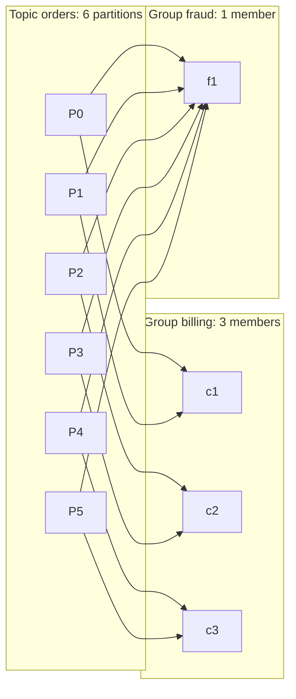
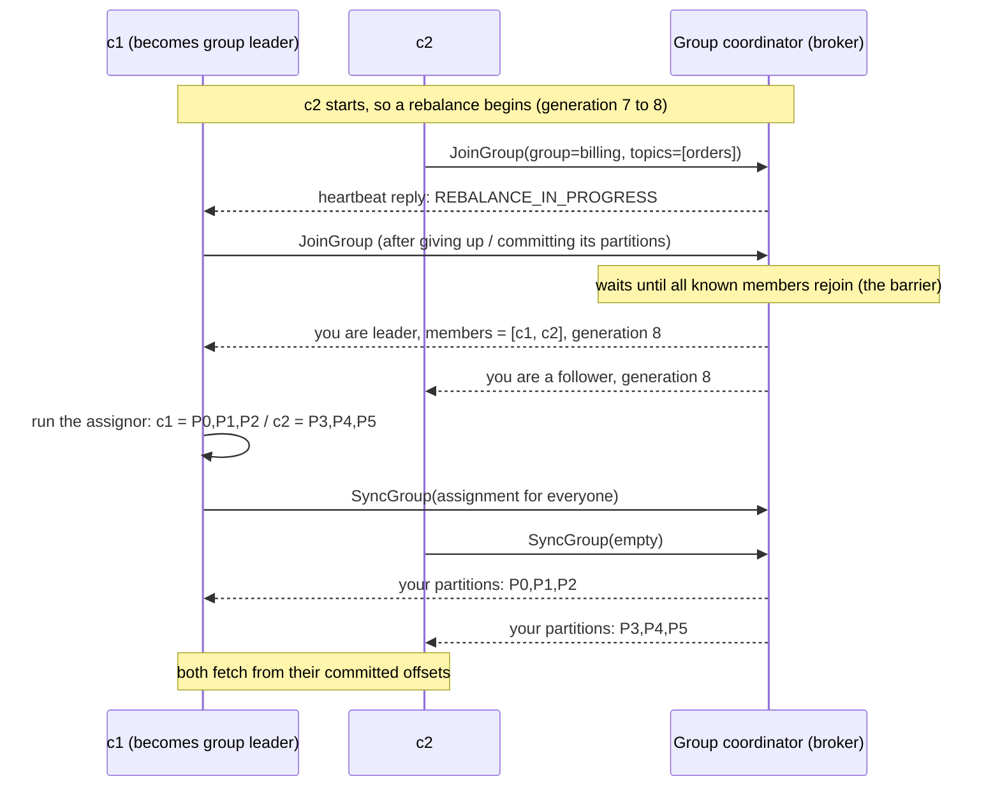

# Consumer Groups and Rebalancing

## 1. One-line summary

A **consumer group** is a set of consumer processes sharing one name (`group.id`) that split a topic's partitions between them, **each partition read by exactly one member**; each group remembers its own progress as **committed offsets**, and whenever members join, leave or die, the group **rebalances**: it pauses and reassigns partitions, which is the main source of duplicates and processing stalls.

💡 *Partition*: one ordered, append-only log; a topic is split into many. *Offset*: a record's position in a partition (0, 1, 2, ...). See [Kafka](../technologies/kafka.md) for the basics; this file goes into how groups work inside.

## 2. The problem it solves

A topic receives 30,000 orders per second. One consumer process can handle ~2,000/s (it calls a database per record). You need ~15 processes working together, and:

- **No record should be processed by two of them** (or you double-charge).
- **Order per key must survive**: all events for order #42 in sequence.
- **If a process dies**, its share of work must move to the others within seconds, starting **where it left off**.
- **If you scale from 15 to 20 pods**, work must spread automatically.
- **Another team** (fraud) wants the same orders, independently, at its own pace.

Option "every consumer reads everything and takes a lock per record" means 15× the reads plus a lock service in the hot path. Kafka's answer is coarser and cheaper: **assign whole partitions** to members. One owner per partition means no per-record locking, order inside the partition is kept for free, and progress is a **single number per partition** (the committed offset) instead of an ack per message. Different teams use **different group IDs** and never affect each other.

Infra analogy: a Kubernetes StatefulSet where each pod owns some shards. If a pod dies, its shards are handed to the survivors; the controller that hands them out is the **group coordinator**.

## 3. How it works

### 3.1 The model and the parallelism limit



- **Inside a group**: each partition → exactly one member (queue-like, work is split).
- **Between groups**: every group gets every record (pub/sub-like, see [pub/sub](../technologies/pub-sub.md#31-topic-semantics-vs-queue-semantics)).
- A member may own many partitions; a partition never has two owners in the same group.

**Parallelism ceiling = partition count.** With 6 partitions, a 7th member gets nothing and sits idle. Worked sizing for the example above:

- Needed: 30,000 records/s ÷ 2,000 records/s per consumer = **15 consumers**.
- So the topic needs **≥ 15 partitions**. Pick for growth: 3× peak headroom → 45 consumers → **48 partitions** (a round number that divides by 2, 3, 4, 6, 8, 12, 16, 24).
- Adding partitions later is possible but changes `hash(key) % partitions`, so keys move to other partitions and per-key ordering breaks at the moment of change. Choose generously up front.

### 3.2 The group coordinator, heartbeats and generations

One broker acts as the **group coordinator** for each group. Which one? The group's offsets live in the internal topic `__consumer_offsets` (50 partitions by default), in partition `hash(group.id) % 50`; the **leader** broker of that partition is the coordinator. That spreads thousands of groups across brokers without any extra lookup service.

The coordinator watches members with **two separate failure detectors**:

| Setting | Default | Detects | What happens |
|---|---|---|---|
| `heartbeat.interval.ms` | 3 s | – | A background thread in the consumer sends a heartbeat this often |
| `session.timeout.ms` | 45 s (10 s before Kafka 3.0, KIP-735, 2021) | **Dead process / lost network**: no heartbeat for this long | Member removed → rebalance |
| `max.poll.interval.ms` | 5 min | **Stuck processing**: the app thread didn't call `poll()` for this long (heartbeats still flowing) | Member leaves the group → rebalance |

💡 *Heartbeat*: a small periodic "I'm alive" message, like a Kubernetes liveness probe in reverse (the client reports instead of being probed). See [presence and heartbeats](presence-and-heartbeats.md).

Why two? A consumer whose processing thread is stuck on a 10-minute database call still has a healthy heartbeat thread. Without `max.poll.interval.ms` it would hold its partitions forever while doing nothing. It's the difference between a k8s **liveness** probe (is the process up?) and a **progress** check (is it actually doing work?).

**Classic rebalance protocol** (the one most clusters ran until Kafka 4.0):



Two details worth naming:

- **The assignment is computed by a consumer** (the group leader), not the broker. That lets you plug in custom assignors without changing brokers, at the cost of a two-round dance.
- Every rebalance bumps the **generation** number. An offset commit carrying an old generation is rejected, so a "zombie" member that was kicked out (say, after a long GC pause 💡 the JVM freezing all threads to clean memory) can't overwrite the new owner's progress. Same fencing idea as a Raft term or a [leader epoch](log-replication-and-isr.md#38-leader-epochs-and-log-truncation-after-failover).

**New consumer protocol (KIP-848):** generally available in Kafka 4.0 (2025). The **broker** computes assignments, members heartbeat their state, and changes are applied incrementally per member, with **no group-wide barrier**. Clients opt in with `group.protocol=consumer`. Older clients keep working through the "classic" protocol.

### 3.3 Partition assignment strategies

`partition.assignment.strategy` picks the algorithm (default since Kafka 3.0: `[RangeAssignor, CooperativeStickyAssignor]`, meaning range unless all members support cooperative-sticky).

| Assignor | How it splits | Good at | Bad at |
|---|---|---|---|
| **Range** | Per topic, sort partitions and members, give each member a consecutive block | **Co-partitioning**: P3 of `orders` and P3 of `payments` go to the same member, useful for joining two topics keyed the same way | Uneven with many topics (first members get the extras of every topic); moves many partitions on change |
| **Round-robin** | All partitions of all topics dealt out one by one | Even spread | Moves many partitions on change; no co-partitioning |
| **Sticky** | Balanced, but keeps as many existing assignments as possible | Fewer moves → less lost cache/state | Still "eager" (everyone revokes everything first, see 3.5) |
| **Cooperative sticky** | Sticky + the cooperative protocol: only partitions that actually move are revoked | Rebalances barely pause the group | Takes two short rounds; needs all members on the same strategy |

A small simulation (run with `java Assignors.java`, Java 21): 12 partitions, 4 consumers, then `c1` leaves. How many partitions change owner under range vs sticky?

```java
import java.util.*;

// Compare how partition-assignment strategies react when one consumer leaves.
public class Assignors {
    // Range: per topic, consecutive blocks of partitions; first consumers get the extra ones.
    static Map<String, List<Integer>> range(List<String> consumers, int partitions) {
        Map<String, List<Integer>> a = new TreeMap<>();
        int n = consumers.size(), per = partitions / n, extra = partitions % n, p = 0;
        for (int i = 0; i < n; i++) {
            List<Integer> mine = new ArrayList<>();
            for (int k = 0; k < per + (i < extra ? 1 : 0); k++) mine.add(p++);
            a.put(consumers.get(i), mine);
        }
        return a;
    }

    // Sticky: keep every surviving owner's partitions, hand orphans to the least-loaded consumer.
    static Map<String, List<Integer>> sticky(Map<String, List<Integer>> old, List<String> consumers, int partitions) {
        Map<String, List<Integer>> a = new TreeMap<>();
        Set<Integer> owned = new HashSet<>();
        for (String c : consumers) {
            List<Integer> keep = new ArrayList<>(old.getOrDefault(c, List.of()));
            a.put(c, keep); owned.addAll(keep);
        }
        for (int p = 0; p < partitions; p++) {
            if (owned.contains(p)) continue;
            String least = consumers.stream().min(Comparator.comparingInt(c -> a.get(c).size())).orElseThrow();
            a.get(least).add(p);
        }
        return a;
    }

    static int moved(Map<String, List<Integer>> before, Map<String, List<Integer>> after) {
        int moved = 0;
        for (var e : after.entrySet())
            for (int p : e.getValue())
                if (!before.getOrDefault(e.getKey(), List.of()).contains(p)) moved++;
        return moved;
    }

    public static void main(String[] args) {
        int partitions = 12;
        List<String> four = List.of("c1", "c2", "c3", "c4"), three = List.of("c2", "c3", "c4");
        var start = range(four, partitions);
        System.out.println("start (4 consumers)   : " + start);
        var r = range(three, partitions);
        System.out.println("c1 leaves, range      : " + r + "  -> partitions changing owner: " + moved(start, r));
        var s = sticky(start, three, partitions);
        System.out.println("c1 leaves, sticky     : " + s + "  -> partitions changing owner: " + moved(start, s));
        System.out.println("eager protocol        : all " + partitions + " partitions revoked and paused during the rebalance");
        System.out.println("cooperative protocol  : only the " + moved(start, s) + " moving partitions pause; the rest keep flowing");
    }
}
```

Real output:

```
start (4 consumers)   : {c1=[0, 1, 2], c2=[3, 4, 5], c3=[6, 7, 8], c4=[9, 10, 11]}
c1 leaves, range      : {c2=[0, 1, 2, 3], c3=[4, 5, 6, 7], c4=[8, 9, 10, 11]}  -> partitions changing owner: 6
c1 leaves, sticky     : {c2=[3, 4, 5, 0], c3=[6, 7, 8, 1], c4=[9, 10, 11, 2]}  -> partitions changing owner: 3
eager protocol        : all 12 partitions revoked and paused during the rebalance
cooperative protocol  : only the 3 moving partitions pause; the rest keep flowing
```

Range recomputes the blocks from scratch, so besides handing out the 3 orphans (0, 1, 2) it also moves 4 and 5 from c2 to c3 and 8 from c3 to c4: 6 moves. Sticky moves only the 3 orphaned partitions (the minimum possible). Every moved partition means a consumer **throws away warm state** (caches, local RocksDB stores in Kafka Streams (💡 RocksDB is an embedded key-value store kept in local files), open DB connections pinned to keys) and the new owner replays from the last committed offset.

### 3.4 Committing offsets: where delivery semantics come from

A group's progress is stored as records in the **compacted** topic `__consumer_offsets`: key = (group, topic, partition), value = the **next offset to read**. Compaction keeps only the latest per key (see [log compaction](log-segments-retention-and-compaction.md#36-log-compaction-keep-the-latest-value-per-key)). Committed offsets of an empty group are kept for `offsets.retention.minutes` (7 days since Kafka 2.0), then forgotten; a group that comes back later falls to `auto.offset.reset` (`earliest` or `latest`).

Note the "next offset" convention: after processing offset 1,049, you commit **1,050**.

| Mode | How | Semantics you actually get |
|---|---|---|
| **Auto commit** (`enable.auto.commit=true`, every `auto.commit.interval.ms` = 5 s) | Inside `poll()`, the client commits the offsets returned by the **previous** `poll()` | At-least-once **if** you finish processing a batch before calling `poll()` again. If you hand records to another thread pool and poll again immediately, offsets get committed for work not yet done → **at-most-once** on crash |
| **Manual, after processing** (`commitSync()` / `commitAsync()`) | Process the batch, then commit | **At-least-once**: a crash after processing but before commit replays the batch |
| **Manual, before processing** | Commit, then process | **At-most-once**: a crash after commit skips the batch |
| **Transactional** (consume-transform-produce Kafka → Kafka) | Output records and `sendOffsetsToTransaction` commit atomically | **Exactly-once inside Kafka** (KIP-98, Kafka 0.11, 2017); see [idempotency and delivery semantics](idempotency-and-delivery-semantics.md) |
| **Offsets stored with your results** | Write the result and the offset into your own DB in one transaction; on startup `seek()` to the stored offset | **Effectively once** for that DB, without Kafka transactions |

Worked example (at-least-once): committed offset = 1,000. The consumer polls 1,000..1,049, processes 1,000..1,029, then the pod is OOM-killed (💡 terminated by the kernel or Kubernetes for exceeding its memory limit). A new owner starts at 1,000 and reprocesses 1,000..1,029: **30 duplicates**. With `max.poll.records` = 500 and a crash just before commit, up to 500 duplicates per partition. That's why consumers must be **idempotent** (dedup by event ID, upserts) as covered in [Kafka §3.4](../technologies/kafka.md#34-delivery-semantics-and-idempotent-consumers).

### 3.5 Rebalancing, rebalance storms and the fixes

**Triggers:** a member joins, leaves cleanly, misses heartbeats for `session.timeout.ms`, exceeds `max.poll.interval.ms`; the subscription changes; partitions are added to a subscribed topic.

**Eager rebalancing** (the original behavior): every member **revokes all its partitions**, commits, rejoins, waits for the barrier, gets a new assignment. During that window, **the whole group processes nothing**. With 100 members, the barrier waits for the slowest one to rejoin.

**Rebalance storm**, a common on-call story:

1. A Deployment of 30 consumer pods does a rolling update. Each pod shutdown = leave (rebalance), each new pod = join (rebalance): **~60 rebalances**.
2. Each eager rebalance pauses the whole group for, say, 5–30 s (rejoin, assignment, warming caches, Kafka Streams restoring state). 60 × 10 s = **10 minutes** of mostly stopped consumption during a routine deploy. Lag spikes, alerts fire.
3. Worse variant: processing gets slow (a DB is degraded), a batch of 500 records takes more than 5 min, the member exceeds `max.poll.interval.ms` and is kicked out → rebalance → its partitions go to others, who are also slow → they get kicked out too. The group **never makes progress**.

The fixes, in the order you'd mention them:

| Fix | What it does | Since |
|---|---|---|
| **Static membership** (`group.instance.id` = stable pod name, e.g. from a StatefulSet) | A restarting member that comes back within `session.timeout.ms` gets **its old partitions with no rebalance at all** | KIP-345, Kafka 2.3 (2019) |
| **Cooperative incremental rebalancing** (`CooperativeStickyAssignor`) | Members keep their partitions during the rebalance; only partitions that must move are revoked, in a second short round | KIP-429, Kafka 2.4 (2019) |
| **New consumer protocol** (`group.protocol=consumer`) | Broker-side assignment, no global barrier, each member reconciles on its own | KIP-848, GA in Kafka 4.0 (2025) |
| **Tune the poll loop** | Lower `max.poll.records`, raise `max.poll.interval.ms` to above worst-case batch time, keep the poll thread free of long blocking calls | Config |
| **Deploy settings** | Raise `session.timeout.ms` above pod restart time when using static membership; use `maxUnavailable` / `maxSurge` so pods don't all bounce at once | Ops |

Static membership plus cooperative-sticky turns the 30-pod rolling deploy from ~60 stop-the-world pauses into **zero or a few tiny incremental moves**. The trade-off of static membership: a pod that **really** died is only detected after `session.timeout.ms`, so its partitions stall for that long.

### 3.6 Lag: the number to watch

**Consumer lag** per partition = **latest readable offset (the high watermark, see [log replication](log-replication-and-isr.md)) − the group's committed offset**. Sum it per group.

```bash
kafka-consumer-groups.sh --bootstrap-server localhost:9092 --describe --group billing
# columns: TOPIC PARTITION CURRENT-OFFSET LOG-END-OFFSET LAG CONSUMER-ID HOST
```

Messages of lag are hard to judge; convert to **time**. Lag of 600,000 records at a consume rate of 20,000/s = **30 s behind**. If the topic's retention is 7 days and lag-in-time keeps growing, the consumer will eventually fall **off the end of the log** and silently skip data ([retention](log-segments-retention-and-compaction.md#35-retention-deleting-whole-segments)).

Watch for:

- **Lag rising on all partitions** → the group is too slow overall: add consumers (up to the partition count) or speed up processing.
- **Lag rising on one partition** → a **hot key** or a stuck consumer; adding consumers won't help.
- **Lag sawtooth** around every deploy → rebalances; see 3.5.

Autoscaling on lag (e.g. KEDA's Kafka scaler in Kubernetes) works well, but cap max replicas at the **partition count**; beyond that new pods are idle and each scale event triggers a rebalance.

💡 *KEDA*: Kubernetes Event-Driven Autoscaling, an add-on that scales Deployments on external metrics such as queue length or consumer lag.

### 3.7 Ordering implications

- Kafka gives order **within a partition**. A group preserves it only if each member processes each partition's records **sequentially**.
- Handing a poll's records to a thread pool breaks order (record 7 may finish before record 5) and makes committing correct offsets hard (you can only commit up to the lowest unfinished offset). If you need more parallelism than partitions, process **per key** in parallel, keeping order per key (the open-source Confluent Parallel Consumer library does this), or add partitions.
- A rebalance **replays** from the committed offset: the new owner may re-see records the old owner already processed, in the same order. Order is preserved, but **duplicates** appear: idempotency again.
- A single slow record blocks its partition (**head-of-line blocking**). Kafka has no per-message retry; the usual pattern is a **retry topic** and a **dead-letter topic** ([retries, backoff and DLQ](retries-backoff-and-dlq.md)), accepting that retried records leave the original order.

### 3.8 Consumer groups vs queue-style competing consumers

| | **Kafka consumer group** | **Competing consumers on a queue** ([SQS, RabbitMQ](../technologies/message-queues.md)) |
|---|---|---|
| Unit of work given out | A whole **partition** (stream of records) | One **message** at a time |
| Progress tracking | One committed offset per partition | Per-message ack / delete |
| Max useful consumers | Number of partitions | Practically unlimited |
| Ordering | Per partition, kept | Weak (redelivery reorders); SQS FIFO per message group |
| A slow or poison message | Blocks its whole partition | Only that message is delayed; goes to a DLQ after N tries |
| Failure handover | Rebalance (seconds, whole partitions move) | Visibility timeout expires, message reappears for another worker |
| Replay / second team | New group or reset offsets, history stays | Not possible once deleted; needs fan-out to another queue |
| Broker cost per message | Very low (sequential read, no per-message state) | Higher (per-message state, acks) |

Pick consumer groups for **high-volume streams, ordering per key and replay**; pick a queue for **independent jobs with per-message retries, delays and priorities**. Kafka is closing the gap: **share groups** (KIP-932, "queues for Kafka") let several members read the same partition with per-record acknowledgement; preview in Kafka 4.1 and production-ready in Kafka 4.2 (2026) per the Apache release notes. (An earlier early-access stage in 4.0 is unverified here.)

## 4. When to use it

- Scaling a consumer service horizontally while keeping **per-key ordering**: orders, payments, chat messages keyed by conversation.
- Several **independent teams** consuming the same stream (billing, fraud, analytics), each with its own group and pace.
- Stateful stream processing where each instance owns some partitions and their local state ([stream processing](../technologies/stream-processing.md)).
- Anything where **replay** matters: fix a bug, reset the group's offsets to yesterday, reprocess.

## 5. When NOT to use it

- **Job queues with very uneven job times** (a 2-hour video transcode next to a 1-second thumbnail): one long job blocks its partition; per-message queues balance better.
- **More consumers than partitions** "for throughput": the extras sit idle.
- **Per-message retry, delay or priority**: groups only move one offset per partition; you'd rebuild retry and delay topics yourself.
- **Very short-lived consumers** (serverless functions spun up per request): each start/stop is a join/leave and therefore a rebalance. Use a queue or a managed trigger that holds the group membership for you.

## 6. Commonly confused with

| Term | Meaning | Not the same as |
|---|---|---|
| **Consumer group** | Members sharing partitions of a topic; each record processed once per group | A **topic subscription** in pure pub/sub, where every subscriber gets every message |
| **Committed offset** | Group's progress: next offset to read, stored in `__consumer_offsets` | **High watermark**: how far the *log* is committed on brokers ([log replication](log-replication-and-isr.md)) |
| **Group coordinator** | Broker managing membership and offsets for a group | **Controller**: manages partition leaders and replicas for the whole cluster |
| **Group leader** | A *consumer* that computes assignments in the classic protocol | **Partition leader**: a *broker* serving a partition's reads and writes |
| **Rebalance** | Reassigning partitions among *consumers* | **Partition reassignment**: moving replicas between *brokers* |
| **Generation** | Group membership version; fences zombie commits | **Leader epoch** (partition leadership version) and **producer epoch** (fences old producers) |

## 7. Common mistakes / misuse

- More pods than partitions, then wondering why some pods do nothing.
- Auto commit plus asynchronous processing on another thread pool → committed offsets run ahead of real work → data loss on crash.
- Doing slow, blocking work (HTTP calls with no timeout) in the poll loop with a large `max.poll.records`, then hitting `max.poll.interval.ms` and causing a rebalance loop.
- Rolling deploys of large consumer groups with the eager protocol and no static membership: minutes of stalled consumption on every release.
- Non-idempotent processing, assuming a rebalance never replays records.
- Reusing one `group.id` across different applications by copy-paste: they silently split the partitions and each sees only part of the data.
- Monitoring lag only in messages, not in time, and not alerting before lag-in-time approaches the topic's retention.
- Treating "add partitions later" as free: it remaps keys and breaks per-key ordering during the change.

## 8. Interview cheat-sheet

> "Consumers of the topic share a group ID, and the group coordinator, a broker, assigns each partition to exactly one member, so partition count is the parallelism ceiling: at 30k messages per second and 2k per consumer I need at least 15 partitions, so I'd create 48 for headroom. Each member processes a partition sequentially, which keeps per-key order, and commits offsets after processing, so delivery is at-least-once and the handler is idempotent on event ID. Members heartbeat every 3 seconds; if one dies or stops polling, the group rebalances and its partitions move to others, which replay from the last committed offset. To keep deploys from causing rebalance storms I'd use static membership with stable pod names and the cooperative-sticky assignor, or the new broker-side consumer protocol, so only partitions that actually move are paused. I'd alert on consumer lag measured in seconds, and autoscale on it up to the partition count."

## 9. Used in

- [Distributed message queue](../interviews/distributed-message-queue/README.md): how consumers share and track work.
  - [L4 (mid)](../interviews/distributed-message-queue/L4-mid.md) §5.2 offsets and consumer groups.
  - [L5 (senior)](../interviews/distributed-message-queue/L5-senior.md) §3.3 consumer group rebalancing (coordinator, eager vs cooperative, static membership) and §3.4 exactly-once (transactional offset commits).
  - [L6 (staff)](../interviews/distributed-message-queue/L6-staff.md): multi-tenant clusters with thousands of groups, quotas and the build vs buy discussion.
- [LLD: Pub-Sub broker](../../LLD/interviews/pub-sub-broker/README.md): delivering messages to subscribers inside one process; this file explains how a distributed broker splits that work across many consumer machines and tracks their progress.
- Related: [Kafka](../technologies/kafka.md), [message queues](../technologies/message-queues.md) (competing consumers), [pub/sub](../technologies/pub-sub.md), [log replication and ISR](log-replication-and-isr.md), [log segments, retention and compaction](log-segments-retention-and-compaction.md), [idempotency and delivery semantics](idempotency-and-delivery-semantics.md), [message ordering and sequencing](message-ordering-and-sequencing.md), [retries, backoff and DLQ](retries-backoff-and-dlq.md), [presence and heartbeats](presence-and-heartbeats.md), [back-pressure](../../LLD/concepts/back-pressure.md).
