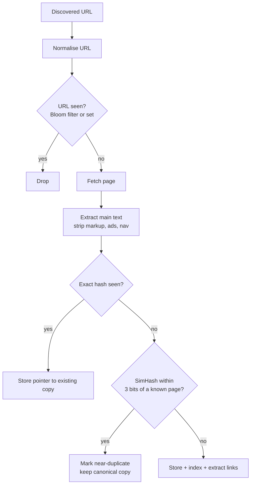

# Content Fingerprinting and Dedup

## 1. One-line summary

A **fingerprint** is a short number computed from a document (8 to 32 bytes) that stands in for the whole thing: **exact fingerprints** (a hash like SHA-256) tell you "these two pages are byte-for-byte the same", while **similarity fingerprints** (SimHash, MinHash) tell you "these two pages are *almost* the same", so a crawler or storage system can skip storing and processing duplicates.

💡 **Dedup** (deduplication) means detecting that you already have something and not storing or processing it again.

---

## 2. The problem it solves

**The pain:** a large share of the web is duplicate or near-duplicate. The same article sits at `/news/123`, `/news/123?ref=twitter` and `/amp/news/123`; mirrors copy whole sites; every page of a shop has the same header and footer with only the price changing. Duplicates are common enough that search engines built dedicated near-duplicate detection systems (section 3.2).

Without dedup a crawler:
- **stores** the same content many times (wasted [object storage](../technologies/object-storage.md)),
- **parses and follows** the same links again (and can loop forever in mirrored sites),
- **indexes** duplicates, so search results show five copies of one article.

Two separate questions need answering:

| Question | Asked when | Technique |
|---|---|---|
| "Have I already seen this **URL**?" | before fetching | URL normalisation + set / [Bloom filter](bloom-filters.md) |
| "Have I already seen this **content**?" | after fetching | exact hash or SimHash / MinHash |

URL dedup saves fetches; content dedup catches the cases URL dedup can't (different URLs, same page).

> Infra analogy: exact fingerprints are what Docker does with image layers (`sha256:...` digests): same digest, same layer, pull once. Near-duplicate detection is more like alert dedup in on-call tooling: two alerts with slightly different text are grouped as "the same incident".

---

## 3. How it works



### 3.1 Exact dedup: hash the normalised content

1. **Normalise** the content first: strip HTML tags, collapse whitespace, remove obviously varying bits (timestamps, session tokens) if you can. Otherwise a page that prints "Generated at 10:31:07" never matches itself.
2. **Hash** it. 💡 A **cryptographic hash** like SHA-256 maps any input to 32 bytes; changing one character changes the output completely, and finding two inputs with the same output is practically impossible. A cheaper non-cryptographic 64-bit hash (e.g. xxHash, MurmurHash) is often enough for dedup.
3. **Look it up** in a key-value store `fingerprint → canonical URL`.

How much space, and how risky are collisions? For **8 billion pages**:

```
64-bit fingerprints:  8e9 × 8 bytes  = 64 GB
SHA-256:              8e9 × 32 bytes = 256 GB
```

The **birthday problem** says that with `n` random `b`-bit values you expect about `n² / 2^(b+1)` accidental collisions:

```
64-bit:  (8e9)² / 2^65  = 6.4e19 / 3.69e19 ≈ 1.7 collisions expected
128-bit: (8e9)² / 2^129 = 6.4e19 / 6.8e38  ≈ 1e-19   (never)
```

So a 64-bit exact fingerprint at web scale will wrongly merge **one or two** pairs of different pages. For a crawler that's harmless; for a storage system that deletes "duplicate" data it is not. Use 128+ bits (or verify bytes on match) when a false match loses data.

### 3.2 Near-duplicate dedup: SimHash

Exact hashes break on a single changed byte. **SimHash** (Charikar, 2002) is designed the other way round: **similar documents get fingerprints that differ in only a few bits**. The distance between two fingerprints is the **Hamming distance**, the number of bit positions where they differ (`1011` vs `1001` = 1).

Algorithm for a `b`-bit SimHash:
1. Split the document into **features** (words or short word sequences) with weights (e.g. how often the word appears).
2. Hash each feature to `b` bits.
3. Keep a vector of `b` counters. For each feature and each bit: add the weight if the bit is 1, subtract it if 0.
4. Final fingerprint: bit `i` is 1 if counter `i` > 0, else 0.

**Tiny worked example (8 bits, made-up hashes).** Document A = "the cat sat on the mat" with weights `the:2, cat:3, sat:2, on:1, mat:1`.

| feature (weight) | hash | b0 | b1 | b2 | b3 | b4 | b5 | b6 | b7 |
|---|---|---|---|---|---|---|---|---|---|
| the (2) | 01010100 | −2 | +2 | −2 | +2 | −2 | +2 | −2 | −2 |
| cat (3) | 10110010 | +3 | −3 | +3 | +3 | −3 | −3 | +3 | −3 |
| sat (2) | 11001010 | +2 | +2 | −2 | −2 | +2 | −2 | +2 | −2 |
| on (1) | 10011001 | +1 | −1 | −1 | +1 | +1 | −1 | −1 | +1 |
| mat (1) | 01100111 | −1 | +1 | +1 | −1 | −1 | +1 | +1 | +1 |
| **sum** | | **+3** | **+1** | **−1** | **+3** | **−3** | **−3** | **+3** | **−5** |
| **SimHash A** | | 1 | 1 | 0 | 1 | 0 | 0 | 1 | 0 |

Document B swaps `mat` for `hat` (hash `00011110`). Redoing the sums gives `+3 −1 −3 +5 −1 −3 +3 −7`, so **SimHash B = 10010010**. A = `11010010`, B = `10010010`: they differ only in bit 1, **Hamming distance 1**. A third, unrelated document `the:1, hat:3, mat:3, on:2` gives `00011111`, distance **5** from A. Small edits move only the counters that were close to zero; heavy shared features keep most bits stable.

**Google at web scale.** Manku, Jain & Das Sarma (WWW 2007) described using SimHash at Google for crawling: **64-bit fingerprints**, and two pages count as near-duplicates if they differ in **at most k = 3 bits**, over a collection of about **8 billion pages**.

**Finding all fingerprints within 3 bits fast.** Comparing against 8B fingerprints one by one is far too slow. The trick is the **pigeonhole principle**: split the 64 bits into 4 blocks of 16. If two fingerprints differ in at most 3 bits, at least one of the 4 blocks is **identical**. So keep 4 tables, each indexed by one block; look up the 4 blocks of the new fingerprint, and only compare the (few) candidates that share a block. The paper uses a refined version of this idea with permuted bit orders and more tables.

### 3.3 MinHash and Jaccard similarity (briefly)

**Jaccard similarity** of two sets is `|A ∩ B| / |A ∪ B|` (shared items over all items). Turn each document into a set of **shingles** (every run of, say, 5 consecutive words). Computing Jaccard exactly for every pair is too expensive, so **MinHash** (Broder, 1997, used for AltaVista) keeps, for each of ~100 hash functions, the *smallest* hash value among the document's shingles. The probability that two documents have the same minimum for one hash function equals their Jaccard similarity, so:

```
matching minimums out of 100 hash functions = 85  →  estimated Jaccard ≈ 0.85
```

MinHash signatures are larger than SimHash (100 × 4 bytes = 400 bytes vs 8 bytes) but estimate the similarity directly. Both are forms of **LSH (locality-sensitive hashing)**: hashing where similar inputs collide on purpose.

### 3.4 URL-side dedup and canonical URLs

- **Normalise** first (lowercase host, drop `#fragment`, drop tracking params; see [URL frontier and politeness](url-frontier-and-politeness.md)).
- **Exact set vs Bloom filter** for "URL seen?": 10 billion URLs as 8-byte hashes is 1e10 × 8 B = **80 GB**; a Bloom filter at 1% false positives needs ~9.6 bits each, 1e10 × 9.6 / 8 = **12 GB**. A false positive means "skip a URL we never actually crawled": 1% of new pages missed. Fine for a broad crawl; not fine if you must crawl every page of a customer's site. Mercator used an exact on-disk set with an in-memory cache instead.
- **`rel=canonical`**: a page can say which URL is the "real" one: `<link rel="canonical" href="https://shop.example/p/42">` in the HTML head (or an HTTP `Link` header). Search engines treat it as a **strong hint, not a command**. Store content under the canonical URL and map the others to it.

---

## 4. When to use it

- **Crawlers and search indexes**: skip storing, parsing and indexing duplicates; spot mirrors and spider traps.
- **Storage dedup**: backup systems, container registries and Git store blobs by content hash.
- **Plagiarism / spam detection**: near-duplicate text across documents or messages.
- **Change detection on recrawl**: same exact hash as last time means "unchanged", feeding the recrawl schedule.

## 5. When NOT to use it (and why it's a mistake)

| Situation | Why |
|---|---|
| SimHash on very short text (tweets, titles) | Few features, so a single word flips many bits. Use exact match or MinHash on character shingles. |
| Deleting data based on a 64-bit fingerprint alone | Birthday collisions (above) will eventually merge two different files. Use 128+ bits or compare bytes. |
| Pages that differ only in what matters (price, stock level) | Near-dup says "same", but the change is the information you need. |
| Small collections | A `HashMap<String, String>` of full content hashes is exact and simple. |

---

## 6. Commonly confused with

| | **Exact hash (SHA-256, 64-bit)** | **SimHash** | **MinHash** | **Bloom filter** |
|---|---|---|---|---|
| Detects | identical content | near-identical content | set similarity (Jaccard) | "seen this key before?" |
| One changed byte | totally different hash | a few bits differ | slight drop in similarity | n/a |
| Size per doc | 8–32 bytes | 8 bytes (64-bit) | ~400 bytes (100 × 4 B) | ~10 bits per key, no per-doc record |
| Compare by | equality | Hamming distance | fraction of equal minimums | membership test |
| Errors | collisions (tiny with 128+ bits) | approximate | approximate | false positives only |

---

## 7. Common mistakes / misuse

1. **Hashing raw HTML.** Timestamps, ad slots and CSRF tokens make every fetch unique. Extract and normalise the main text first.
2. **Only URL dedup.** Different URLs, same content is the common case on the web.
3. **Using `String.hashCode()`** (32 bits) as a fingerprint: with ~77,000 items you already have a 50% chance of a collision (birthday bound ≈ 1.18 × √2³²).
4. **Linear scan for near-duplicates.** Say how you index fingerprints (block tables, LSH bands).
5. **Treating `rel=canonical` as authoritative.** Sites misconfigure it (every page canonical to the homepage).
6. **Forgetting the threshold is a product decision.** k = 3 of 64 bits worked for Google's web pages; tune it on your own data.

---

## 8. Interview cheat-sheet

> "There are two dedup checks. Before fetching, I normalise the URL and check a seen-URL store; a Bloom filter makes it about 12 GB for 10 billion URLs at 1% false positives, which only means we occasionally skip a new page. After fetching, I extract the main text and compute an exact hash to catch identical copies, and a 64-bit SimHash to catch near-duplicates. SimHash gives similar documents fingerprints that differ in few bits; Google reported treating pages within 3 bits as near-duplicates across about 8 billion pages. To find matches quickly I split the 64 bits into 4 blocks: any fingerprint within 3 bits shares at least one block exactly, so I index each block. I also honour rel=canonical as a hint to store one copy under the canonical URL."

---

## 9. Used in

- [Web Crawler](../interviews/web-crawler/README.md): **seen-URL check** before fetching and **exact + SimHash content dedup** after fetching (see the [L4](../interviews/web-crawler/L4-mid.md), [L5](../interviews/web-crawler/L5-senior.md) and [L6](../interviews/web-crawler/L6-staff.md) answers).
- Related: [Bloom filters](bloom-filters.md) (compact seen-URL set), [URL frontier and politeness](url-frontier-and-politeness.md) (URL normalisation, recrawl by change rate), [object storage](../technologies/object-storage.md) (storing page bodies by content hash), [DNS](../technologies/dns.md).
