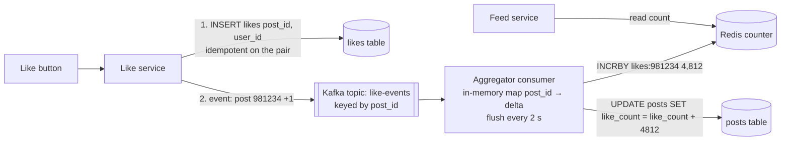

# Counters at scale (likes, views, followers)

## 1. One-line summary

A **counter at scale** is a number like "1.2M likes" that millions of people increment at once. Storing it as **one row you `UPDATE count = count + 1`** turns that row into a bottleneck, so we use **Redis `INCR`**, **sharded counters** (N sub-counters summed on read), **async aggregation** through a stream, and **approximate** display ("1.2M") because nobody needs the exact value on screen.

---

## 2. The problem it solves

**The pain:** a celebrity posts, and in the first minute 600,000 people tap like, i.e. **10,000 likes/s on one post**. The naive schema:

```sql
UPDATE posts SET like_count = like_count + 1 WHERE id = 981234;
```

Every update must take the **row lock** on that one row. 💡 A **row lock** is the DB's way of making sure two transactions don't modify the same row at the same time: the second one waits until the first commits. If one update + commit takes ~1 ms (including the write to the **WAL**, the DB's on-disk change journal), the row maxes out at roughly `1 / 1 ms = 1,000 updates/s`, no matter how many DB CPUs you have. At 10,000/s, requests queue, connection pools fill up, the like button spins, and unrelated queries on that DB slow down too.

**The fix:** stop making every like touch the same row synchronously. Spread the writes (sharding), absorb them in memory (Redis), or batch them (stream aggregation), and accept that the displayed number lags by a few seconds.

> Infra analogy: like Prometheus counters. Each pod keeps its own counter and the query does `sum(rate(...))` across pods. Nobody funnels every request through one global variable.

---

## 3. How it works

Keep two concepts separate:

- **The fact:** "user 42 liked post 981234" (a row in `likes(post_id, user_id)`, needed for "did I like this?" and unlike). Written once per user, spread across shards by `post_id`/`user_id`, no hotspot on a single row.
- **The aggregate:** `like_count = 1,204,331`. This is the hot part. Everything below is about the aggregate.

### 3.1 Redis INCR

[Redis](../technologies/redis.md) executes commands on one thread, so `INCR likes:981234` is atomic and takes microseconds: one Redis node does ~100k+ increments/s. Persist to the DB periodically (e.g. every 5 s, a job writes the current value). Risk: if the node dies before persistence, the last few seconds of increments are lost unless replicated / AOF-enabled. 💡 **AOF** (append-only file) is Redis's write log on disk for crash recovery.

Limit: one key still lives on one Redis node. 10k/s is fine; 500k/s on a single key needs the next technique.

### 3.2 Sharded counters

Split one logical counter into **N sub-counters**. Each increment picks one at random; reads sum all N.

```
write:  INCR likes:981234:{rand(0..N-1)}
read:   likes = sum( GET likes:981234:0 ... likes:981234:N-1 )      (one MGET)
```

With `N = 16`, each sub-counter gets `10,000 / 16 ≈ 625 writes/s`, fine even for a single DB row. Trade-off: a read now touches 16 keys (one `MGET`, cheap) and N must be chosen per hotness. Common pattern: start with N = 1 and **promote** a counter to N = 16/64 when it's detected as hot. Google Cloud Datastore's docs recommend exactly this for counters.

### 3.3 Async aggregation via a stream

The highest-throughput option: the like API just writes the fact and publishes an event; a consumer **batches** increments.



- The aggregator holds `post_id → delta` in memory and flushes every ~2 s: 10,000 likes/s become **one** `INCRBY 20,000` every 2 s. The DB sees 0.5 writes/s per hot post instead of 10,000.
- Events are keyed by `post_id` in [Kafka](../technologies/kafka.md), so one consumer owns each post and there are no races between aggregators.
- Commit Kafka offsets **after** the flush. A crash replays events → possible double count. Either accept a tiny over-count, or make the flush idempotent (store "last applied offset" with the counter). See [idempotency](idempotency-and-delivery-semantics.md).
- Bonus: views, impressions and shares go through the same pipeline, which also feeds analytics and [feed ranking](feed-ranking.md).

### 3.4 Approximate counts for display

The UI shows **"1.2M"**, not 1,204,331. So the displayed count only needs to be right to ~2–3 significant digits:

- Cache the formatted count with a short TTL (e.g. 10–30 s) in the post object; feed hydration reads it with the post.
- Under 1,000, users notice exact numbers (their own like should show +1). Fix with **client-side optimistic update**: the app adds +1 locally on tap; the server count catches up in seconds.

### 3.5 Unique counts: HyperLogLog

"How many **distinct** people viewed this post?" is harder than "how many views": storing every viewer ID in a set costs `100M viewers × 8 bytes = 800 MB` for one post.

**HyperLogLog (HLL)** is a probabilistic structure that estimates distinct counts using a fixed **~12 KB** with **~0.81% standard error**. Plain-words intuition: hash each viewer ID; in random hashes, seeing a value that starts with 20 zero bits is rare (1 in a million), so "the longest run of leading zeros I've seen" hints at how many distinct values went by. HLL keeps many such small estimates in buckets and averages them to reduce luck.

```
PFADD  uv:post:981234 user42 user77 user42     # duplicates don't increase it
PFCOUNT uv:post:981234                          # → ~2
PFMERGE uv:post:981234:week uv:day1 ... uv:day7 # union of daily HLLs
```

Like a [Bloom filter](bloom-filters.md), it trades exactness for huge memory savings; unlike a Bloom filter it answers "how many?" not "is X in it?".

### 3.6 Consistency expectations

| Counter | Acceptable lag | Exactness needed |
|---|---|---|
| Likes / views on a post | Seconds | No (display rounded) |
| Follower count | Seconds–minutes | No |
| "Did *I* like this?" | Read-your-writes | Yes (comes from the `likes` fact, not the counter) |
| Ad impressions billed to an advertiser | Minutes | Yes, eventually exact (reconcile from the event log) |
| Money balance | None | Not a counter problem: use transactions |

Periodic **reconciliation** (a nightly batch `COUNT` from the facts table) fixes any drift from crashes or double counting.

---

## 4. When to use it

- **Redis INCR:** up to ~tens of thousands of increments/s per key; rate limits; simple counts.
- **Sharded counters:** a few known-hot keys beyond one node's comfort, or a DB without Redis in front.
- **Stream aggregation:** platform-wide engagement counting (likes, views, impressions) where you also want analytics.
- **HyperLogLog:** unique visitors/viewers/users per day where ~1% error is fine.

## 5. When NOT to use it (and why it's a mistake)

| Situation | Why |
|---|---|
| Sharded counters for a counter updated 5 times a minute | Extra reads and code for no benefit. |
| Approximate/async counts for money or inventory | Lost or double increments become real losses. Use DB transactions. |
| HLL when you need the list of viewers | HLL can't tell you *who*, only *about how many*. |
| `SELECT COUNT(*) FROM likes WHERE post_id = ?` per feed render | Scans up to millions of rows per post, 25 posts per page. |

---

## 6. Commonly confused with

| | **Single-row counter** | **Redis INCR** | **Sharded counter** | **Stream aggregation** | **HyperLogLog** |
|---|---|---|---|---|---|
| Write throughput / key | ~1k/s | ~100k/s | N × base | Very high (batched) | ~100k/s (Redis) |
| Read cost | 1 row | 1 key | N keys summed | 1 key | 1 key |
| Freshness | Immediate | Immediate | Immediate | Seconds | Immediate |
| Exact? | Yes | Yes (if durable) | Yes | Eventually (or slight over-count) | No, ~0.8% error |
| Counts | Events | Events | Events | Events | Distinct items |

---

## 7. Common mistakes / misuse

1. **`UPDATE ... SET count = count + 1` on the hot path** for viral content.
2. **Deriving "did I like it?" from the counter** instead of the facts table.
3. **Read-modify-write** (`GET`, add 1 in Java, `SET`) instead of atomic `INCR`: lost updates under concurrency.
4. **No idempotency on the like itself:** double-tap = two likes. Make `(post_id, user_id)` the primary key.
5. **Forgetting unlikes** (decrements) and negative drift; reconcile periodically.
6. **Promising exact real-time counts** that the product doesn't need, which forces the expensive design.

---

## 8. Interview cheat-sheet

> "I separate the like fact from the like count. The fact is a row keyed by post and user, which makes likes idempotent and answers 'did I like this?'. The count is an aggregate, and a single row updated for every like caps out around a thousand updates a second because of row-lock contention. So the like service publishes an event to Kafka keyed by post id, an aggregator batches deltas in memory and flushes an INCRBY to Redis and the DB every couple of seconds, which turns 10,000 writes a second into one. For extremely hot keys I can shard the counter into N sub-counters summed on read. The UI shows '1.2M' with an optimistic +1 on the client, so seconds of lag are invisible, and unique viewers use HyperLogLog at 12 KB per post with under 1% error."

---

## 9. Used in

- [News feed](../interviews/news-feed/README.md): **like / comment / view counts** shown on every post (async aggregation via Kafka, sharded counters for celebrity posts, approximate display), follower counts, and unique viewers with HyperLogLog.
- [URL shortener](../interviews/url-shortener/README.md): click counting for analytics.
- [Video streaming](../interviews/video-streaming/README.md): **view counts** from player heartbeats, counted once per session past a watch-time threshold, aggregated in a stream job.
- [Payment system](../interviews/payment-system/README.md): splitting a **hot ledger account** (platform commission) into sub-accounts (L5 §3.6), and velocity counters for fraud (L6 §2).
- Related: [Redis](../technologies/redis.md) (INCR, HyperLogLog), [Kafka](../technologies/kafka.md), [idempotency and delivery semantics](idempotency-and-delivery-semantics.md), [sharding and replication](sharding-and-replication.md), [Bloom filters](bloom-filters.md).
