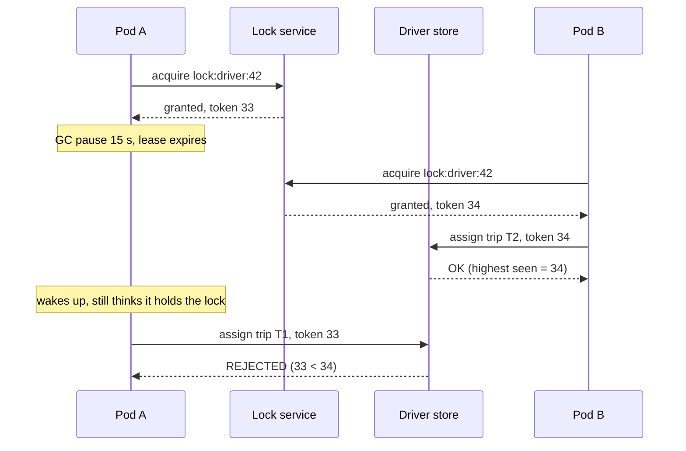

# Distributed Locks and Leases

## 1. One-line summary

A **distributed lock** makes sure only **one** process among many servers does something at a time ("only one rider gets driver 42"); a **lease** is a lock that **expires on its own** after a TTL, so a crashed holder can't block everyone forever. The best "lock" is often not a lock at all, but a **conditional update** in the database.

> 💡 **TTL (time to live)**: a countdown after which something is deleted automatically, e.g. a Redis key set with `PX 10000` disappears after 10,000 ms.

---

## 2. The problem it solves

**The pain:** two riders, Asha and Ben, request a ride 200 m apart at the same second. Two matching-service pods each run:

```java
Driver d = driverRepo.find(42);          // status = AVAILABLE (both pods see this)
if (d.status == AVAILABLE) {
    d.status = ASSIGNED; d.tripId = myTrip;
    driverRepo.save(d);                   // both pods write; last write wins
    offerTripToDriver(42, myTrip);
}
```

Both read `AVAILABLE`, both write, both send an offer. Driver 42 gets two trips, one rider waits for a car that never comes. This is a **race condition** (the result depends on the timing of two concurrent operations): a **check-then-act** where the "check" is stale by the time you "act".

In one JVM you'd use `synchronized` or a `ReentrantLock`. Across 30 pods there's no shared memory, so you need something **outside** the pods that says "you won, you lost" atomically.

**The fix (in order of preference):**

1. Make the decision **atomic in the store that holds the data** (conditional update / compare-and-set).
2. Route all decisions for one entity to **a single owner** so there's no race.
3. Only then, an explicit **lock or lease** (Redis, ZooKeeper/etcd), ideally with **fencing tokens**.

---

## 3. How it works

### 3.1 Conditional update / compare-and-set (preferred)

**Compare-and-set (CAS)**: "set the value to X **only if** it is currently Y", done as one atomic step by the store. Java has the same idea in `AtomicInteger.compareAndSet`.

```sql
UPDATE drivers
SET    status = 'OFFERED', trip_id = :tripId, offer_expires_at = now() + interval '15 seconds',
       version = version + 1
WHERE  driver_id = 42 AND status = 'AVAILABLE';
-- rows affected = 1 → you won; 0 → someone else got him, try the next driver
```

The database's row lock makes the two `UPDATE`s run one after the other; the second sees `status = 'OFFERED'` and matches 0 rows. No separate lock service, no lock to forget to release, and the "lock" is the data itself. Same idea elsewhere: a `version` column (**optimistic locking**: `WHERE version = :readVersion`), DynamoDB `ConditionExpression`, Cassandra lightweight transactions (`IF status = 'AVAILABLE'`, slower: ~4 round trips with Paxos), Redis `SET NX` or a Lua script.

### 3.2 Redis lock: SET NX PX

```
SET lock:driver:42 <random-token> NX PX 10000    # NX = only if not exists, PX = expire in 10,000 ms
... do work ...
# release only if still mine (Lua, atomic):
if redis.call("GET", KEYS[1]) == ARGV[1] then return redis.call("DEL", KEYS[1]) end
```

The random token prevents deleting someone else's lock. Fast (~0.5 ms), simple. **Failure modes:**

| Failure | What happens |
|---|---|
| **Expiry while holding** | Work takes 12 s (slow DB, retry storm), lock expired at 10 s, pod B takes it. Two holders. |
| **Process pause** | A **stop-the-world GC pause** (the JVM freezes all your threads to clean memory) of 15 s right after acquiring. The pod wakes up believing it holds the lock; it doesn't. |
| **Clock jumps** | Expiry relies on time passing at the same rate everywhere; an **NTP** (network time sync) adjustment or VM migration skews it. |
| **Failover** | Primary acks `SET`, dies before async replication; replica promoted without the key; second client acquires. |

**Redlock** (acquire on a majority of 5 independent Redis nodes) narrows the failover case but not the pause case. Conclusion: Redis locks are fine for **efficiency** (avoid doing the same work twice; a rare duplicate is harmless), not for **correctness** (a duplicate is a bug).

### 3.3 Fencing tokens: making a stale holder harmless

A **fencing token** is a number that **increases** every time the lock is granted. The holder sends it with every write, and the **resource rejects any token lower than the highest it has seen**.



Plain words: the lock alone can't stop a zombie, but the **resource** can, if it checks the ticket number. ZooKeeper's `zxid` / znode version and etcd's revision are natural fencing tokens. Note the resource must do the check, which is a conditional update again (`WHERE fence < :token`): another reason CAS is the core tool.

### 3.4 Leases with TTL

A **lease** = "you own this for 10 s; renew before it runs out, or lose it". It's how you avoid a dead holder blocking forever:

- Holder renews every ~1/3 of the TTL (every 3 s for 10 s).
- If the holder crashes, the lease lapses and someone else can take over after ≤ 10 s.
- The holder must **stop acting** when it can't renew (and should assume it lost the lease a bit *before* the TTL, to allow for clock drift).

The ride offer itself is a lease: `status = OFFERED, offer_expires_at = now + 15 s`. If the driver doesn't accept in 15 s, a sweeper (or the next matcher's `WHERE status='AVAILABLE' OR offer_expires_at < now()`) frees the driver. Infra analogy: a Kubernetes **leader-election Lease** object, renewed by the active controller-manager; if it stops renewing, a standby takes over.

### 3.5 ZooKeeper / etcd locks

[ZooKeeper / etcd](../technologies/zookeeper-etcd.md) are **consensus** stores (a cluster of 3–5 nodes that agree on every write by majority vote, so no acked write is lost on failover). Locks there use **ephemeral nodes** / **leases tied to a client session**: the lock disappears when the client's session dies, and the revision number is a fencing token. Slower (~2–10 ms, a few thousand writes/s per cluster) but correct under failover. Use for **coarse, low-rate** locks: leader election, "which pod owns shard 7", not one lock per ride.

### 3.6 No lock at all: single owner per partition

If all decisions about one entity go to **one** worker, there's nothing to race with. Partition by key: the matcher for city `blr` cell group 17 is one consumer of Kafka partition 17; it processes requests for those cells **sequentially** and keeps driver state in memory. Concurrency control becomes "a Kafka partition has one consumer in a group". You still need a lease/fencing at the partition level (Kafka's consumer-group **generation** number fences old consumers), but only one coarse lease per partition instead of one lock per driver.

---

## 4. When to use it

- **Conditional update**: the default for "claim this exact thing": assign driver, reserve seat, mark a coupon used, transition a trip state (`WHERE state = 'REQUESTED'`).
- **Lease with TTL**: claims that must self-heal: driver offer timeouts, job ownership, leader election.
- **Redis lock**: de-duplicating expensive but harmless work (only one pod rebuilds a cache entry; one pod runs a cron).
- **ZooKeeper/etcd**: low-rate, must-be-correct coordination: leader election, shard ownership.
- **Single owner per partition**: high-rate decisions on many keys (matching per region, per-conversation sequencing).

## 5. When NOT to use it (and why it's a mistake)

| Situation | Why |
|---|---|
| Redis lock around a DB write that must be exactly once | The lock can be held twice; the DB constraint is what actually protects you. Use the constraint/CAS directly. |
| ZooKeeper lock per ride request (thousands/s) | Consensus writes are slow and capacity-limited; you'd overload the coordination cluster that also does leader election. |
| Lock without TTL | A crashed holder blocks the driver forever; on-call manually deletes keys at 3 a.m. |
| Locking when the operation is naturally idempotent | `SET driver:42:location = x` twice is harmless; no lock needed. |
| Holding a lock across a slow external call (payment provider) | Lock outlives its TTL under provider latency; use a state machine + idempotency key instead. |

---

## 6. Commonly confused with

| | **DB conditional update (CAS)** | **Redis SET NX PX** | **ZooKeeper / etcd lock** | **Single owner per partition** |
|---|---|---|---|---|
| Correct under failover/pauses? | Yes (if DB is durable) | No | Yes, with fencing | Yes, with partition-level fencing |
| Latency | ~1–5 ms | ~0.5 ms | ~2–10 ms | In-memory |
| Throughput | DB write rate | ~100k/s | ~thousands/s | Very high |
| Releases on crash | n/a (state, plus expiry column) | TTL | Session expiry | Rebalance |
| Best for | Claim one row | Efficiency dedup | Leader election | High-rate per-key decisions |

Also confused: **idempotency** (doing it twice has the same effect as once) vs **mutual exclusion** (only one does it). Idempotency handles retries of the *same* request; locks/CAS handle *different* requests competing for one thing. See [idempotency](idempotency-and-delivery-semantics.md).

---

## 7. Common mistakes / misuse

1. **Read, check in Java, then write** without a condition in the `WHERE` clause.
2. **`DEL` to release** without checking the token: deletes another pod's lock after yours expired.
3. **TTL shorter than the work** (or GC pauses longer than the TTL) with no fencing.
4. **Claiming Redlock makes it safe for correctness.**
5. **No timeout on offers**: driver ignores the request, stays `OFFERED` forever, disappears from supply.
6. **Forgetting the release path on error**: exceptions skip `unlock()`; use `finally`, and TTL as the backstop.
7. **One global lock** ("lock:matching") serialising all of a city's matches.

---

## 8. Interview cheat-sheet

> "Exclusive driver assignment is a compare-and-set, not a lock service: `UPDATE drivers SET status='OFFERED', trip_id=?, offer_expires_at=now()+15s WHERE id=? AND status='AVAILABLE'`; one row affected means we won, zero means try the next candidate. The 15-second expiry makes the offer a lease, so a driver who ignores it returns to the pool. If I used a Redis `SET NX PX` lock, I'd treat it as an efficiency optimisation only, because a GC pause or failover can give two holders; for correctness I'd use fencing tokens checked by the resource, or ZooKeeper/etcd for low-rate things like leader election. At higher scale I'd avoid per-driver locking entirely by giving each region's matching to a single owner, a Kafka partition consumer, so decisions are sequential."

---

## 9. Used in

- [Ride-sharing](../interviews/ride-sharing/README.md): **exclusive driver assignment** (conditional update `AVAILABLE → OFFERED` with an offer lease/timeout), trip state transitions guarded by `WHERE state = ...`, and single-owner matching per region at L6.
- [LLD: Design a Movie Ticket Booking System](../../LLD/interviews/movie-booking/README.md): **seat holds as leases** (a hold row with `expires_at`), claimed with a conditional `UPDATE ... WHERE state = 'AVAILABLE' OR hold expired` instead of a lock service; `SELECT ... FOR UPDATE SKIP LOCKED` at L6.
- [LLD: Task Scheduler](../../LLD/interviews/task-scheduler/README.md): **leases on claimed task rows** (`lease_until`, renewed by heartbeat, reclaimed after expiry) and the single-leader alternative for running schedules across many instances.
- 🔬 [See it work: Raft leader election](../../see-it-work/raft-leader-election/README.md): a paused leader wakes up believing it's still in charge, the same stale-holder problem as an expired lease, resolved by terms (Raft's fencing tokens).
- [Metrics & monitoring](../interviews/metrics-monitoring/README.md): a standby ruler takes over a rule group through a lease when the active one dies.
- [Collaborative editor](../interviews/collaborative-editor/README.md): a lease per document so exactly one session server orders its edits, with a fencing token on log appends after failover.
- [Payment system](../interviews/payment-system/README.md): fencing the old primary during ledger database failover (L6 §5).
- Related: [ZooKeeper / etcd](../technologies/zookeeper-etcd.md), [Redis](../technologies/redis.md) (`SET NX PX`), [PostgreSQL](../technologies/postgresql.md) (row locks, `SKIP LOCKED`), [idempotency and delivery semantics](idempotency-and-delivery-semantics.md), [CAP and consistency](cap-and-consistency.md), [sagas and distributed transactions](sagas-and-distributed-transactions.md), [Kafka](../technologies/kafka.md) (consumer generations).
