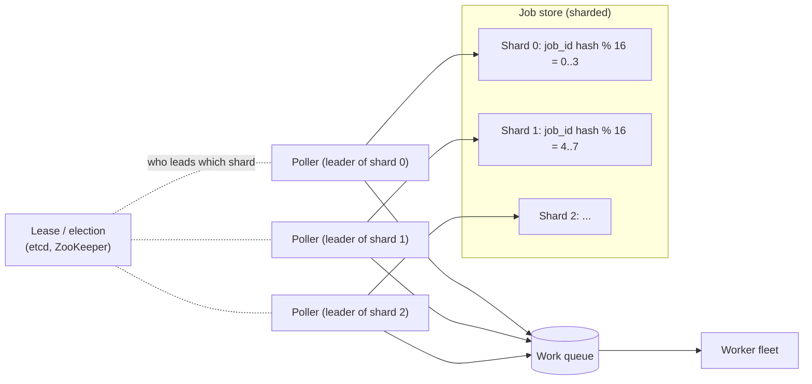

# Distributed Scheduling and Time Buckets

## 1. One-line summary

A distributed scheduler stores, for every job, **when it should run next** (`next_run_at`), and a fleet of pollers repeatedly asks "which jobs are due *now*?" using an index sorted by time (time buckets, a [Redis](../technologies/redis.md) sorted set, or a database index), so that **each due job is claimed by exactly one node** and the load stays smooth even when millions of jobs share the same minute.

💡 *Cron*: the classic Unix tool that runs a command at times like `0 0 * * *` (every midnight). See [cron and recurring schedules](../../LLD/concepts/cron-and-recurring-schedules.md) for the expression syntax; this file is about running that at cluster scale.

## 2. The problem it solves

One machine running cron is easy. Now the numbers grow: **100 million job runs per day**, owned by thousands of customers, and the scheduler must not lose a job when a node dies or fire one twice.

- Average load: 100,000,000 ÷ 86,400 s ≈ **1,157 runs/s**. Fine.
- The catch is **clustering**. People love round times. Say 10% of daily runs are "at midnight": 10,000,000 jobs, all due inside the same minute → 10,000,000 ÷ 60 ≈ **166,667 runs/s**, about **144×** the average.
- The naive scan `SELECT * FROM jobs WHERE next_run_at <= now()` over 100M rows every second would read the whole table. We need an index that answers "what is due" in time proportional to the *answer*, not to the table.
- With several scheduler nodes (for availability), two nodes must not pick the same job.

Infra analogy: it is a Kubernetes CronJob controller, except it must handle millions of CronJobs, survive controller restarts, and not stampede the API server at 00:00.

## 3. How it works

### 3.1 Store `next_run_at`, never "a timer per job"

Each job row holds its schedule (cron expression or interval) and one derived field: `next_run_at`. The loop is:

1. Find rows with `next_run_at <= now`.
2. Dispatch each (push to a queue, see [message queues](../technologies/message-queues.md)).
3. Compute the *next* occurrence from the schedule and write it back to `next_run_at`.

Why not keep 100M in-memory timers? Memory (100M × ~100 B ≈ 10 GB per copy), and they vanish on restart. Persist the *next due time* and rebuild in-memory helpers from it.

💡 *Index*: a sorted side-structure (usually a B-tree) the database keeps so it can jump to "all rows with value ≤ X" without reading everything.

### 3.2 Three ways to find "due now" cheaply

| Approach | How | Cost to find due jobs | Notes |
|---|---|---|---|
| DB index on `next_run_at` | `WHERE next_run_at <= now() ORDER BY next_run_at LIMIT 500` | O(log N + k) for k due rows | Simplest. [Postgres](../technologies/postgresql.md) handles ~thousands of claims/s per shard |
| Time-bucket table | Row also has `bucket = floor(next_run_at / 60s)`; poll only buckets ≤ current | O(k), buckets are small and hot | Old buckets are cheap to drop; sharding by bucket is natural |
| Redis ZSET | `ZADD due <epoch_seconds> job_id`; poll with `ZRANGEBYSCORE due -inf now LIMIT 0 500` | O(log N + k) in memory | Very fast, but Redis is not the source of truth, so rebuild from the DB after a failure |

💡 *ZSET (sorted set)*: a Redis structure holding unique members, each with a numeric **score**; it keeps them ordered by score, so "everything with score ≤ now" is a quick range read. Using the due timestamp as the score turns it into a priority queue by time.

### 3.3 Claiming a job safely: `SELECT ... FOR UPDATE SKIP LOCKED`

With 5 poller nodes all running the query above, they would all read the *same* 500 due rows. The fix is a row lock that other pollers **skip instead of waiting on**:

```sql
BEGIN;
SELECT id FROM jobs
 WHERE next_run_at <= now()
 ORDER BY next_run_at
 LIMIT 500
 FOR UPDATE SKIP LOCKED;   -- lock these rows; ignore rows others already locked
-- dispatch them / mark state='queued', set next_run_at = next occurrence
COMMIT;
```

- `FOR UPDATE` locks the selected rows until commit, so nobody else can modify them.
- `SKIP LOCKED` tells the database: "if a row is already locked by another transaction, pretend it isn't there". Each poller therefore gets a **disjoint batch** with no blocking and no coordination service.
- If a poller crashes mid-transaction, the locks vanish on rollback and the rows are due again for the next poller. No job is lost; a job may be *dispatched twice* if the crash is after the queue push but before commit, which is why the job must be idempotent (see [idempotency](idempotency-and-delivery-semantics.md)).

Trade-off: all pollers hit the same table, so the table (or index head) becomes the hot spot. That motivates sharding.

### 3.4 Sharding the schedule: one leader per shard



Two common ways to split the schedule:

- **By job ID hash** (see [consistent hashing](consistent-hashing.md)): every shard has a similar number of jobs, but midnight still hits *every* shard at once. Good default.
- **By time bucket** (e.g. `bucket % N`): each shard owns certain minutes. Tidy to reason about, but one hot minute lands entirely on one shard, so use a hash of job ID *within* the bucket too.

With one **leader per shard** (elected through a [lease](distributed-locks-and-leases.md) or [Raft](consensus-and-raft.md)-backed store like [etcd](../technologies/zookeeper-etcd.md)), polling needs no row locks at all: only the leader reads that shard. A standby takes over when the lease expires. Danger: an old leader that was paused (GC, network) may still believe it leads, so every dispatch carries a **fencing token** (the lease's increasing number) and downstream rejects stale ones.

### 3.5 Timing wheels at cluster scale

Inside a single node, "fire these 20,000 things at precise instants" is done with a **timing wheel**, an array of slots each holding the timers due in that tick (details in [timers, delay queues and timing wheels](../../LLD/concepts/timers-delay-queues-and-timing-wheels.md)). In a cluster, use two tiers:

1. **Durable tier**: the DB / ZSET, coarse (minute buckets), the source of truth.
2. **In-memory tier**: each shard leader loads the *next few minutes* of jobs into a timing wheel and fires at second precision, so the DB is queried once per minute per shard rather than once per job.

If the leader dies, its wheel is lost, but the next leader rebuilds it from the durable tier. Same pattern as an in-memory cache in front of a database, with the DB authoritative.

### 3.6 Clock skew

Different machines' clocks disagree by milliseconds (NTP-synced) to seconds (neglected VM). Rules of thumb:

- Take "now" from **one authority** per decision: use the database's `now()` in the claim query, not each poller's own clock.
- Never compare timestamps from two different hosts' clocks to decide ordering; use a lease/fencing number.
- Add a small safety margin (e.g. consider a job late only after 5 s) before alerting.
- Job timestamps are stored in **UTC**; time zones and DST (clocks jumping an hour) are applied only when computing the next occurrence from the cron expression.

💡 *NTP*: Network Time Protocol, the service that keeps a machine's clock close to real time. *DST*: daylight saving time.

### 3.7 Misfires: what if we were down at the due time?

The scheduler was deployed for 10 minutes; 600,000 jobs became overdue. Each job declares a **misfire policy** (names borrowed from Quartz, a Java scheduling library):

| Policy | Behaviour | Good for |
|---|---|---|
| Fire now (once) | Run once immediately, then resume the normal schedule | Cache refresh, "sync data" |
| Skip | Drop the missed run; wait for the next slot | Hourly metrics ping, stale-after-the-fact reminders |
| Catch up all | Run every missed occurrence in order | Daily billing/ledger closes where each day must be processed |

Also set a **grace window** (e.g. "still run if less than 5 min late, otherwise apply the policy").

### 3.8 Jitter: defusing the midnight thundering herd

💡 *Thundering herd*: many clients react to the same trigger at the same moment and overwhelm a shared resource.

Worked numbers from the section above, 10,000,000 jobs "at 00:00":

| Strategy | Window | Rate |
|---|---|---|
| Fire all at 00:00:00 sharp | 60 s (they trickle out as fast as workers pick up) | 10,000,000 ÷ 60 ≈ **166,667/s** |
| Random jitter, spread over 10 minutes | 600 s | 10,000,000 ÷ 600 ≈ **16,667/s** (10× lower) |
| Jitter plus per-tenant rate limit | 600 s | Capped, e.g. 5,000/s per tenant |

**Jitter** = add a random delay to `next_run_at`. Pick it deterministically from the job ID (`hash(job_id) % window`) so the job does not drift each run and customers can reason about it. Offer exact-time as a premium option with a quota, since most "at midnight" jobs don't truly care about second-level precision.

Tiny check (a short Java 21 simulation: 10M random jobs over 600 one-second slots), real output:

```java
int[] perSec = new int[600];
for (int i = 0; i < 10_000_000; i++) perSec[r.nextInt(600)]++;
```
```
no jitter, all in 60s: 166666 jobs/s
jitter over 600s: avg 16666, min 16228, max 17017
```

Random spreading is very even: max is only ~2% above the average. Remember the fix is for *dispatch*, so also put a [back-pressure](../../LLD/concepts/back-pressure.md)-aware queue and worker autoscaling behind it.

## 4. When to use it

- You need scheduled work across multiple nodes that survives restarts: reminders, billing runs, report generation, TTL cleanup, "send email at 9am local time".
- Job count is large enough that one cron box or one process is a single point of failure or bottleneck (>~10k jobs, or availability matters).
- Many jobs share round wall-clock times (always true for human-chosen schedules).

## 5. When NOT to use it

- **A few dozen jobs**: a Kubernetes CronJob or a single leader-elected process is simpler. A bucketed, sharded scheduler is machinery you must operate.
- **Event-triggered work** ("when upload finishes, process it") belongs on a queue, not a clock.
- **Sub-second precision at huge scale**: a database poll loop gives ~1 s granularity. Use in-memory timing wheels or a dedicated delay queue.
- **Using Redis as the only store**: a ZSET lost in a failover (async replication) silently drops jobs. Keep the DB authoritative.

## 6. Commonly confused with

| Looks similar | Difference |
|---|---|
| Delay queue (SQS delay, RabbitMQ TTL+DLX) | Delay queues hold *messages* for a short fixed delay (SQS caps at 15 minutes, per AWS docs, verify before quoting); a scheduler owns *recurring definitions* and computes the next occurrence |
| Cron daemon | One host, one clock, no failover |
| Workflow engine ([DAGs](workflow-orchestration-and-dags.md)) | Decides *what* runs after what; the scheduler decides *when* it starts |
| Message-queue consumers | Consumers react to arrival; schedulers react to time |

## 7. Common mistakes / misuse

- **Computing the next run before the current one is safely dispatched**: crash in between and the job silently stops recurring. Do both in one transaction (or advance after dispatch and accept a duplicate).
- **Advancing `next_run_at` from `now()` instead of from the previous scheduled time**: schedules drift ("every 10 minutes" becomes every 10 min + delay). Compute from the schedule.
- Polling with plain `SELECT` + `UPDATE` and no `SKIP LOCKED`/leader: double dispatch.
- Using the poller's local clock: skewed nodes fire early or late.
- Ignoring the midnight spike, then sizing workers for the average of 1,157/s.
- Treating "fired" as "done": a dispatched job also needs timeouts and retries ([retries, backoff and DLQ](retries-backoff-and-dlq.md)).
- One misfire policy for everything: skipping a billing run is a bug; replaying 500 stale reminders is spam.

## 8. Interview cheat-sheet

"I store `next_run_at` per job in a sharded table with an index on it (or a Redis sorted set scored by timestamp as a fast cache). Per shard, a leader holding a lease polls for due jobs each second, or workers use `FOR UPDATE SKIP LOCKED` so batches never overlap. It dispatches to a queue and advances `next_run_at` from the cron expression in UTC. Delivery is at-least-once, so jobs are idempotent and carry a fencing token. Misfire policy per job: fire-now, skip, or catch-up. For the midnight herd, 10M jobs in one minute is about 167k/s versus 1.2k/s average, so I add deterministic jitter and per-tenant rate limits, which brings it to roughly 17k/s over ten minutes."

## 9. Used in

- [Distributed job scheduler: README](../interviews/distributed-job-scheduler/README.md)
- [L4 mid-level](../interviews/distributed-job-scheduler/L4-mid.md): finding due jobs, polling with SKIP LOCKED
- [L5 senior](../interviews/distributed-job-scheduler/L5-senior.md): partitioning, misfires, thundering herd
- [L6 staff](../interviews/distributed-job-scheduler/L6-staff.md): multi-tenant fairness, multi-region
- [LLD: task scheduler](../../LLD/interviews/task-scheduler/README.md): the single-process version
- Related: [workflow orchestration and DAGs](workflow-orchestration-and-dags.md), [presence and heartbeats](presence-and-heartbeats.md)
