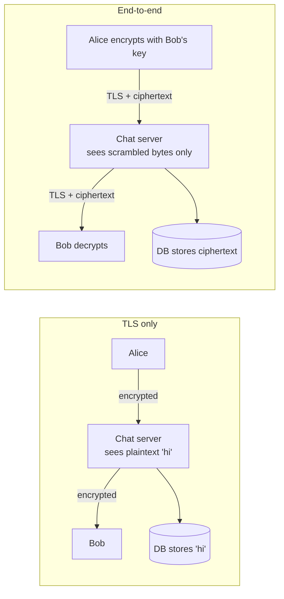

# End-to-End Encryption (E2EE)

> **Not a cryptography course.** This file explains what E2EE means for **system design**: which component holds which key, what the server can and cannot do, and how that changes features like search, backup and multi-device. No math. In an interview, nobody expects you to derive the Signal protocol; they expect you to know its consequences.

## 1. One-line summary

**End-to-end encryption** means a message is encrypted on the sender's device and can only be decrypted on the recipient's device(s); every server in between, including your own, only ever sees scrambled bytes. WhatsApp, Signal and iMessage work this way.

---

## 2. The problem it solves

**The pain:** with only normal HTTPS, a chat message is encrypted **on the wire** (phone → load balancer), but your servers decrypt it, process it, and store it readable in [Cassandra](../technologies/cassandra.md). That means:

- An attacker who gets into the database (or a stolen backup) reads 5 years of everyone's private messages.
- An insider with prod access, or a government order, can read any conversation.
- Users have to trust every engineer, every vendor, every log line that might contain a payload.

**The fix:** the server is designed to **not be able** to read messages. Keys live only on users' devices. A breach of the server leaks metadata, not content.

> Infra analogy: think of TLS termination at your load balancer. With "TLS to the LB, plain HTTP inside the cluster", anyone with access inside the cluster can sniff traffic. E2EE is like the two apps doing mTLS (mutual TLS, where both sides prove their identity with certificates) **through** every proxy, where your infra only forwards opaque bytes it can't decrypt, except here the "endpoints" are users' phones, not services.

---

## 3. How it works

### 3.1 Transport encryption (TLS) vs end-to-end encryption

**TLS** (the "S" in HTTPS) encrypts traffic between **two hops**: client ↔ the server that terminates TLS. Every hop decrypts and re-encrypts.

With E2EE you still use TLS (it hides metadata from the coffee-shop Wi-Fi and authenticates the server); E2EE is an **extra** layer inside it.

### 3.2 Public and private keys, in plain words

- Each device generates a **key pair**: a **private key** (secret, never leaves the device) and a **public key** (safe to give to anyone).
- Anything locked with Bob's **public** key can only be unlocked with Bob's **private** key. Like a padlock: you can hand out open padlocks to anyone; only you have the key that opens them.
- So Alice doesn't need a secret shared with Bob in advance. She just needs Bob's public key.

### 3.3 The server as a key directory

Alice needs Bob's public key even when Bob is offline. So the server runs a **key distribution service**:

1. On install, Bob's device uploads its public **identity key** plus a batch of ~100 one-time **pre-keys** (extra public keys, each used once to start a new session).
2. Alice wants to message Bob for the first time: she fetches Bob's identity key + one pre-key from the server (the server deletes that pre-key so it's never reused).
3. Alice's device combines them with her own keys to compute a **shared secret** that only she and Bob can compute. Bob computes the same secret when he receives the first message. The server never learns it.

The trust problem: what if the server hands Alice a **fake** public key (its own) and reads everything (a **man-in-the-middle** attack)? Defense: **safety numbers / security codes**: both users can compare a fingerprint of the keys (scan a QR code in person). Apps also show "Bob's security code changed" when he reinstalls.

### 3.4 The Signal protocol idea: a new key for every message

Using one shared key forever is dangerous: steal it once, read the whole history. The **Signal protocol** (used by Signal, WhatsApp, Google Messages RCS) uses a **double ratchet**:

- A **ratchet** is a one-way step: from the current key you derive the next key, but you can't go back. Like a ratchet wrench that only turns one way.
- Every message is encrypted with a **fresh key**, then that key is deleted.
- Every time the conversation changes direction (Bob replies), the two devices mix in brand-new randomness (a new key exchange), so even keys derived from a stolen state stop working soon.

What this buys:

| Property | Plain words |
|---|---|
| **Forward secrecy** | Steal Bob's phone keys today → you **can't** decrypt messages he received last month (those keys are already deleted) |
| **Post-compromise security** ("self-healing") | Steal keys once → after a few back-and-forth messages, new randomness locks you out again |

### 3.5 Group chats: sender keys

Encrypting each group message separately for each of 256 members (pairwise) = 256 encryptions and 256 uploads per message. Phones and batteries don't love that.

**Sender keys** (WhatsApp's group approach): each member creates a **sender key** for the group and sends it once to every other member over the pairwise E2EE sessions. After that, a group message is encrypted **once** with the sender's key and the server [fans out](fan-out.md) the same ciphertext to all members.

- Cost: 1 encryption + 1 upload per message, server fans out (fine).
- Catch: when someone **leaves** the group, every remaining member must generate and redistribute new sender keys, otherwise the ex-member could still decrypt. In a 1,000-member group that's a lot of key traffic, one reason E2EE groups have size caps (WhatsApp: 1,024) and huge broadcast channels often aren't E2EE.

### 3.6 Multi-device complications

Each device has **its own** key pair (private keys never get copied between devices). So "send to Bob" really means "send to each of Bob's devices":

- Alice's phone fetches the list of Bob's devices (phone, laptop, tablet) and encrypts the message **once per device** (or once per device's session). Her own other devices also get a copy so her sent messages appear there.
- Linking a new device: scan a QR code from the primary phone, which vouches for the new device's key.
- **History on a new device** isn't automatically there, since the server can't decrypt the old messages; the old device must re-encrypt and transfer history to the new one, or the new device starts empty.
- Server-side impact: messages per user = messages × devices; the device list must be authenticated, or the server could silently add a "device" (another man-in-the-middle).

### 3.7 Media

Attachments are encrypted **on the device** with a random one-time key, the encrypted file goes to [object storage](../technologies/object-storage.md), and the **key + file hash travel inside the E2EE message**. The [CDN](../technologies/cdn.md) and bucket only ever hold ciphertext. Side effect: a photo forwarded to 50 chats can't be deduplicated by content on the server unless the same key is reused when forwarding.

### 3.8 What the server can and cannot do

| Feature | With E2EE | Consequence for the design |
|---|---|---|
| Route and store messages | Yes (opaque blobs) | Storage, fan-out, ordering, acks all unchanged |
| **Server-side search** of message text | **No** | Search runs on the device over its local DB |
| **Content moderation / spam scanning** | **No** (content) | Rely on user reports (reporter's device sends the messages), metadata-based abuse signals, rate limits, forward-count limits |
| Push notification previews | Not by the server | Push carries "new message" or ciphertext; the app decrypts locally (iOS notification service extension) |
| Link previews | Generated by the **sender's** device | Server never fetches the URL |
| **Metadata**: who talks to whom, when, how often, IP, message size, group membership | **Yes, still visible** | E2EE hides content, not the social graph; minimize logs/retention |
| **Backups** | Readable unless backups are E2EE too | iCloud/Google Drive backups were historically unencrypted by WhatsApp; now optional encrypted backups with a password or 64-digit key that the user can lose |
| Recover history if user loses phone + key | **No** | Product must warn users; "forgot password" can't restore messages |
| Lawful access to content | No | Policy/legal topic, out of the design's hands |

---

## 4. When to use it

- Private person-to-person and small-group messaging (WhatsApp, Signal, iMessage).
- Health, legal or financial messages where the operator shouldn't be trusted with content.
- Password managers and encrypted notes/backups.
- Anywhere "even we can't read your data" is a product promise.

## 5. When NOT to use it (and why it's a mistake)

| Situation | Why E2EE hurts |
|---|---|
| Enterprise chat (Slack, Teams) | Companies **need** compliance archiving, eDiscovery (handing messages to lawyers in a lawsuit), DLP (data loss prevention: scanning for leaked secrets or customer data) and admin search, which require the server to read content |
| Huge public channels (100k+ members) | Content is effectively public anyway; key rotation on every leave is unworkable |
| Features built on server-side content: cross-device full-text search, AI summaries, translation, spam ML on content | All need plaintext on the server |
| A team that can't own key management UX | Lost keys = lost data and angry users |

---

## 6. Commonly confused with

| | **TLS (in transit)** | **Encryption at rest** (disk/DB/S3 SSE) | **End-to-end** |
|---|---|---|---|
| Protects against | Network eavesdroppers | Stolen disks / backups | Everyone except the endpoints, **including your servers** |
| Who holds the keys | Each hop (LB, servers) | The provider / your KMS | Only users' devices |
| Server can read content | Yes | Yes (decrypts transparently) | **No** |
| Breaks server features | No | No | Yes: search, moderation, previews |

---

## 7. Common mistakes / misuse

1. **Saying "we use HTTPS, so it's end-to-end."** TLS ends at your load balancer.
2. **Promising E2EE and server-side search/moderation** in the same design. Pick, and say the trade-off.
3. **Thinking E2EE hides metadata.** Who-talks-to-whom is often as sensitive as content.
4. **Forgetting backups.** Plaintext cloud backups undo E2EE.
5. **Copying a private key between devices** instead of per-device keys.
6. **Ignoring group membership changes** (removed member keeps the sender key).
7. **Rolling your own crypto.** Use the audited Signal protocol library (libsignal); in an interview, name it, don't invent it.

---

## 8. Interview cheat-sheet

> "With end-to-end encryption, messages are encrypted on the sender's device for each recipient device, and the server only stores and routes ciphertext, so storage, fan-out, ordering and acks don't change. The server acts as a directory of public keys and one-time pre-keys so a first message can be sent while the recipient is offline. I'd use the Signal protocol rather than invent anything: the double ratchet gives every message a new key, so stealing keys today doesn't expose past messages. Groups use sender keys so a message is encrypted once and the server fans it out, with key rotation when someone leaves. The cost is that the server can't search, moderate content or restore history, metadata is still visible, and backups must be encrypted too or they undo the whole thing."

---

## 9. Used in

- [Chat system](../interviews/chat-system/README.md): **end-to-end encryption** deep dive (L5/L6): key directory and pre-keys, per-device encryption for multi-device sync, sender keys for groups, encrypted media in object storage, and what E2EE breaks (server search, moderation, backups).
- Related: [object storage](../technologies/object-storage.md) (encrypted media), [CDN](../technologies/cdn.md), [fan-out](fan-out.md) (group delivery), [push/email/SMS providers](../technologies/push-email-sms-providers.md) (notification previews), [load balancer](../technologies/load-balancer.md) (TLS termination).
