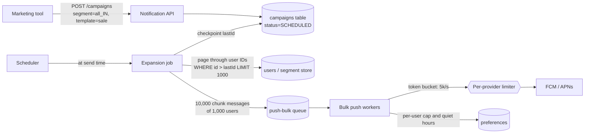

# Fan-out

## 1. One-line summary

**Fan-out** is turning **one event into many deliveries**: one "new post" into a write to every follower's feed, or one "flash sale starts" campaign into 10 million push notifications. The design question is **when** you do the multiplication (on write or on read) and **how** you do it without melting your queues, database or providers.

---

## 2. The problem it solves

**The pain:** marketing clicks "send" on a campaign to all 10M users. A naive Notification API does:

```java
for (User u : userRepo.findAll()) {   // 10M rows into memory
    sendPush(u);                       // synchronous, in one request
}
```

- The HTTP request times out after 30 s, having sent maybe 20k pushes. Retrying restarts from zero: duplicates.
- Loading 10M rows OOMs the pod.
- If it did work, FCM would get 10M calls in a burst and answer with 429s.
- OTPs triggered at the same moment wait behind 10M marketing messages.

**The fix:** treat the broadcast as a **job**: store the campaign, have a **batch expansion** process walk the audience in chunks (e.g. 1,000 users), enqueue each chunk on a low-priority queue, and let throttled workers drain it at the provider's allowed rate. Progress is checkpointed, so a crash resumes instead of restarting.

> Infra analogy: a rolling deploy to 1,000 nodes. You don't SSH into all of them at once from one shell loop. You batch (maxSurge), checkpoint progress, and throttle so the system stays healthy.

---

## 3. How it works

### 3.1 Fan-out on write vs on read

| | **Fan-out on write (push model)** | **Fan-out on read (pull model)** |
|---|---|---|
| When the work happens | At event time: copy the event to every recipient's inbox/feed | At read time: each reader gathers events from the sources they follow |
| Write cost | High: 1 event × N recipients | Low: 1 write |
| Read cost | Low: read your own precomputed inbox | High: merge from many sources on every read |
| News feed example | Post written into each follower's feed cache | Timeline built by querying the people you follow |
| Notification example | Insert a row per user into the inbox, send push to each | Store one "global announcement" row; every client's inbox query also reads active broadcasts |
| Breaks on | **Celebrities** (one post → 100M writes) | Users who follow thousands of accounts |

Most real systems are **hybrid**: fan-out on write for normal users, on read for celebrities / huge broadcasts. For notifications, anything that must reach a phone (push/SMS/email) **has to be fanned out on write**, since there is no "read" until the user is nudged. The in-app inbox for a global announcement can be fanned out on read (one row, joined at query time) to avoid writing 10M rows.

### 3.2 Broadcast to 10M users: batch expansion



Steps:

1. **Store the campaign** with an ID (that's the idempotency key for the whole broadcast).
2. **Expansion job** pages through the audience with **keyset pagination** (`WHERE user_id > :last ORDER BY user_id LIMIT 1000`, not `OFFSET`, which gets slower each page). After each page it saves `last_user_id` so a restart resumes there.
3. Each page becomes **one chunk message** (`{campaignId, userIds[1000]}`), not 1,000 messages: 10M users ÷ 1,000 = **10,000 queue messages**.
4. **Chunk workers** load preferences and device tokens for the 1,000 users in one batch query, drop opted-out users and those in quiet hours, then send. FCM supports up to 500 messages per batch request.
5. **Per-message idempotency** key `campaignId:userId`, so redelivered chunks don't double-send.

### 3.3 Throttling to provider limits

How long does the blast take? Suppose we self-limit push to **5,000/s** to stay well under FCM's quota and leave room for transactional traffic:

```
10,000,000 ÷ 5,000 per s = 2,000 s ≈ 33 minutes
```

For SMS with an aggregate 500 msg/s across sender numbers: `10M ÷ 500 = 20,000 s ≈ 5.6 hours` (and ~$100k, which is why nobody SMSes 10M users). Email at 1,000/s: ~2.8 hours.

Throttling is a **token bucket per provider** shared by all workers (e.g. in Redis), see the [rate limiter LLD](../../LLD/interviews/rate-limiter/README.md). Bulk traffic gets its own queue and a **reserved slice** of the provider quota so OTPs always have headroom. Also spread the blast: 10M users opening the app within 60 s is a self-inflicted DDoS on your own API ("thundering herd from a push").

### 3.4 Celebrity / hot-key problem

A celebrity with 50M followers posts. Fan-out on write means 50M inbox inserts in seconds, all triggered by **one key**:

- One Kafka partition (keyed by `authorId`) and one consumer do all the work: a **hot partition**.
- Fixes: key the fan-out tasks by **recipient chunk**, not author, so work spreads across partitions; treat accounts above a follower threshold (e.g. 1M) with **fan-out on read**; rate-limit celebrity-triggered notifications ("X and 4,000 others liked..."), i.e. **aggregate** instead of sending one per event.

### 3.5 Transactional outbox

Fan-out usually starts from a DB change ("order shipped" row updated). How do you **reliably** publish the event?

- Write DB, then publish to the queue: crash between them = event lost.
- Publish, then write DB: crash = event for a change that never happened.
- Both in a distributed transaction (2PC): slow, rarely supported by brokers.

**Outbox pattern:** in the **same local DB transaction**, update the business row **and** insert an `outbox` row. A separate **relay** (a poller using `SELECT ... FOR UPDATE SKIP LOCKED`, or CDC like Debezium reading the DB's write-ahead log) publishes outbox rows to [Kafka](../technologies/kafka.md) or a [queue](../technologies/message-queues.md) and marks them sent.

```sql
BEGIN;
UPDATE orders SET status = 'SHIPPED' WHERE id = 981;
INSERT INTO outbox(id, topic, payload) VALUES (gen_random_uuid(), 'order-events', '{"orderId":981,"event":"SHIPPED"}');
COMMIT;
```

The relay may publish a row twice (crash after publish, before marking), so it is **at-least-once**: consumers must be [idempotent](idempotency-and-delivery-semantics.md), using the outbox row ID as the key.

---

## 4. When to use it

- **Fan-out on write:** small, bounded recipient lists (a user's 300 followers, an order's 1 customer), and all push/SMS/email delivery.
- **Fan-out on read:** huge or unbounded audiences for in-app content (global banners, celebrity posts).
- **Batch expansion + throttling:** any campaign/broadcast over ~10k recipients.
- **Outbox:** whenever a DB change must trigger a notification/event without loss.

## 5. When NOT to use it (and why it's a mistake)

| Situation | Why |
|---|---|
| Fan-out on write for a 10M broadcast into the in-app inbox | 10M row inserts for one announcement most users never open. Store once, read at query time. |
| Fan-out on read for push | There is no read: the user must be nudged. |
| Per-user queue messages for a broadcast | 10M messages vs 10k chunks: 1,000× more broker overhead. |
| Outbox for fire-and-forget metrics | Losing an occasional metric is fine; don't add a table and relay. |

---

## 6. Commonly confused with

| | **Fan-out** | **Fan-in** | **Pub/Sub** | **Batching** |
|---|---|---|---|---|
| Meaning | 1 event → N deliveries | N results → 1 aggregate | Delivery mechanism: subscribers each get a copy | Group many items per call |
| Example | Campaign → 10M pushes | "4,000 people liked your post" digest | SNS topic → 3 SQS queues; Redis Pub/Sub to gateways | 500 FCM messages per request |
| Relation | Pub/Sub implements small fan-outs to a few services; user-level fan-out needs a job | Used to tame celebrity fan-out | Fan-out to services, not to millions of users | Used inside fan-out workers |

---

## 7. Common mistakes / misuse

1. **One giant loop in one request** for a broadcast: timeouts, OOM, duplicates on retry.
2. **`OFFSET` pagination** over 10M rows: page 9,000 scans 9M rows.
3. **No checkpoint**, so a crashed expansion job restarts at user 0 and double-sends.
4. **Bulk and critical traffic on the same queue/quota**: the sale blast delays OTPs.
5. **Ignoring per-user limits** during campaigns: one user is in 5 segments and gets 5 pushes.
6. **Keying fan-out by author**, creating a hot partition for celebrities.
7. **Dual write** (DB then queue) instead of an outbox: lost events on crash.
8. **Not estimating duration and cost** (33 min for push, hours and $100k for SMS).

---

## 8. Interview cheat-sheet

> "A broadcast is a job, not a request. The campaign is stored with an ID, and at send time an expansion job pages through the audience with keyset pagination in chunks of 1,000, checkpointing its position so a crash resumes instead of restarting. Each chunk is one message on a low-priority bulk queue; workers batch-load preferences and tokens, filter opt-outs and quiet hours, and send through a per-provider token bucket that leaves reserved headroom for OTPs. At 5,000 pushes a second, 10M users takes about 33 minutes, which is fine for marketing. For in-app, a global announcement is fanned out on read, one row joined at query time, while push, SMS and email must be fanned out on write. Events that start from a DB change go through a transactional outbox so they're never lost, and everything downstream is idempotent on campaignId plus userId."

---

## 9. Used in

- [Notification system](../interviews/notification-system/README.md): **broadcasts to millions** (batch expansion, chunking, throttling to provider limits, bulk vs critical lanes), fan-out on read for in-app announcements, and the transactional outbox for event-triggered notifications.
- [Chat system](../interviews/chat-system/README.md): **group chat delivery**: fan-out on write to each member's inbox/gateway for small groups vs per-conversation topics / fan-out on read for large groups and channels, plus presence fan-out avoided via subscribe-on-view.
- [News feed](../interviews/news-feed/README.md): the **core of the design**: **hybrid fan-out** (fan-out on write into Redis feed caches for normal users, fan-out on read merged at request time for celebrities), the **celebrity problem**, and skipping inactive users during fan-out.
- Related: [message queues](../technologies/message-queues.md), [Kafka](../technologies/kafka.md) (hot partitions), [push/email/SMS providers](../technologies/push-email-sms-providers.md), [idempotency and delivery semantics](idempotency-and-delivery-semantics.md), [back-of-the-envelope](back-of-the-envelope.md), [rate limiter (LLD)](../../LLD/interviews/rate-limiter/README.md).
