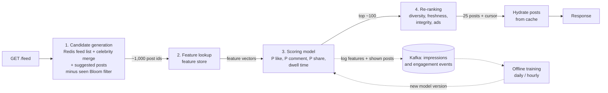

# Feed ranking

## 1. One-line summary

**Feed ranking** decides the **order** of posts in someone's feed. A **chronological** feed sorts by time; a **ranked** feed runs a pipeline (**candidate generation → feature lookup → scoring model → re-ranking**) that predicts which posts this user will most likely engage with, and shows those first.

💡 **Engagement** = any action showing interest: like, comment, share, save, watch time, clicking "see more".

---

## 2. The problem it solves

**The pain:** an average user follows 300 accounts that together post ~1,500 items a day. The user opens the app 5 times and scrolls maybe 50 posts each time. With a purely chronological feed:

- A close friend's wedding photo from 6 hours ago is buried under 200 posts from a meme page that posts every 5 minutes.
- Whoever posts most often wins, so accounts are rewarded for spamming.
- The user misses what they care about, scrolls less, and stops opening the app.

**The fix:** treat the feed as a **recommendation problem**. For each candidate post, predict "how likely is this user to like / comment / share / spend time on it?", combine the predictions into one score, sort, then adjust for variety and safety.

Chronological still has a place: it is simple, predictable, easy to debug, and some products offer it as an option ("Following" tab on X, "Favorites" on Instagram). At L4 it is the right default answer; ranking is the L5/L6 deep dive.

> Infra analogy: chronological is a FIFO queue. Ranking is a priority queue whose priority is computed per user by a service, like a scheduler that orders pods by priority class and resource fit instead of arrival time.

---

## 3. How it works

### 3.1 Why a pipeline, not one big model

Scoring is expensive: a good model may take ~0.1 ms of CPU per post. Running it on every post on the platform (billions) per request is impossible. So we **narrow down in stages**, each stage cheaper per item than the next:

| Stage | Input → output | What it does | Budget (p99) |
|---|---|---|---|
| 1. **Candidate generation** | all posts → ~500–1,500 | Read precomputed feed from Redis (fan-out on write), merge celebrity posts (fan-out on read), add a few recommended / "suggested" posts. Drop already-seen ones via a [Bloom filter](bloom-filters.md). | ~30 ms |
| 2. **Feature lookup** | 1,000 candidates → 1,000 feature vectors | Fetch facts about user, post and author from a **feature store** (a fast KV store of precomputed numbers). | ~40 ms |
| 3. **Scoring** | 1,000 → 1,000 scores | Model predicts P(like), P(comment), P(share), expected dwell time; combine into one score. | ~60 ms |
| 4. **Re-ranking** | top ~100 → final 25-item page | Diversity, freshness, integrity rules, ads insertion. | ~10 ms |
| Hydration + network | | Load post bodies, media URLs, counts. | ~60 ms |

Total ≈ `30 + 40 + 60 + 10 + 60 = 200 ms`, which fits a typical **feed p99 target of 200–300 ms**. (💡 **p99** = 99% of requests are faster than this.)



### 3.2 Features: the inputs to the model

A **feature** is one number (or category) describing the situation. Examples:

| About | Feature examples |
|---|---|
| Viewer ↔ author | How often the viewer liked this author's posts in the last 30 days; are they mutual follows; did they DM recently |
| Post | Age in minutes; media type (photo/video/text); likes in first 10 minutes; caption length |
| Author | Follower count; typical engagement rate |
| Viewer | Prefers video vs photo; time of day; device; session depth |

Features are **precomputed** by stream/batch jobs and stored in a **feature store** (often Redis or Cassandra keyed by `user_id`, `post_id`, `(user_id, author_id)`), so serving is a batch of key lookups, not a computation. 1,000 candidates × ~3 lookups = 3,000 keys, fetched as a few pipelined multi-gets, which is why this stage can fit in ~40 ms.

### 3.3 Scoring: one number from many predictions

The model outputs several probabilities per post. The product decides how much each is worth:

```
score = 1.0 × P(like) + 4.0 × P(comment) + 6.0 × P(share) + 0.5 × E[dwell seconds]/10
        − 20 × P(hide or report)
```

The weights are **product decisions** (comments are worth more than likes because they create conversation), tuned by A/B tests, not by engineers guessing. You don't need ML math in an interview; say "a model predicts several engagement probabilities, a weighted sum turns them into one score".

### 3.4 Re-ranking: rules on top of the score

Pure score-sorting produces bad feeds: five posts in a row from the same author, all videos, all from yesterday. Re-ranking applies rules:

- **Diversity:** at most 2 consecutive posts from one author; mix media types.
- **Freshness:** boost posts under 1 hour old; demote posts the user already scrolled past.
- **Integrity:** demote borderline content, remove anything the trust-and-safety classifier flagged after fan-out.
- **Business:** insert ads at fixed slots (e.g. every 5th position), insert "suggested for you".

### 3.5 Offline training vs online serving

- **Online serving** = the request path above: must answer in milliseconds, uses a frozen model version, reads precomputed features.
- **Offline training** = a batch job (hours) that reads logged events ("we showed post X at position 3 with these features, user liked it / scrolled past") and produces a **new model version**, which is pushed to scoring servers like a config rollout: canary on 1% of traffic, compare metrics, then roll out.
- Important: log the **exact features used at serving time**. If training recomputes features later, they differ from what the model saw live ("training/serving skew") and the new model gets worse.

> Infra analogy: training is the CI pipeline building an artifact; serving is the running deployment. Model versions are rolled out and rolled back like container images.

### 3.6 Feedback loops

The model learns from what users engaged with, but users can only engage with what the model showed them. Consequences:

- **Rich get richer:** popular authors are shown more, get more likes, get shown even more. New creators never get a chance.
- **Echo chambers / clickbait:** optimizing raw clicks rewards outrage and bait.

Mitigations: reserve a small slice (e.g. 5%) of slots for **exploration** (posts the model is unsure about), include negative signals (hide, report, "see less"), optimize long-term metrics (7-day retention) not just next click.

---

## 4. When to use it

- **Chronological:** small scale, L4 answers, "Following" tabs, messaging-like products, any feed where users expect strict order (stock tickers, audit logs).
- **Ranked:** large follow counts (more content than a user can see), engagement-driven products, any feed with ads.
- **Hybrid:** rank within a time window ("best of the last 24 hours"), or chronological with light boosts for close friends.

## 5. When NOT to use it (and why it's a mistake)

| Situation | Why |
|---|---|
| ML ranking in an L4 answer before the basic design works | Interviewers want storage, fan-out and pagination first. Mention ranking as a pluggable step. |
| Scoring every post on the platform per request | 1B posts × 0.1 ms = 28 CPU-hours per request. Narrow with candidate generation first. |
| Computing features at request time from the DB | Thousands of queries per feed load. Precompute into a feature store. |
| Ranked feed with offset pagination | Scores shift between requests, so pages duplicate/skip. Snapshot the ranked list and use a cursor ([pagination](pagination.md)). |

---

## 6. Commonly confused with

| | **Feed ranking** | **Search ranking** | **Fan-out** | **Recommendation ("Explore")** |
|---|---|---|---|---|
| Question answered | In what order do I show posts from people I follow? | Which documents best match this query? | How do posts get into a feed? | What new content (not followed) might I like? |
| Candidates come from | The follow graph | An inverted index | n/a, it's delivery | Whole platform, embeddings |
| Input from user | None (implicit) | A query string | n/a | None |
| Relation | Consumes fan-out output | Same pipeline shape | Feeds candidate generation | Often injects candidates into the feed |

---

## 7. Common mistakes / misuse

1. **Describing ranking as "sort by likes".** Popular-globally is not relevant-to-me.
2. **One monolithic stage** with no latency budget per step.
3. **Ignoring cold start:** new users have no history (use popular posts, onboarding interests), new posts have no engagement (use author priors).
4. **Re-ranking on every page request** so page 2 changes under the user. Rank once per session, cache the ranked list with a TTL.
5. **No logging of impressions**, so there is nothing to train on and no way to measure.
6. **Forgetting the ranker can fail:** fall back to chronological if the scoring service times out (graceful degradation).

---

## 8. Interview cheat-sheet

> "I'd start chronological and make ranking a pluggable stage. A ranked feed is a funnel: candidate generation pulls ~1,000 posts from the user's precomputed feed in Redis plus celebrity posts merged at read time, minus already-seen posts via a Bloom filter. A feature store lookup gets precomputed signals like affinity to the author and post age, a model predicts P(like), P(comment), P(share) and dwell time, and a weighted sum gives one score. Re-ranking enforces diversity, freshness and integrity and inserts ads. The whole pipeline fits a ~200 ms budget. The model is trained offline on logged impressions and rolled out like a canary deploy, and if the ranker times out we fall back to chronological."

---

## 9. Used in

- [News feed](../interviews/news-feed/README.md): **ordering the feed**: chronological at L4; at L5/L6 the candidate generation → scoring → re-ranking pipeline, latency budget, feature store, feedback loops and fallback to chronological.
- Related: [fan-out](fan-out.md) (produces the candidates), [Bloom filters](bloom-filters.md) (seen-post filtering), [pagination](pagination.md) (paging a ranked list), [caching strategies](caching-strategies.md), [Redis](../technologies/redis.md), [Kafka](../technologies/kafka.md) (impression/engagement logs).
