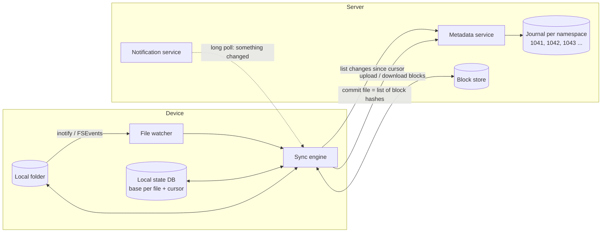
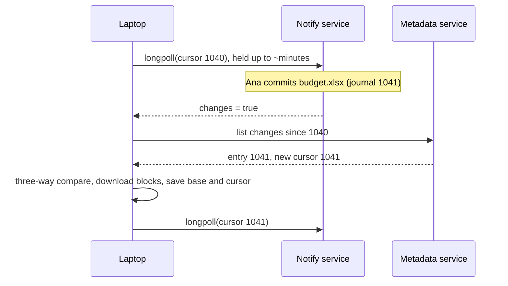

# File Sync and Conflict Resolution

## 1. One-line summary

A sync client (Dropbox, Google Drive, OneDrive) keeps a folder identical on many devices by remembering **what each file looked like the last time this device and the server agreed** (the *base*), pulling the server's **journal of changes since a cursor**, watching the local disk for edits, and for every file comparing **base vs local vs remote** to decide "upload", "download", "nothing to do" or "both sides changed: keep both as a conflicted copy".

💡 **Sync client** = the background program on each device that moves changes between the local folder and the server. **Journal** = an append-only list of changes, each with an increasing number. **Cursor** = a bookmark into that list ("I have seen everything up to entry 1042").

> Infra analogy: this is a Kubernetes controller's reconcile loop, three ways. A controller compares *desired* (spec) with *actual* (status) and acts on the difference. A sync client compares *local*, *remote* and *last-agreed* state, and the third one is what lets it tell **who** made the difference.

---

## 2. The problem it solves

Ben has a laptop, a phone and an office desktop. The naive design is "every 30 seconds, upload files whose modification time is newer than the server's copy, download the rest". It fails in five ways:

| What happens | Naive result |
|---|---|
| Ben edits `budget.xlsx` on the plane (offline), Ana edits it in the office | whichever uploads last silently overwrites the other: **lost work** |
| Ben deletes `old.txt` on the laptop while the desktop is off | the desktop comes back, sees `old.txt` "missing on the server", uploads it again: **zombie file** |
| Ben renames `Photos/` (20,000 files) to `Pictures/` | looks like 20,000 deletes + 20,000 new files: **re-uploads gigabytes** |
| The desktop's clock is 10 minutes slow | its newer edit has an *older* mtime and loses: **wrong winner** |
| A 10,000-file folder, polled every 30 s | listing everything each time costs CPU, battery and server load: **doesn't scale** |

💡 **mtime** = a file's "last modified" timestamp, set from the local computer's clock.

The fix has four parts: a **local state database**, a **server journal with cursors**, a **notification channel**, and a **three-way comparison** per file.

---

## 3. How it works

### 3.1 The moving parts

- **Local state DB** (usually SQLite, 💡 a small database stored in one local file): for every synced file, its path, a stable file ID, the size, hash and server revision **as of the last successful sync**. That is the *base*. It also stores the cursor.
- **Metadata service + journal**: the server's source of truth. Each **namespace** (💡 a user's root folder, or one shared folder, with its own change history) has its own journal of changes with strictly increasing IDs. Keeping order per namespace instead of globally is the same per-key ordering trick as in [message ordering and sequencing](message-ordering-and-sequencing.md).
- **Block store**: file contents, split into blocks and stored by hash, so only changed blocks travel ([chunking and block-level dedup](chunking-and-block-level-dedup.md)).

### 3.2 Pull: "give me changes since cursor X"

| journal ID | namespace | change |
|---|---|---|
| 1041 | ben-root | `budget.xlsx` rev 7 → blocks [a1, b2] |
| 1042 | ben-root | `notes.txt` deleted |
| 1043 | ben-root | file ID 88 moved `/Photos` → `/Pictures` |

The phone's cursor says 1040, so it asks for everything after 1040, applies 1041–1043 in order, and saves cursor 1043 **in the same local transaction** as the applied changes. If it crashes halfway, it re-asks from the last saved cursor; applying an entry twice must be harmless ([idempotency](idempotency-and-delivery-semantics.md): doing it again gives the same result). The cursor is opaque to the client: it may encode several namespaces' positions, and the server may expire very old ones, forcing a full re-list.

Public APIs show the shape: Dropbox's `files/list_folder` returns a `cursor`, `files/list_folder/continue` returns entries after it (deletions come back as entries tagged `deleted`); Google Drive's `changes.getStartPageToken` + `changes.list` work the same way.

### 3.3 Push: knowing *when* to pull

Polling `continue` every few seconds for millions of idle devices is wasteful. Instead the client opens a **long poll** (💡 an HTTP request the server deliberately holds open until something changes or a timeout passes, then answers; the client immediately opens another). Dropbox exposes this as `files/list_folder/longpoll`, which answers only "changes: true/false", never the changes themselves.

Keeping the notification separate from the data means the notify tier only holds cheap idle connections (like a [WebSocket](../technologies/websockets-and-sse.md) fan-out tier, 💡 a WebSocket is a long-lived two-way connection between client and server), and a lost notification costs only latency: the next poll or a periodic safety re-check still finds the change.

### 3.4 The three-way comparison

For every path or file ID, the engine compares three versions: **base** (last agreed, from the local DB), **local** (on disk now), **remote** (server now). A two-way comparison can't work: if local has a file and remote doesn't, was it *created* locally or *deleted* remotely? The base answers that.

| base | local | remote | meaning | action |
|---|---|---|---|---|
| v1 | v1 | v1 | nothing changed | none |
| v1 | **v2** | v1 | I changed it | upload v2 |
| v1 | v1 | **v3** | they changed it | download v3 |
| v1 | **v2** | **v3** | both changed it | **conflict** (3.5) |
| v1 | v2 | v2 | both made the same change | none, update base |
| v1 | *gone* | v1 | I deleted it | delete on server |
| v1 | v1 | *gone* | they deleted it | delete locally |
| v1 | **v2** | *gone* | I edited, they deleted | keep the edit (restore), don't lose data |
| none | new | none | I created it | upload |

"Changed" is decided by **content hash** (with size + mtime + inode as a cheap first filter, 💡 an **inode** is the file's internal ID on a Unix filesystem), not by comparing timestamps.

**Dropbox Nucleus (2020).** Dropbox rewrote its desktop sync engine ("Sync Engine Classic", mostly Python) as **Nucleus**, written in Rust (💡 a compiled systems language with strict compile-time checks on memory and threads), over about four years, and shipped it to all users (Dropbox tech blog, Sujay Jayakar, March 2020). Its core state is exactly three trees: the **Remote Tree** (latest server state), the **Local Tree** (last observed disk state) and the **Synced Tree** (last known fully synced state). The post compares each Synced Tree node to a **merge base** in version control: it is what lets the engine "derive the direction of a change". A **planner** repeatedly emits operations that bring the three trees closer until they converge. A notable design choice: Classic persisted *pending work* ("this file needs uploading"), while Nucleus persists *observations* and derives the work, so a crash never leaves a stale to-do list. A companion post (Isaac Goldberg, April 2020) describes randomized testing (CanopyCheck generates random trees and checks the planner always converges). *Unverified detail: I recall the post saying Nucleus identifies nodes by unique ID rather than by path, which makes a directory move a single change; I could not confirm the exact wording.*

### 3.5 Conflicts: keep both, never pick silently

When both sides changed a file, the server can't merge a spreadsheet or a JPEG. The safe rule is **never lose bytes**: the server keeps the first commit that arrived; the second device's version is saved next to it as a **conflicted copy**, e.g. `budget (Ben's conflicted copy 2026-10-08).xlsx` (Dropbox's documented pattern is the original name plus the computer or user name and the date; exact wording varies by version and language). A human decides.

How the server *detects* "both changed" is a **conditional write**: the client commits "new version of `budget.xlsx`, **based on rev 7**". If the server is already at rev 8, it refuses (or auto-renames). This is **optimistic concurrency** (💡 don't lock up front; check at write time that nobody else changed it, and fail if they did), the same idea as HTTP `If-Match` or a compare-and-set. Dropbox's upload API exposes it as write mode `update(rev)` plus an `autorename` flag.

Why not last-writer-wins? Because it silently discards one person's work and relies on clocks (see [vector clocks and conflict resolution](vector-clocks-and-conflict-resolution.md) for why timestamps lie). Why not merge? For plain text you could do a three-way merge like Git, and for live documents (Google Docs) you edit through [OT or CRDTs](operational-transformation-and-crdts.md) instead of file sync. For arbitrary binary files, a conflicted copy is the honest answer.

### 3.6 Renames and moves

A file watcher typically reports a rename as two events, "`a.txt` gone" and "`b.txt` appeared", or as a rename pair that may arrive split or out of order. The client should:

1. Give every file a **stable ID** that survives renames (the server's file ID, matched locally to the inode or Windows file ID).
2. When "gone + appeared" happen close together with the **same inode** (or same content hash and size), treat it as a **move**: one metadata change, zero bytes uploaded.
3. Move a directory as **one** operation on the directory's ID, not one per descendant. With path-keyed state, renaming a 20,000-file folder rewrites 20,000 rows. With ID-keyed state and parent pointers, it rewrites one.

Hard cases: a move into a folder you don't sync (looks like a delete), a move between two different shared namespaces (it is a delete in one journal and a create in the other), and two devices moving the same folder to different places (the server serializes them, and one move wins).

### 3.7 Deletes need tombstones

If a delete just removes the row, an offline device that still has the file sees "local has it, base has it, remote doesn't" and can't tell "deleted remotely" from "never synced". So the server records a **tombstone** (💡 a marker that says "this existed and was deleted at journal entry N") in the journal, and devices apply it like any other change. Tombstones can be dropped after a retention period, but then any device whose cursor is older than that must do a full re-list and compare against its base. Deleted files usually also go to a trash/version history (Dropbox and Drive keep deleted files for a plan-dependent number of days), which doubles as the undo for "my laptop synced a mass delete".

### 3.8 File watchers and their limits

💡 A **file watcher** is an OS feature that tells a program "something in this folder changed", instead of the program re-scanning the disk.

| OS | API | Limits to know |
|---|---|---|
| Linux | **inotify** | one watch **per directory** (not recursive), capped by `fs.inotify.max_user_watches` (historically 8,192; newer kernels scale the default with RAM; a Linux 6.18 test VM in October 2026 showed 130,054). The kernel event queue (`max_queued_events`, 16,384 here) can overflow, and then you only get `IN_Q_OVERFLOW` |
| macOS | **FSEvents** | per-directory, coalesced ("something in `/x` changed"), but with persistent event IDs so an app can ask "what changed since event N" after a restart |
| Windows | **ReadDirectoryChangesW** | recursive, but a fixed buffer: if it fills, events are lost and you must rescan |

Rules that follow: **watchers are hints, not truth**. On overflow, startup, or wake from sleep, do a **full scan** (walk the tree, compare size + mtime + inode against the local DB, hash only the suspects). **Debounce** (💡 wait for a burst of events to go quiet before acting): wait until a file stops changing for a second or two before hashing it, otherwise you upload half-written files. Dropbox's Linux help pages have long told users to raise `max_user_watches` when the folder is large.

### 3.9 Clock skew: never trust mtimes alone

💡 **Clock skew** = two computers disagree about the current time. Laptops drift, VMs pause, users change the clock.

- Use mtime only as a **"maybe changed" filter** locally, compared against the mtime *this same device* recorded in its DB. Never compare one device's mtime against another's to pick a winner.
- Ordering comes from the **server's journal IDs and revisions**, which one authority assigns. This is the [sequencing](message-ordering-and-sequencing.md) idea: one sequencer beats many clocks.
- Some apps save by writing a temp file and renaming it over the original, and some tools restore old mtimes (`cp -p`, `tar`, `rsync -t`). Content hashes catch those cases, mtimes don't.

### 3.10 Selective sync and on-demand files

**Selective sync** = "don't download `Videos/` to this laptop". The server journal still contains changes for that folder; the client filters them out and remembers which subtrees are excluded. Pitfalls: a local folder created with the same name as an excluded one (Dropbox creates a "selective sync conflict" folder for this), and moves from an excluded folder into an included one (must become a download). **On-demand / placeholder files** (Dropbox online-only files, OneDrive Files On-Demand) go further: every file appears locally as a stub with metadata, and bytes download on first open via an OS file-provider hook.

---

## 4. When to use it

- Any **multi-device** folder sync: consumer cloud drives, enterprise file shares, photo backup with edits, game save sync.
- **Offline-first** apps that must accept edits without a network and reconcile later (notes, field-service apps).
- Config or asset distribution to many machines where you want "pull since cursor" instead of full re-lists (the same pattern as a Kubernetes watch with `resourceVersion`).

## 5. When NOT to use it

| Situation | Why it's a mistake | Use instead |
|---|---|---|
| Real-time co-editing of one document | Conflicted copies every few seconds | [OT / CRDTs](operational-transformation-and-crdts.md) |
| One-way backup | No conflicts are possible; the three-way machinery is overhead | snapshot + incremental upload |
| A shared database file (SQLite, `.pst`) synced while open | Block-level sync of a live DB file corrupts it | the app's own replication |
| Strong consistency between machines (locks, leader election) | Sync is eventually consistent by design | [distributed locks](distributed-locks-and-leases.md), a database |

## 6. Commonly confused with

| | **File sync (this)** | **Backup** | **rsync** | **Real-time collaboration** |
|---|---|---|---|---|
| Direction | two-way, many devices | one-way | one-way per run | many-way |
| Change detection | journal + cursor + watcher | scan or snapshot diff | scan both sides every run | operation stream |
| Conflicts | three-way compare, conflicted copies | none | none, destination overwritten | transformed or merged automatically |
| Unit | file (content as blocks) | file or blocks | file, delta inside ([rsync rolling hash](../../under-the-hood/rsync-rolling-hash.md)) | character or object |
| Keeps a base? | yes, per file | no | no | yes (server version) |

## 7. Common mistakes / misuse

1. **Two-way comparison** (local vs remote only): can't tell a local create from a remote delete, so deleted files come back.
2. **Using mtimes across devices** to choose a winner: clock skew picks the wrong one.
3. **Last-writer-wins** on files: silent data loss. Keep both.
4. **Hard deletes with no tombstones**: offline devices resurrect files.
5. **Path as identity**: every rename becomes delete + upload, and folder moves cost O(files).
6. **Trusting the watcher**: no full-scan fallback, so an overflowed queue means files never sync.
7. **Saving the cursor before applying the changes** (or in a different transaction): a crash skips changes forever.
8. **Uploading while the file is still being written**: debounce, then hash.
9. **Polling the full listing** instead of journal + long poll: O(files) per device per poll.

## 8. Interview cheat-sheet

> "Each device keeps a local SQLite database with, per file, the last version it agreed on with the server: the base. The server keeps a per-namespace journal with increasing IDs, and devices ask 'changes since cursor X', with a long poll that just says 'something changed'. For each file I do a three-way compare of base, local and remote: if only local changed I upload, if only remote changed I download, if both changed it's a conflict. Uploads are conditional on the base revision, so the server detects the race, keeps the first version and saves the other as a conflicted copy, because silently picking one loses work. Identity is a stable file ID, not the path, so a rename is one metadata change. Deletes are journal tombstones so offline devices don't resurrect files. I never compare mtimes across devices, ordering comes from the server's journal, and file watchers are only hints with a full rescan on overflow. Dropbox's 2020 Nucleus rewrite is built on exactly these three trees: remote, local and synced."

## 9. Used in

- [File storage and sync (Dropbox / Google Drive)](../interviews/file-storage-sync/README.md): the client sync loop, the metadata journal and cursor API, long-poll notifications, conflict handling, renames and deletes across devices.
- Related: [chunking and block-level dedup](chunking-and-block-level-dedup.md) (how changed content travels), [resumable and chunked uploads](resumable-and-chunked-uploads.md), [vector clocks and conflict resolution](vector-clocks-and-conflict-resolution.md), [message ordering and sequencing](message-ordering-and-sequencing.md), [OT and CRDTs](operational-transformation-and-crdts.md), [idempotency](idempotency-and-delivery-semantics.md), [Git's object store](../../under-the-hood/git-object-store.md) (merge bases in version control).

**Sources:** Dropbox tech blog, "Rewriting the heart of our sync engine" (Sujay Jayakar, March 2020) and "Testing sync at Dropbox" (Isaac Goldberg, April 2020); Dropbox API v2 docs (`list_folder`, `list_folder/continue`, `list_folder/longpoll`, `WriteMode.update`); Google Drive API docs (`changes.list`); Linux `inotify(7)` man page.
