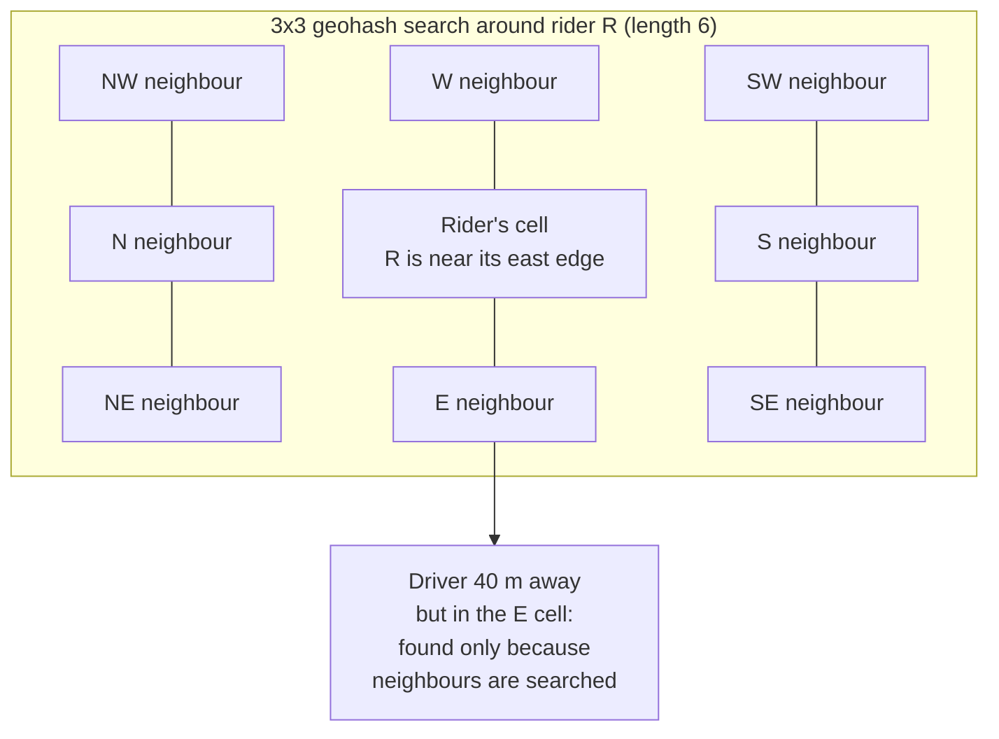

# Geospatial Indexing

## 1. One-line summary

A **geospatial index** turns a 2-D position (latitude, longitude) into something a computer can look up fast, usually a **cell ID** where nearby points share the same or neighbouring cells, so "find drivers within 2 km of me" checks a few cells instead of every driver on the planet.

> 💡 **Latitude / longitude**: the two numbers of a GPS position. Latitude = north/south (−90 to 90), longitude = east/west (−180 to 180). One degree of latitude ≈ 111 km.

---

## 2. The problem it solves

**The pain:** drivers send GPS every 4 s; you store them like this:

```sql
CREATE TABLE driver_location (driver_id BIGINT PRIMARY KEY, lat DOUBLE, lng DOUBLE, updated_at TIMESTAMP);
CREATE INDEX ON driver_location(lat);
CREATE INDEX ON driver_location(lng);

SELECT driver_id FROM driver_location
WHERE lat BETWEEN 12.95 AND 12.99 AND lng BETWEEN 77.57 AND 77.61;   -- ~4 km box
```

Why it's slow: a normal **B-tree index** (the sorted tree a DB uses for `WHERE x BETWEEN a AND b`) sorts on **one** dimension. The `lat` index finds every driver in a **horizontal strip around the whole planet** at that latitude (Bangalore, but also Thailand, Ethiopia, Central America...), then filters by `lng` row by row. With 1M online drivers, the strip may hold tens of thousands of rows for one query.

And it's update-heavy: `1M drivers ÷ 4 s = 250,000 UPDATEs/s`, each also rewriting two indexes. A single Postgres primary does maybe 10–30k writes/s. It melts on writes before reads even matter.

**The fix:** map 2-D to 1-D **cells** that keep nearby things together, then keep the latest position per driver **in memory**, indexed by cell.

---

## 3. How it works

### 3.1 Geohash: interleave bits, prefix = nearby

1. Split longitude range in half: left half → `0`, right half → `1`. Do the same for latitude. Repeat, halving each time.
2. **Interleave** the bits: lng, lat, lng, lat... Each extra pair of bits zooms into one quarter of the current rectangle.
3. Encode every 5 bits as one base-32 character.

Result: central Bangalore starts with `tdr1`, and each extra character zooms in further. Points that share a **longer prefix** are inside the same smaller rectangle, so "nearby" becomes "string starts with `tdr1y`", which a sorted index answers with a range scan.

| Geohash length | Cell size (approx) | Use |
|---|---|---|
| 4 | 39 km × 19.5 km | City |
| 5 | 4.9 km × 4.9 km | Neighbourhood |
| 6 | 1.2 km × 0.61 km | "Drivers near me" |
| 7 | 153 m × 153 m | Street block |

**The edge problem:** two points 10 m apart can sit on opposite sides of a cell border and share **no** prefix (worst case: the equator or the 0° meridian). So you always search the **cell plus its 8 neighbours** (a 3×3 block), then filter by real distance.



### 3.2 Quadtree: split only where it's crowded

A tree where each node is a rectangle; when a node holds more than N points (e.g. 100), it splits into 4 children. Downtown Mumbai ends up with tiny cells, a rural highway with huge ones, so every leaf has a similar number of drivers. Good for uneven density; the cost is that splits/merges move points around as drivers move, so it's usually rebuilt periodically in memory rather than updated per ping.

### 3.3 Uber H3: hexagons

**H3** covers the Earth with **hexagons** at 16 resolutions (res 0 ≈ 4.3M km², res 9 ≈ 0.1 km² with ~174 m edges, res 15 ≈ 1 m²). Why hexagons:

- Every hexagon has **6 neighbours, all at the same distance** from its centre. A square has 4 edge neighbours and 4 corner neighbours that are 1.41× farther, which skews "nearby" searches and surge maps.
- **k-ring** search: `gridDisk(cell, k)` returns all cells within k steps. k=1 → 7 cells, k=2 → 19 cells, k=3 → 37 cells (`1 + 3k(k+1)`). Expanding rings is exactly how matching searches "nearby first, then farther".

Uber uses H3 for surge pricing per cell, supply/demand heatmaps and dispatch.

### 3.4 Google S2: cells on a cube

**S2** projects the Earth onto a cube's 6 faces and orders cells along a **Hilbert curve** (a space-filling line that wiggles through every cell so cells adjacent on the line are adjacent on the map), giving a 64-bit cell ID with 31 levels. Squares-ish cells, excellent for "cover this polygon with cells" (city boundaries, geofences). Used by Google Maps, and historically by Uber and Foursquare.

### 3.5 Redis GEO: geohash inside a sorted set

[Redis](../technologies/redis.md) stores each member's position as a 52-bit geohash used as the **score** in a sorted set (members ordered by a number), so a nearby search is a few range scans over neighbour cells:

```
GEOADD drivers:blr 77.5946 12.9716 driver:42          # O(log N), overwrites old position
GEOSEARCH drivers:blr FROMLONLAT 77.60 12.97 BYRADIUS 2 km ASC COUNT 20 WITHDIST
```

One Redis node handles ~100k+ `GEOADD`/s, and a key per city (`drivers:blr`) is a natural shard. Missing pieces: no TTL per member (stale drivers stay until you `ZREM` them), so keep a separate `driver:42:alive` key with a TTL or filter by last-update time.

### 3.6 PostGIS: durable and complex queries

**PostGIS** is a [PostgreSQL](../technologies/postgresql.md) extension adding geometry types and **GiST/R-tree indexes** (trees of bounding boxes). Use it for things that change slowly and need real geometry: city service-area polygons, airport pickup zones, "is this point inside this geofence", trip history analytics. Not for 250k position updates/s.

### 3.7 Choosing the cell size: worked example

Bangalore at peak: **20,000 online drivers** over ~**700 km²** urban area → `20,000 ÷ 700 ≈ 29 drivers/km²`.

| Cell | Area | Drivers per cell | 3×3 / k=1 search | Verdict |
|---|---|---|---|---|
| Geohash 5 | 24 km² | ~690 | 9 × 690 = **6,200** candidates | Too coarse: ranking 6k drivers per request |
| Geohash 6 | 0.73 km² | ~21 | 9 × 21 = **~190** candidates | Good for "within ~1–2 km" |
| H3 res 8 | 0.74 km² | ~21 | 7 × 21 = **~150** | Good, uniform neighbours |
| Geohash 7 | 0.023 km² | ~0.7 | 9 cells → **~6** | Too fine: often empty, many ring expansions |

Rule: pick the size where one search ring returns **tens to a few hundred** candidates, then expand rings (k=1 → 2 → 3) only if too few are found (suburbs at 2 a.m.).

### 3.8 Update-heavy workloads

Millions of moving points need a different mindset than a DB table:

- **Overwrite latest, don't append.** The index holds one entry per driver; history goes separately to Kafka → cold storage (S3).
- **In memory, sharded by region/city.** 1M drivers × ~100 bytes ≈ 100 MB: fits easily in RAM; the limit is writes/s, so shard by city.
- **Losing it is OK.** Drivers resend in 4 s, so a crashed node is refilled within seconds; no durability needed.
- **Moving across cells** = remove from old cell, add to new. Redis GEO handles it in one `GEOADD`.

---

## 4. When to use it

- "Find the K nearest / everything within R km" with many points: ride matching, food delivery, "restaurants near me".
- Aggregating by area: surge per cell, heatmaps, demand forecasts (cell ID as the key in [stream processing](../technologies/stream-processing.md)).
- Geofencing: is this driver inside the airport zone?

## 5. When NOT to use it (and why it's a mistake)

| Situation | Why |
|---|---|
| A few thousand static points (store locator for 300 shops) | Compute distance to all 300 in memory; an index adds complexity for nothing. |
| PostGIS as the live driver index | 250k writes/s of WAL + GiST updates; one primary can't, and you don't need durability for 4-second-old data. |
| Searching only the rider's own cell | Misses drivers 20 m away across the border. Always include neighbours. |
| One global key/shard for the world | Every write hits one node; shard by city/region. |

---

## 6. Commonly confused with

| | **Geohash** | **Quadtree** | **H3** | **S2** | **PostGIS (R-tree)** |
|---|---|---|---|---|---|
| Cell shape | Rectangles | Rectangles, adaptive | Hexagons | Quads on a cube | Bounding boxes of shapes |
| Fixed grid? | Yes | No, splits by density | Yes | Yes | No (tree of shapes) |
| Neighbours | 8, unequal distance | Tree walk | 6, equal distance | 8 | Index query |
| Strength | Simple, string prefix, Redis GEO | Uneven density | Uniform rings, surge maps | Polygon covering | Durable, complex geometry |
| Weakness | Edge effects, distortion near poles | Rebalancing as points move | Hexagons don't nest perfectly | More complex | Write throughput |

---

## 7. Common mistakes / misuse

1. **Two B-tree indexes on lat and lng** and calling it a geo index.
2. **Forgetting neighbour cells** (edge problem).
3. **Euclidean distance on degrees**: 1° of longitude is 111 km at the equator but ~108 km in Bangalore and ~64 km in Oslo. Use haversine (great-circle distance), or let Redis/H3 compute it.
4. **Cell too big or too small** without doing the drivers-per-cell arithmetic.
5. **Straight-line distance as the ranking**: the closest driver may be across a river. Use the cell search for candidates, then rank by road **ETA**.
6. **No staleness handling**: a driver whose app crashed is still "nearby" forever. Use heartbeats + TTL ([presence](presence-and-heartbeats.md)).
7. **Writing every ping to the primary DB.**

---

## 8. Interview cheat-sheet

> "Plain lat/lng columns don't work because a B-tree indexes one dimension and we'd also be doing 250k updates a second. I'd map positions to cells: geohash or H3. With about 30 drivers per km² in a big city, H3 resolution 8 or geohash 6 gives roughly 20 drivers per cell, so a first ring of 7 or 9 cells returns 150 to 200 candidates, and I expand to more rings if it's sparse. The live index is in memory, latest position only, sharded by city: Redis GEO with GEOADD and GEOSEARCH works, since it's a geohash in a sorted set. Losing it is fine because drivers resend every 4 seconds. Candidates are then ranked by road ETA, not straight-line distance. PostGIS holds the durable stuff like service-area polygons and trip history."

---

## 9. Used in

- [Ride-sharing](../interviews/ride-sharing/README.md): the **live driver location index** (latest position per driver in Redis GEO / H3 cells, sharded by city), **expanding-ring search** for matching, H3 cells as the key for **surge pricing**, and geofences for service areas and airports.
- Related: [Redis](../technologies/redis.md) (GEO commands), [PostgreSQL](../technologies/postgresql.md) (PostGIS), [stream processing](../technologies/stream-processing.md), [sharding and replication](sharding-and-replication.md), [presence and heartbeats](presence-and-heartbeats.md), [back-of-the-envelope](back-of-the-envelope.md).
