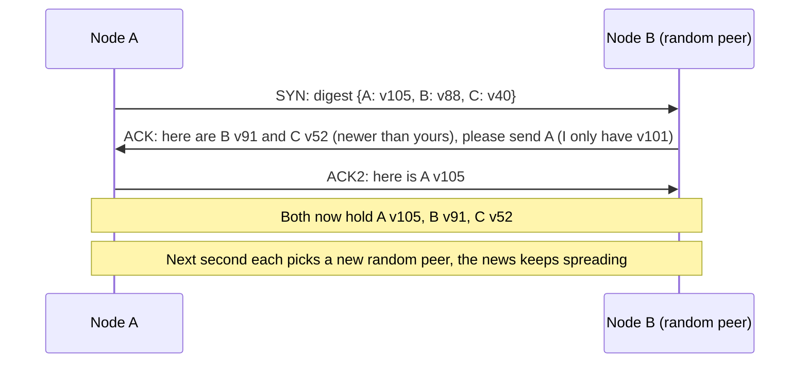
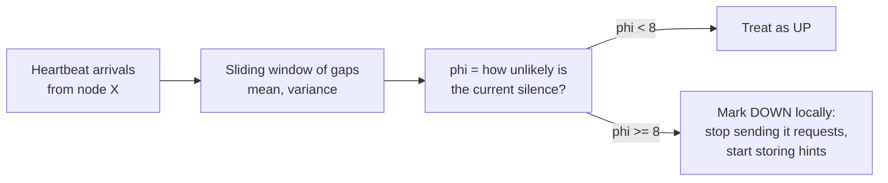

# Gossip Protocols and Failure Detection

## 1. One-line summary

**Gossip** = every node, every second or so, swaps what it knows with a few randomly chosen peers, so news (who joined, who's down, who owns which data) spreads through the whole cluster like a rumour in **O(log n) rounds** with no central server; a **failure detector** turns "I haven't heard from node X for a while" into a decision, ideally as a **suspicion level** (phi accrual) instead of a hard yes/no.

## 2. The problem it solves

In a leaderless cluster (Dynamo, [Cassandra](../technologies/cassandra.md), Riak) every node can coordinate any request (💡 *coordinator*: the node that receives a client request and forwards it to the replicas). To do that, every node needs an up-to-date answer to:

- **Membership**: which nodes exist, and which token ranges (slices of the [hash ring](consistent-hashing.md)) does each own?
- **Liveness**: which of them are up right now, so I don't wait on a dead replica?

Options and their pain:

| Approach | Messages per second (n = 1,000 nodes, every 1 s) | Problem |
|---|---|---|
| Everyone heartbeats everyone | 1,000 × 999 ≈ **1M msgs/s** | Grows as n², melts the network |
| Everyone heartbeats one central monitor | 1,000 msgs/s into **one** box | Single point of failure; that box's view becomes "the truth" |
| Membership in a CP store ([ZooKeeper / etcd](../technologies/zookeeper-etcd.md)) | Small | Fine for tens/hundreds of nodes; adds a dependency and its quorum must stay up |
| **Gossip** | Each node sends ~1 msg/s → **~1,000 msgs/s total**, spread evenly | Eventually consistent view (a few seconds stale) |

💡 *Heartbeat*: a small periodic "I'm alive" message. Same idea as a k8s liveness probe, except here nodes probe each other rather than the kubelet probing a container.

## 3. How it works

### 3.1 One gossip round

Every second, each node:
1. Increments its own **heartbeat counter** (a number that only goes up while the node is alive).
2. Picks 1–3 random peers and sends a **digest**: `{node: (generation, version)}` for every node it knows. (*Generation* = when the node last started, so a restarted node is recognised as new; *version* = how fresh that info is.)
3. The peer replies with anything newer it has and asks for anything it's missing. Both merge, keeping the highest version per node.

Because state is merged by "highest version wins", messages can be lost, duplicated or reordered and everyone still converges.

(This three-message exchange is what Cassandra does. Each node gossips every **1 s** with one random live peer, sometimes also an unreachable one and a **seed** node: a well-known address new nodes contact first.)

### 3.2 Why O(log n): the numbers

Suppose node A learns "node X is leaving". Each round, every node that knows the news tells one random peer. The number of informed nodes roughly **doubles** each round until most know, then a short tail picks up the stragglers.

| Round | Informed (n = 1,000) |
|---|---|
| 0 | 1 |
| 1 | ~2 |
| 2 | ~4 |
| 5 | ~32 |
| 10 | ~600–700 (most) |
| ~15–17 | essentially all |

Math: doubling needs log₂(1,000) ≈ 10 rounds; the tail adds about ln(1,000) ≈ 7 more. So **~17 rounds ≈ 17 s** at 1 round/s for 1,000 nodes, and only ~3 more rounds when the cluster doubles to 2,000. Gossip with 3 peers per round converges faster (log₄ instead of log₂). Cost per node stays constant (~1 message/s), which is why it scales.

### 3.3 From heartbeats to "is it dead?": failure detection

Each node records, for every peer, when that peer's heartbeat counter last increased (seen directly or via gossip). Now decide when to call it dead.

**Fixed timeout** ("dead if silent for 10 s"): simple, but one number can't fit every situation. Too short → a 3 s **GC pause** (💡 the JVM stopping all threads to clean memory) or a busy network link marks healthy nodes dead. Too long → requests keep going to a really dead node.

**Phi accrual failure detector** (Hayashibara et al., used by Cassandra and Akka): instead of yes/no, compute a continuous **suspicion level φ (phi)** from the history of heartbeat arrival gaps.

- Keep the last ~1,000 gaps between heartbeats from node X (say they average **1 s**).
- φ answers: "given how this node normally behaves, how unlikely is this much silence?" Formally φ = −log₁₀(probability that a heartbeat would arrive *later* than now).
- φ = 1 → ~10% chance we're wrong if we call it dead; φ = 2 → 1%; φ = 8 → 0.000001%.
- The application picks the threshold. Cassandra's `phi_convict_threshold` defaults to **8**.

Worked example with the simple exponential model Cassandra uses (P(later than t) = e^(−t/mean)), so φ = t / (mean × ln 10) ≈ 0.434 × t / mean:

| Silence t (mean gap 1 s) | φ | Verdict at threshold 8 |
|---|---|---|
| 1 s | 0.43 | alive |
| 5 s | 2.2 | alive, getting suspicious |
| 10 s | 4.3 | alive |
| 18.4 s | 8.0 | **convicted (marked down)** |

The adaptive part: on a jittery cloud network the observed gaps are larger and vary more, so the same silence produces a *lower* φ. The detector automatically becomes more patient where the network is noisy. Infra analogy: like an alert based on "3 standard deviations from this service's normal latency" instead of a fixed "> 500 ms" threshold.

### 3.4 What happens after "down"

- Each node's verdict is **local**: node A may consider X down while B still sees it up. That's acceptable because "down" only changes routing (skip X, use a [stand-in node with a hint](hinted-handoff-and-sloppy-quorum.md)), not data ownership.
- **Permanent removal** (X's token ranges move to other nodes) is an operator action (`nodetool decommission` / `removenode`), not automatic, precisely because false positives happen.
- When X's heartbeats resume, φ drops and every node marks it up again within a few gossip rounds.

### 3.5 SWIM: the other popular design

**SWIM** (used by HashiCorp **Serf/Consul** and memberlist) separates detection from dissemination: each node pings one random peer per period; if no ack, it asks **k other nodes to ping it indirectly** (rules out "only my link is broken"); if still silent, the peer becomes *suspect* and is declared dead only if it doesn't refute within a timeout. News is piggybacked on the ping messages (gossip). Same O(log n) spread, constant load per node.

### 3.6 What actually gets gossiped (Cassandra example)

Each node owns a small map of **application states**, each with its own version number. Peers only exchange entries whose version is newer than what the other side has, so a round usually carries a few hundred bytes to a few KB.

| State | Example value | Who uses it |
|---|---|---|
| `STATUS` | `NORMAL`, `LEAVING`, `JOINING` | Routing: is this node a valid replica? |
| `TOKENS` | the node's ring positions (vnodes) | Every coordinator builds the ring and preference lists from it |
| `DC` / `RACK` | `us-east-1` / `1a` | Placing replicas on different racks/zones |
| `SCHEMA` | schema version hash | Detecting nodes with a different table definition |
| `LOAD` | `412 GB` | Operators, load-aware tooling |
| heartbeat | (generation, version) | Failure detector input |

## 4. When to use it

- **Large, peer-to-peer clusters** (hundreds to thousands of nodes) where every node needs the membership/ownership map: Cassandra, ScyllaDB, Riak, Dynamo, Redis Cluster (cluster bus gossip), Consul/Serf agents.
- Spreading **soft state** that tolerates being a few seconds stale: load info, schema versions, token ownership.
- When you **don't want a central coordinator** on the critical path.

## 5. When NOT to use it

- **When you need one agreed answer right now** (who is the leader, who holds the lock, is this config committed). Gossip is eventually consistent: two nodes can believe different things for seconds. Use [consensus (Raft)](consensus-and-raft.md) / [etcd](../technologies/zookeeper-etcd.md).
- **Small clusters (< ~20–50 nodes)** with a coordination service already present: a central registry (k8s API + etcd, Consul servers) is simpler to reason about and debug.
- **Fast failover decisions**: gossip + phi detection takes ~10–20 s. If you need sub-second failover, use leases from a CP store or direct health checks from a load balancer.

## 6. Commonly confused with

| | Heartbeats (direct) | Gossip | Consensus (Raft) |
|---|---|---|---|
| Who talks to whom | Node → monitor (or all-to-all) | Each node → few random peers | Leader → followers |
| Load | O(n) on monitor or O(n²) total | O(1) per node | O(n) on leader |
| Agreement | Monitor's view is truth | Eventually converges; views may differ | One agreed log, strong |
| Typical use | k8s node heartbeats, LB health checks | Cassandra membership, Consul LAN | etcd, ZooKeeper, leader election |

Infra analogies: **k8s** nodes heartbeat (Lease objects) to the API server; the node controller marks a node `NotReady` after ~40–50 s (`node-monitor-grace-period`) and evicts pods after a further ~5 min toleration. That's a centralized heartbeat + fixed timeout design. **Consul** runs Serf gossip (SWIM) among agents for membership, but uses Raft among its 3–5 servers for the catalog: gossip for "who's around", consensus for "what's true".

Also not to be confused with [presence and heartbeats](presence-and-heartbeats.md) for *users* (online dots in chat): same heartbeat idea, but clients report to a server with TTL keys, no peer gossip.

## 7. Common mistakes / misuse

- Saying "gossip" without saying **what** is gossiped (membership, heartbeat versions, token ownership) or **how fast** it converges (O(log n) rounds, ~seconds).
- Treating a failure detector verdict as truth. In an asynchronous network you **cannot** distinguish "dead" from "slow" (that's a proven impossibility result, FLP); you can only trade detection speed against false positives.
- Automatically **re-replicating data** as soon as a node looks down. A 30 s GC pause would trigger copying hundreds of GB. Use hints for short outages and require an operator (or a long delay) for permanent removal.
- Setting the phi threshold too low on noisy cloud VMs → nodes flap up/down (cloud deployments often raise Cassandra's threshold to 10–12).
- Forgetting **seed nodes**: a new node needs at least one known address to join the gossip.

## 8. Interview cheat-sheet

> "Membership and failure detection are decentralized: every second each node gossips a digest of heartbeat versions with one to three random peers, and merges by highest version, so news reaches all 1,000 nodes in about log n rounds, ~15–20 seconds, with constant load per node. Each node runs a phi accrual failure detector: it learns the normal gap between a peer's heartbeats and computes a suspicion level instead of using a fixed timeout, and at phi ≥ 8 it marks the peer down locally. 'Down' only changes routing: the coordinator skips that replica and a stand-in stores hints. Permanently removing a node and moving its ranges is an explicit operator action, because a GC pause looks exactly like a crash. Anything that needs one agreed answer, like a leader, goes to Raft, not gossip."

## 9. Used in

- [Distributed key-value store](../interviews/distributed-kv-store/README.md): **cluster membership and failure detection**: gossip spreads ring ownership and heartbeat state, phi accrual decides when a replica is treated as down (which triggers sloppy quorum / hinted handoff).
- [Metrics & monitoring](../interviews/metrics-monitoring/README.md): a clustered Alertmanager **gossips which notifications were sent**, so a page goes out once even when an instance dies.
- 📚 [Case study: Amazon Dynamo → DynamoDB](../../case-studies/amazon-dynamo-to-dynamodb.md): where this technique came from (the 2007 Dynamo paper) and whether DynamoDB kept it.
- Related: [Consistent hashing](consistent-hashing.md) (the ring the gossip describes), [hinted handoff and sloppy quorum](hinted-handoff-and-sloppy-quorum.md), [consensus and Raft](consensus-and-raft.md), [presence and heartbeats](presence-and-heartbeats.md), [service discovery](service-discovery.md), [Cassandra](../technologies/cassandra.md), [ZooKeeper / etcd](../technologies/zookeeper-etcd.md).
