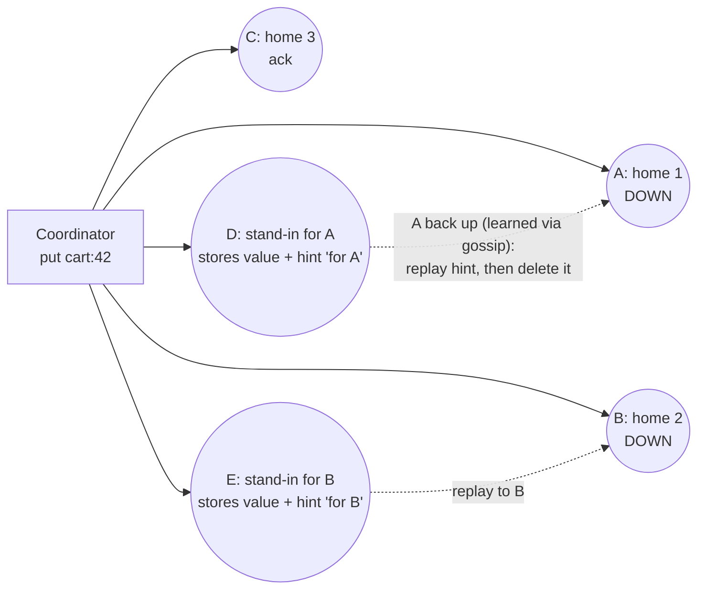

# Hinted Handoff and Sloppy Quorum

## 1. One-line summary

**Sloppy quorum** = when some of a key's usual replicas are down, accept the write anyway on **other healthy nodes** so the client still gets W acknowledgements; **hinted handoff** = those stand-in nodes keep the write with a note ("hint") saying who it really belongs to, and **hand it back** when that node recovers. Writes stay available; consistency guarantees get weaker.

## 2. The problem it solves

In a Dynamo-style store each key lives on its **preference list**: the next N = 3 distinct nodes clockwise on the [hash ring](consistent-hashing.md). With a **strict quorum**, a write needs W acks *from those 3 nodes* (see [CAP and consistency](cap-and-consistency.md) for R + W > N).

Now, a rack loses power and 2 of the 3 home replicas for `cart:42` are down for 20 minutes:

- Strict quorum, W = 2: only 1 home replica answers → **write fails**. For Amazon's shopping cart, "Add to cart" erroring is lost revenue; this is exactly the scenario the 2007 Dynamo paper was written for.
- Even W = 1 fails if all 3 are unreachable from this coordinator (💡 *coordinator*: the node that received the client request and forwards it to replicas).

We'd rather store the write *somewhere* durable now and move it to the right place later. Infra analogy: when your mail server is down, the sender's MTA (mail transfer agent) queues the message and retries delivery for days. Hinted handoff is that queue, inside the database.

## 3. How it works

### 3.1 Strict vs sloppy quorum

- **Strict**: the W acks (and R responses) must come from the key's N home replicas. Down home replicas simply don't count.
- **Sloppy**: walk further along the ring past the first N nodes and use the first **healthy** nodes instead. Writes to stand-ins count toward W.

💡 *Gossip*: nodes periodically swap "who is up" info with random peers, so every node learns within seconds that A is back. *Read repair*: fixing a stale replica when a read notices it disagrees. *Anti-entropy*: a scheduled background comparison of replicas that fixes everything else.

Ring order A → B → C → D → E. The coordinator learns A and B are down from the [failure detector](gossip-and-failure-detection.md), so it sends to C plus the next two healthy nodes, D and E. With W = 2 the write succeeds after any 2 acks.

### 3.2 Hinted handoff step by step

1. The stand-in stores the value in a separate **hints** area (not as normal data it owns), tagged with the target node, e.g. `{target: A, key: cart:42, value, timestamp}`.
2. Gossip reports A is alive again.
3. The stand-in streams its hints for A to A (throttled so A isn't flattened), A applies them like normal writes, and the stand-in deletes the delivered hints.

Real implementations differ in **who** keeps the hint:
- **Dynamo / Riak**: the next healthy node on the ring (true sloppy quorum: the stand-in counts toward W).
- **Cassandra**: the **coordinator** stores hints locally on disk. Hints do **not** count toward the consistency level except for the special `ANY` level, so Cassandra uses hinted handoff for *repair speed* but keeps quorums strict.

### 3.3 Why consistency gets weaker

R + W > N promises overlap only if reads and writes go to **the same N nodes**. Sloppy quorum breaks that.

Worked example (N = 3, W = 2, R = 2, home replicas A, B, C):

| Time | Event | Who has v2 |
|---|---|---|
| t0 | All have v1 | — |
| t1 | A and B are unreachable from the coordinator; write v2 lands on C and stand-in D (W = 2 satisfied) | C, D (hint for A) |
| t2 | A and B are reachable again, but D hasn't replayed its hint yet | C, D |
| t3 | Read with R = 2 hits A and B | **Neither** → returns v1, stale, although R + W = 4 > 3 |
| t4 | D replays hint to A; read repair or [anti-entropy](merkle-trees-and-anti-entropy.md) fixes B | A, C (+ B after repair) |

Worse, during a network **partition** both sides can accept writes for the same key on different stand-ins, creating concurrent versions that must be resolved with LWW or [vector clocks](vector-clocks-and-conflict-resolution.md). Sloppy quorum is explicitly a choice of **A over C**.

### 3.4 Limits: hint windows and storage

Hints are a queue, and queues need bounds:

- **Hint window**: after a node has been down longer than this, stop collecting hints for it. Cassandra's `max_hint_window` defaults to **3 hours**. Beyond that, the node must be fixed by a full **repair** (Merkle-tree anti-entropy), because hints would grow without bound and replaying them would take longer than streaming the data.
- **Hints on the stand-in can be lost**: if the stand-in dies before handing back, those writes exist only on the other replicas. Again, repair is the safety net.
- **Storage and replay time**, worked numbers. Cluster of 10 nodes, RF = 3, 50,000 writes/s of 1 KB. A down node is a replica for ~3/10 of all keys:
  - Writes it misses: 50,000 × 0.3 = 15,000/s.
  - Over a 3 h window: 15,000 × 10,800 s ≈ 162M writes × 1 KB ≈ **162 GB of hints**, ~18 GB on each of the 9 survivors.
  - Replay is throttled (Cassandra `hinted_handoff_throttle`, 1,024 KiB/s per delivery thread by default). At ~1 MB/s, 18 GB takes 18,000 s ≈ **5 hours**. That's why the window isn't "forever" and why long outages go straight to repair or a node rebuild.
- **Hint replay causes a load spike** on the recovering node exactly when it's already busy catching up, so throttle it, just like you'd rate-limit a backlog drain after an outage.

### 3.4.1 Timeline: a 5-minute rolling restart of node A

| Time | What happens |
|---|---|
| 10:00:00 | A is stopped for an upgrade (k8s pod deleted, JVM shutting down) |
| 10:00:00–10:00:20 | Writes sent to A time out; coordinators store hints for the ones A missed |
| ~10:00:20 | Peers' failure detectors convict A (phi ≥ 8); gossip spreads "A down" within seconds |
| 10:00:20–10:05:00 | Every write for A's ranges: the other two replicas ack (QUORUM 2 of 3 still met), and a hint for A is stored |
| 10:05:00 | A starts, replays its own commit log, rejoins gossip |
| ~10:05:05 | Peers mark A up; each node holding hints for A starts streaming them (throttled) |
| ~10:14 | Hints delivered and deleted; A has every write from the outage |
| Meanwhile | Reads that touch A before ~10:14 may get a stale answer from A; QUORUM reads (2 of 3) still return the newest version, and read repair fixes A for those keys |

Numbers: 15,000 missed writes/s × 300 s = 4.5M writes × 1 KB ≈ **4.5 GB of hints**, ~500 MB on each of 9 nodes. At ~1 MB/s per sender that's ~500 s ≈ 8–9 minutes of replay, well inside the 3 h window. This everyday case (restarts, upgrades, a pod rescheduled) is what hinted handoff is built for.

### 3.4.2 The same idea in different systems

| System | Who keeps hints | Counts toward W? | Limits |
|---|---|---|---|
| Dynamo (paper) | Next healthy node on the ring | Yes (sloppy) | Hints handed back when the owner returns |
| Riak | "Fallback" vnodes on other nodes | Yes by default; `PW`/`PR` force primaries (strict) | Handoff runs when the primary returns |
| Cassandra / ScyllaDB | The coordinator, on local disk | No (except `ANY`) | `max_hint_window` 3 h, throttled replay |
| DynamoDB | Managed internally | Hidden from you | You only choose eventual vs strong reads |

### 3.5 How it fits with the other repair mechanisms

| Mechanism | Covers |
|---|---|
| Hinted handoff | Writes missed during **short** outages (minutes to the hint window) |
| Read repair | Stale keys that get **read** |
| Anti-entropy (Merkle trees) | **Everything else**: long outages, lost hints, cold keys, corruption |

See [Merkle trees and anti-entropy](merkle-trees-and-anti-entropy.md) for the full comparison.

## 4. When to use it

- **Write availability matters more than read freshness**: carts, sessions, likes, telemetry, user activity. Accepting the write now and reconciling later beats an error.
- Dynamo-style leaderless stores where nodes routinely restart (rolling upgrades, k8s pod reschedules, spot instances): hints make a 5-minute restart nearly invisible.
- Even with strict quorums (Cassandra's way), hinted handoff is valuable to **shorten** the inconsistency window after a blip.

## 5. When NOT to use it

- **When you need R + W > N to really mean "read sees the latest write"** (uniqueness, balances): sloppy quorum silently breaks the overlap. Use strict quorums, or a [Raft-per-partition](consensus-and-raft.md) design.
- **For long outages**: hints beyond a few hours cost more than a rebuild. Cap the window and rely on repair.
- **Leader-based systems** (Raft, Postgres): a lagging follower catches up from the leader's log; hints are unnecessary.
- **As a substitute for running repair**: hints can be lost, and they expire.

## 6. Commonly confused with

| | Strict quorum | Sloppy quorum | Cassandra `ANY` |
|---|---|---|---|
| Who can ack a write | Only the N home replicas | Home replicas or healthy stand-ins | Anyone, even just a stored hint |
| R + W > N guarantees overlap | Yes | **No** | No |
| Write availability | Fails if > N − W home replicas down | Succeeds while W healthy nodes exist anywhere | Succeeds if the coordinator is alive |
| Typical use | Cassandra QUORUM, Riak with PW/PR | Dynamo, Riak default | Fire-and-forget logging |

Also confused: **hinted handoff vs read repair**. Hinted handoff *pushes* writes the replica missed while down; read repair *pulls* fixes on read for keys that differ. **Hinted handoff vs a retry queue in the client**: same idea, but inside the database, invisible to the app.

## 7. Common mistakes / misuse

- Claiming "W + R > N so reads are always fresh" in a design that also uses sloppy quorum.
- Forgetting **who** stores the hint and what happens if **that** node dies.
- No **hint window**: hints pile up for a node that is never coming back.
- Treating a down node as "handled by hints" for days, then wondering why data is missing: run repair after any outage longer than the window.
- Forgetting the **replay spike**: throttle hint delivery.
- Using `ANY` (or W = 1 with sloppy quorum) for important data: the only copy may be a hint on one node's disk until handoff.
- Not alerting on **hint backlog size** per target node: a growing backlog is the early warning that a node is flapping or a disk is slow, just like consumer lag in [Kafka](../technologies/kafka.md).

## 8. Interview cheat-sheet

> "For write availability I'd use a sloppy quorum: if some of a key's three home replicas are down, the coordinator sends the write to the next healthy nodes on the ring and counts their acks toward W. Each stand-in stores the value with a hint naming the real owner and replays it when gossip says that node is back, then deletes it. The cost is that R + W > N no longer guarantees overlap, because the write may sit on nodes outside the home set, so reads can be stale until handoff, read repair or anti-entropy catches up. I'd cap hints at about three hours, like Cassandra's max_hint_window, because a 3-hour outage at 15k missed writes/s is already ~160 GB of hints, and anything longer goes to a Merkle-tree repair or a node rebuild. If a feature needs a real quorum guarantee, it uses strict quorum or the Raft design."

## 9. Used in

- [Distributed key-value store](../interviews/distributed-kv-store/README.md): **handling temporary failures**: sloppy quorum + hinted handoff on the write path, why it weakens R + W > N, hint windows, and how it hands over to read repair and anti-entropy.
- Related: [gossip and failure detection](gossip-and-failure-detection.md) (deciding a node is down / back), [Merkle trees and anti-entropy](merkle-trees-and-anti-entropy.md), [vector clocks and conflict resolution](vector-clocks-and-conflict-resolution.md), [CAP and consistency](cap-and-consistency.md), [consistent hashing](consistent-hashing.md) (preference lists), [Cassandra](../technologies/cassandra.md), [retries, backoff and DLQ](retries-backoff-and-dlq.md) (queue-and-replay analogy).
