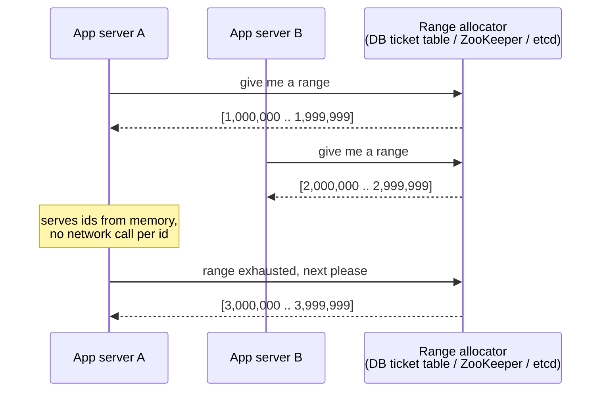
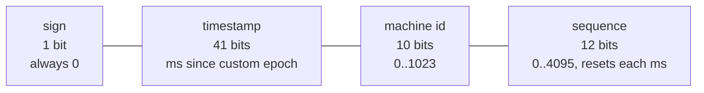

# ID Generation

## 1. One-line summary

How a distributed system hands out **unique identifiers** (row keys, short codes, event ids) without two servers ever producing the same one — and with the right size, ordering and guessability for the job.

## 2. The problem it solves

On a single database, `id BIGSERIAL` / `AUTO_INCREMENT` is all you need: the DB keeps a counter and gives out 1, 2, 3...

The pain starts when you scale out:
- **Many app servers, many DB shards.** Shard A and shard B both auto-increment from 1 → two rows with id 42. Merging, routing or referencing them breaks.
- **One central counter is a bottleneck and a single point of failure.** Every insert needs a round trip to it.
- **Product constraints.** A URL shortener needs ids that are *short* (7 chars), a feed needs ids that are *time-sortable*, a public API might need ids that are *not guessable*.

So the question is never "how do I make a unique number" but "unique **and** short? sortable? unguessable? without coordination?" Each technique below trades these off.

## 3. How it works

### 3.1 Database auto-increment

The DB keeps a counter per table. Simple, compact (8-byte `BIGINT`), ordered.
- **Multi-shard trick:** give each of N shards a different offset and a step of N (shard 1: 1, 4, 7...; shard 2: 2, 5, 8...). Works, but changing N later is painful.
- Downside: one write path through the DB per id; ids leak business volume (see 3.8).

### 3.2 UUID v4 and v7

A **UUID** is a 128-bit (16-byte) id, usually printed as 36 chars: `550e8400-e29b-41d4-a716-446655440000`.
- **v4** = 122 random bits. Generated anywhere with zero coordination (`java.util.UUID.randomUUID()`). Collision chance is negligible (you'd need ~2.7 × 10^18 ids for a 50% chance of one collision). Downside: **random order** — inserting random keys into a B-tree index (Postgres, MySQL InnoDB) scatters writes across pages, causing page splits and poor cache locality.
- **v7** (RFC 9562, 2024) = 48-bit Unix millisecond timestamp + random bits. Still coordination-free, but **roughly time-ordered**, so B-tree inserts go to the "right edge" like auto-increment. Prefer v7 over v4 for primary keys today.
- Both are **too long for a short URL** (22 chars even in Base64).

### 3.3 Hash + truncate (+ collision handling)

`code = base62(MD5(longUrl))[0..7]` — hash the input, keep the first 7 characters.
- Nice property: same long URL → same code (natural deduplication).
- Problem: truncating to 7 chars (~42 bits) makes **collisions real**. By the birthday paradox, with 62^7 ≈ 3.5 × 10^12 possible codes you expect a first collision after roughly √(3.5 × 10^12) ≈ 1.9 million URLs — and we plan for billions.
- **Collision handling:** insert with a unique constraint; on conflict, append a salt/counter to the input (`longUrl + "#1"`), rehash, retry. Each retry is another DB round trip, and retries grow as the table fills.
- SHA-256 instead of MD5 doesn't help — the collision comes from truncation, not from the hash function.

### 3.4 Base62 encoding of a counter

Take a unique integer (from any counter) and write it in base 62 using `[0-9a-zA-Z]`. It's the same idea as converting to hex, just with 62 symbols. URL-safe, no `+` or `/` like Base64.

```
Length 6: 62^6 = 56,800,235,584        ≈ 56.8 billion
Length 7: 62^7 = 3,521,614,606,208     ≈ 3.5 trillion
```

For a URL shortener storing 6 billion URLs over 5 years (see [back-of-the-envelope](back-of-the-envelope.md)), 7 chars gives ~580x headroom. **No collisions by construction** — unique counter in, unique code out.

```java
public class Base62 {
    private static final String ALPHABET =
            "0123456789abcdefghijklmnopqrstuvwxyzABCDEFGHIJKLMNOPQRSTUVWXYZ";

    static String encode(long n) {
        if (n == 0) return "0";
        StringBuilder sb = new StringBuilder();
        while (n > 0) {
            sb.append(ALPHABET.charAt((int) (n % 62)));
            n /= 62;
        }
        return sb.reverse().toString();
    }

    static long decode(String s) {
        long n = 0;
        for (char c : s.toCharArray()) {
            n = n * 62 + ALPHABET.indexOf(c);
        }
        return n;
    }

    public static void main(String[] args) {
        long[] samples = {0L, 61L, 62L, 125L, 1_000_000L, 56_800_235_584L, 3_521_614_606_207L};
        for (long id : samples) {
            String code = encode(id);
            System.out.println(id + " -> " + code + " -> " + decode(code));
        }
    }
}
```

Output: `1000000 -> 4c92`, `56800235584 -> 1000000` (first 7-char code), `3521614606207 -> ZZZZZZZ` (last 7-char code). To always get exactly 7 chars, start the counter at 62^6 or left-pad with `0`.

The counter itself can come from any of the next three sources.

### 3.5 Redis INCR counter

`INCR url:counter` is atomic and fast (~0.5 ms, ~100K ops/s on one node). Easy and good enough for many systems.
- Risks: it's a single point of failure; with async replication a failover can **lose recent increments and hand out duplicates** unless you persist (AOF `fsync always`) or add a safety jump after failover. See [Redis](../technologies/redis.md).

### 3.6 Range / batch allocation (ticket server, ZooKeeper, etcd)

Instead of asking for one id per request, each app server **leases a block** of ids (say 1,000,000 at a time) and hands them out from memory.



- **DB ticket server** (Flickr's approach): a table with one row; `UPDATE tickets SET next = next + 1000000 RETURNING next` inside a transaction.
- **ZooKeeper / etcd**: a compare-and-set on a key, which is linearizable (strongly consistent) — see [ZooKeeper / etcd](../technologies/zookeeper-etcd.md).
- The allocator is hit once per million ids, so it's never a bottleneck, and a brief outage doesn't stop servers that still have ids left.
- Cost: if a server crashes, the rest of its range is **lost** (gaps). That's fine — ids need to be unique, not dense.

### 3.7 Twitter Snowflake

A 64-bit id built from the clock + machine id + per-ms counter. No coordination at runtime; fits in a Java `long`; roughly time-sorted.



```
| 1 bit | 41 bits                      | 10 bits    | 12 bits   |
|   0   | ms since custom epoch        | machine id | sequence  |
```

- 41 bits of ms: 2^41 ms ≈ 2.2 × 10^12 ms ≈ **69.7 years** from your chosen epoch.
- 10 bits: 2^10 = **1,024 machines** (often split 5 bits datacenter + 5 bits worker).
- 12 bits: 2^12 = **4,096 ids per ms per machine** → ~4M ids/s per machine.
- Machine ids must be unique — usually assigned via ZooKeeper/etcd or from the k8s StatefulSet ordinal.
- Encoded in Base62, a Snowflake id is ~11 chars — too long for a "short" URL, great for tweet/order/event ids.

### 3.8 Security: predictability and enumeration

Sequential ids (auto-increment, Base62 of a counter) are **guessable**:
- Anyone can walk `/abc123`, `/abc124`, ... and scrape every short link — including "private" ones people shared with a colleague.
- They leak business metrics ("my order id went up by 50,000 this week → they get ~7K orders/day").

Mitigations: don't rely on id secrecy for authorization (always check permissions); rate-limit lookups; or make the code non-sequential — e.g., run the counter through a reversible bit-shuffle / block cipher (like Feistel or Hashids-style scrambling) before Base62, or use random codes with a uniqueness check.

### 3.9 Clock skew

Any time-based id (Snowflake, UUID v7) depends on the machine clock. NTP can move the clock **backwards**; then a Snowflake generator could re-emit an already-used `(timestamp, sequence)` → duplicate ids.
Standard handling: remember the last timestamp; if `now < last`, wait until the clock catches up (small skew) or refuse to generate and alert (large skew). Also, ids from different machines are only *roughly* ordered — two machines' clocks differ by a few ms, so never use Snowflake ids for strict global ordering.

## 4. When to use it (which technique)

| Need | Pick |
|---|---|
| Single DB, internal ids | Auto-increment / `BIGSERIAL` |
| Ids generated anywhere, no coordination, B-tree friendly | UUID v7 |
| Short, collision-free codes (URL shortener) | Counter (range allocation or Redis) + Base62 |
| Dedup same input → same code | Hash + truncate with collision retry |
| 64-bit, time-sortable, high throughput across many services | Snowflake |

## 5. When NOT to use it

- **Don't build Snowflake/range allocation when one database is enough.** At 40 writes/s, `BIGSERIAL` + Base62 works. Extra infrastructure (ZooKeeper, machine-id assignment, clock handling) is a mistake because every moving part is something to page you at 3 a.m.
- **Don't use UUID v4 as a clustered primary key on a large, write-heavy B-tree table** — random inserts hurt write throughput and cache hit rate.
- **Don't use hash+truncate when you expect billions of entries** — collision retries become frequent and every write needs a uniqueness check.
- **Don't expose sequential ids** where enumeration matters (private links, user ids in public URLs).

## 6. Commonly confused with

| Technique | Size | Coordination | Sorted by time? | Collisions? | Guessable? |
|---|---|---|---|---|---|
| Auto-increment | 8 B | Central DB | Yes | No | Yes |
| UUID v4 | 16 B | None | No | Practically never | No |
| UUID v7 | 16 B | None | Roughly | Practically never | Partly (timestamp visible) |
| Hash + truncate (7 chars) | 7 chars | None (but DB uniqueness check) | No | **Yes, must handle** | No (but deterministic) |
| Counter + Base62 | 7 chars | Counter source | Yes | No | **Yes** unless scrambled |
| Redis INCR | 8 B | Redis | Yes | Only after unsafe failover | Yes |
| Range allocation | 8 B | Rare (once per range) | Per-server only | No | Yes |
| Snowflake | 8 B | Machine id only | Roughly | Only with clock skew bug | Partly |

Also confused: **Base62 vs Base64** — Base64 includes `+`, `/`, `=`, which need escaping in URLs. **Encoding vs hashing** — Base62 is reversible (decode gives the number back); a hash is one-way.

## 7. Common mistakes / misuse

- Saying "I'll use MD5 of the URL" without addressing **collisions after truncation**.
- Using a single Redis/DB counter with **no plan for its failure**.
- Forgetting **clock skew** when proposing Snowflake.
- Proposing UUIDs for short codes (36 chars is not short).
- Assuming ids must be **dense** (no gaps). They only need to be unique; range allocation is allowed to waste ids.
- Ignoring **enumeration** for a public-facing id.

## 8. Interview cheat-sheet

> "I need ~6 billion unique short codes, and 62^7 is about 3.5 trillion, so 7 Base62 characters is plenty. I'll generate a unique integer and Base62-encode it, which is collision-free by construction, unlike hashing and truncating. To avoid a central bottleneck, each app server leases a range of a million ids from a ticket table or etcd and serves them from memory; a crash just leaves a gap. Since sequential codes are guessable, I'd scramble the counter with a reversible permutation before encoding, and never rely on code secrecy for access control. If I needed sortable 64-bit ids across many services, I'd use Snowflake and handle clock going backwards."

## 9. Used in

- [URL Shortener](../interviews/url-shortener/README.md) — generating the short code: hash vs counter + Base62, range allocation for multiple app servers, key length (62^7), and enumeration concerns.
- Related: [Redis](../technologies/redis.md) (INCR), [ZooKeeper / etcd](../technologies/zookeeper-etcd.md) (range leasing, machine ids), [PostgreSQL](../technologies/postgresql.md) (sequences, ticket table, UUID index behaviour), [CAP and consistency](cap-and-consistency.md) (why uniqueness needs strong consistency).
