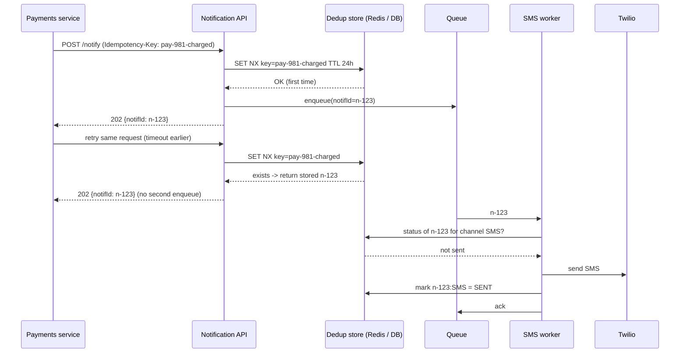

# Idempotency and Delivery Semantics

## 1. One-line summary

**Delivery semantics** describe how many times a message may be processed when things crash: **at-most-once** (maybe zero), **at-least-once** (maybe twice), or **"exactly-once"**. **Idempotency** means doing the same operation twice has the same effect as doing it once, which is how real systems turn at-least-once into **effectively-once**.

> 💡 **Queue / ack:** a queue holds messages between a sender and a worker. When a worker finishes a message it sends an *ack* (acknowledgement: "done, you can delete it"); without an ack the queue assumes the worker failed and hands the message to someone else.

---

## 2. The problem it solves

**The pain:** an SMS worker takes a message off the queue, calls Twilio (an SMS-sending service), Twilio sends the OTP (one-time password, the login code you get by text), and then the worker pod is OOM-killed (out of memory) **before it acks**. The queue's visibility timeout (the period a taken message is hidden from other workers; when it runs out the message reappears) expires and another worker sends the OTP **again**. Or: the Payments service calls `POST /notify` with "You were charged $500", gets a timeout, retries, and the user gets two scary messages.

Every retry (client retry, queue redelivery, provider webhook resend; a webhook is an HTTP call the provider makes to your server to report an event, such as "SMS delivered") can create a duplicate. You can't remove retries, because without them you lose messages.

**The fix:** keep the retries (at-least-once), and make the processing **idempotent** with an **idempotency key**: a unique ID for "this logical notification". Before doing the side effect, check whether that key was already handled.

> Infra analogy: `kubectl apply -f deploy.yaml` is idempotent (running it again changes nothing): run it 5 times, you get one Deployment. `kubectl create` is not: the second run fails or, for a non-unique resource, creates a duplicate. You want every consumer to behave like `apply`.

---

## 3. How it works

### 3.1 The three semantics

| Semantics | How you get it | Failure result | Use for |
|---|---|---|---|
| **At-most-once** | Ack/commit **before** processing; never retry | Crash = message **lost** | Metrics samples, "user is typing" |
| **At-least-once** | Ack/commit **after** processing; retry on failure | Crash = message **processed twice** | Almost everything (the default) |
| **Exactly-once** | Not achievable end to end across independent systems | n/a | Marketing term; see below |
| **Effectively-once** | At-least-once **+ idempotent processing** | Duplicates arrive but have no extra effect | Payments, notifications, counters |

Why exactly-once is impossible across a network boundary: a sender that gets **no response** cannot know whether the receiver (a) never got the request, (b) processed it and the reply was lost. It must either retry (risk duplicate) or not (risk loss). This is the **Two Generals problem** (two armies can never be sure a messenger got through). Kafka's "exactly-once" is real but only **inside Kafka** (read from Kafka, write to Kafka, in one transaction). See [Kafka](../technologies/kafka.md).

### 3.2 Idempotency keys: end-to-end flow



Two layers of dedup:

1. **API layer:** the caller supplies `Idempotency-Key` (or the API derives one, e.g. `hash(source, eventId, userId, template)`). Same key → return the original response, don't enqueue again.
2. **Worker layer:** key per `(notificationId, channel)`. Before calling the provider, check "already sent?"; after success, record it. Handles queue redelivery.

### 3.3 Dedup storage and TTL

> 💡 **Dedup** = deduplication, dropping repeats. **TTL** (time to live) = how long a stored key is kept before it auto-deletes. **Redis** is an in-memory key-value store; **NX** below means "only if the key doesn't exist yet", which makes the claim atomic (one winner).

| Store | How | Notes |
|---|---|---|
| [Redis](../technologies/redis.md) | `SET key value NX EX 86400` (set only if absent, expire in 24 h) | Fast, atomic. Lost on failover (switching to a replica when the primary dies) without persistence, so a small duplicate risk remains. |
| [PostgreSQL](../technologies/postgresql.md) | `INSERT INTO sent(idem_key) ... ON CONFLICT DO NOTHING` (unique index) | Durable, can share a transaction with the business write. Purge old rows by partition (drop a whole old table slice at once instead of deleting row by row). |
| [Cassandra](../technologies/cassandra.md) / DynamoDB | Conditional write (`IF NOT EXISTS`) with TTL | Scales horizontally, LWT (lightweight transaction, a conditional write) costs a Paxos round (a multi-step agreement between replicas, so it's slower). |

A worker-side claim in Postgres, using states so a crashed attempt can be retried later:

```sql
-- Claim: succeeds for exactly one worker; others get 0 rows.
INSERT INTO deliveries (notification_id, channel, state, lease_until)
VALUES ('n-123', 'SMS', 'IN_PROGRESS', now() + interval '2 minutes')
ON CONFLICT (notification_id, channel) DO UPDATE
   SET state = 'IN_PROGRESS', lease_until = EXCLUDED.lease_until
 WHERE deliveries.state = 'FAILED_RETRYABLE'
    OR (deliveries.state = 'IN_PROGRESS' AND deliveries.lease_until < now())
RETURNING notification_id;
-- After the provider call: UPDATE ... SET state = 'SENT', provider_msg_id = '...'
```

**Sizing the TTL:** it must exceed the longest window a duplicate can arrive in: client retry window + max queue retry time + DLQ (dead-letter queue, where messages that keep failing are parked) redrive (moving them back for another try). If retries run for up to 6 hours, a 24 h TTL is safe. Storage: 50M notifications/day × ~100 bytes per key = **5 GB per day** of keys, which fits in a Redis cluster with a 24 h TTL.

### 3.4 The unavoidable gap: third-party side effects

The worker does: `check key → call Twilio → record key → ack`. If it crashes **after Twilio accepted but before recording**, the retry sends again. No local trick closes this gap, because Twilio's state is outside your transaction.

Ways to shrink it:

- **Pass your key to the provider** when it supports one (Stripe's `Idempotency-Key` header is the classic example; some email/SMS APIs accept a client reference you can dedupe on, and FCM/APNs (Google's and Apple's push services) accept a collapse ID so a duplicate push **replaces** the earlier one in the notification tray).
- **Mark "IN_PROGRESS" before calling**, and on retry of an IN_PROGRESS record, query the provider's API by your reference before re-sending.
- **Make the message itself harmless to duplicate**: an OTP retry should resend the **same** code, not generate a new one, so two SMS don't confuse the user.

The honest interview answer: "exactly-once SMS across a third-party boundary is impossible; we get at-least-once with dedup that makes duplicates rare (only on a crash in a ~100 ms window), and we design content so a duplicate is harmless."

---

## 4. When to use it

- Any consumer of a queue or [Kafka](../technologies/kafka.md) topic (they all redeliver).
- Any API that clients retry on timeout: payments, order creation, `POST /notify`.
- Webhook receivers (providers resend delivery receipts: callbacks saying "your message was delivered").
- State updates: prefer "set status = DELIVERED" over "increment delivered_count".

## 5. When NOT to use it (and why it's a mistake)

| Situation | Why |
|---|---|
| Reads (`GET`) | Already idempotent; dedup tables add cost for nothing. |
| Truly lossy-OK data (telemetry samples, typing indicators) | At-most-once is cheaper; a duplicate or loss doesn't matter. |
| Using a dedup table with **infinite** TTL "to be safe" | Unbounded growth; size TTL from the retry window. |
| Using a random UUID generated **on each retry** as the key | Every retry gets a new key, so nothing is deduped. The key must be generated once, by the originator, and reused on retries. |

---

## 6. Commonly confused with

| | **Idempotency** | **Deduplication** | **Exactly-once** | **Ordering** |
|---|---|---|---|---|
| Meaning | Op applied twice = once | Detect and drop repeated messages | Each message processed once, guaranteed | Messages processed in send order |
| Who provides it | Your code / API design | Broker (SQS FIFO, AWS's ordered queue, with a 5-min window) or your table | Only within one system (Kafka transactions) | Partition / FIFO group |
| Relationship | Goal | One technique to achieve idempotency | What people want; idempotency is how you approximate it | Separate concern: dedup doesn't fix reordering |

Also: **HTTP method idempotency.** `PUT` (replace a resource) and `DELETE` are idempotent by spec, `POST` is not, which is why `POST` APIs add an `Idempotency-Key` header.

---

## 7. Common mistakes / misuse

1. **Claiming "Kafka gives exactly-once" for SMS.** Kafka's guarantee stops at Kafka's boundary.
2. **Check-then-act without atomicity:** `if (!exists(key)) { send(); save(key); }` from two workers at once sends twice. Use `SET NX`, a unique constraint (the DB rejects a duplicate), or a conditional write as the claim.
3. **Recording the key before the side effect and never clearing it on failure**, so a failed send is never retried (now you have at-most-once). Use states: `IN_PROGRESS` with a lease timeout, then `SENT` / `FAILED`.
4. **Key too broad:** `userId + template` blocks a legit second "order shipped" for a different order. Include the business event ID.
5. **Key too narrow:** including a timestamp, so retries differ.
6. **Non-idempotent counters** (`delivered += 1` per webhook) double-count when webhooks repeat.
7. **TTL shorter than the retry window**, so a late redelivery after DLQ redrive sends again.

---

## 8. Interview cheat-sheet

> "Queues and webhooks are at-least-once, so duplicates will happen; true exactly-once delivery of an SMS isn't possible because we can't make Twilio part of our transaction. So I make processing idempotent. Callers send an idempotency key such as the payment event ID, and the API claims it atomically with Redis SET NX and a 24-hour TTL, returning the original notification ID on a retry. Workers dedupe per notification and channel before calling the provider and record SENT after success. The only remaining gap is a crash between the provider accepting and us recording it, which is rare, and we make it harmless by resending the same OTP code and using collapse IDs for push. Status updates from webhooks are 'set to furthest state', not increments."

---

## 9. Used in

- [Notification system](../interviews/notification-system/README.md): **idempotency keys on the Notification API**, per-channel dedup in workers to survive queue redelivery, idempotent handling of provider delivery webhooks, and the "why no exactly-once SMS" discussion.
- [Chat system](../interviews/chat-system/README.md): **client-generated message IDs** so a resend after a lost ack is stored once, at-least-once delivery to devices with dedup by seq, and the sent ✓ / delivered ✓✓ / read ack states.
- [Ride-sharing](../interviews/ride-sharing/README.md): **idempotency keys for ride requests** (a double-tap creates one trip) and for each **payment saga step** (authorize, capture, payout) so retries after timeouts never double-charge; idempotent consumers of trip events ([sagas](sagas-and-distributed-transactions.md)).
- [LLD: Design Splitwise](../../LLD/interviews/splitwise/README.md): **idempotency key on `addExpense`** so a client retry after a timeout doesn't record the same dinner twice in the ledger.
- [LLD: Design a Movie Ticket Booking System](../../LLD/interviews/movie-booking/README.md): **idempotent `confirmBooking(holdId, paymentRef)`** so a retried confirm after a timeout returns the same booking and never charges or books twice.
- [API gateway](../interviews/api-gateway/README.md): **which requests the gateway may retry**: only idempotent methods or POSTs carrying an `Idempotency-Key`, passed through to backends ([resilience patterns](resilience-patterns.md)).
- [Web crawler](../interviews/web-crawler/README.md): **re-fetching after a crash is harmless** (same URL, same content hash), which is why in-flight fetches can simply be redone instead of tracked exactly once.
- [Video streaming](../interviews/video-streaming/README.md): **idempotent transcoding tasks** with deterministic output paths, so a crashed encoder's chunk can simply be retried.
- [LLD: Vending Machine](../../LLD/interviews/vending-machine/README.md): **duplicate UPI callbacks** ignored by order id, and a late success after cancel refunded exactly once.
- [Collaborative editor](../interviews/collaborative-editor/README.md): client-generated **op IDs** so ops resent after a reconnect or owner failover are acknowledged, not applied twice.
- [Payment system](../interviews/payment-system/README.md): **idempotency keys in three layers** (our API, to the PSP, webhook event IDs), exactly-once *effect* via outbox + idempotent consumers, and never retrying a timed-out charge with a new key.
- [LLD: ATM / Digital Wallet](../../LLD/interviews/digital-wallet/README.md): idempotent transfers in code, including 16 concurrent duplicates producing one transfer.
- [Distributed message queue](../interviews/distributed-message-queue/README.md): commit timing → at-least/at-most-once, the idempotent producer (producer ID + sequence numbers), transactions, and why end-to-end exactly-once needs idempotent sinks (L5 §3.4).
- [LLD: Pub-Sub Broker](../../LLD/interviews/pub-sub-broker/README.md): at-most-once vs at-least-once with ack deadlines in code, and an idempotent consumer wrapper.
- [Distributed job scheduler](../interviews/distributed-job-scheduler/README.md): a run ID passed to every target so retries and zombie workers don't repeat side effects.
- Related: [Kafka](../technologies/kafka.md) (consumer idempotency, Kafka transactions), [message queues](../technologies/message-queues.md) (visibility timeout, redelivery), [retries, backoff and DLQ](retries-backoff-and-dlq.md), [push/email/SMS providers](../technologies/push-email-sms-providers.md), [Redis](../technologies/redis.md).
