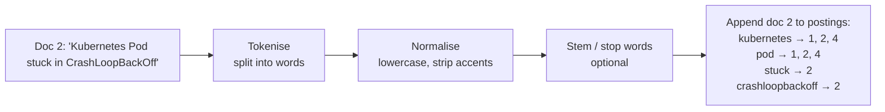
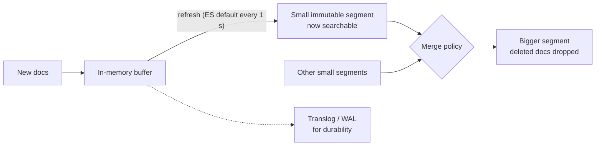

# Inverted Index

## 1. One-line summary

An **inverted index** maps each **term** (a normalised word) to the sorted list of documents that contain it (its **postings list**), so a search for `kubernetes restart` becomes "fetch two lists and intersect them" instead of reading every document; it is the core data structure inside Lucene, [Elasticsearch](../technologies/elasticsearch.md) and every full-text search engine.

💡 It's "inverted" because a normal (forward) index goes document → words in it; this one goes word → documents. It's the index at the back of a book: "Kafka … pages 12, 48, 103".

---

## 2. The problem it solves

**The pain:** you have 10 million support articles and a user searches `restart pod`. Options without an inverted index:

- **Scan everything** (`grep`): read 10M documents × ~5 KB = **50 GB** per query. Even at 2 GB/s from memory that's 25 s.
- **SQL `LIKE '%restart%'`**: a normal B-tree index can't help with a leading `%`, so it's the same full scan. It also misses "Restarting", "restarted", "RESTART".

**The fix:** do the work **at write time**. When a document arrives, split it into terms, normalise them, and append its ID to each term's postings list. A query then only reads the postings of the few terms it mentions.

> Infra analogy: this is exactly how log search works. Elasticsearch/OpenSearch (ELK) index every log line's words; Loki deliberately indexes only labels and greps the chunks, which is cheaper to store but slower for free-text queries.

---

## 3. How it works



### 3.1 Analysis: from text to terms

The **analyzer** turns raw text into terms. The *same* analyzer must run on documents (at index time) and on queries (at search time), or they won't match.

| Step | What it does | Example |
|---|---|---|
| **Tokenise** | split text into tokens (words) | `"Pod-restart policy"` → `Pod`, `restart`, `policy` |
| **Normalise** | lowercase, remove accents, unify Unicode forms | `Café` → `cafe` |
| **Stop words** (optional) | drop very common words | drop `the`, `in`, `a` |
| **Stem** (optional) | cut words to a root form | `restarting`, `restarted` → `restart` |
| **Synonyms** (optional) | map equivalent terms | `k8s` → `kubernetes` |

💡 **Stemming** is a rule-based chop (the Porter stemmer turns `connections` into `connect`); it's crude (`university` and `universe` both become `univers`). **Lemmatisation** uses a dictionary to find the real base word and is slower. Modern engines often drop stop-word removal because scoring (3.4) already gives common words little weight.

### 3.2 Postings lists and compression

Each postings list is **sorted by document ID**. Real engines also store, per document, how often the term appears (**term frequency**) and where (**positions**, needed for phrase queries like `"restart pod"`).

Sorted IDs compress very well with **delta encoding** (store the gap to the previous ID instead of the ID) plus **varint** encoding (a variable-length integer: 7 bits of number per byte, the 8th bit says "another byte follows", so small numbers take 1 byte):

```
docIds:  1000, 1003, 1010, 1200, 70000, 70001
gaps:    1000,    3,    7,  190, 68800,     1
bytes:      2  +  1  +  1  +  2  +   3  +   1  = 10 bytes   (vs 6 × 4 = 24 as plain ints)
```

At scale: a common term in 1M of 10M documents has an average gap of 10M / 1M = 10, which fits in one byte:

```
plain ints:      1M × 4 B = 4 MB
delta + varint:  1M × 1 B ≈ 1 MB    (4× smaller, and smaller lists = fewer cache misses)
```

Lucene uses the same idea but packs gaps in blocks of 128 with **bit-packing** (every gap in the block uses the same minimal number of bits), which decodes faster than byte-by-byte varints.

### 3.3 Boolean queries: AND, OR

- **AND** (`kubernetes AND restart`): **intersect** the two sorted lists with two pointers, always advancing the one with the smaller ID. O(a + b). Start from the **shortest** list; with **skip pointers** (Lucene stores skip data every so many entries) you can jump ahead in the long list instead of walking it.
- **OR**: **merge** the sorted lists (union), like the merge step of merge sort.
- **NOT**: walk the first list and skip IDs present in the second.

A runnable sketch (Java 21, `java TinyIndex.java`):

```java
import java.io.ByteArrayOutputStream;
import java.util.*;

public class TinyIndex {
    private final Map<String, List<Integer>> postings = new TreeMap<>();

    // Analysis: lowercase, split on non-letters/digits. (Real analyzers also stem, drop stop words, ...)
    static List<String> analyze(String text) {
        List<String> terms = new ArrayList<>();
        for (String t : text.toLowerCase(Locale.ROOT).split("[^\\p{L}\\p{N}]+"))
            if (!t.isEmpty()) terms.add(t);
        return terms;
    }

    void add(int docId, String text) {             // docIds must arrive in increasing order
        for (String term : new LinkedHashSet<>(analyze(text))) {
            postings.computeIfAbsent(term, k -> new ArrayList<>()).add(docId);
        }
    }

    // AND query: walk two sorted lists with two pointers. O(len(a) + len(b)).
    static List<Integer> intersect(List<Integer> a, List<Integer> b) {
        List<Integer> out = new ArrayList<>();
        int i = 0, j = 0;
        while (i < a.size() && j < b.size()) {
            int cmp = Integer.compare(a.get(i), b.get(j));
            if (cmp == 0) { out.add(a.get(i)); i++; j++; }
            else if (cmp < 0) i++;
            else j++;
        }
        return out;
    }

    // Compression: store gaps between docIds, each as a varint (7 bits per byte, high bit = "more bytes follow").
    static byte[] deltaVarint(List<Integer> docIds) {
        ByteArrayOutputStream out = new ByteArrayOutputStream();
        int prev = 0;
        for (int id : docIds) {
            int gap = id - prev;
            prev = id;
            while (gap >= 0x80) { out.write((gap & 0x7F) | 0x80); gap >>>= 7; }
            out.write(gap);
        }
        return out.toByteArray();
    }

    public static void main(String[] args) {
        TinyIndex idx = new TinyIndex();
        idx.add(1, "How to restart a Kubernetes pod");
        idx.add(2, "Kubernetes pod stuck in CrashLoopBackOff");
        idx.add(3, "Restart Java service without downtime");
        idx.add(4, "Pod restart policy in Kubernetes");
        System.out.println("kubernetes -> " + idx.postings.get("kubernetes"));
        System.out.println("restart    -> " + idx.postings.get("restart"));
        System.out.println("kubernetes AND restart -> "
                + intersect(idx.postings.get("kubernetes"), idx.postings.get("restart")));

        List<Integer> big = List.of(1000, 1003, 1010, 1200, 70000, 70001);
        byte[] enc = deltaVarint(big);
        System.out.println("docIds " + big + ": raw " + big.size() * 4 + " bytes, delta+varint " + enc.length + " bytes");
    }
}
```

Output:

```
kubernetes -> [1, 2, 4]
restart    -> [1, 3, 4]
kubernetes AND restart -> [1, 4]
docIds [1000, 1003, 1010, 1200, 70000, 70001]: raw 24 bytes, delta+varint 10 bytes
```

### 3.4 Ranking: BM25 in one paragraph

Matching gives you a set; users want the best first. **BM25** (the default similarity in Lucene and Elasticsearch since ES 5.0) scores a document higher when the query term appears **often in it** (term frequency, with diminishing returns), when the term is **rare across all documents** (IDF, inverse document frequency), and when the document is **short** (a match in a title beats one in a 50-page manual). The IDF part, with `N` documents and `n` containing the term:

```
idf = ln(1 + (N − n + 0.5) / (n + 0.5))

N = 1,000,000
rare term,   n = 1,000:    ln(1 + 999,000.5 / 1,000.5)   = ln(999.5) ≈ 6.9
common term, n = 500,000:  ln(1 + 500,000.5 / 500,000.5) = ln(2)     ≈ 0.69
```

So a match on a rare word counts about 10× more than a match on a common one. Two knobs, `k1` (default 1.2, how fast extra repetitions stop helping) and `b` (default 0.75, how much length matters), are rarely changed.

### 3.5 Search-as-you-type: prefix and edge n-gram indexing

A normal index only matches **whole terms**: `kube` finds nothing. Two fixes:

- **Prefix query at search time**: walk the sorted term dictionary from `kube` to the end of the `kube…` range and OR together all matching postings. Flexible, but a 1–2 letter prefix can expand to thousands of terms (slow, and engines cap it).
- **Edge n-grams at index time**: index every leading slice of each word: `kubernetes` → `k`, `ku`, `kub`, `kube`, … up to a max length (say 10). Now `kube` is an ordinary term lookup. The cost is a bigger index:

  ```
  average word 7 chars, min_gram 1, max_gram 10 → 7 indexed terms per word instead of 1
  ```

  Crucially, the **query** must *not* be n-grammed (use a plain analyzer at search time), or `kube` becomes `k OR ku OR kub OR kube` and matches everything starting with `k`.

Unlike a [trie](tries-and-prefix-search.md), this matches the prefix of **any word** in the text, so `stream` finds "java stream api".

### 3.6 Segments, merges and near-real-time search

Rewriting a giant sorted postings file for every new document would be far too slow. Lucene uses the same trick as an [LSM tree](lsm-trees-and-storage-engines.md):



- A **segment** is a small, complete, **immutable** inverted index. A search queries every segment and combines the results.
- **Refresh**: the buffer is written out as a new segment and becomes visible to searches. Elasticsearch does this every **1 second** by default, so a new document is searchable about 1 s after indexing. This is **near-real-time (NRT)** search: not instant, not batch.
- **Deletes and updates**: segments are never modified. A delete sets a bit in a "deleted docs" bitmap; an update is delete + add of a new version.
- **Merges**: a background process combines small segments into bigger ones and physically drops deleted documents. Too many small segments makes every search slower (one lookup per segment); merging costs disk I/O.
- **Durability** is separate from visibility: a refresh doesn't fsync. Writes are also appended to a **translog** (a write-ahead log: a file you append every change to before acknowledging, so it can be replayed after a crash) and a periodic **flush** fsyncs segments and trims the log ([durability, WAL and snapshots](../../LLD/concepts/durability-wal-and-snapshots.md)).

💡 **fsync** is the system call that forces data from the OS's memory cache onto the physical disk; until it returns, a power cut can lose the write.

---

## 4. When to use it

- **Full-text search**: documents, products, tickets, code, chat history.
- **Log search** across many fields and free text (ELK/OpenSearch).
- **Search-as-you-type** that must match words anywhere in a title (edge n-grams).
- **Faceted filtering** ("brand = X AND size = M"): term → doc ID lists intersect just like words.

## 5. When NOT to use it (and why it's a mistake)

| Situation | Why |
|---|---|
| Exact key lookups (`user_id = 42`) | A B-tree or hash index in your database is simpler and transactional. |
| Data that needs immediate read-after-write | NRT refresh means a just-written doc may be invisible for ~1 s. |
| Pure prefix completion over short strings (query suggestions) | A [trie](tries-and-prefix-search.md) with precomputed top-k is faster and smaller. |
| Numeric ranges and geo as the main access pattern | Engines use other structures for these (BKD trees for numbers/geo in Lucene); see [geospatial indexing](geospatial-indexing.md). |
| Tiny datasets | `LIKE` over a few thousand rows, or Postgres full-text search ([PostgreSQL](../technologies/postgresql.md)), is enough. |

---

## 6. Commonly confused with

| | **Inverted index** | **B-tree index** | **Trie** | **Forward index** |
|---|---|---|---|---|
| Maps | term → sorted doc IDs | key → row (sorted keys) | prefix → node (and top-k) | doc → its terms/fields |
| Best for | "which docs contain these words?" | exact match, ranges, ordering | prefix completion | showing/highlighting a doc, sorting by field |
| Updates | append new segments, merge later | in place | rebuild or in place | per doc |
| Example | Lucene, Elasticsearch | Postgres, MySQL indexes | autocomplete service | Lucene stored fields / doc values |

---

## 7. Common mistakes / misuse

1. **Different analyzers at index and query time** (e.g. stemming only one side): `running` indexed as `run` never matches a query for `running`.
2. **Edge n-grams on the query side**: `kube` turns into `k`, `ku`, `kub`, `kube` and matches half the index.
3. **Treating refresh as durability** or expecting read-your-write without forcing a refresh.
4. **Setting refresh interval very low for heavy indexing**: many tiny segments, constant merging. Raise it (or disable it) during bulk loads.
5. **Ignoring index size from n-grams**: an index can be several times larger than the source text.
6. **Using a search index as the source of truth**: keep the data in a database and rebuild the index from it.

---

## 8. Interview cheat-sheet

> "An inverted index maps each normalised term to a sorted list of document IDs. Indexing runs an analyzer: tokenise, lowercase, maybe stem; the same analyzer runs on queries. Sorted postings compress well with delta plus varint encoding, often 4× smaller. AND queries intersect lists starting from the shortest, using skip pointers; OR merges them. BM25 ranks by term frequency, rarity and document length. For search-as-you-type I'd index edge n-grams so a typed prefix is a plain term lookup, with a normal analyzer at query time. Lucene writes immutable segments, refreshes about every second for near-real-time search, merges in the background, and uses a translog for durability."

---

## 9. Used in

- [Search Autocomplete](../interviews/search-autocomplete/README.md): the alternative to a trie when suggestions must match words anywhere in a title, and the structure behind the search results page the suggestions lead to.
- Related: [tries and prefix search](tries-and-prefix-search.md), [Elasticsearch](../technologies/elasticsearch.md), [top-k and heavy hitters](top-k-and-heavy-hitters.md), [LSM trees and storage engines](lsm-trees-and-storage-engines.md) (the same immutable-segment-plus-merge idea), [observability](observability.md) (log search).
