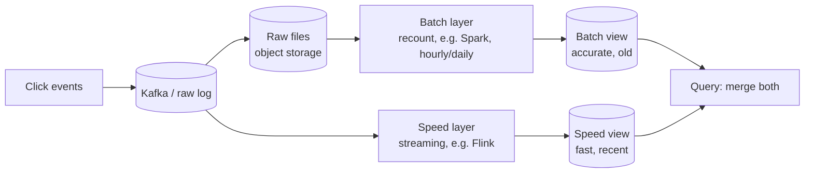
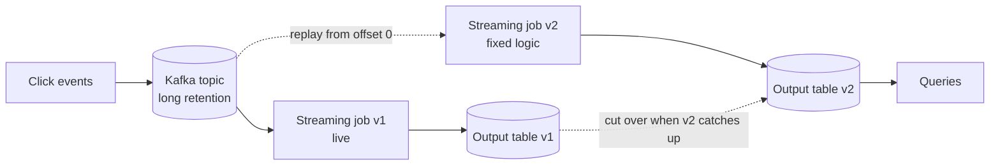

# Lambda vs Kappa Architecture

## 1. One-line summary

**Lambda** runs two pipelines over the same data: a slow, accurate **batch layer** (recount everything from raw data) and a fast, approximate **speed layer** (streaming), and merges them at query time. **Kappa** drops the batch layer: there is **one streaming pipeline**, and when you need to fix or recompute history you **replay** the raw events from a durable log (such as [Kafka](../technologies/kafka.md)) through the same code.

💡 *Batch vs streaming*: batch reads a finished, bounded dataset ("all of yesterday") and exits; streaming reads an endless flow and emits results continuously. See [stream processing](../technologies/stream-processing.md).

---

## 2. The problem it solves

**The pain:** an ad platform shows advertisers "clicks so far this minute" and also bills them monthly. Two needs pull in opposite directions:

- **Fast**: dashboards must update within seconds, so we count in a streaming job.
- **Correct**: money is involved. The streaming job may have dropped [late events](windowing-watermarks-and-late-events.md), hit a bug for 3 hours, or double-counted after a crash. An invoice that is 0.5% off on a 10M-dollar monthly spend is a 50,000-dollar dispute.

Early big-data systems (Hadoop MapReduce, ~2008) were accurate but took hours; early streaming systems (Storm, ~2011) were fast but gave at-most-once or approximate answers and lost state on failure. Teams wanted both.

Infra analogy: a live Grafana panel (fast, may have gaps from scrape failures) versus the monthly cloud bill (slow, authoritative). You glance at the first, you pay the second, and finance reconciles the two.

## 3. How it works

### 3.1 Lambda (Nathan Marz, popularised around 2011-2015)

Nathan Marz (creator of Apache Storm) described it in blog posts and the book *Big Data* (Marz and Warren, 2015). Three layers:

1. **Batch layer**: stores the immutable raw event log (e.g. in HDFS / object storage as files) and periodically (hourly, daily) recomputes **batch views** from scratch.
2. **Speed layer**: a streaming job that computes the same aggregates for only the data the last batch run has not covered yet.
3. **Serving layer**: answers queries by merging `batch view + speed view`.

The key property: when the batch run for hour H finishes, its numbers **overwrite** the speed layer's numbers for hour H, so any streaming error is self-healing within one batch cycle. Humans can also re-run the batch with a bug fixed.

**The cost:** you write and operate the aggregation logic **twice** (say, a Flink job and a Spark job), in two codebases that must agree exactly on edge cases (time zones, dedup rules, null handling). When they disagree, which one is right? Teams report this as Lambda's biggest pain.

### 3.2 Kappa (Jay Kreps, 2014)

Jay Kreps (co-creator of Kafka) argued in "Questioning the Lambda Architecture" (O'Reilly Radar, 2014) that if the log is durable and replayable, you do not need a second system. One streaming job, one codebase:

**Reprocessing recipe** (this is what "replay" means in practice):

1. Fix the bug / change the logic; deploy it as a **new** job version with a fresh consumer group and a **new output table** (so the old one keeps serving).
2. Start it reading the Kafka topic from the **earliest retained offset** (or a chosen timestamp).
3. It runs faster than real time (no waiting on live traffic, only the compute limit) until it catches up to the head of the log.
4. Compare v1 and v2 outputs, switch queries to v2, delete v1.

This requires the log to still **contain** the history: Kafka's retention (time or size based; see [log segments, retention and compaction](log-segments-retention-and-compaction.md)) must cover the replay window. Replaying 30 days is fine if retention is 30 days; for longer you either keep raw events in cheap object storage as well (and replay from there, which brings back a batch-flavoured path) or use tiered storage.

**Replay speed, worked example.** 100,000 clicks/s × 86,400 s = **8.64 billion clicks/day**; at ~200 bytes each that is 8.64e9 × 200 B ≈ **1.7 TB/day**. A 30-day replay reads ≈ **52 TB**. If the job can read 1 GB/s across the cluster, that is 52,000 s ≈ **14.4 hours**. Fine for a one-off fix; not fine if you hoped for "recount in minutes". Raising parallelism shortens it, as long as partition count allows (replay parallelism is capped by the number of partitions; see [consumer groups](consumer-groups-and-rebalancing.md)).

### 3.3 Reconciliation: fast approximate vs billing-grade

Whichever shape you pick, the billing pattern is the same:

| Number | Source | Freshness | Used for |
|---|---|---|---|
| **Provisional** | Streaming job, small allowed lateness | seconds | dashboards, pacing ("budget 80% spent") |
| **Final** | Recount from the raw log (batch or replay) after the lateness window is long over | hours to a day | invoices, disputes |

Reconciliation loop: for each closed period (say each hour) run the recount, **diff** against the streaming result per `(ad, minute)`, and (a) overwrite the table with the recount, (b) alert if the relative difference exceeds a threshold (say 0.1%), because a large diff means a pipeline bug rather than just stragglers. This is the same "two independent sources must agree" idea as [payment reconciliation](payment-reconciliation.md).

Illustration: streaming counted 1,000,000 clicks for hour H; recount says 1,002,300. Diff = 2,300 / 1,002,300 ≈ **0.23%**, above a 0.1% alert. Investigation finds a 40 s partition stall that pushed events past the 10 s lateness (see [watermarks](windowing-watermarks-and-late-events.md)). The invoice uses 1,002,300.

## 4. When to use it

**Lambda fits when:**
- The batch engine already exists and is trusted (data warehouse, nightly Spark), and the streaming layer is a bolt-on for freshness.
- Batch logic can legitimately differ: e.g. batch can do heavy joins, ML-based fraud scoring, or look at full-day context the stream cannot.
- Raw data is much older than any broker retains (years of history).

**Kappa fits when:**
- Streaming and recompute logic are naturally the same (counting, summing, sessionising).
- The log retains enough history, or you have tiered storage.
- You want one codebase, one deployment, one set of tests. Modern engines (Flink, Spark Structured Streaming) run the *same* API in batch and streaming modes, which shrinks the Lambda duplication problem even when you keep both paths.

## 5. When NOT to use it

- **Lambda for a small team with simple counting.** Two systems doubles on-call load and creates a "which is right?" argument. If one streaming job with a replayable log gives correct counts, stop there.
- **Kappa with tiny retention.** If Kafka keeps only 3 days and a bug is found on day 5, you cannot replay. Either extend retention or archive raw events (e.g. sink to object storage).
- **Either, when you need neither.** A dashboard of "requests per minute" that tolerates being 1% off does not need reconciliation at all; one streaming job, done.
- **Replaying without isolation.** Pointing a replay at the *live* output table (same keys) causes live and historical writes to fight; always write to a new table and cut over.

## 6. Commonly confused with

| Pair | Difference |
|---|---|
| Lambda vs Kappa | Two code paths (batch + stream) merged at query time vs one stream path, recompute by replay. |
| Kappa vs "just use a stream" | Kappa is specifically the discipline of keeping the log long enough and designing jobs to be **re-runnable**; a one-off stream job with no replay plan is not Kappa. |
| Reconciliation vs exactly-once | Exactly-once tries to be right the first time; reconciliation *checks* and repairs afterward. Serious billing systems use both. |
| Replay vs consumer rewind | Rewinding the live consumer's offset re-applies events to *existing* state/sink (double counting unless idempotent); a Kappa replay builds a **new** output from scratch. |
| Lambda vs ETL warehouse | A nightly warehouse load alone is just batch; Lambda adds the speed layer for the not-yet-loaded recent window. |

## 7. Common mistakes / misuse

- Implementing the batch and speed layers with subtly different dedup or time-zone rules, then publishing both numbers to users.
- Not defining which number is **authoritative** and when. Say it out loud: "streaming is provisional until the recount for that hour lands."
- Merging at query time with an overlapping boundary (batch covers up to 10:00 inclusive, speed starts at 10:00) so the 10:00 bucket is counted twice or not at all. Use half-open ranges `[start, end)`.
- Forgetting the cost of keeping raw events: 1.7 TB/day × 30 days = 52 TB of Kafka disk at replication factor 3 is ≈ 156 TB. Often cheaper to keep 3 days on Kafka and the rest as compressed files in object storage.
- Reprocessing that re-triggers side effects (emails, charges). Replayed jobs must write only to idempotent, isolated sinks.

## 8. Interview cheat-sheet

"For the live view I run a streaming job that gives provisional per-minute counts within seconds. For billing I don't trust it alone: I keep the raw click log, and after each period closes I recount it and overwrite the aggregates, alerting if the diff exceeds a threshold. Classic **Lambda** does this with a separate batch codebase; I'd prefer **Kappa**, replaying the log through the same job into a new table, so there's one set of logic. That needs retention (or archived raw files) covering the replay window, and a 30-day replay at our volume takes about half a day, so I'd keep it as a repair tool, not a routine path. The recount is authoritative; streaming is provisional."

## 9. Used in

- [Ad click aggregation, overview](../interviews/ad-click-aggregation/README.md)
- [Ad click aggregation, L5](../interviews/ad-click-aggregation/L5-senior.md): reconciliation with a batch recount
- [Ad click aggregation, L6](../interviews/ad-click-aggregation/L6-staff.md): billing-grade correctness, cost, build vs buy
- [Metrics and monitoring](../interviews/metrics-monitoring/README.md): live rollups vs recomputed history
- [Kafka](../technologies/kafka.md) (retention and replay), [stream processing](../technologies/stream-processing.md)
- Sibling concept: [Windowing, watermarks and late events](windowing-watermarks-and-late-events.md)

**Sources**: N. Marz, "How to beat the CAP theorem" (2011) and N. Marz and J. Warren, *Big Data: Principles and best practices of scalable realtime data systems* (2015); J. Kreps, "Questioning the Lambda Architecture", O'Reilly Radar (2014). The 100k clicks/s volume and 1 GB/s replay rate are illustrative assumptions, not measurements.
