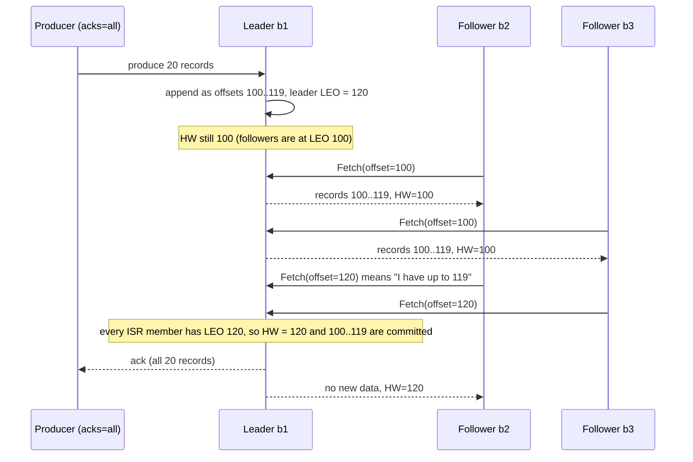
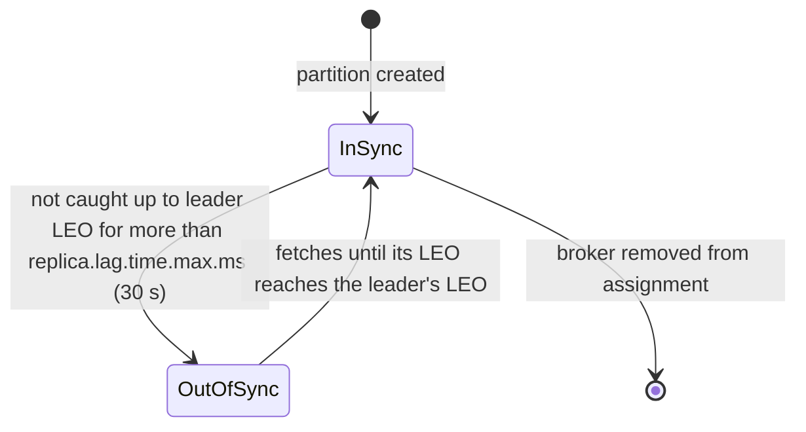
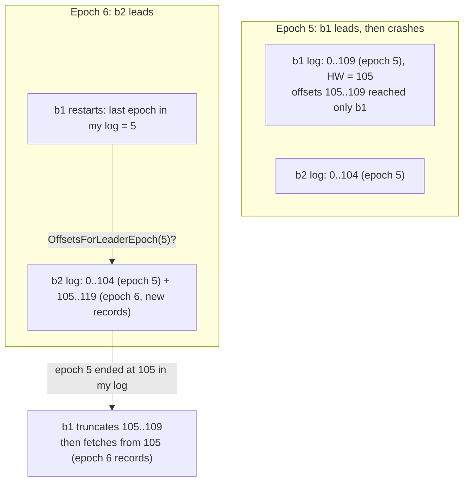

# Log Replication and ISR (In-Sync Replicas)

## 1. One-line summary

Kafka keeps each partition's log on several brokers: one **leader** takes all writes and the **followers pull** new records from it; the leader tracks which followers are keeping up (the **ISR**, in-sync replicas), and a record counts as **committed** once every ISR member has it, which is marked by the **high watermark**. Producers choose how long to wait with `acks`, and `min.insync.replicas` decides how few copies are "too few" to accept a write.

💡 *Broker*: one Kafka server process. *Partition*: one ordered, append-only log; a topic is split into many partitions (see [Kafka](../technologies/kafka.md)). *Replica*: one copy of a partition's log on one broker.

💡 *Offset*: the position of a record inside a partition (0, 1, 2, ...). It never changes and is never reused.

## 2. The problem it solves

A partition's log lives on a disk. Disks die, brokers get rebooted for kernel patches, and whole racks lose power. If the log exists only on one broker, every one of those events means **lost data or a stopped topic**.

So we keep copies. The hard question is **when to tell the producer "your write is safe"**:

| Option | How it works | What goes wrong |
|---|---|---|
| Ack after the leader writes it | Fast | Leader dies before followers copy it: the write is gone, though the producer was told OK |
| Ack after **all** replicas have it | Safe | One slow or dead follower blocks **every** write to the partition |
| Ack after a **majority** has it (Raft, see [consensus and Raft](consensus-and-raft.md)) | Safe, tolerates slow minority | Needs 2f + 1 copies to survive f failures: 3 copies to survive 1 failure, 5 copies to survive 2 |
| **Kafka: ack after every *in-sync* replica has it** | Slow or dead followers are **dropped from the in-sync set**, so they stop blocking; everyone still in the set has every committed record | With f + 1 copies you survive f failures, but you need a separate, consensus-backed **controller** to manage the in-sync set |

💡 *Consensus*: a protocol (Raft, Paxos) that lets a group of machines agree on one value even when some crash. Kafka's controller uses it to store "who is leader, who is in sync"; the data itself uses the cheaper ISR scheme described here.

Infra analogy: a load balancer health check. A backend that stops answering health checks is pulled out of the pool so it doesn't slow everyone down, and it's put back once it passes again. The ISR is a health-checked pool of replicas, and "healthy" means "caught up with the leader recently".

## 3. How it works

### 3.1 Vocabulary

| Term | Meaning |
|---|---|
| **Leader** | The one replica that accepts produce requests (writes) and, by default, serves reads for that partition. |
| **Follower** | A replica that copies the leader's log by sending it **fetch requests**, the same request a consumer sends. |
| **Assigned replicas (AR)** | All brokers that should hold a copy, e.g. `[1, 2, 3]` for replication factor 3. |
| **LEO (log end offset)** | The offset the *next* record will get on a replica. A log holding offsets 0..99 has LEO 100. Each replica has its own LEO. |
| **ISR (in-sync replicas)** | The leader plus every follower that has caught up to the leader's LEO within the last `replica.lag.time.max.ms` (default 30 s since Kafka 2.5, KIP-537, 2020; it was 10 s before). |
| **High watermark (HW)** | The smallest LEO among the ISR. Every offset below HW is on all in-sync replicas, so it is **committed**. Consumers can only read below HW. |
| **`acks`** (producer setting) | How many replicas must have the write before the leader answers: `0`, `1` or `all`. |
| **`min.insync.replicas`** (topic/broker setting) | With `acks=all`, the leader refuses writes if the ISR is smaller than this. |
| **Leader epoch** | A number that goes up by one every time the partition gets a new leader. Same idea as a Raft *term*: a fencing token that tells everyone which leader is current. |
| **Controller** | The component that decides leaders and stores ISR changes. Since KRaft (KIP-500, proposed 2019, production-ready for new clusters in Kafka 3.3, 2022, the only mode from Kafka 4.0, 2025) it's a small Raft quorum of controller nodes; before that, ZooKeeper held the metadata ([ZooKeeper / etcd](../technologies/zookeeper-etcd.md)). |

💡 *KIP*: "Kafka Improvement Proposal", the numbered design documents in which Kafka changes are proposed and accepted. They're handy to cite and to search for.

### 3.2 Followers pull, the leader keeps score

Followers aren't pushed to. They loop, sending `Fetch(offset = my LEO)` to the leader, exactly as a consumer would. That single request does two jobs:

1. It asks for new records starting at the follower's LEO.
2. It **tells the leader the follower's LEO**. If follower b2 asks for offset 120, the leader learns that b2 has 0..119.

From those numbers the leader computes the HW, and sends it back in the next fetch response so followers learn the HW too.



Why pull and not push? The follower controls its own pace (a slow disk just fetches less often), the leader keeps no per-follower send queue, and the same well-tuned fetch path (batching, [zero-copy](../technologies/kafka.md#32-why-its-fast)) serves both followers and consumers. Followers usually use **long polling**: a fetch with no new data waits on the leader (up to `replica.fetch.wait.max.ms`, 500 ms by default) instead of returning empty, so new records reach followers within milliseconds.

💡 *Long polling*: the server holds a request open until there's data or a timeout, instead of the client asking again and again.

### 3.3 ISR membership: shrink and expand



- The rule is **time-based**, not "N messages behind". An old rule used a message-count lag (`replica.lag.max.messages`), which flapped on traffic bursts: a 10k-record burst made every follower "out of sync" for a moment. It was removed in Kafka 0.9 (2015).
- When the leader shrinks or expands the ISR, it asks the controller to record the change, so the controller always knows which replicas are safe to promote.
- A dead follower costs at most `replica.lag.time.max.ms` of stalled `acks=all` writes (30 s by default), then it's dropped and writes flow again. That stall is the price of not being majority-based.

### 3.4 `acks` and `min.insync.replicas`

Replication factor 3 (three copies) is the usual production setting. Here is what each combination buys:

| Producer `acks` | Leader replies when... | Latency | Can an acked write be lost? |
|---|---|---|---|
| `0` | Never; the producer doesn't wait | Lowest | Yes, even without failures (the request may never arrive) |
| `1` | The leader has appended it | Low (one disk append to page cache) | Yes: leader dies before any follower fetched it |
| `all` (`-1`), `min.insync.replicas=1` | Every current ISR member has it | Higher (one follower fetch round trip) | Yes, if the ISR had shrunk to just the leader and then the leader died |
| **`all`, `min.insync.replicas=2`, RF=3** | Every ISR member has it, and the ISR has **at least 2** | Higher | Only if 2 brokers fail before the data spreads further. **This is the standard "don't lose data" setting.** |

`acks=all` became the producer default in Kafka 3.0 (2021, KIP-679), together with the idempotent producer (see [idempotency and delivery semantics](idempotency-and-delivery-semantics.md)).

With RF=3 and `min.insync.replicas=2`:

- 1 broker down → ISR = 2 → writes and reads continue.
- 2 brokers down → ISR = 1 → `acks=all` producers get `NotEnoughReplicas`; consumers can still read committed data. The partition **chooses consistency over availability** for writes ([CAP](cap-and-consistency.md)).
- Setting `min.insync.replicas=3` with RF=3 is a classic mistake: any single broker restart blocks all writes.

### 3.5 What "committed" really means

Committed = **below the high watermark** = present on every replica that was in sync at that moment. Three consequences people often miss:

1. **Consumers never see uncommitted records.** A consumer fetching from the leader gets only offsets below HW. Otherwise a consumer could read offset 118, the leader could die, the new leader might not have 118, and the consumer would have seen data that "never existed".
2. **Committed is not the same as fsynced.** Kafka by default does not force each write to disk (it leaves flushing to the OS; the `flush.messages` / `flush.ms` settings are effectively off). Durability comes from **copies on several machines**, not from the disk of one. A simultaneous power loss of all ISR brokers could lose acked data that was still in RAM. That's why replicas are spread across racks or availability zones (`broker.rack`).
3. **Producer ack and commit are linked but not identical.** With `acks=all`, the leader replies once HW passes your record. With `acks=1`, you get the reply earlier, and the record may never become committed.

💡 *Page cache*: the part of RAM where the OS keeps recently read or written file data. A write "to a file" first lands here and reaches the physical disk later. *fsync*: the system call that forces those pages to the disk now (~0.1–2 ms on an SSD), see [durability, WAL and snapshots](../../LLD/concepts/durability-wal-and-snapshots.md).

### 3.6 Worked example: watching the HW move

A small Java simulation (run with `java IsrSim.java`, Java 21). One partition, RF=3, `acks=all`, `min.insync.replicas=2`, `replica.lag.time.max.ms=30 s`. Every 10 s the producer appends 100 records; follower b2 dies after 20 s; b3 stalls from 10 s to 40 s, catches up at 50 s, then dies after 60 s.

```java
import java.util.*;

// One partition, replication factor 3, acks=all, min.insync.replicas=2.
// Every 10 s a producer appends 100 records to the leader; followers fetch.
public class IsrSim {
    static final long LAG_MAX_MS = 30_000;   // replica.lag.time.max.ms default
    static final int MIN_ISR = 2;            // min.insync.replicas

    static class Replica {
        final String name; long leo; long lastCaughtUpMs; boolean inIsr = true;
        Replica(String name) { this.name = name; }
    }

    public static void main(String[] args) {
        Replica leader = new Replica("b1");
        Replica b2 = new Replica("b2"), b3 = new Replica("b3");
        List<Replica> all = List.of(leader, b2, b3);
        long hw = 0;
        System.out.println("  t | leader LEO | b2 LEO | b3 LEO | ISR        | HW   | producer");
        for (long t = 0; t <= 110_000; t += 10_000) {
            int isrSize = (int) all.stream().filter(r -> r.inIsr).count();
            String producer;
            if (isrSize < MIN_ISR) {
                producer = "REJECTED: NotEnoughReplicas";
            } else {
                leader.leo += 100;
                producer = "+100";
            }
            leader.lastCaughtUpMs = t;
            boolean b3Alive = t == 0 || (t >= 50_000 && t <= 60_000); // b3 stalls 10-40 s, back at 50 s, dies after 60 s
            boolean b2Alive = t <= 20_000;                           // b2 dies after 20 s
            for (Replica f : List.of(b2, b3)) {
                boolean alive = (f == b2) ? b2Alive : b3Alive;
                if (alive) { f.leo = leader.leo; f.lastCaughtUpMs = t; }   // fetch catches up
                if (f.inIsr && t - f.lastCaughtUpMs > LAG_MAX_MS) f.inIsr = false;   // shrink
                if (!f.inIsr && f.leo == leader.leo) f.inIsr = true;                 // expand
            }
            // High watermark = smallest LEO among in-sync replicas (never moves backwards).
            long minLeo = all.stream().filter(r -> r.inIsr).mapToLong(r -> r.leo).min().orElseThrow();
            hw = Math.max(hw, minLeo);
            boolean isrOk = all.stream().filter(r -> r.inIsr).count() >= MIN_ISR;
            if (producer.equals("+100")) producer += isrOk ? ", acked up to offset " + (hw - 1)
                                                           : ", error NotEnoughReplicasAfterAppend";
            StringBuilder isr = new StringBuilder();
            for (Replica r : all) if (r.inIsr) isr.append(r.name).append(' ');
            System.out.printf("%3d | %10d | %6d | %6d | %-10s | %4d | %s%n",
                t / 1000, leader.leo, b2.leo, b3.leo, isr.toString().trim(), hw, producer);
        }
    }
}
```

Real output:

```
  t | leader LEO | b2 LEO | b3 LEO | ISR        | HW   | producer
  0 |        100 |    100 |    100 | b1 b2 b3   |  100 | +100, acked up to offset 99
 10 |        200 |    200 |    100 | b1 b2 b3   |  100 | +100, acked up to offset 99
 20 |        300 |    300 |    100 | b1 b2 b3   |  100 | +100, acked up to offset 99
 30 |        400 |    300 |    100 | b1 b2 b3   |  100 | +100, acked up to offset 99
 40 |        500 |    300 |    100 | b1 b2      |  300 | +100, acked up to offset 299
 50 |        600 |    300 |    600 | b1 b2 b3   |  300 | +100, acked up to offset 299
 60 |        700 |    300 |    700 | b1 b3      |  700 | +100, acked up to offset 699
 70 |        800 |    300 |    700 | b1 b3      |  700 | +100, acked up to offset 699
 80 |        900 |    300 |    700 | b1 b3      |  700 | +100, acked up to offset 699
 90 |       1000 |    300 |    700 | b1 b3      |  700 | +100, acked up to offset 699
100 |       1100 |    300 |    700 | b1         | 1100 | +100, error NotEnoughReplicasAfterAppend
110 |       1100 |    300 |    700 | b1         | 1100 | REJECTED: NotEnoughReplicas
```

How to read it:

- **t = 10–30 s:** b3 is stuck at LEO 100 but still in the ISR (lag ≤ 30 s), so HW stays at 100. Producers with `acks=all` are **waiting**: that's the stall a slow follower causes.
- **t = 40 s:** b3 has not caught up for 40 s > 30 s → dropped. HW jumps to min(500, 300) = 300, releasing the waiting acks up to offset 299. (b2 died after 20 s but was last caught up at 20 s, so it's still "in sync" until t > 50 s; that's why HW is 300, not 500.)
- **t = 50 s:** b3 catches up to 600 and **rejoins**. b2 is still in the ISR (lag exactly 30 s) and holds HW at 300.
- **t = 60 s:** b2 is dropped. ISR = {b1, b3}, HW = 700.
- **t = 100 s:** b3 is dropped. The append already happened (the ISR was 2 when it arrived), but the ISR is now 1 < 2, so the producer gets `NotEnoughReplicasAfterAppend` and will retry. The records are in the leader's log; without an idempotent producer the retry creates **duplicates**.
- **t = 110 s:** the leader now refuses new writes up front. Writes are unavailable until a follower returns; reads of committed data still work.

The lesson: HW is held back by the **slowest in-sync** replica, and the ISR timeout is what turns "a follower is slow" into "the follower is out, carry on".

### 3.7 Leader failover and unclean leader election

When a leader's broker dies, the controller notices (the broker stops heartbeating to it) and picks a new leader **from the ISR**. Since every ISR member has every committed record, no committed data is lost. Clients get `NotLeaderOrFollower`, refresh their metadata (which broker leads which partition), and retry against the new leader. Typical failover is a few seconds.

What if **no ISR member is alive**? Say ISR shrank to {b1} and then b1's disk died. Only b2 is alive, and it's out of sync (it lacks offsets 300..1099). Two choices:

| | Wait for an ISR member (clean) | **Unclean leader election**: promote out-of-sync b2 |
|---|---|---|
| Setting | `unclean.leader.election.enable=false` (default since Kafka 0.11, 2017) | `=true` |
| Availability | Partition is down until b1 comes back (maybe never) | Partition is writable again in seconds |
| Data | No committed data lost | **Committed records b2 never received are lost**, and b1, if it comes back, truncates its log to match b2 |
| Pick for | Payments, orders, anything you can't re-create | Metrics, logs, clickstreams where a gap beats an outage |

This is the CAP trade-off made into one config flag. An interview answer should name it explicitly. (`min.insync.replicas=2` makes it rarer: an acked record is on at least 2 brokers, so you need 2 failures before the choice even comes up.)

### 3.8 Leader epochs and log truncation after failover

After a failover, an old replica may hold records the new leader never got: they were appended on the old leader but never committed (never acked under `acks=all`). Those must be cut off, or the two logs would **diverge** (the same offset holding different records on different brokers).

Before 2017, a returning replica truncated its log to **its own high watermark** and re-fetched. But a follower's HW lags the leader's by one fetch round trip, so in some crash-and-restart sequences this either **deleted committed data** or **left logs diverged**. KIP-101 (originally proposed by Jun Rao; shipped in 2017, in Kafka 0.11 by most accounts, one listing says 1.0) replaced that rule with **leader epochs**:

- Every record batch is stamped with the leader epoch it was written in.
- Each replica keeps a small file (`leader-epoch-checkpoint`) of `epoch → first offset of that epoch`.
- A returning replica asks the current leader: "**where did epoch N end in your log?**" (`OffsetsForLeaderEpoch`) and truncates exactly there.

Worked example with offsets:



1. Epoch 5, leader b1. b1 has offsets 0..109; follower b2 fetched up to 104, so HW = min(110, 105) = 105. Records 105..109 are uncommitted and were never acknowledged to an `acks=all` producer.
2. b1 crashes. The controller makes b2 leader with **epoch 6**. New records go to offsets 105..119 on b2.
3. b1 restarts. Its own offsets 105..109 contain *different* records than b2's 105..109.
4. b1 asks b2 where epoch 5 ended; b2 answers 105. b1 deletes 105..109 and fetches 105..119 from b2. Logs match again.
5. The producer that sent the lost 105..109 never got an ack and retries, so nothing acked is lost.

The epoch also **fences zombies**: a leader that was paused (a long GC pause, 💡 the JVM freezing all threads to clean memory) and wakes up with epoch 5 has its requests rejected because everyone else is on epoch 6. Later fixes (KIP-279 in Kafka 2.0, 2018; KIP-320 in 2.1, 2018) closed edge cases around fast repeated failovers and let consumers detect truncation too.

### 3.9 Same goal, three designs: ISR vs Raft vs leaderless quorums

| | **Kafka ISR** | **Raft majority** ([consensus and Raft](consensus-and-raft.md)) | **Leaderless quorum** ([Cassandra](../technologies/cassandra.md), Dynamo) |
|---|---|---|---|
| Who accepts writes | Partition leader | Group leader | Any replica (via a coordinator) |
| When is a write "done" | All **in-sync** replicas have it (≥ `min.insync.replicas`) | A **majority** has it | **W** of N replicas acked |
| Copies to survive f failures | **f + 1** (plus a consensus controller) | **2f + 1** | Depends on R, W, N; usually N = 3 |
| A slow replica | Stalls writes up to `replica.lag.time.max.ms`, then dropped | Ignored if a majority is fast | Ignored if W others answer |
| Leader choice | Controller picks from ISR | Replicas vote; log must be up to date | No leader |
| Divergent copies | Truncated using leader epochs | Overwritten by leader's log (terms) | Kept; resolved by timestamp or [vector clocks](vector-clocks-and-conflict-resolution.md), repaired by [hinted handoff](hinted-handoff-and-sloppy-quorum.md) and [Merkle anti-entropy](merkle-trees-and-anti-entropy.md) |
| Ordering | One total order per partition | One total order per group | None |
| Example | Kafka data partitions | etcd, KRaft metadata, Redpanda, TiKV | Cassandra, Riak, DynamoDB internals |

Why did Kafka choose ISR? Storage cost and throughput: a partition with RF=3 tolerates 2 failures under ISR (with `min.insync.replicas=1`), where Raft would need 5 copies; and for a system storing petabytes of logs, every extra copy is real money. The catch is that ISR **depends on an external consensus system** (ZooKeeper, now the KRaft quorum) to agree on who's in sync, while Raft is self-contained. Redpanda, a Kafka-compatible broker, uses Raft per partition instead, which is a good "there's more than one valid design" point in an interview.

You can try the leaderless side yourself in 🔬 [see it work: hash ring and quorum](../../see-it-work/hash-ring-quorum/README.md).

## 4. When to use it

- **Durable, ordered logs** where you want one total order per partition and cheap storage: message brokers, change-data-capture streams, write-ahead logs replicated to other machines.
- When you can rely on a separate **strongly consistent metadata service** (KRaft, ZooKeeper, etcd) to hold leadership and membership.
- When you want **per-topic choice** between availability and durability (`acks`, `min.insync.replicas`, unclean election) rather than one fixed rule.

## 5. When NOT to use it

- **Small strongly consistent state** (config, locks, leader election): use Raft directly via etcd/ZooKeeper; you'd otherwise need a consensus system anyway just to run ISR.
- **Writes that must keep going during network partitions in every region**: leader-based replication refuses writes when the leader is unreachable; a leaderless, eventually consistent store fits better.
- **"Kafka is replicated, so it's my backup"**: replication copies mistakes too. A bad producer, a wrong retention setting, or a deleted topic is replicated instantly. Keep real backups or cross-cluster copies for disaster recovery.

## 6. Commonly confused with

| Term | What it is | Not to be confused with |
|---|---|---|
| **High watermark** | Last committed offset + 1, on the broker | **Consumer committed offset**: how far *a consumer group* has processed ([consumer groups](consumer-groups-and-rebalancing.md)) |
| **Log end offset** | Next offset to be written on one replica, committed or not | HW; LEO ≥ HW always |
| **ISR** | Replicas currently caught up | **Assigned replicas**: all replicas that *should* hold a copy |
| **`acks=all`** | Producer waits for the current ISR | "All replicas": if the ISR shrank to 1, `acks=all` means 1 unless `min.insync.replicas` says otherwise |
| **Leader epoch** | Generation number of a partition's leadership | **Producer epoch** (fences old idempotent/transactional producers) and **consumer group generation** (fences old group members) |
| **Replication** | Live copies for availability and durability | **Backup**: a point-in-time copy you can restore after mistakes |

## 7. Common mistakes / misuse

- Using `acks=all` with `min.insync.replicas=1` and believing nothing can be lost. If the ISR shrinks to the leader alone, `acks=all` degrades to `acks=1`.
- `min.insync.replicas` equal to the replication factor: one broker restart (a routine rolling upgrade) blocks every write.
- Enabling unclean leader election on a payments topic "for availability" without realizing it can silently drop committed records.
- Putting all three replicas in one rack or one availability zone: one power event takes out every copy, and since Kafka doesn't fsync each write, acked data can be lost.
- Reading `acks=1` latency numbers from a benchmark and promising them for a durable topic.
- Forgetting that a returning replica **truncates** its log: "but the record was on disk on broker 1!" Only records below the HW were ever promised.
- Alerting only on "broker down" and not on **under-replicated partitions** (partitions whose ISR is smaller than the replica list) or **ISR shrink rate**. These are the early warnings, like a k8s Deployment with fewer ready pods than desired.

## 8. Interview cheat-sheet

> "Each partition has one leader and, with replication factor 3, two followers on different racks. Followers pull from the leader with fetch requests, which also tell the leader how far each follower has got. The leader keeps an in-sync replica set: followers that caught up within the last 30 seconds. The high watermark is the smallest log end offset in that set; everything below it is on all in-sync replicas, so it's committed, and consumers only see committed records. Producers use acks=all with min.insync.replicas=2, so an acknowledged write is on at least two brokers, and if two brokers are down we reject writes rather than risk losing data. On leader failure the controller, which runs on a Raft quorum in KRaft, promotes an ISR member, and returning replicas truncate uncommitted records using leader epochs. Unclean leader election stays off for important topics, trading availability for no data loss. Compared to Raft, ISR survives f failures with f + 1 copies, but it needs that external consensus controller."

## 9. Used in

- [Distributed message queue](../interviews/distributed-message-queue/README.md): the replication design of the broker.
  - [L4 (mid)](../interviews/distributed-message-queue/L4-mid.md) §5.3 replication basics: leader and followers, replication factor, `acks`.
  - [L5 (senior)](../interviews/distributed-message-queue/L5-senior.md) §3.1 ISR, high watermark and `acks` with `min.insync.replicas`; §3.2 leader election, the KRaft controller, unclean election and leader epochs.
  - [L6 (staff)](../interviews/distributed-message-queue/L6-staff.md): rack/zone placement, multi-region replication and why ISR inside a region but async copies across regions.
- [LLD: Pub-Sub broker](../../LLD/interviews/pub-sub-broker/README.md): the in-memory broker has no replication; this file shows what a real broker adds on top.
- Related: [Kafka](../technologies/kafka.md), [log segments, retention and compaction](log-segments-retention-and-compaction.md) (where the replicated log lives on disk), [consumer groups and rebalancing](consumer-groups-and-rebalancing.md), [consensus and Raft](consensus-and-raft.md), [sharding and replication](sharding-and-replication.md), [CAP and consistency](cap-and-consistency.md), [idempotency and delivery semantics](idempotency-and-delivery-semantics.md) (idempotent producer retries), [ZooKeeper / etcd](../technologies/zookeeper-etcd.md).
