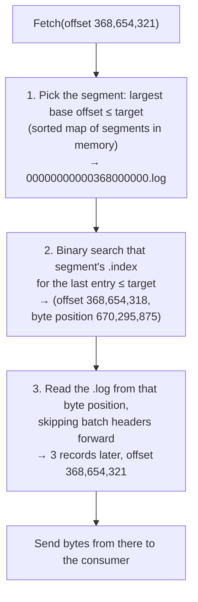
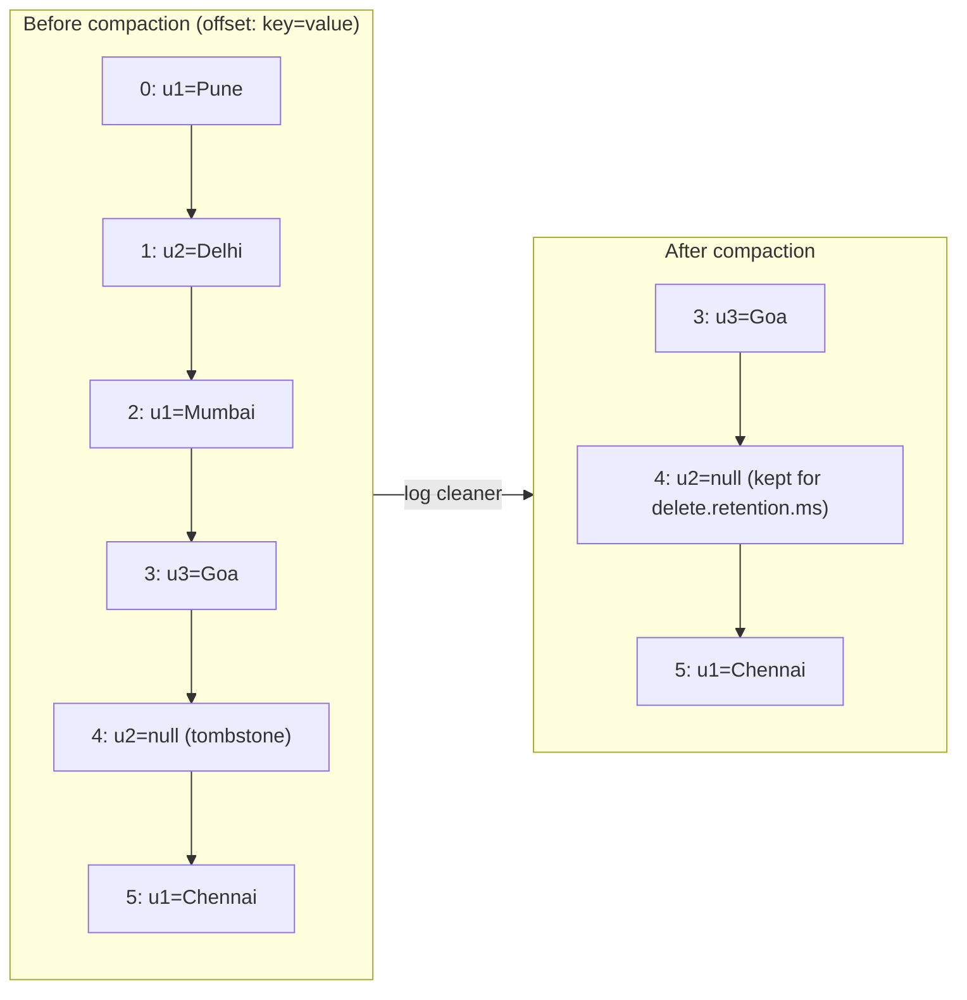

# Log Segments, Retention and Compaction

## 1. One-line summary

A Kafka partition is stored on disk not as one endless file but as a series of **segment files** (about 1 GB each), each with a small **sparse index** that maps offsets to byte positions; old data is removed by **deleting whole segments** once they pass a time or size limit (**retention**), or, for keyed data, by **compaction**, which keeps only the latest record per key.

💡 *Partition*: one ordered, append-only log; a topic is split into many of them (see [Kafka](../technologies/kafka.md)). *Offset*: a record's position in the partition (0, 1, 2, ...), never reused.

## 2. The problem it solves

Imagine storing a partition as **one file** that only grows:

- **Deleting old data is impossible cheaply.** You can't cut the first 500 GB off the front of a file without rewriting the rest. File systems only truncate from the end.
- **Finding offset 368,654,321 is slow.** Records have different sizes, so you can't compute its byte position. You'd scan from the start: hundreds of GB of reading.
- **Crash recovery is slow.** After a power loss, the broker must check the tail of the log for half-written records. With one huge file, it doesn't know where "recent" starts.
- **The disk fills up.** A 50 MB/s topic writes 50 × 86,400 = 4.32 TB per day.

The fix is the same trick log rotation uses for `/var/log/app.log` → `app.log.1`, `app.log.2.gz`: **chop the log into files**, write only to the newest, and delete or rewrite old files as whole units. Then add a tiny index per file so lookups don't need a scan.

Infra analogy: `logrotate` with `size 1G` and `rotate 7`. The active file grows, gets closed at 1 GB, and the oldest closed file is deleted. Kafka does exactly this per partition, plus an index per file.

## 3. How it works

### 3.1 What's on disk

Each partition replica is a directory on the broker named `<topic>-<partition>`:

```
/var/lib/kafka/data/orders-3/
├── 00000000000367000000.log         closed segment: offsets 367,000,000 .. 367,999,999 (approx)
├── 00000000000367000000.index       its sparse offset index
├── 00000000000367000000.timeindex   its time index
├── 00000000000368000000.log         active segment: new records are appended here
├── 00000000000368000000.index
├── 00000000000368000000.timeindex
├── leader-epoch-checkpoint          epoch → first offset (see log replication)
└── partition.metadata
```

- The file name is the **base offset**: the offset of the first record in that segment, zero-padded to 20 digits so files sort correctly by name.
- Only the newest segment, the **active segment**, is written to. All others are **closed** and never change again (except by compaction, which writes a replacement file).
- The `leader-epoch-checkpoint` file belongs to replication, see [log replication and ISR](log-replication-and-isr.md#38-leader-epochs-and-log-truncation-after-failover).

The `.log` file holds **record batches**. A batch header carries the base offset, batch length, the leader epoch, a **CRC** (💡 a checksum: a short number computed from the bytes, so a reader can detect a torn or corrupted batch), producer ID and sequence number (for the [idempotent producer](idempotency-and-delivery-semantics.md)), and timestamps. Records inside store only small **deltas** (offset delta, timestamp delta) plus key, value and headers.

A key design choice: the **bytes on disk are the same bytes the producer sent and the consumer receives**. The broker doesn't decode and re-encode records, so it can send file bytes straight to the network socket (zero-copy, `sendfile`, see [why Kafka is fast](../technologies/kafka.md#32-why-its-fast)).

💡 *Zero-copy / `sendfile`*: a system call that tells the kernel "send bytes from this file to this socket", so data goes from the OS page cache (the RAM where the OS keeps file data) to the network card without being copied into the application's memory first.

### 3.2 Finding a record by offset: the sparse index

A consumer says "give me records from offset 368,654,321". Three steps:



The index is **sparse**: it has an entry only every `log.index.interval.bytes` of log data (default **4,096 bytes**), not one per record. Each entry is **8 bytes**: a 4-byte offset *relative to the segment's base offset*, and a 4-byte byte position in the `.log` file. Relative offsets fit in 4 bytes because one segment never spans more than ~2 billion offsets; 4-byte positions work because a segment is at most 2 GB.

Arithmetic for a full 1 GB segment:

- Index entries ≤ 1,073,741,824 B ÷ 4,096 B = **262,144** entries.
- Index size ≤ 262,144 × 8 B = **2 MB** (the index file is preallocated up to `segment.index.bytes`, default 10 MB, and trimmed when the segment closes).
- Binary search: log₂(262,144) = **18 comparisons**.
- Forward scan after the hit: at most ~4 KB of log data.

So one lookup touches ~18 index slots (in RAM) plus ≤ 4 KB of log, instead of scanning up to 1 GB. The index files are **memory-mapped** (💡 *mmap*: the OS maps a file into the process's memory so reading it looks like reading an array; pages the process touches are loaded from disk on demand and cached), and consumers mostly read near the end of the log, so the hot part of the index stays in RAM.

A small simulation (run with `java SparseIndex.java`, Java 21). It fills one 1 GB segment with records of 500–1,548 bytes (think of each as one small batch), builds the sparse index, and looks up one offset:

```java
import java.util.*;

// One 1 GB segment of ~1 KB records, with a sparse offset index:
// one entry (relativeOffset, filePosition) every 4,096 bytes of log data.
public class SparseIndex {
    public static void main(String[] args) {
        long baseOffset = 368_000_000L;               // segment file 00000000000368000000.log
        long segmentBytes = 1L << 30, indexInterval = 4096;
        Random rnd = new Random(42);
        List<Long> positions = new ArrayList<>();     // file position of every record (simulated)
        List<int[]> index = new ArrayList<>();        // {relativeOffset, position}
        long pos = 0, bytesSinceEntry = indexInterval;
        while (pos < segmentBytes) {
            if (bytesSinceEntry >= indexInterval) {   // time to add a sparse index entry
                index.add(new int[]{positions.size(), (int) pos});
                bytesSinceEntry = 0;
            }
            positions.add(pos);
            int size = 500 + rnd.nextInt(1049);       // record batch of 500..1548 bytes
            pos += size; bytesSinceEntry += size;
        }
        System.out.printf("records in segment : %,d (offsets %,d .. %,d)%n",
            positions.size(), baseOffset, baseOffset + positions.size() - 1);
        System.out.printf("index entries      : %,d x 8 bytes = %,d KB%n",
            index.size(), index.size() * 8 / 1024);

        long target = 368_654_321L;                   // consumer asks: fetch from this offset
        int rel = (int) (target - baseOffset);
        int lo = 0, hi = index.size() - 1, steps = 0; // binary search: last entry <= rel
        while (lo < hi) {
            int mid = (lo + hi + 1) >>> 1; steps++;
            if (index.get(mid)[0] <= rel) lo = mid; else hi = mid - 1;
        }
        int[] e = index.get(lo);
        System.out.printf("binary search      : %d steps -> entry (offset %,d, position %,d)%n",
            steps, baseOffset + e[0], e[1]);
        int scanned = rel - e[0];                     // walk record headers forward from there
        System.out.printf("forward scan       : %d records (%,d bytes read) -> offset %,d at position %,d%n",
            scanned, positions.get(rel) - e[1], target, positions.get(rel));
    }
}
```

Real output:

```
records in segment : 1,048,377 (offsets 368,000,000 .. 369,048,376)
index entries      : 230,754 x 8 bytes = 1,802 KB
binary search      : 18 steps -> entry (offset 368,654,318, position 670,295,875)
forward scan       : 3 records (3,419 bytes read) -> offset 368,654,321 at position 670,299,294
```

230,754 entries (not 262,144) because an entry is added only after *at least* 4,096 bytes, and records don't land exactly on 4 KB boundaries. The point stands: ~1.8 MB of index lets you find any of a million records with 18 comparisons and a 3 KB read.

Why not a dense index (one entry per record)? 1,048,377 × 8 B ≈ 8 MB per segment instead of 1.8 MB, for no real gain: the forward scan over ≤ 4 KB of already-cached data costs microseconds. Sparse indexes trade a tiny scan for a 4× smaller index, the same idea as the sparse index inside an SSTable (💡 an immutable file of key-sorted data) in an [LSM tree](lsm-trees-and-storage-engines.md).

### 3.3 The time index

`.timeindex` maps **timestamp → offset**, 12 bytes per entry (8-byte timestamp, 4-byte relative offset), added at the same sparse interval. It answers "which offset was current at 09:00 yesterday?" (the `offsetsForTimes` API), which is how you **rewind a consumer group to a point in time** after shipping a bug:

```bash
kafka-consumer-groups.sh --bootstrap-server localhost:9092 --group billing \
  --topic orders --reset-offsets --to-datetime 2026-10-08T09:00:00.000 --execute
```

It's also used by time-based retention: each segment's **largest timestamp** decides when it expires.

### 3.4 Rolling segments

The active segment is closed and a new one is opened ("rolled") when any of these is true:

| Trigger | Setting (topic-level name) | Default |
|---|---|---|
| Segment reaches its size limit | `segment.bytes` | 1 GiB (1,073,741,824 B) |
| Segment is older than its time limit | `segment.ms` | 7 days |
| The offset or time index is full | `segment.index.bytes` | 10 MB |

Why does this matter? **Retention and compaction only ever act on closed segments.** The active segment is never deleted, whatever its age. Classic surprise: a low-traffic topic with `retention.ms` = 1 day and the default `segment.ms` = 7 days writes only 50 MB a week, so its active segment never hits 1 GB and stays open for 7 days. Data you thought expired after 1 day sticks around for **up to ~8 days**. Fix: lower `segment.ms` on that topic.

Smaller segments mean finer-grained deletion but **more files**: each segment is 3 files and 2 memory maps. A broker with 4,000 partition replicas × 50 segments each = 200,000 segments = **600,000 open files** and 400,000 mmaps. That's why Kafka hosts raise the open-file limit (`ulimit -n`) and `vm.max_map_count` (💡 the Linux limit on how many memory-mapped regions one process may have; default 65,530).

### 3.5 Retention: deleting whole segments

With `cleanup.policy=delete` (the default), a background task (every `log.retention.check.interval.ms`, default 5 min) deletes the **oldest closed segments** while either limit is exceeded:

| Setting | Meaning | Default |
|---|---|---|
| `retention.ms` | Delete a segment once its newest record is older than this | 7 days (168 h) |
| `retention.bytes` | Delete oldest segments while the partition is larger than this. **Per partition, not per topic.** | -1 (no limit) |

Deleting is cheap: rename the files with a `.deleted` suffix, then unlink them (💡 remove the file name; the space is freed once no process has it open) after `file.delete.delay.ms` (60 s), so readers still using the file can finish. No rewriting, no per-record work. That's why retention costs nothing at the scale where a database `DELETE FROM events WHERE ts < now() - 7 days` would hurt.

Worked sizing, the arithmetic an interviewer expects:

- Topic ingest: 50 MB/s (after compression).
- Per day: 50 MB/s × 86,400 s = **4.32 TB/day**.
- 7-day retention: 4.32 × 7 = **30.24 TB** of unique data.
- Replication factor 3: 30.24 × 3 = **~90.7 TB** of disk across the cluster, plus ~20–30 % headroom ≈ **115 TB**.
- 100 partitions: 30.24 TB ÷ 100 ≈ 302 GB per partition ≈ **~300 segments of 1 GB** each.
- Deletion granularity: with 50 MB/s spread over 100 partitions = 0.5 MB/s per partition, a 1 GB segment fills in ~2,000 s ≈ 35 min. So data lives for 7 days plus up to ~35 min before its segment is deleted.

When retention deletes data a consumer hasn't read yet, the partition's **log start offset** moves past the consumer's position. Its next fetch gets `OffsetOutOfRange`, and it jumps to the earliest or latest offset according to `auto.offset.reset`. That's **silent data loss for that consumer**: alert on consumer lag *in time* approaching the retention period ([consumer groups](consumer-groups-and-rebalancing.md#36-lag-the-number-to-watch)).

### 3.6 Log compaction: keep the latest value per key

Some topics aren't "events that expire" but **"the current state of each key"**: the latest address per user, the latest price per product, the latest committed offset per consumer group. For those, time retention is wrong (a user who hasn't moved in 2 years would lose their address) and keeping everything is wasteful. `cleanup.policy=compact` keeps **at least the last record for every key**, forever, and removes older records for the same key.



Worked through:

- `u1` was written at offsets 0, 2 and 5 → only offset **5** (Chennai) survives.
- `u2` was set at 1 and deleted at 4 with a **tombstone** (a record with the key and a `null` value, meaning "this key is deleted") → offset 1 is removed; the tombstone itself stays for `delete.retention.ms` (default 24 h) so that a consumer that is behind still *sees* the delete, then it's removed too.
- `u3` has only one record → kept.
- **Offsets don't change.** The compacted log reads 3, 4, 5: gaps are normal, and consumers must not assume offset + 1 exists.

How the **log cleaner** (background threads on each broker) does it:

1. A partition's log is split into the **clean** part (already compacted) and the **dirty** part (written since the last pass). The active segment is never touched.
2. The cleaner picks the partition with the highest **dirty ratio** (dirty bytes ÷ total bytes) once it exceeds `min.cleanable.dirty.ratio` (default 0.5, so up to half the log may be stale).
3. It scans the dirty part and builds an in-memory map **key hash → latest offset** (the dedupe buffer, `log.cleaner.dedupe.buffer.size`, default 128 MB shared by cleaner threads; at roughly 24 bytes per entry that's on the order of 5 million keys per pass, approximate figure).
4. It **rewrites** old segments into new files, copying a record only if its offset is the latest for its key (or it's a tombstone still within its retention), then swaps the new files in.

Guarantee you can say in an interview: a consumer that reads a compacted topic **from the beginning** ends up with the latest value of every key, so it can rebuild the full state. That's exactly how:

- **`__consumer_offsets`** (the internal topic storing each group's committed offsets) stays small: key = (group, topic, partition), value = offset.
- **Kafka Streams changelog topics** back up local state stores: on restart, a task restores its RocksDB (💡 an embedded key-value store library that keeps data in local files) state by replaying the compacted changelog ([stream processing](../technologies/stream-processing.md)).
- **Change data capture** (CDC: streaming every row change out of a database, e.g. with Debezium) topics keyed by primary key act as a replayable copy of a table.

`cleanup.policy=compact,delete` combines both: latest value per key, but nothing older than `retention.ms`. Useful for "current state of active sessions, forget sessions idle for 30 days".

Cost: compaction **rewrites data**, so it costs disk I/O and CPU, like compaction in an [LSM tree](lsm-trees-and-storage-engines.md), but much simpler: no sorting, no levels, just "drop superseded keys". Compaction also needs every record to have a **key**; a keyless record can't be compacted (the broker rejects it on a compacted topic).

### 3.7 Tiered storage: closed segments go to object storage

Segments are immutable once closed, which makes them ideal to **upload to object storage** (S3, GCS, Azure Blob; see [object storage](../technologies/object-storage.md)). Tiered storage (KIP-405; early access in Kafka 3.6, 2023; declared production-ready in Kafka 3.9, November 2024):

- `local.retention.ms` (e.g. 1 day) keeps recent segments on broker disks, where tail-reading consumers hit them.
- `retention.ms` (e.g. 90 days) is the total; older segments live only in the remote store, with their indexes.
- A consumer reading old data triggers a fetch from the remote store (slower, tens to hundreds of ms for the first bytes).

Arithmetic with the 50 MB/s topic and 90-day retention:

- Local only: 4.32 TB/day × 90 × RF 3 ≈ **1,166 TB** of broker disk.
- Tiered: local 1 day × 3 = ~13 TB on brokers; remote 4.32 × 90 ≈ **389 TB** in object storage, stored once by Kafka (the object store does its own replication), on much cheaper storage.
- Bonus: a replacement broker only re-copies ~1 day of data instead of 90 days, so recovery takes minutes, not many hours.

Limits worth knowing: the original KIP-405 scope excludes **compacted topics**, and a consumer that suddenly re-reads months of history now leans on object-storage throughput and per-request cost.

### 3.8 Crash recovery uses the segment structure

On a clean shutdown the broker writes a marker; on restart it trusts its files. After a crash it uses a per-directory **recovery point** (the offset up to which data was known flushed to disk) and only re-validates segments after that point: it reads each batch, checks the CRC, rebuilds the `.index` and `.timeindex` files, and truncates any torn batch at the end. Because only the last segment or two are affected, recovery takes seconds to minutes rather than re-reading the whole partition. Anything truncated here that was committed is re-fetched from the leader ([log replication](log-replication-and-isr.md)).

## 4. When to use it

- **Segments + sparse index**: any append-only store that needs cheap deletion of old data and offset or time lookups: message brokers, write-ahead logs (WAL), time-series storage, audit logs.
- **Time/size retention**: event streams whose value fades with age: clicks, logs, metrics, notifications.
- **Compaction**: topics that represent **current state per key**: changelogs, CDC tables, configuration, user profiles, consumer offsets.
- **Tiered storage**: long retention (weeks to years) on high-volume topics where most reads are at the tail.

## 5. When NOT to use it

- **Compaction as a database.** You can't query a compacted topic by key without reading it all; consumers materialize it into a real store (RocksDB, Postgres, Redis).
- **Compaction for "delete after N days" on keyed data** without also setting `delete`: compaction alone keeps the latest record per key **forever**.
- **Compaction for GDPR-style "erase this user now"** without understanding timing: a tombstone only removes older records when the cleaner runs, and never from the active segment, so deletion can take hours to days unless you tune `segment.ms` and `max.compaction.lag.ms`.
- **Tiny segments to get "exact" retention**: thousands of tiny files blow up open file handles and mmap counts, and slow broker startup.
- **Relying on retention as your only archive**: once a segment is deleted it's gone. Archive to object storage if you need history.

## 6. Commonly confused with

| | **Retention (delete)** | **Log compaction** | **Per-message TTL (queues, Redis)** |
|---|---|---|---|
| Unit removed | Whole segment files | Individual superseded records (by rewriting segments) | Individual messages/keys |
| Decided by | Segment age or partition size | Is there a newer record with the same key? | Each message's own expiry time |
| Keeps | Everything newer than the limit | At least the latest value per key, forever | Messages not yet expired |
| Cost | Nearly free (unlink files) | CPU + disk I/O to rewrite | Per-message bookkeeping |
| Example | Clickstream, 7 days | `__consumer_offsets`, user-profile changelog | SQS message retention, Redis `EXPIRE` |

Also: **Kafka segments vs LSM SSTables** ([LSM trees](lsm-trees-and-storage-engines.md)). Both are immutable files with sparse indexes and background rewriting. SSTables are **sorted by key** and merged to serve key lookups; Kafka segments are **sorted by offset** (arrival order) and never merged by key except in compaction, because readers scan sequentially, not by key.

## 7. Common mistakes / misuse

- Setting `retention.bytes` thinking it's per topic; it's **per partition**. 100 partitions × 10 GB = 1 TB per replica set, ×3 with replication.
- Expecting data to disappear exactly at `retention.ms`: the active segment is never deleted, and the check runs every 5 minutes.
- Forgetting keys on a compacted topic, or using a non-deterministic key (like a random UUID per event), which makes compaction useless.
- Consumers assuming offsets are contiguous; compaction and transaction markers leave gaps.
- Not watching **consumer lag in time** against retention: a consumer that falls more than 7 days behind silently skips data.
- Ignoring `ulimit -n` and `vm.max_map_count` on brokers with many partitions, then seeing brokers crash with "Too many open files" or "Map failed".
- Sizing disks for 1× data and forgetting the replication factor and headroom.

## 8. Interview cheat-sheet

> "Each partition is a directory of segment files of about 1 GB, named by their first offset. Only the newest segment is appended to; older ones are immutable. Each segment has a sparse index with one entry every 4 KB mapping a relative offset to a byte position, so finding an offset is: pick the segment by base offset, binary-search its index, about 18 steps for a 1 GB segment, then scan forward at most 4 KB. Retention just deletes whole closed segments once they're older than, say, 7 days, which is nearly free compared with deleting rows. For topics that hold current state per key, like changelogs or consumer offsets, I'd use log compaction: a background cleaner keeps the latest record per key and removes deletes after a grace period via tombstones, so a new consumer can rebuild full state by reading from the start. For long retention I'd use tiered storage so closed segments move to object storage and brokers keep only a day locally."

## 9. Used in

- [Distributed message queue](../interviews/distributed-message-queue/README.md): how the broker stores each partition.
  - [L4 (mid)](../interviews/distributed-message-queue/L4-mid.md) §5.1 partitioned append-only log, §5.4 retention, §5.5 storage layout (segments and sparse index).
  - [L5 (senior)](../interviews/distributed-message-queue/L5-senior.md) §3.5 performance (sequential I/O, page cache, zero-copy all rely on this file layout) and §3.6 log compaction.
  - [L6 (staff)](../interviews/distributed-message-queue/L6-staff.md): tiered storage and the cost model of long retention.
- [LLD: Pub-Sub broker](../../LLD/interviews/pub-sub-broker/README.md): an in-memory broker keeps each topic's messages in memory; this file shows what a durable broker adds on top (segment files, indexes, retention, compaction).
- Related: [Kafka](../technologies/kafka.md), [log replication and ISR](log-replication-and-isr.md), [consumer groups and rebalancing](consumer-groups-and-rebalancing.md), [LSM trees and storage engines](lsm-trees-and-storage-engines.md) (SSTables, compaction, tombstones), [object storage](../technologies/object-storage.md), [stream processing](../technologies/stream-processing.md) (changelog topics), [back-of-the-envelope](back-of-the-envelope.md), [durability, WAL and snapshots](../../LLD/concepts/durability-wal-and-snapshots.md).
