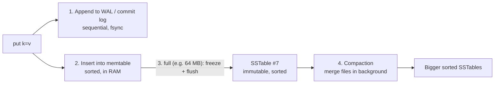

# LSM Trees and Storage Engines (vs B-trees)

## 1. One-line summary

A **storage engine** is the part of a database that actually puts bytes on disk and finds them again; the two big families are **B-trees** (update data *in place* in a sorted tree of pages: great reads) and **LSM trees** (never update in place: buffer writes in memory, dump them as sorted immutable files, merge files in the background: great writes).

💡 *Storage engine*: think of it as the "driver" under the query layer. MySQL can swap InnoDB (B-tree) for MyRocks (LSM) without changing SQL.

## 2. The problem it solves

Disks (even SSDs) are much faster at **sequential** I/O (writing bytes one after another) than **random** I/O (jumping to scattered locations). Rough numbers from [back-of-the-envelope](back-of-the-envelope.md): a spinning disk does ~100–200 random writes/s but ~100+ MB/s sequential; an NVMe SSD does ~100k+ random 4 KB writes/s but still prefers big sequential writes (less internal "write amplification", see §3.5).

💡 *I/O* = input/output, i.e. reading from or writing to disk. *fsync* = a system call (a request from your program to the OS kernel) that forces data out of OS memory onto the physical disk, so it survives a power cut. It costs ~0.1–10 ms.

A **B-tree** database (Postgres, MySQL InnoDB) handles `UPDATE user SET name = 'x' WHERE id = 42` by finding the 8–16 KB **page** (fixed-size block of the file) that holds row 42 and rewriting it. Each write is a small random write to wherever that page lives. Fine at thousands of writes/s; painful at 100k+ writes/s per node.

A distributed key-value store like Dynamo or [Cassandra](../technologies/cassandra.md) wants each node to absorb **tens of thousands of writes per second**. The **LSM tree** (Log-Structured Merge tree) turns every write into a sequential append plus an in-memory insert, and pays for it later, in the background, and on reads.

## 3. How it works

### 3.1 B-tree in plain words (the baseline)

A B-tree is a sorted tree whose nodes are disk pages. Each page holds hundreds of keys, so the tree is shallow: with ~500 keys per page, 3 levels cover 500³ = 125M keys. A lookup = ~3–4 page reads, and the top levels are cached in the **buffer pool** (the database's in-RAM cache of disk pages), so usually only 1 real disk read. Writes modify the page in place and are also recorded in a WAL (below) for crash safety.

### 3.2 LSM write path



1. **WAL / commit log** (write-ahead log): append the change to a log file on disk *before* acknowledging. If the node crashes, replaying the log rebuilds RAM state. Infra analogy: like a k8s audit log you can replay.
2. **Memtable**: an in-memory sorted map (a skip list or red-black tree, both "sorted structures with O(log n) insert"; in Java terms a `ConcurrentSkipListMap`). Insert is O(log n) in RAM, ~1 µs (microsecond = one millionth of a second).
3. **Flush**: when the memtable reaches its limit (e.g. 64 MB), it becomes read-only, a new empty one takes writes, and the old one is written out in key order as an **SSTable** (Sorted String Table): an immutable file of sorted key-value pairs plus a small index and a [Bloom filter](bloom-filters.md). Then the matching WAL segment can be deleted.
4. **Compaction**: a background job merges SSTables (like the merge step of merge sort), keeping only the newest version of each key and dropping deleted data.

Result: the write path touches the disk only with **sequential appends**. No "read the old page first". That's why a Cassandra node takes ~10k–50k+ writes/s.

### 3.3 LSM read path

To `get(k)`, check from newest to oldest and stop at the first hit:

1. Active memtable, then any memtable being flushed (RAM, ~µs).
2. SSTables, newest first. For each file: ask its **Bloom filter** "might k be here?". If "definitely not", skip the file with zero disk reads. If "maybe", use the file's sparse index (every ~64th key, kept in RAM) to jump to one small block and read it.

Worked example: 1 memtable + 20 SSTables on a node. Without Bloom filters, a read of a key that lives in the oldest file could do 20 disk reads (~20 × 0.1 ms on SSD = 2 ms). With 1%-false-positive filters (~10 bits per key), the expected wasted reads are 19 × 0.01 ≈ 0.2, so ~1.2 disk reads. Bloom filter memory: 1 billion keys × 10 bits = 10 Gbit ≈ **1.25 GB of RAM** per node, which is why filter size is a tuning knob.

Range scans ("all keys from `user:42:` to `user:42;`") must merge-iterate the memtable and every overlapping SSTable at once; Bloom filters don't help there.

### 3.4 Compaction strategies in plain words

| Strategy | Plain words | Good at | Bad at |
|---|---|---|---|
| **Size-tiered** (STCS, Cassandra default) | When there are ~4 files of similar size, merge them into one bigger file. Files grow 4×, 16×, 64×... | Write-heavy loads: each byte is rewritten few times | A key can be in many files (slower reads); a merge temporarily needs up to 2× disk space |
| **Leveled** (LCS, RocksDB/LevelDB default) | Data is in levels L0, L1, L2..., each ~10× bigger than the last. Inside a level, files don't overlap in key range, so a key is in at most one file per level | Read-heavy: a read checks ~1 file per level; little wasted space (~10%) | Writes: a byte gets rewritten ~10× per level as it moves down |
| **Time-window** (TWCS) | Group files by time bucket (e.g. one per day); never merge across days; drop whole old files when their TTL (time-to-live: data auto-expires after a set time) passes | Time series with TTL (metrics, logs) | Updates to old data |

### 3.5 The three amplifications

The core trade-off of any storage engine. Pick two to be good at.

- **Write amplification** = bytes written to disk ÷ bytes the user wrote. Leveled LSM with 5 levels: a 1 KB value is written to WAL (1×), flushed (1×), then rewritten ~10× per level → can reach **10–30×**. B-tree: changing a 100-byte row rewrites a whole 8 KB page → up to 80× in the worst case (mitigated by caching and batching).
- **Read amplification** = disk reads per lookup. B-tree: ~1. Size-tiered LSM: several. Leveled LSM: ~1 per level, mostly avoided by Bloom filters.
- **Space amplification** = disk used ÷ live data size. Size-tiered: up to ~2× (old versions waiting for compaction). Leveled: ~1.1×. B-tree: ~1.3–1.5× (half-full pages).

Infra analogy: compaction is like log rotation + garbage collection that never stops. If writes outpace compaction, files pile up, reads slow down, and disk fills: the LSM version of "the consumer lag keeps growing".

### 3.6 Tombstones: why deletes are tricky

You can't remove a key from an immutable file. So `delete(k)` writes a **tombstone**: a special "k is deleted at time T" record. Reads that see the tombstone first return "not found".

The tombstone must outlive every older copy of `k` in older SSTables **and on other replicas**. If it's dropped too early, a replica that missed the delete can bring the old value back during repair ("zombie data"). So Cassandra keeps tombstones for `gc_grace_seconds` (default **10 days**) and requires [anti-entropy repair](merkle-trees-and-anti-entropy.md) (a scheduled job that compares replicas and copies missing data, including tombstones) to run more often than that.

Pain example: a "queue" table where you insert 1M rows/day and delete them after processing. A read of "the next items" scans past ~1M tombstones before finding live rows; Cassandra warns at 1,000 and aborts the query at 100,000 tombstones scanned by default.

### 3.7 Crash recovery in one paragraph

Node loses power with 40 MB in the memtable. On restart: (1) open the existing SSTables (they're immutable, so they're either complete or the half-written one is discarded), (2) replay the WAL segments that weren't flushed yet, rebuilding the memtable, (3) start serving. Nothing acknowledged is lost, because nothing was acknowledged before its WAL append. The knob that matters: **when does the WAL fsync?** Cassandra's default `commitlog_sync: periodic` fsyncs every 10 s (fast, but a whole-node power loss can drop the last ~10 s on that replica; the other replicas still have it), while `batch` fsyncs before acking (safer, slower).

### 3.8 The whole idea in ~50 lines of Java

A toy, not a real engine (no files, no Bloom filters), but it shows the moving parts: WAL first, sorted memtable, flush to immutable sorted tables, newest-first reads, tombstones, and compaction. Runs with `javac TinyLsm.java && java TinyLsm`.

```java
import java.util.*;

public class TinyLsm {
    private static final String TOMBSTONE = "\u0000DELETED";
    private static final int MEMTABLE_LIMIT = 2;               // tiny, to force flushes

    private final List<String> wal = new ArrayList<>();          // stand-in for an append-only file
    private TreeMap<String, String> memtable = new TreeMap<>();  // sorted, in RAM
    private final Deque<SortedMap<String, String>> sstables = new ArrayDeque<>(); // newest first

    void put(String k, String v) {
        wal.add("PUT " + k + " " + v);                           // 1. durability first
        memtable.put(k, v);                                      // 2. then memory
        if (memtable.size() >= MEMTABLE_LIMIT) flush();
    }

    void delete(String k) { put(k, TOMBSTONE); }                 // a delete is just a write

    String get(String k) {
        String v = memtable.get(k);
        if (v == null) {
            for (SortedMap<String, String> sst : sstables) {     // newest -> oldest
                v = sst.get(k);                                  // real engine: Bloom filter first
                if (v != null) break;
            }
        }
        return TOMBSTONE.equals(v) ? null : v;
    }

    private void flush() {
        sstables.addFirst(Collections.unmodifiableSortedMap(memtable)); // immutable "file"
        memtable = new TreeMap<>();
        wal.clear();                                             // flushed data no longer needs the log
    }

    void compact() {                                             // merge all, newest wins, drop tombstones
        TreeMap<String, String> merged = new TreeMap<>();
        Iterator<SortedMap<String, String>> oldestFirst = sstables.descendingIterator();
        while (oldestFirst.hasNext()) merged.putAll(oldestFirst.next());
        merged.values().removeIf(TOMBSTONE::equals);
        sstables.clear();
        sstables.addFirst(Collections.unmodifiableSortedMap(merged));
    }

    public static void main(String[] args) {
        TinyLsm db = new TinyLsm();
        db.put("a", "1"); db.put("b", "2");      // flush -> SSTable #1
        db.put("a", "3"); db.delete("b");        // flush -> SSTable #2
        System.out.println("a=" + db.get("a") + " b=" + db.get("b") + " files=" + db.sstables.size());
        db.compact();
        System.out.println("after compaction files=" + db.sstables.size() + " " + db.sstables.peekFirst());
    }
}
```

Output: `a=3 b=null files=2`, then `after compaction files=1 {a=3}`. Note the toy drops tombstones during a full compaction; a replicated store may only do that after the grace period (see 3.6).

## 4. When to use it

- **LSM**: write-heavy workloads (events, messages, metrics, logs, IoT), key-value lookups, data much bigger than RAM, distributed KV stores. Examples: **RocksDB** (embedded library used inside TiKV, CockroachDB's earlier versions, Kafka Streams state stores, MyRocks), **LevelDB** (Google, the ancestor), **Cassandra**, **ScyllaDB**, **HBase**, Bigtable; CockroachDB now uses **Pebble** (a Go RocksDB-like engine).
- **B-tree**: read-heavy OLTP (online transaction processing: many small reads/writes by users), lots of secondary indexes, range scans, in-place updates, strong transactional semantics. Examples: [PostgreSQL](../technologies/postgresql.md) (heap + B-tree indexes), MySQL **InnoDB**, SQLite, etcd's bbolt.

## 5. When NOT to use it

- **Don't pick LSM for read-mostly, update-in-place data** (a product catalog read 1000× per write). You pay read amplification and compaction CPU for a write speed you don't need.
- **Don't use an LSM store as a queue** (insert then delete): tombstone storms. Use [Kafka](../technologies/kafka.md) or a real queue.
- **Don't pick B-tree for 100k+ writes/s per node** of append-like data: random page writes and page splits become the bottleneck.
- **Don't design your own storage engine in an interview** unless asked: say "an LSM engine like RocksDB per node" and spend time on distribution.

## 6. Commonly confused with

| | B-tree | LSM tree |
|---|---|---|
| Write | Find page, modify in place (random I/O) | Append WAL + memtable (sequential) |
| Read | ~1 disk read (tree in buffer pool) | Memtable + possibly several SSTables (Bloom filters help) |
| Delete | Remove from page | Write a tombstone; removed at compaction |
| Background work | Vacuum (Postgres), page splits | Flush + compaction (continuous) |
| Space | ~1.3–1.5× (fragmented pages) | 1.1× (leveled) to 2× (size-tiered) |
| Examples | Postgres, InnoDB, SQLite | RocksDB, LevelDB, Cassandra, HBase |

Also confused: **WAL vs commit log vs Kafka log**. All three are append-only logs; WAL/commit log is a node-local crash-recovery file deleted after flush, while a Kafka log *is* the data. **SSTable vs memtable**: memtable is mutable RAM, SSTable is immutable disk.

## 7. Common mistakes / misuse

- Saying "LSM is faster" without saying **for what**: faster writes, slower reads, background cost.
- Forgetting the **WAL**: "writes go to memory" alone loses data on crash.
- Forgetting **Bloom filters** when explaining reads; or thinking they help range scans.
- Deleting by **TTL or delete-heavy patterns** without thinking about tombstones and `gc_grace_seconds`.
- Not monitoring **pending compactions** in production (the LSM version of a growing backlog), and running disks above ~50% full with size-tiered compaction (merge needs headroom).

## 8. Interview cheat-sheet

> "Each storage node runs an LSM engine like RocksDB. A write is appended to a commit log for durability and inserted into an in-memory sorted memtable, so the disk only sees sequential writes; when the memtable hits ~64 MB it's flushed as an immutable sorted SSTable. Reads check the memtable, then SSTables newest to oldest, and a per-file Bloom filter skips files that can't contain the key, so a point read is about one disk read. Background compaction merges files and drops overwritten values: size-tiered for write-heavy, leveled for read-heavy. Deletes are tombstones that must be kept longer than the repair interval, otherwise deleted data can come back from a stale replica. A B-tree like Postgres or InnoDB is the opposite trade-off: cheap reads, in-place random writes."

## 9. Used in

- [Distributed key-value store](../interviews/distributed-kv-store/README.md): the **per-node storage engine** deep dive: commit log + memtable + SSTables + compaction + per-SSTable Bloom filters, and tombstones for deletes.
- Related: [Cassandra](../technologies/cassandra.md), [PostgreSQL](../technologies/postgresql.md) (B-tree side), [Bloom filters](bloom-filters.md), [Merkle trees and anti-entropy](merkle-trees-and-anti-entropy.md) (repair vs tombstone lifetime), [back-of-the-envelope](back-of-the-envelope.md) (disk latency numbers).
