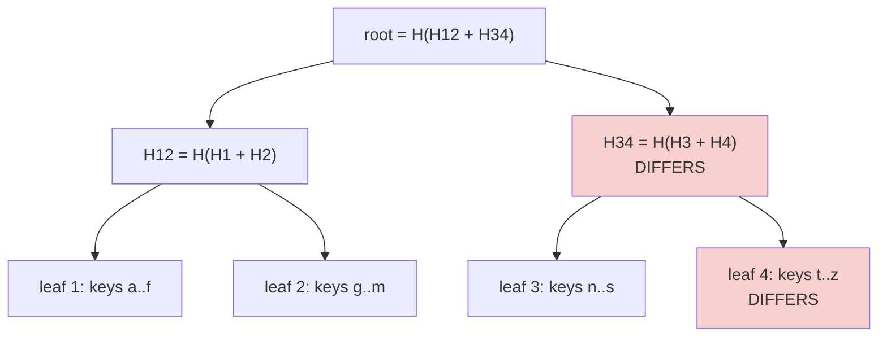
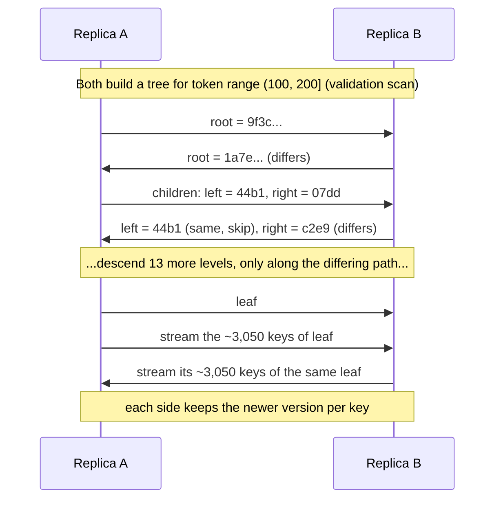

# Merkle Trees and Anti-Entropy Repair

## 1. One-line summary

A **Merkle tree** is a tree of hashes where each parent is the hash of its children, so one **root hash** summarizes a whole dataset; two replicas can find exactly which keys differ by comparing roots and descending **only into branches whose hashes differ**, which is how **anti-entropy repair** keeps replicas in sync without shipping all the data.

💡 *Hash*: a function (e.g. SHA-256, MD5, Murmur3) that turns any input into a short fixed-size fingerprint. Same input → same fingerprint; any change → a different one (with overwhelming probability).

💡 *Entropy* here means "disorder": replicas drifting apart. *Anti-entropy* = a background process that pulls them back together.

## 2. The problem it solves

In a leaderless store with replication factor N = 3 (see [sharding and replication](sharding-and-replication.md)), replicas drift apart:

- A write succeeded on 2 of 3 replicas (W = 2); the third was restarting.
- A [hinted handoff](hinted-handoff-and-sloppy-quorum.md) hint expired or the stand-in node died.
- A disk bit-flip or a bug corrupted a value.
- A delete's [tombstone](lsm-trees-and-storage-engines.md#36-tombstones-why-deletes-are-tricky) reached only some replicas.

Reads with R + W > N usually hide the drift, but keys that are **never read** stay wrong forever, and if another replica dies you may lose the only good copy.

The naive fix: replica A sends all its keys and value hashes to replica B. Worked numbers: a node holds 100M keys in a range; sending `(key ~50 B, hash 16 B)` per key = 100M × 66 B ≈ **6.6 GB** over the network, every repair, for every replica pair, even if only 10 keys differ. We want the cost to be proportional to **how much differs**, not to how much data there is.

## 3. How it works

### 3.1 Building the tree

1. Split the key range into buckets by hash (e.g. 2^15 = 32,768 leaf buckets). Each key falls in exactly one bucket.
2. **Leaf hash** = hash of all `(key, value, timestamp)` in that bucket.
3. **Parent hash** = hash(left child hash + right child hash), all the way up to one **root**.

Both replicas must build the tree over the **same key range with the same bucket boundaries**, which works naturally with [consistent hashing](consistent-hashing.md): each **token range** (a slice of the hash ring that the same set of replicas owns) is repaired separately.

### 3.2 Comparing two replicas

1. A and B exchange **root hashes**. Equal → the whole range is identical. Done, with 1 hash sent.
2. Different → exchange the two child hashes. Recurse only into children that differ.
3. At the leaves that differ, stream the actual keys in those buckets and let the newer version (by timestamp or [vector clock](vector-clocks-and-conflict-resolution.md)) win on both sides.

Worked numbers (100M keys, depth 15 → 32,768 leaves, ~3,050 keys per leaf):

| Situation | Hashes compared | Keys streamed |
|---|---|---|
| Replicas identical | 1 (root) | 0 |
| 1 leaf differs | 1 + 2 × 15 = **31** | ~3,050 (one leaf) |
| 10 leaves differ (scattered) | ≤ 10 × 31 = **~310** | ~30,500 |
| Naive "compare every key" | **100,000,000** | whatever differs |

So we go from ~6.6 GB of comparisons to a few KB of hashes plus the affected buckets. The trade-off is **leaf granularity**: one bad key forces streaming its whole leaf (~3k keys). Deeper trees mean smaller leaves but more memory (32k leaves × 32-byte hash ≈ 1 MB per range, fine).

### 3.2.1 A repair session as a conversation

Infra analogy: like `rsync`, which compares block checksums so it only sends the changed blocks of a big file, except organised as a tree so you can skip whole identical halves at once.

### 3.3 The catch: building the tree is expensive

To compute leaf hashes, a node must **read every key in the range** from disk. Cassandra calls this a *validation compaction*: hundreds of GB of disk reads and CPU per node. That's why:

- Repair is run **per token range, throttled, and scheduled** (e.g. with Cassandra Reaper), not continuously.
- **Incremental repair** marks SSTables (the immutable sorted data files of an [LSM engine](lsm-trees-and-storage-engines.md)) already repaired, so later runs only hash new data.
- Riak and Dynamo kept trees **persistently updated** on each write (an always-on "active anti-entropy"), trading write overhead for cheap comparisons.
- The tree is invalidated by new writes; it's a snapshot, so a few keys may show as different simply because writes arrived during the build.

### 3.4 The three repair mechanisms side by side

A Dynamo-style store has three layers of repair. Each covers the gaps of the previous one.

| Mechanism | When it runs | What it fixes | Cost | Gap it leaves |
|---|---|---|---|---|
| [**Hinted handoff**](hinted-handoff-and-sloppy-quorum.md) | When a replica was down for writes, replayed when it comes back | Writes missed during **short** outages (Cassandra: < 3 h) | Low: only missed writes | Hints lost if stand-in dies; long outages exceed the hint window |
| **Read repair** | On a read, when replicas' answers disagree | **Only the keys being read** | Small extra latency on mismatched reads | Cold keys never get repaired |
| **Anti-entropy (Merkle repair)** | Scheduled (e.g. weekly per range) | **Everything**, including never-read keys and lost hints | High: full scan of data to build trees | Runs rarely; drift persists until next run |

Read repair in one paragraph: the coordinator asks one replica for the full value and the others for a **digest** (hash). If the digests match, done. If not, it fetches full values, returns the newest to the client, and writes it back to stale replicas.

Rule from [LSM trees](lsm-trees-and-storage-engines.md): full repair must complete more often than the tombstone grace period (Cassandra `gc_grace_seconds`, 10 days by default), or a replica that missed a delete can resurrect the data.

### 3.5 Where you've already met Merkle trees

- **Git**: every file (blob) and directory (tree) is stored by its SHA hash, and a commit points to the root tree's hash. Two checkouts with the same commit hash are identical; `git` compares directory hashes and skips unchanged subtrees, which is why `git status` and `fetch` are fast.
- **BitTorrent**: a file is split into pieces, each with a known hash, so you can verify every piece from an untrusted peer (BitTorrent v2 uses a Merkle tree per file).
- **Bitcoin / blockchains**: a block header stores the Merkle root of its transactions; a light wallet can prove a transaction is in a block with ~log₂(n) hashes (~12 hashes for 4,000 transactions) instead of downloading the block.
- **Certificate Transparency** logs (part of the [TLS](tls-and-mtls.md) ecosystem), ZFS and IPFS also use them to prove "this data hasn't changed".

## 4. When to use it

- Periodically **reconciling replicas** of a large dataset where most data is identical (anti-entropy in Dynamo, Cassandra, Riak, DynamoDB).
- **Syncing** two copies over a slow link (backup tools, file sync, Git).
- **Proving integrity**: "this piece belongs to this dataset" without sending the dataset.

## 5. When NOT to use it

- **Small datasets**: if both sides fit in a few MB, just compare everything or send a full checksum list; a tree adds code for no gain.
- **Replicas that differ a lot** (a brand-new empty replica): you'd descend into every branch. Just stream the whole range (bootstrap / rebuild).
- **Leader-based replication with an ordered log** (Raft, Postgres streaming): a follower knows its log position and just asks for "everything after entry 1,234". Merkle trees are a leaderless-world tool.
- **As the only repair mechanism**: it's too expensive to run often; pair it with hinted handoff and read repair.

## 6. Commonly confused with

| | Merkle tree | Plain checksum of all data | Bloom filter |
|---|---|---|---|
| Answers | **Where** two datasets differ | **Whether** they differ | "Is key k maybe in this set?" |
| Cost to locate a difference | O(log n) hashes per differing bucket | Must compare everything | N/A |
| Used for | Anti-entropy, Git, blockchain proofs | File download check | Skipping SSTables, seen-sets ([Bloom filters](bloom-filters.md)) |

Also: **read repair vs anti-entropy repair**. Read repair is opportunistic and only touches keys being read; anti-entropy is a scheduled full sweep. **Hinted handoff** is not a repair of existing data at all: it's a delayed delivery of writes a replica missed.

## 7. Common mistakes / misuse

- Saying "replicas sync via Merkle trees" as if it's free and continuous: building the trees means **scanning all data**, so it's scheduled and throttled.
- Forgetting that replicas must hash the **same ranges** (that's what token ranges provide).
- Relying on read repair alone: **cold keys** stay inconsistent forever.
- Never running repair in production, then losing data when a node dies, or seeing deleted rows come back after `gc_grace_seconds`.
- Mixing up the three mechanisms (hinted handoff, read repair, anti-entropy) or presenting them as alternatives instead of layers.

## 8. Interview cheat-sheet

> "Replicas drift: a write misses a replica, a hint expires, a disk corrupts a value. I'd use three layers of repair. Hinted handoff replays writes a replica missed during a short outage. Read repair fixes keys when a read sees replicas disagree, but only for keys that get read. And anti-entropy catches everything else: each replica builds a Merkle tree per token range, leaves are hashes of key buckets and parents hash their children, and two replicas compare root hashes and descend only into differing branches. With 32k leaves that's about 31 hashes to locate one bad bucket instead of comparing 100 million keys. Building the tree scans all data, so it runs on a schedule, throttled, and must finish within the tombstone grace period so deletes don't come back."

## 9. Used in

- [Distributed key-value store](../interviews/distributed-kv-store/README.md): **anti-entropy** deep dive: Merkle trees per token range, how they combine with read repair and hinted handoff, and why repair must run within the tombstone grace period.
- 📚 [Case study: Amazon Dynamo → DynamoDB](../../case-studies/amazon-dynamo-to-dynamodb.md): where this technique came from (the 2007 Dynamo paper) and whether DynamoDB kept it.
- Related: [hinted handoff and sloppy quorum](hinted-handoff-and-sloppy-quorum.md), [LSM trees and storage engines](lsm-trees-and-storage-engines.md) (tombstones), [vector clocks and conflict resolution](vector-clocks-and-conflict-resolution.md) (which version wins), [consistent hashing](consistent-hashing.md) (token ranges), [Cassandra](../technologies/cassandra.md), [Bloom filters](bloom-filters.md).
