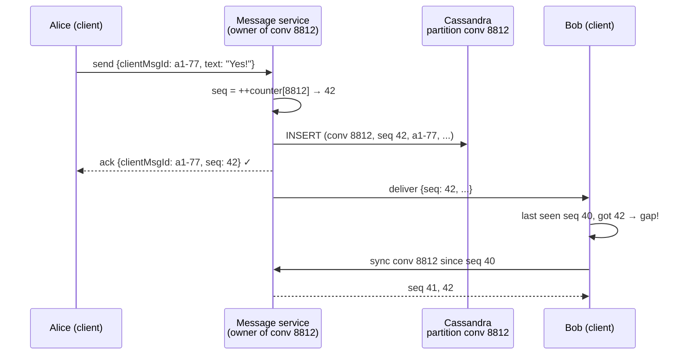

# Message Ordering and Sequencing

## 1. One-line summary

**Ordering** is making sure everyone sees messages in the same, sensible order ("Want pizza?" before "Yes!"). In distributed systems you can't trust clocks for this, so you give each message a **sequence number** assigned by a single owner (e.g. per conversation: 1, 2, 3, ...) and use it to order, detect gaps and sync.

---

## 2. The problem it solves

**The pain:** Alice and Bob chat. Each phone stamps messages with its own clock, and the server sorts by timestamp.

```
Alice's phone clock is 90 s fast. Bob's is correct.
10:00:00 (real)  Bob:   "Want pizza?"   stamped 10:00:00
10:00:20 (real)  Alice: "Yes!"          stamped 10:01:50
10:00:40 (real)  Bob:   "Pepperoni?"    stamped 10:00:40
Sorted by stamp: "Want pizza?", "Pepperoni?", "Yes!"   ← Alice seems to say yes to pepperoni
```

**Clock skew** (two machines disagreeing about the current time) is normal: phones can be minutes off, users change the time manually, and even servers synced with **NTP** (Network Time Protocol, the daemon that keeps server clocks in sync) drift by a few milliseconds and can jump backwards when corrected. Two servers stamping messages 2 ms apart can't reliably say which came first.

Other symptoms:

- Two messages with the **same timestamp** (millisecond resolution, 1M messages/s): which is first?
- After reconnecting, the client asks "what did I miss since 10:00:40?" A message stamped 10:00:39 by a slow server arrives late and is skipped forever.

**The fix:** one **owner** per conversation hands out an increasing counter. Message 42 is after message 41, period. Order is defined by who wrote first **to the owner**, not by anyone's clock.

> Infra analogy: etcd/Kubernetes `resourceVersion`. Watchers don't compare timestamps; they say "give me changes after resourceVersion 81234". Same with Kafka offsets and Postgres WAL LSNs (log sequence numbers): a single writer assigns a monotonically increasing position.

---

## 3. How it works

### 3.1 Per-conversation sequence numbers

You don't need a global order across all of WhatsApp (nobody cares whether a message in chat X came before one in chat Y). You need order **within a conversation**. That's much cheaper: each conversation gets its own counter.



How do you make "one owner" real at scale?

| Approach | How | Trade-off |
|---|---|---|
| **Counter in [Redis](../technologies/redis.md)** | `INCR seq:conv:8812` → 42 | Simple, ~0.1 ms. Need persistence/failover care: a failover that loses the last increments could hand out 42 twice; guard with a DB uniqueness check or a conditional insert |
| **Partition owner** | Route all writes for a conversation to one service instance (by [consistent hashing](consistent-hashing.md) on conv_id), which keeps the counter in memory and persists it | Fast; on owner change the new owner must load the last seq from the DB first |
| **DB conditional write** | `INSERT ... IF NOT EXISTS` with seq = last + 1 (Cassandra lightweight transaction) | Correct without extra infra, but slow (~4 round trips) under contention in busy groups |
| **[Kafka](../technologies/kafka.md) partition offset** | Key by conv_id; the partition's offset orders messages | Order is per partition (many convs share it); offsets aren't dense per conversation, so gaps can't be detected per chat |

Storage fits naturally: [Cassandra](../technologies/cassandra.md) with **partition key** `conversation_id` (all of a chat's messages on the same nodes) and **clustering key** `seq` (sorted on disk), so "last 50 messages" and "everything after seq 40" are single sequential reads.

### 3.2 Ordering within a Kafka partition

[Kafka](../technologies/kafka.md) guarantees order **only within one partition**. If you produce messages for conversation 8812 with key `8812`, they all land on the same partition and consumers see them in order. Pitfalls:

- Random or null keys spread one conversation across partitions → reordering.
- Producer retries can reorder unless the **idempotent producer** is on (`enable.idempotence=true`, default since Kafka 3.0).
- Increasing the partition count changes `hash(key) % N`, so a conversation moves partitions mid-stream.
- A consumer that processes messages from one partition with a thread pool loses the order again.

### 3.3 Gap detection and "sync since seq N"

Because seqs are **dense** (no holes) per conversation, the client can detect loss:

- Client stores `lastSeq` per conversation (e.g. 40).
- Receives 42 → knows 41 is missing → calls `sync(conv=8812, after=40)`.
- On reconnect after being offline, the client sends its `lastSeq` for each active conversation (or a per-user inbox cursor) and the server returns everything after it, paged (e.g. 200 at a time).

This is what makes the real-time push path allowed to be **lossy** ([pub/sub](../technologies/pub-sub.md) can drop a message; the gap is healed on the next sync). A timestamp can't do this: "nothing between 10:00:40 and 10:00:45" tells you nothing.

### 3.4 Client message ID (dedup) vs server seq (order)

Two different IDs with two different jobs:

| | **Client message ID** (`clientMsgId`) | **Server sequence number** (`seq`) |
|---|---|---|
| Who creates it | The sender's device, before sending (UUID) | The conversation owner on the server |
| Purpose | **Deduplication**: the phone retries after a timeout; the server sees `a1-77` again and returns the existing seq instead of storing twice | **Ordering**, gap detection, sync cursor |
| Unique within | Sender (or globally, if UUID) | One conversation |
| Exists while offline | Yes, so the UI can show the message immediately with a clock icon | No, assigned on server acceptance |

Retry flow: Alice sends, the network dies before the ack, Alice's app resends with the same `clientMsgId`. The server checks `(sender, clientMsgId)` in a dedup table/[Redis](../technologies/redis.md) key with TTL, finds seq 42, and replies "already stored as 42". This is the [idempotency key](idempotency-and-delivery-semantics.md) pattern.

### 3.5 Lamport clocks (briefly)

When there is **no single owner** (peer-to-peer, multi-leader databases), you can use a **Lamport clock**: every node keeps a counter; it increments on each event, attaches the counter to messages it sends, and on receiving a message sets `counter = max(own, received) + 1`. This guarantees "if A caused B, A's number < B's number", and ties are broken by node ID. It gives a consistent order, not the real-time order. **Vector clocks** extend this to detect concurrent edits. For chat with a server in the middle, a per-conversation sequence is simpler and stronger; mention Lamport clocks to show you know why physical clocks fail.

### 3.6 What order do users actually see?

- **Sender's own view:** shows messages instantly in send order (optimistic, by local time), then re-sorts if the server seq differs.
- **Everyone else:** sorted by seq. Two people typing at the same second in a group may see "Alice then Bob" on everyone's screen even if Bob tapped send 5 ms earlier. That's fine: **consistent** for all members matters more than "true" time.
- **Displayed time** is still a timestamp (server receive time), shown as a label, not used for sorting.

---

## 4. When to use it

- Chat and comment threads, collaborative editing operation logs, event-sourced aggregates (per-entity version numbers).
- Any **sync protocol**: "give me changes after X" for mobile offline sync, CDC consumers, watch APIs.
- Optimistic concurrency: `UPDATE ... WHERE version = 7` uses the same idea.

## 5. When NOT to use it (and why it's a mistake)

| Situation | Why | Use instead |
|---|---|---|
| Global sequence across all conversations | One counter for 1M msgs/s = a single bottleneck and single point of failure; nobody needs cross-chat order | Per-conversation seq + unique IDs like [Snowflake](id-generation.md) |
| Loose ordering is fine (social feed, logs for humans) | A counter owner is extra infra | Timestamps / time-sortable IDs |
| Dense seq for a 1M-member broadcast channel with heavy writes | One owner's counter is a hot spot | Channel partitions, or a sortable ID without gap detection |

---

## 6. Commonly confused with

| | **Per-conv sequence number** | **Timestamp** | **[Snowflake / time-sortable ID](id-generation.md)** | **Lamport clock** |
|---|---|---|---|---|
| Guarantees order? | Yes, within the conversation | No (skew, ties) | Roughly by time, not strictly across machines | Causal order, consistent tie-breaks |
| Detect gaps? | Yes (dense: 41, 42, 43) | No | No (sparse) | No |
| Needs coordination | One owner per conversation | None | None (machine ID per node) | Piggybacked on messages |
| Use for | Chat order, sync cursors | Display only | Unique primary keys | P2P / multi-leader systems |

---

## 7. Common mistakes / misuse

1. **Ordering by client timestamps.** Phones lie; users change clocks.
2. **Ordering by server timestamps across many servers** and calling it solved: ms-level skew and NTP jumps still reorder close messages.
3. **One global counter** for all messages: bottleneck and SPOF.
4. **Confusing the dedup ID and the order ID**: generating the seq on the client, or deduping on seq (a retry gets a new seq and is stored twice).
5. **Sync by timestamp** ("since 10:00:40"): late-committed messages are skipped forever.
6. **Kafka without a key** (or with parallel processing per partition), then wondering why messages arrive out of order.
7. **Forgetting failover**: a new owner starting its counter from a cached value and reusing seq numbers. Load `max(seq)` from the DB on takeover.

---

## 8. Interview cheat-sheet

> "I won't order by timestamps, because clocks on phones and servers skew and ties are common. Each conversation gets a monotonically increasing sequence number from a single owner, either a Redis INCR per conversation or the service instance that owns that conversation by consistent hashing. Messages are stored in Cassandra partitioned by conversation ID and clustered by seq, so 'everything after seq N' is one sequential read. Because seqs are dense, the client can detect a gap and call sync-since-N, which also lets the real-time path be best-effort. Separately, the client attaches its own UUID to each message so retries are deduplicated: the client ID is for idempotency, the server seq is for order."

---

## 9. Used in

- [Chat system](../interviews/chat-system/README.md): **per-conversation sequence numbers** for message order, the Cassandra schema (partition by conversation_id, cluster by seq), **sync since last seq** on reconnect, gap detection, and **client message IDs** for idempotent retries.
- 🔬 [See it work: chat sequencer + gap detection](../../see-it-work/chat-sequencer-sync/README.md): a runnable server sequencer with devices that buffer early messages, fetch gaps, ignore duplicates and sync after being offline.
- [Collaborative editor](../interviews/collaborative-editor/README.md): **one owner per document** assigns versions so operational transformation has a single order to transform against.
- [File storage & sync](../interviews/file-storage-sync/README.md): an append-only **journal per namespace**; each device keeps a cursor and asks for changes since it.
- Related: [ID generation](id-generation.md), [idempotency and delivery semantics](idempotency-and-delivery-semantics.md), [Kafka](../technologies/kafka.md) (per-partition order), [Cassandra](../technologies/cassandra.md), [pub/sub](../technologies/pub-sub.md), [consistent hashing](consistent-hashing.md), [CAP and consistency](cap-and-consistency.md).
