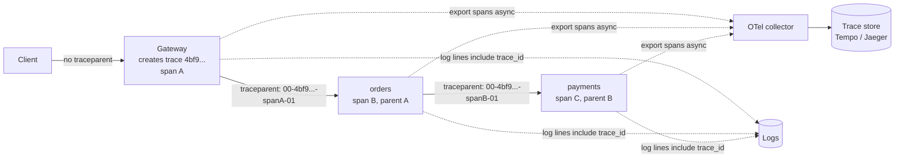

# Observability: Metrics, Logs and Traces

## 1. One-line summary

Observability is being able to answer "what is the system doing right now, and why is this request slow or failing?" from the outside, using three signals: **metrics** (cheap numbers over time), **logs** (detailed per-event records) and **traces** (the path and timing of one request across services).

---

## 2. The problem it solves

**The pain:** at 03:00 you're paged: "checkout is slow". A request goes `gateway → orders → inventory → payments → bank`. You have:

- CPU graphs for each service: all look fine.
- Logs on 200 pods: grepping them for one user's request takes 20 minutes, and the log lines from different services have nothing linking them.
- An "average latency" graph: 120 ms, normal. Yet 1% of users wait 8 seconds.

You can't tell **which hop** is slow, **how many users** are affected, or **whether it's getting better**.

**The fix:**
- **Metrics** with percentiles tell you *that* something is wrong and how big it is (p99 = 8 s on `/checkout`, 2% errors).
- **Traces** tell you *where*: the `payments → bank` span takes 7.8 s.
- **Logs**, found via the trace ID, tell you *why*: `bank API: connection pool exhausted`.
- **SLOs** tell you *whether to wake up at all*.

> Infra analogy: you already run Prometheus + Grafana (metrics), Loki/ELK (logs) and maybe Jaeger/Tempo (traces). This file is about using them as a system design tool, not just installing them.

---

## 3. How it works

### 3.1 The three signals

| | **Metrics** | **Logs** | **Traces** |
|---|---|---|---|
| What | Numeric time series: `http_requests_total{route="/orders",status="500"}` | One text/JSON record per event | Tree of **spans** (one timed operation each) for one request |
| Cost | Tiny, fixed per series (not per request) | Proportional to traffic: 50k req/s × 1 KB = 50 MB/s ≈ 4.3 TB/day | Proportional to traffic × hops, so **sampled** |
| Best for | Dashboards, alerts, trends | Debugging details, audits | Finding the slow/failing hop |
| Tools | Prometheus, Datadog, CloudWatch | Loki, Elasticsearch, Splunk | Jaeger, Tempo, Zipkin, Datadog APM |

**OpenTelemetry (OTel)** is the vendor-neutral standard and SDK set for producing all three; a Java agent can instrument Spring, JDBC and HTTP clients without code changes.

### 3.2 What to measure: RED and USE

- **RED** for **request-driven services** (gateways, APIs): **R**ate (req/s), **E**rrors (failed req/s or %), **D**uration (latency distribution). Per route, per status class, per upstream service.
- **USE** for **resources** (CPU, disks, connection pools, queues): **U**tilization (% busy), **S**aturation (work waiting: queue length, threads waiting for CPU), **E**rrors.
- Plus the "golden signals" from Google's SRE book: latency, traffic, errors, **saturation**. Same idea.

For a gateway: RED per route and per backend cluster, plus USE on CPU, open connections, and connection-pool usage to each backend.

### 3.3 Percentiles, not averages

A **percentile** p99 = the latency that 99% of requests are faster than.

```
1,000 requests: 990 take 50 ms, 10 take 5,000 ms
average = (990 × 50 + 10 × 5,000) / 1,000 = (49,500 + 50,000) / 1,000 ≈ 100 ms   ← looks fine
p50 = 50 ms, p99 = 50 ms (the 990th fastest), p99.9 = 5,000 ms                    ← reveals the tail
```

- **Tail latency amplifies** with fan-out: if a page calls 10 backends in parallel, each with 1% slow requests, the chance that at least one is slow is `1 − 0.99^10 ≈ 9.6%`.
- You **cannot average percentiles** across pods (average of 20 pods' p99 is not the fleet p99). Record **histograms** (counts per latency bucket) and compute percentiles from the merged buckets.

### 3.4 Distributed tracing



- The first hop (the gateway) creates a **trace ID** (16 random bytes) and a **span ID** for its own work.
- It passes them downstream in the **W3C `traceparent` header**: `00-<trace-id>-<parent-span-id>-<flags>`; the last field's `01` bit means "sampled".
- Each service creates a child span, records start/end time and tags, and forwards a new `traceparent`. Spans are sent **asynchronously** to a collector, never blocking the request.
- Put the `trace_id` in **every log line** so you can jump from a slow trace to its logs.
- The gateway must **not trust** a client's `traceparent` blindly for sampling decisions (a client could force 100% sampling); it may start a new trace or keep the ID but decide sampling itself.

**Sampling** keeps cost bounded:
- **Head sampling**: decide at the first hop (e.g. keep 1%), propagate the decision. Cheap, but may miss the rare slow request.
- **Tail sampling**: the collector buffers all spans of a trace for ~10–30 s, then keeps all errors and slow traces plus 1% of the rest. Better signal, more collector memory.
- Numbers: 50k req/s × 5 spans × 500 bytes = 125 MB/s unsampled; at 1% ≈ 1.25 MB/s.

### 3.5 Cardinality explosions

**Cardinality** = number of distinct time series = product of distinct values of each label.

```
http_requests_total{route, method, status}:   200 routes × 5 methods × 10 statuses = 10,000 series  ✔
add label user_id with 10M users:              10,000 × 10,000,000 = 10^11 series                   ✘
```

Each series costs memory in Prometheus (~a few KB), so a "small" label like `user_id`, `api_key`, full URL path (`/orders/12345`) or `trace_id` can take the metrics system down. Rule: **labels have bounded values** (route templates like `/orders/{id}`, status class, backend cluster). Per-user or per-API-key detail goes to logs/traces, or a top-K analytics pipeline.

### 3.6 SLIs, SLOs and error budgets

- **SLI** (service level indicator): a measured ratio, e.g. "requests answered successfully within 300 ms ÷ all requests".
- **SLO** (objective): the target for the SLI, e.g. **99.9% over 30 days**.
- **Error budget**: what's left: `0.1% × 30 days × 24 h × 60 min = 43.2 minutes` of full outage per month, or 0.1% of requests.
- **SLA** (agreement): a contractual promise with penalties, set looser than the SLO.
- Alert on **burn rate** (how fast the budget is being spent): e.g. burning 14.4× normal for 1 h means 2% of the monthly budget in one hour: page. Slow burns open a ticket instead. This replaces noisy "CPU > 80%" pages.
- If the budget is spent, slow down risky deploys; if plenty is left, ship faster.

---

## 4. When to use it

- Every service: RED metrics per endpoint and histograms from day one.
- Gateways and meshes: the natural place to emit uniform RED metrics, access logs and to **start traces**, since every request passes through.
- Traces whenever a request crosses more than ~2 services.
- SLOs for anything with users or on-call.

## 5. When NOT to use it (and why it's a mistake)

| Situation | Why it's a mistake |
|---|---|
| Logging full request/response bodies at 50k req/s | Terabytes per day, cost explodes, and you log PII (personal data) and tokens. |
| Unbounded labels (user ID, URL with IDs) on metrics | Cardinality explosion; the metrics backend falls over during the incident you need it for. |
| 100% trace sampling at high QPS (queries per second) | Collector and storage cost larger than the service itself. |
| Alerting on causes (CPU, GC: JVM garbage-collection pauses) instead of symptoms (SLO burn) | Pages for things users never notice; misses real user pain. |
| Synchronous log/trace export on the request path | A slow log backend makes your API slow. |

---

## 6. Commonly confused with

| | **Monitoring** | **Observability** | **Logging** | **Tracing** |
|---|---|---|---|---|
| Question | "Is a known thing broken?" | "Why is it broken, including things I didn't predict?" | "What exactly happened in this event?" | "Where did this request spend its time?" |
| Built from | Predefined dashboards and alerts | Metrics + logs + traces with shared IDs/labels | Log records | Spans linked by trace ID |
| Example | Alert: error rate > 1% | Slice p99 by route, region, backend, version | `payment declined: insufficient funds` | 7.8 s in `payments → bank` |

Also: **SLO vs SLA** (internal target vs contract), **average vs percentile**.

---

## 7. Common mistakes / misuse

1. **Averages on dashboards** hiding the tail.
2. **Averaging percentiles** across instances instead of merging histograms.
3. **No trace ID in logs**, so traces and logs can't be joined.
4. **Dropping `traceparent`** at one hop (custom HTTP client, async queue) and breaking every trace there; for queues, put it in message headers.
5. **High-cardinality labels.**
6. **Alerting on everything** → alert fatigue → real pages ignored.
7. **Counting 4xx as service errors** in the SLO: a client's bad request isn't your outage (but a 429 from your own limiter might be worth tracking).

---

## 8. Interview cheat-sheet

> "Every gateway node emits RED metrics, request rate, error rate and latency histograms, labelled by route template, status class and backend, never by user or API key, to keep cardinality bounded; per-key detail goes to access logs. I look at p99, not averages, and compute it from merged histograms. The gateway starts a trace for each request and propagates the W3C traceparent header to backends, which add child spans; we head-sample around 1% plus tail-sample all errors and slow requests, and every log line carries the trace ID. Alerts are on SLO burn rate: for a 99.9% monthly availability SLO the error budget is about 43 minutes, and we page only when it's burning fast."

---

## 9. Used in

- [API gateway](../interviews/api-gateway/README.md): **observability at the edge**: access logs, RED metrics per route/backend, starting and propagating traces (`traceparent`), sampling, cardinality of per-API-key metrics, and gateway SLOs.
- [Web crawler](../interviews/web-crawler/README.md): crawler health metrics: pages/s by status, frontier size per priority, **top hosts by frontier size** as a trap detector, DNS cache hit rate, waste rate and freshness of pages users actually see.
- [Search autocomplete](../interviews/search-autocomplete/README.md): serving metrics (p99, empty-result rate, cache hit rate) as guardrails next to product metrics (acceptance rate, keystrokes saved), plus alerts on unusual trending volume.
- Related: [back-of-the-envelope](back-of-the-envelope.md) (log and trace volume sizing), [service mesh and Envoy](../technologies/service-mesh-and-envoy.md) (per-hop telemetry), [resilience patterns](resilience-patterns.md) (what to alert on when breakers open or load is shed), [Kafka](../technologies/kafka.md) (shipping logs and events).
