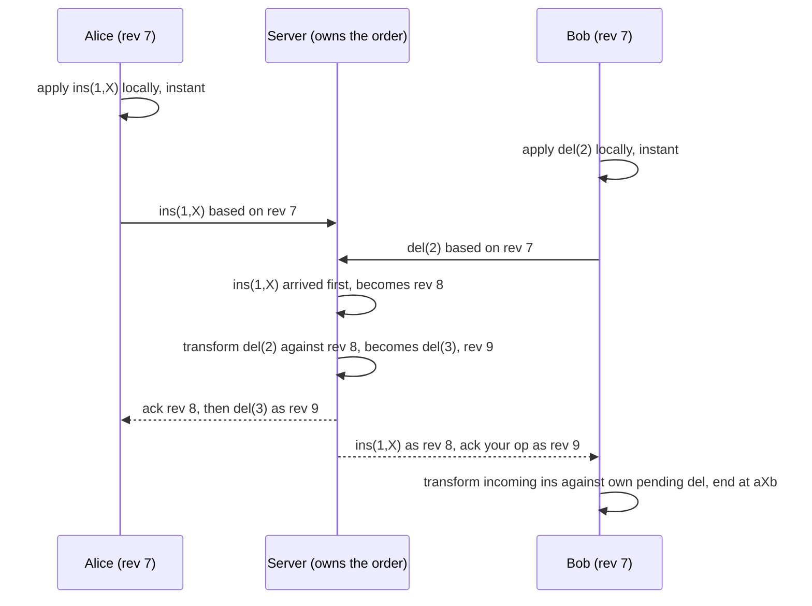
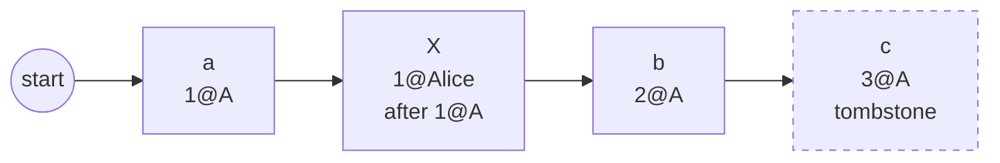

# Operational Transformation and CRDTs (concurrent text editing)

## 1. One-line summary

When two people edit the same document at the same moment, each edit was made against a version of the text the other person no longer has; **Operational Transformation (OT)** fixes this by **rewriting** an incoming edit's position to account for edits it didn't know about (usually with a central server deciding the order), while **CRDTs** avoid positions altogether by giving **every character a permanent unique ID**, so edits can be merged in any order, on any replica, with no server.

💡 **Replica** = one full copy of the document: each user's browser tab holds one, and the server holds one. **Converge** = all replicas end up with the same text once they've seen the same edits.

> Infra analogy: think of two `kubectl apply` runs from different laptops against the same ConfigMap, where each patch says "replace line 7". If someone else inserted a line above, "line 7" now points at the wrong thing. OT recomputes "line 7 is now line 8"; a CRDT says "replace the line with ID `x91`", which never moves.

This file is the text-editing deep dive. For the general problem of concurrent writes on replicas (last-writer-wins, vector clocks, counters and sets as CRDTs), read [vector clocks and conflict resolution](vector-clocks-and-conflict-resolution.md) first; this file doesn't repeat it.

---

## 2. The problem it solves

Alice and Bob both have `"abc"` open. Each edit is described by a **position** (a 0-based index into the string):

```
Alice: insert "X" at 1   → her screen: "aXbc"
Bob:   delete at 2 (the "c") → his screen: "ab"
```

Each sends their operation to the other. Two naive options both fail:

| Approach | What happens | Result |
|---|---|---|
| **Send whole document, last write wins** | Alice's `"aXbc"` and Bob's `"ab"` race to the server; the later one replaces the other | One person's edit is silently lost |
| **Send the operation, apply it as-is** | Alice applies Bob's `delete at 2` to `"aXbc"` and deletes `"b"`, not `"c"` | Alice has `"aXc"`, Bob has `"aXb"`: **replicas diverge forever** |

The core issue: **positions shift**. Alice's insert pushed every character after index 1 one place to the right, so Bob's "index 2" means a different character on Alice's screen. Locking the document ("only one editor at a time") would fix it, but nobody wants to wait for a lock to type a letter, and on a 150 ms network every keystroke would feel slow.

What we want: every user types into their **local** copy instantly (no network wait), edits are exchanged in the background, and everyone ends up with the same text that **keeps every user's intent** (Alice's X is there, Bob's c is gone).

---

## 3. How it works

### 3.1 OT: transform the position, not the text

An **operation** is a small description of one edit: `ins(pos, char)` or `del(pos)`. OT defines one function:

```
transform(a, b) → a'    "rewrite a so it can run AFTER b has already been applied"
```

The rules for single characters:

| a \ b | b = `ins(q)` | b = `del(q)` |
|---|---|---|
| a = `ins(p)` | `p < q` → unchanged. `p > q` → `p+1`. **`p == q` → tie-break by site ID** (lower ID goes first), both sides must use the same rule | `p <= q` → unchanged. `p > q` → `p-1` |
| a = `del(p)` | `p < q` → unchanged. `p >= q` → `p+1` | `p < q` → unchanged. `p > q` → `p-1`. **`p == q` → no-op** (both deleted the same char, delete it once) |

💡 **Site ID** = a unique number per editor (per client). Without a deterministic tie-break, Alice would put her X before Bob's Y and Bob would put Y before X.

**The worked example on `"abc"`:**

```
Alice: a = ins(1,'X')      Bob: b = del(2)

Alice's replica:  "abc" --a--> "aXbc" --transform(b, a)--> del(2) becomes del(3)  (2 >= 1, shift right)
                                     --del(3)--> "aXb"
Bob's replica:    "abc" --b--> "ab"   --transform(a, b)--> ins(1,'X') unchanged     (1 <= 2)
                                     --ins(1,'X')--> "aXb"
Both: "aXb"  ✔  X inserted, c deleted, nobody lost anything
```

The property that guarantees two replicas agree is called **TP1** (transformation property 1): applying `a` then `transform(b, a)` gives the same text as applying `b` then `transform(a, b)`.

### 3.2 Runnable demo (Node 22, no dependencies)

```js
// ot.js: transform for single-character insert/delete, two replicas converge.
// Op shapes: { type: 'ins', pos, ch, site }  or  { type: 'del', pos, site }
function apply(doc, op) {
  if (op.type === 'noop') return doc;
  if (op.type === 'ins') return doc.slice(0, op.pos) + op.ch + doc.slice(op.pos);
  return doc.slice(0, op.pos) + doc.slice(op.pos + 1);
}

// transform(a, b): rewrite a so it can run AFTER b has already been applied.
function transform(a, b) {
  if (a.type === 'noop' || b.type === 'noop') return a;
  const shift = (d) => ({ ...a, pos: a.pos + d });
  if (a.type === 'ins' && b.type === 'ins') {
    // same spot: lower site id goes first (a fixed tie-break both sides agree on)
    if (a.pos < b.pos || (a.pos === b.pos && a.site < b.site)) return a;
    return shift(+1);
  }
  if (a.type === 'ins' && b.type === 'del') return a.pos <= b.pos ? a : shift(-1);
  if (a.type === 'del' && b.type === 'ins') return a.pos < b.pos ? a : shift(+1);
  // del / del
  if (a.pos < b.pos) return a;
  if (a.pos > b.pos) return shift(-1);
  return { type: 'noop' }; // both deleted the same char: delete only once
}

function show(op) {
  return op.type === 'noop' ? 'noop' : `${op.type}(${op.pos}${op.ch ? ",'" + op.ch + "'" : ''})`;
}

function run(title, start, opA, opB) {
  // Replica A applies its own op, then B's op transformed against it, and vice versa.
  const bOnA = transform(opB, opA);
  const aOnB = transform(opA, opB);
  const docA = apply(apply(start, opA), bOnA);
  const docB = apply(apply(start, opB), aOnB);
  const naiveA = apply(apply(start, opA), opB); // no transform: what goes wrong
  console.log(`${title}: start "${start}"  Alice ${show(opA)}  Bob ${show(opB)}`);
  console.log(`  Alice gets ${show(opB)} -> ${show(bOnA)}  => "${docA}"`);
  console.log(`  Bob   gets ${show(opA)} -> ${show(aOnB)}  => "${docB}"`);
  console.log(`  without transform Alice would have "${naiveA}"  converged: ${docA === docB}`);
}

run('insert/delete', 'abc', { type: 'ins', pos: 1, ch: 'X', site: 1 }, { type: 'del', pos: 2, site: 2 });
run('insert/insert', 'abc', { type: 'ins', pos: 1, ch: 'X', site: 1 }, { type: 'ins', pos: 1, ch: 'Y', site: 2 });
run('delete/delete', 'abc', { type: 'del', pos: 1, site: 1 }, { type: 'del', pos: 1, site: 2 });
```

Real output of `node ot.js`:

```
insert/delete: start "abc"  Alice ins(1,'X')  Bob del(2)
  Alice gets del(2) -> del(3)  => "aXb"
  Bob   gets ins(1,'X') -> ins(1,'X')  => "aXb"
  without transform Alice would have "aXc"  converged: true
insert/insert: start "abc"  Alice ins(1,'X')  Bob ins(1,'Y')
  Alice gets ins(1,'Y') -> ins(2,'Y')  => "aXYbc"
  Bob   gets ins(1,'X') -> ins(1,'X')  => "aXYbc"
  without transform Alice would have "aYXbc"  converged: true
delete/delete: start "abc"  Alice del(1)  Bob del(1)
  Alice gets del(1) -> noop  => "ac"
  Bob   gets del(1) -> noop  => "ac"
  without transform Alice would have "a"  converged: true
```

Note the delete/delete case: without the no-op rule, both deletes run and `"b"` **and** `"c"` disappear.

Real editors use multi-character operations (`retain 5, insert "hello", delete 3`), which need the same rules applied to ranges, plus rules for overlapping range deletes. The idea is identical; the case analysis is longer.

### 3.3 Why OT is (almost) always run with a central server

With two replicas, TP1 is enough. With three or more peers exchanging operations directly, ops can arrive in different orders at different peers, and you also need **TP2**: transforming an op `c` against `a`-then-`b` must give the same result as against `b`-then-`a`. Many published peer-to-peer OT algorithms were later shown to break TP2 in corner cases (the original 1989 Ellis and Gibbs algorithm has a known counterexample, often called the "dOPT puzzle"), which is why peer-to-peer OT has a reputation for being notoriously hard to get right.

The practical escape is a **central server that defines one total order** (💡 every operation gets a single global sequence number, so "who came first" has one answer). The lineage:

- **Jupiter** (Xerox PARC, Nichols, Curtis, Dixon, Lamping, UIST 1995) took a distributed OT algorithm and simplified it by routing everything through one server: each client only ever transforms against **one** other party, the server. That reduces the problem to the two-party case where TP1 suffices.
- **Google Wave** (2009) published its OT design as based on Jupiter, and **Google Docs** uses server-ordered OT (Google described its collaboration model in 2010 Drive blog posts; internal details are not public, so treat specifics as unverified).



Each client keeps at most **one operation in flight** plus a buffer of local edits not yet sent; when the server's ack arrives it sends the next batch. The server only needs the operations since the revision a client says it is based on ("my op is based on rev 7"), so it keeps a recent operation log (see [message ordering and sequencing](message-ordering-and-sequencing.md) for the per-document sequence number idea).

### 3.4 CRDTs: stop using positions

A **CRDT** (conflict-free replicated data type) for text gives every character a **unique, never-changing ID** and defines the order of IDs so that every replica sorts them the same way. Operations refer to IDs, not indexes:

```
"abc" stored as:  (a, id=1@A)  (b, id=2@A)  (c, id=3@A)       id = counter@site

Alice: insert X after 1@A, new id 1@Alice       Bob: delete 3@A
```

Bob's delete says "delete the character whose ID is `3@A`". It doesn't matter that Alice's X shifted its index: the ID still points at `c`. Both replicas apply both ops in any order and get `"aXb"`. No transform function, and no server needed to pick an order, because the merge is **commutative** (💡 order doesn't matter: A then B equals B then A) and **idempotent** (💡 applying the same op twice changes nothing, so duplicate delivery is harmless).

Three families of ID schemes:

| Scheme | How a new char gets its place | Notes |
|---|---|---|
| **RGA** (replicated growable array, Roh et al. 2011) | "insert after ID `x`". Concurrent inserts after the same `x` ordered by a timestamp + site ID | Linked-list style. Automerge's text type is RGA-based |
| **Fractional / dense positions** (Logoot 2009, LSEQ) | Pick a position strictly **between** neighbours: between 0.2 and 0.3 choose 0.25, tie-broken by site | Like fractional indexing for list order. IDs can grow long after many inserts in one spot |
| **YATA** (Yjs, 2016) | Insert records left and right neighbours at creation time, a deterministic rule resolves concurrent inserts | Yjs merges consecutive chars typed by one user into one item to save space |



**Tombstones:** a deleted character can't simply be removed, because some other replica may still send "insert after `3@A`". So deletes only **mark** the item as deleted (a **tombstone**). Visible text skips tombstones. Cleaning them up needs to know every replica has seen the delete, which is hard without coordination.

**Metadata overhead:** a naive implementation stores, per character, an ID (site + counter, ~16 bytes) plus links and flags. Illustrative arithmetic, not a measurement of any library:

```
1 MB document ≈ 1,000,000 chars
naive per-char object ≈ 1 char + 16 B id + ~16 B links/flags ≈ 33 B
→ 1,000,000 × 33 B ≈ 33 MB in memory, before tombstones
```

That's why real libraries compress: **Yjs** stores runs of consecutive characters typed by one user as one item, and **Automerge** (2.x) uses a compact columnar binary encoding. Both are production-grade open-source libraries; use one rather than writing your own.

Known quirk: with some schemes, two users typing whole words at the same spot concurrently can see their letters **interleaved** ("HWeolrllod") rather than one word after the other (described by Kleppmann et al. in a 2019 paper on interleaving anomalies). The paper found Logoot and LSEQ prone to it and RGA to a lesser form, so it's worth knowing which scheme your library uses.

### 3.5 Figma: server-authoritative, CRDT-inspired

Figma's 2019 engineering blog post *"How Figma's multiplayer technology works"* (Evan Wallace) is the best-known middle path. As summarised from that post and secondary write-ups (the original page was not reachable while writing this, so wording is paraphrased):

- Clients talk to a server over [WebSockets](../technologies/websockets-and-sse.md). The **server is the central authority** for the final state, so Figma says it does not use "true" CRDTs, just CRDT-inspired structures without the decentralised overhead.
- A design file is a tree of objects with properties. Conflicts are resolved **per property, last writer wins** (two people changing *different* properties of the same rectangle both win).
- Child order uses **fractional indexing** (a position between 0 and 1, insert between two siblings = average of their positions), described in Figma's follow-up post *"Realtime editing of ordered sequences"*.
- Figma chose this over OT because a simpler algorithm was easier to understand and implement. Collaborative editing *inside* one text string is the case this model does not handle well.

Lesson for interviews: you don't have to choose "pure OT" or "pure CRDT". A central server plus simple per-field rules covers most structured data; text within a field is where OT or a text CRDT is needed.

---

## 4. When to use it

- **OT with a server:** a classic web editor (Google-Docs-like) where every client is online through your servers anyway, you want a small wire format (operations are just positions), and the server can order everything.
- **CRDT:** offline-first apps (edit on a plane, merge later), peer-to-peer or multi-region with no single leader, local-first software, or when you'd rather adopt Yjs/Automerge than write transform functions.
- **Hybrid (Figma-style):** structured documents (objects with properties) where last-writer-wins per field is acceptable and a server exists.

## 5. When NOT to use it

- **Single editor at a time** (a wiki page with a lock, a config file in Git): optimistic locking with a version number is far simpler; a merge on save is fine.
- **Data with invariants** ("seats sold ≤ capacity"): neither OT nor CRDTs can enforce a rule across replicas; you need coordination (see [CAP and consistency](cap-and-consistency.md)).
- **Peer-to-peer OT written from scratch**: TP2 bugs show up only under rare interleavings in production. If you have no server, use a CRDT.
- **CRDT for a huge, append-heavy log nobody edits concurrently**: you pay tombstone and ID overhead for merges that never happen.

## 6. Commonly confused with

| | **OT** | **CRDT (text)** | **Last-writer-wins** | **Git three-way merge** |
|---|---|---|---|---|
| Edits refer to | positions (shifted by transform) | unique char IDs | whole value | lines, against a common ancestor |
| Needs central server? | in practice yes (Jupiter-style) | no | no | no, but a human resolves conflicts |
| Concurrent edits | all kept, intent preserved | all kept | one lost | kept, may need manual resolution |
| Metadata | small ops, server keeps op log | IDs + tombstones per char (compressed in Yjs/Automerge) | timestamp | commit graph |
| Offline for days | hard (long transform chains) | natural fit | loses edits | natural (branches) |
| Used by | Google Docs, Google Wave, Jupiter | Yjs, Automerge-based apps | many KV stores | Git |

Also confused: **CRDT vs vector clock**: vector clocks *detect* that two writes were concurrent; a CRDT *merges* them automatically (see [vector clocks](vector-clocks-and-conflict-resolution.md)). For how Git stores history as content-addressed snapshots, see [Git's object store](../../under-the-hood/git-object-store.md).

## 7. Common mistakes / misuse

1. **"We'll use last-writer-wins on the document"**: loses whole paragraphs of a collaborator's work.
2. **Sending positions without transforming**: replicas diverge permanently, and nobody notices until a user reports two different texts.
3. **No deterministic tie-break** for two inserts at the same position: replicas order X and Y differently.
4. **Forgetting the delete/delete case**: the same character is deleted twice and an innocent neighbour disappears.
5. **Claiming OT works peer-to-peer "with a few more cases"**: that's the TP2 trap.
6. **Ignoring CRDT tombstones and metadata** in capacity estimates, or claiming tombstones can be dropped immediately.
7. **Treating cursor positions as document edits**: cursors are ephemeral presence data, see [real-time collaboration and presence](real-time-collaboration-and-presence.md).

## 8. Interview cheat-sheet

> "Every client applies its own edits locally for zero latency, so concurrent edits are made against different versions, and positions shift. The classic fix is operational transformation: each op carries the revision it was based on, a single server per document assigns a global order, and an incoming op is transformed against everything it missed. Insert after an earlier insert shifts right, after an earlier delete shifts left, a delete of an already-deleted char becomes a no-op, and same-position inserts are tie-broken by client ID. Routing through one server, as in Jupiter and Google Docs, keeps it a two-party problem, avoiding the TP2 property that makes peer-to-peer OT so hard. The alternative is a CRDT like Yjs or Automerge: each character gets a unique ID, ops refer to IDs, merges commute, so it works offline and without a server, at the cost of per-character metadata and tombstones. I'd pick server-ordered OT or a server-hosted CRDT for a Docs-style product, and a CRDT if offline editing is a core requirement."

## 9. Used in

- [Collaborative document editor](../interviews/collaborative-editor/README.md): **concurrent edit resolution**: why last-writer-wins fails, transform rules with a per-document server ordering ops, and CRDTs as the offline-first / serverless alternative, with the OT vs CRDT trade-off as the main deep dive.
- Related: [real-time collaboration and presence](real-time-collaboration-and-presence.md), [vector clocks and conflict resolution](vector-clocks-and-conflict-resolution.md), [message ordering and sequencing](message-ordering-and-sequencing.md), [idempotency and delivery semantics](idempotency-and-delivery-semantics.md), [CAP and consistency](cap-and-consistency.md), [WebSockets and SSE](../technologies/websockets-and-sse.md), [Command and Memento](../../LLD/concepts/command-and-memento.md) (undo in a single-user editor), [Git's object store](../../under-the-hood/git-object-store.md) (version history).
