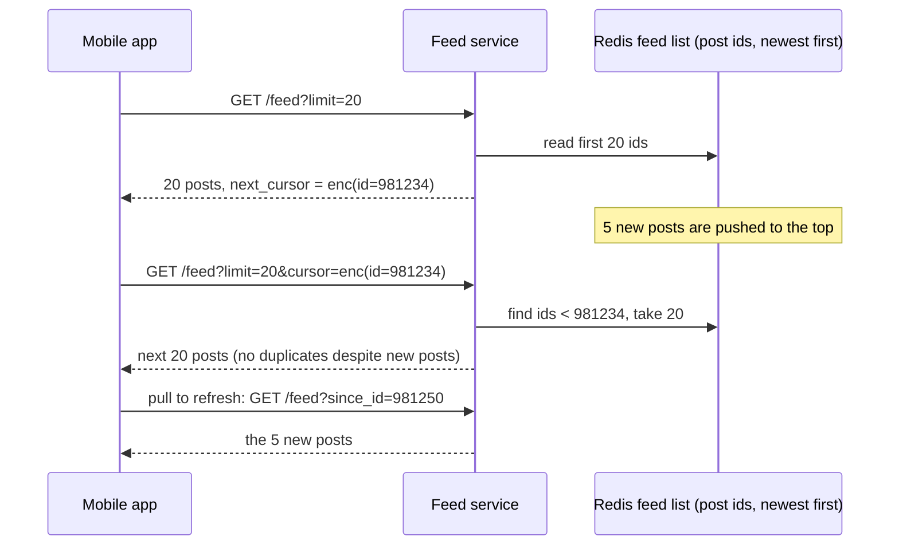

# Pagination (offset vs cursor)

## 1. One-line summary

**Pagination** returns a long list in pages. **Offset pagination** says "skip 40, give me 20"; **cursor (keyset) pagination** says "give me 20 items that come after *this* item". On live feeds and deep pages, cursors are the correct choice: they don't duplicate or skip items when new data arrives, and they stay fast at any depth.

💡 **Keyset** = you page by the values of the sort key (e.g. `created_at, id`) instead of by row position. A **cursor** is a token the server hands back meaning "you stopped here".

---

## 2. The problem it solves

**The pain:** the feed API started as:

```
GET /feed?page=3&size=20     →  SELECT ... ORDER BY created_at DESC LIMIT 20 OFFSET 40
```

Two things go wrong:

1. **Live data shifts the window.** The user loads page 1 (posts 1–20). While they read, 5 new posts arrive at the top. Page 2 = `OFFSET 20` now starts at old post #16, so posts 16–20 show **again** (duplicates). If 5 posts are deleted instead, 5 posts are **skipped** silently.
2. **Deep pages get slow.** `OFFSET 100000` makes the database read and throw away 100,000 rows before returning 20. Page cost grows linearly with depth: page 1 takes 1 ms, page 5,000 takes hundreds of ms and burns DB CPU.

**The fix:** remember the **last item** the client saw and ask for "the next 20 strictly after it". New items at the top don't move that anchor, and the DB jumps straight to it with an index seek.

> Infra analogy: reading a Kafka topic by **offset in the log** (a stable position you commit) vs "give me message number 40 counting from the newest", which changes every time someone produces.

---

## 3. How it works

### 3.1 Offset vs keyset in SQL

```sql
-- Offset: DB walks 40 rows and discards them
SELECT id, author_id, created_at FROM posts
WHERE author_id = 7
ORDER BY created_at DESC, id DESC
LIMIT 20 OFFSET 40;

-- Keyset: DB seeks directly to the anchor using the index on (author_id, created_at, id)
SELECT id, author_id, created_at FROM posts
WHERE author_id = 7
  AND (created_at, id) < ('2026-10-08 09:15:00', 981234)   -- last item of previous page
ORDER BY created_at DESC, id DESC
LIMIT 20;
```

The `(created_at, id) < (...)` **row comparison** works in [PostgreSQL](../technologies/postgresql.md) and MySQL 8. The index makes it a **seek** (jump in the B-tree to the anchor) plus 20 sequential reads, so page 5,000 costs the same as page 1. 💡 A **B-tree** is the sorted tree structure DB indexes use; finding any key costs ~3–4 page reads.

| Depth | Offset cost (rows touched) | Keyset cost (rows touched) |
|---|---|---|
| Page 1 (offset 0) | 20 | 20 + index seek |
| Page 100 (offset 1,980) | 2,000 | 20 + index seek |
| Page 5,000 (offset 99,980) | 100,000 | 20 + index seek |

### 3.2 Stable, unique ordering (the tiebreaker)

Keyset only works if the sort order is **total**: no two rows may tie. `created_at` alone is not unique (two posts in the same millisecond), so a page boundary falling between them would skip or repeat one. Always add a unique tiebreaker: `ORDER BY created_at DESC, id DESC`.

Even simpler: if IDs are **time-ordered** (Snowflake IDs, see [ID generation](id-generation.md)), `ORDER BY id DESC` alone is both chronological and unique, and the cursor is just the last ID.

### 3.3 Opaque cursors

Don't expose raw columns as query parameters. Encode the anchor into an **opaque** token (the client can't read or build it; it just passes it back):

```
cursor JSON:  {"v":1,"id":981234,"ts":1791450900000}
base64url  →  eyJ2IjoxLCJpZCI6OTgxMjM0LCJ0cyI6MTc5MTQ1MDkwMDAwMH0
```

Why opaque:

- You can change what's inside later (add a ranking score, a snapshot id) without breaking clients. The `"v":1` field is a version.
- Clients can't craft cursors to scrape or jump around. Optionally **sign it** (HMAC) so tampering is detected.
- For a **ranked feed**, the cursor can hold `{rankedListId, position}` or `{lastScore, lastId}`; the order is not time, but the principle is the same: "continue after this item in this ordering".

### 3.4 REST shape

```http
GET /v1/feed?limit=20
200 OK
{
  "items": [ {"id": 981250, ...}, ..., {"id": 981234, ...} ],
  "next_cursor": "eyJ2IjoxLCJpZCI6OTgxMjM0fQ",
  "has_more": true
}

GET /v1/feed?limit=20&cursor=eyJ2IjoxLCJpZCI6OTgxMjM0fQ
```

- `next_cursor` is `null` (or `has_more: false`) at the end.
- **Page size limits:** default 20, **max 100** enforced server-side. A client asking `limit=100000` must not be able to pull a whole table in one call.
- For "pull to refresh" (new items above what you have), use a second cursor: `?before_cursor=` / `since_id=` returning items **newer** than the first one shown.



### 3.5 Cursors over a cache list

In the news feed, page 1 usually comes from a **Redis list or sorted set of post IDs**, not SQL. With a sorted set scored by post ID (or timestamp), the keyset query is `ZREVRANGEBYSCORE feed:42 (981234 -inf LIMIT 0 20` (the `(` means "strictly less than"). When the cached list (~500–800 ids) runs out, the cursor tells the service to continue from the database or the fan-out-on-read path, starting at the same anchor.

---

## 4. When to use it

- **Cursor/keyset:** infinite scroll, feeds, timelines, chat history, activity logs, batch jobs walking a big table (`WHERE id > :last LIMIT 1000`), public APIs (GitHub, Stripe, Slack all use cursors).
- **Offset:** small, mostly static lists where users need "jump to page 7 of 12": admin tables, search results UI with page numbers, reports.

## 5. When NOT to use it (and why it's a mistake)

| Situation | Why |
|---|---|
| Offset on a live feed | New posts shift the window: duplicates and skips. |
| Offset for deep pages or batch jobs | `OFFSET 9,000,000` scans 9M rows; each page slower than the last. |
| Cursor when users need "go to page 37" | Keyset can only go forward/backward from an anchor, not jump. Use offset (with a depth cap) or search. |
| Cursor on a non-unique sort key | Ties at page boundaries skip/repeat rows. Add `id` as a tiebreaker. |

---

## 6. Commonly confused with

| | **Offset** | **Keyset / cursor** | **Page token over a snapshot** | **Server-side DB cursor** |
|---|---|---|---|---|
| Client sends | `page`/`offset` + `limit` | Opaque token with last sort key | Token with snapshot id + position | Nothing; connection holds state |
| Live inserts | Duplicates/skips | Correct | Correct (frozen view) | Correct within transaction |
| Deep pages | Slow (O(offset)) | Fast (index seek) | Fast | Fast |
| Random jump | Yes | No | Limited | No |
| Stateless server | Yes | Yes | Needs snapshot storage (TTL) | No, holds a DB connection |
| Typical use | Admin tables | Feeds, APIs | Ranked feeds, search | ETL inside one session |

The **database cursor** (`DECLARE c CURSOR FOR ...` in SQL) is a different thing: it keeps a connection open; never use it for HTTP pagination across requests.

---

## 7. Common mistakes / misuse

1. **`OFFSET` in an expansion job** over 10M users (see [fan-out](fan-out.md)): the job slows to a crawl near the end.
2. **No tiebreaker** in `ORDER BY`.
3. **Exposing `?last_id=` raw**, then being unable to change the ordering later without breaking clients.
4. **No max page size**, enabling one request to dump a table.
5. **Re-ranking a ranked feed on every page**, so the order changes under the user. Snapshot the ranked list (TTL ~30 min) and page through the snapshot ([feed ranking](feed-ranking.md)).
6. **Returning `total_count`** on every page of a huge feed: `COUNT(*)` is expensive and meaningless on a live feed. Return `has_more` instead.

---

## 8. Interview cheat-sheet

> "The feed uses cursor pagination, not offset. Offset breaks on a live feed: if five posts arrive while I'm reading page one, page two repeats five posts, and deep offsets make the database scan and discard rows. A cursor encodes the last item I saw, for example the last post's Snowflake ID, which is unique and time-ordered, and the next page is 'items strictly older than that', which is an index seek costing the same at any depth. The cursor is opaque base64 with a version, so we can later put a ranking score or snapshot id inside. Page size defaults to 20 with a server-enforced max of 100, and pull-to-refresh uses a since_id in the other direction."

---

## 9. Used in

- [News feed](../interviews/news-feed/README.md): **`GET /feed` pagination** with an opaque cursor over the Redis feed list and the merged celebrity posts; snapshotting the ranked list so pages are stable.
- [Notification system](../interviews/notification-system/README.md): the broadcast expansion job pages through users with keyset pagination (via [fan-out](fan-out.md)).
- Related: [ID generation](id-generation.md) (time-ordered IDs as cursors), [PostgreSQL](../technologies/postgresql.md) (row comparisons, indexes), [Redis](../technologies/redis.md) (sorted-set range queries), [feed ranking](feed-ranking.md).
