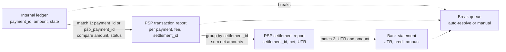

# Payment Reconciliation

## 1. One-line summary

**Reconciliation ("recon")** is the regular job of comparing **your own record of payments** with the **payment provider's report** and the **bank statement**, line by line, so that every rupee is accounted for and every disagreement (a "break") is found, explained and fixed.

---

## 2. The problem it solves

**The pain:** your `payments` table says 1,00,000 payments succeeded yesterday for ₹5.2 crore. The PSP's report (PSP = payment service provider like Razorpay or Stripe, see [payment gateways and PSPs](../technologies/payment-gateways-and-psps.md)) says 1,00,003. The bank credited ₹5.09 crore. Which number is right? Usually **none of them is wrong**: they disagree for ordinary reasons.

| Reason | What it looks like |
|---|---|
| **Timeout with unknown outcome** | We called "create payment", the connection dropped, we marked it `PENDING` (or worse, `FAILED`), but the PSP charged the customer. |
| **Webhook lost or duplicated** | A webhook (the PSP calling our HTTPS endpoint with a result) never arrived, so we still say `PENDING`. Or it came twice and a buggy handler counted it twice. |
| **Partial capture / partial refund** | We expected ₹1,200, the PSP captured ₹1,000. A refund of 1 item out of 3 was processed at the PSP but not recorded by us. |
| **Fees and taxes** | The bank receives gross minus MDR (merchant discount rate, the PSP's % fee) minus GST on that fee. |
| **Currency** | International cards charged in USD, settled in INR at the PSP's rate. |
| **Settlement batching** | The PSP pays one lump sum per day for thousands of payments, minus refunds and chargebacks (customer disputes) from other days. |
| **Cut-off times** | A payment at 23:59:30 is "yesterday" for us and "today" in the PSP's report (time zones too: UTC vs IST). |

Without recon, these become: customers charged but no order (angry tweets), orders shipped but never paid (lost money), and books that don't close (auditors and RBI rules require reconciled accounts).

> Infra analogy: recon is a **drift detector**, like comparing your Terraform state, the cloud's actual resources and the billing invoice. Each is "the truth" from its own point of view, and drift is normal; the job is to detect it daily and fix it before it compounds.

---

## 3. How it works

### 3.1 Three sources of truth

| Source | Who writes it | What it knows | Key it carries |
|---|---|---|---|
| **Internal ledger / payments table** | Us | Order, user, amount we intended, our state | Our `payment_id` (we also send it to the PSP as `receipt` / metadata) |
| **PSP reports** (transaction report + settlement report, via API or a daily CSV file dropped on SFTP, a secure file-transfer server) | PSP | What actually got authorized, captured, refunded, fees, which settlement batch each item went into | `psp_payment_id` (e.g. `pay_Nx...`), our `payment_id` echoed back, `settlement_id` |
| **Bank statement** | Our bank | Money that actually landed in our account | **UTR** + amount + narration |

> 💡 **UTR (Unique Transaction Reference)**: the reference number Indian banks assign to every inter-bank transfer (NEFT, RTGS, IMPS, UPI). Blog sources commonly cite 16 characters for NEFT, 22 for RTGS and 12 digits for UPI/IMPS (where it's also called RRN); treat the formats as unverified and match on the value, don't parse it. The PSP's settlement report lists the UTR of each payout, which is how you tie a bank credit to a settlement batch.

The internal ledger should be a proper append-only [ledger](../../LLD/concepts/ledgers-and-event-sourcing.md), ideally double-entry ([double-entry ledgers](../../under-the-hood/double-entry-ledgers.md)), so you can say exactly what you believed at any time.

### 3.2 Two-way and three-way matching



- **Two-way match**: ledger ↔ PSP transactions, per payment. Key: our `payment_id` (best, because we chose it) or the `psp_payment_id` we stored. Compare amount, currency, status.
- **Three-way match**: also check that the PSP's settlement batches add up and match bank credits. `Σ(gross) − Σ(fees + GST) − Σ(refunds) − Σ(chargebacks) = net payout`, and the net payout appears in the bank statement with the same UTR.

Example settlement check (illustrative fee of 2% + 18% GST on the fee):

```
gross captured  : 1,000 payments x ₹500        = ₹5,00,000.00
fees            : 2% of 5,00,000               = ₹10,000.00
GST on fees     : 18% of 10,000                = ₹1,800.00
refunds         :                                ₹12,000.00
net payout      : 5,00,000 - 10,000 - 1,800 - 12,000 = ₹4,76,200.00
bank credit     : UTR AXISR52025100900123, ₹4,76,200.00  -> matched
```

Do this arithmetic in integer paise or `BigDecimal` ([BigDecimal and money](../../LLD/libraries/java/bigdecimal-and-money.md)); fee rounding per transaction vs per batch is itself a common source of 1-paisa breaks ([splitting money and rounding](../../LLD/concepts/splitting-money-and-rounding.md)).

### 3.3 Types of breaks and what to do

| Break | Example | Typical cause | Resolution |
|---|---|---|---|
| **Missing on our side** | PSP has a captured payment we have no record of / still `PENDING` | Timeout, lost webhook, crash before DB write | If it maps to an order: mark success and fulfil. If no order exists or the order was cancelled: **refund** it. |
| **Missing on their side** | We say `SUCCESS`, PSP has nothing | Bug that trusted a browser redirect, or a forged webhook, or the PSP report is late | Re-query PSP status API. If truly absent, reverse our entry and hold the order. Security review if repeated. |
| **Amount mismatch** | Ours ₹1,200, PSP ₹1,000 | Partial capture, currency conversion, partial refund not recorded | Fetch the PSP payment detail, post a correcting ledger entry. |
| **Status mismatch** | Ours `PENDING`, PSP `CAPTURED` | Missed webhook | Auto-update via the state machine. |
| **Settlement mismatch** | Net ≠ bank credit | Chargeback deducted, fee change, payout held by PSP | Pull the settlement breakdown, post fee/chargeback entries. |
| **Duplicates** | Two captures for one order | Retry without idempotency key | Refund one, fix the bug. |

### 3.4 Pending state and status-check polling

Recon at end of day is the safety net, but most breaks should be fixed within minutes:

1. When the outcome is unknown, store `PENDING` with `next_check_at`. Never flip to `FAILED` on a timeout ([sagas](sagas-and-distributed-transactions.md) §3.4).
2. A poller asks the PSP `GET /payments/{id}` for rows `PENDING` older than e.g. 2 minutes, with backoff (2 min, 5 min, 15 min, 1 h; see [retries, backoff and DLQ](retries-backoff-and-dlq.md)).
3. Webhooks and polling both feed the **same idempotent** state-transition code ([idempotency](idempotency-and-delivery-semantics.md)), so whichever arrives first wins and the other is a no-op.
4. After a deadline (e.g. 24 h for UPI-style flows), still-unknown payments go to the break queue.

### 3.5 Daily recon job, ageing and the manual queue

A typical pipeline, each step a stage you can rerun:

1. **Ingest** at ~06:00: fetch PSP transaction + settlement reports (API or SFTP), import bank statement (bank API, or an MT940 file, the SWIFT standard text format for bank statements, or CSV). Store raw files untouched for audit.
2. **Normalize**: one schema (`source, key, amount_paise, currency, status, event_date`), convert time zones to one business day.
3. **Match** using keys, in order of confidence: exact `payment_id` → `psp_payment_id` → (amount + date + last 4 card digits) fuzzy match, flagged lower confidence.
4. **Auto-resolve** known patterns: status-only mismatch, PSP report lag (re-check tomorrow), fee rounding ≤ ₹1.
5. **Manual queue** for the rest, with an **ageing report**: breaks bucketed by age (0–1 day, 2–7, 8–30, 30+) and amount. Old breaks are dangerous: refund deadlines pass, chargeback evidence windows close, and month-end books can't close.
6. **Metrics and alerts** ([observability](observability.md)): match rate, break count by type, ₹ value unreconciled. A sudden drop in match rate usually means a bug or a PSP report-format change, not fraud.

### 3.6 Arithmetic at scale: 10M payments/day

```
payments/day              = 10,000,000
avg rate                  = 10,000,000 / 86,400 s ≈ 116 per second
report rows/day (PSP)     ≈ 10M (+ refunds, say 3% = 0.3M)
row size (CSV)            ≈ 200 bytes  -> 10.3M x 200 B ≈ 2 GB/day per source
hash map for matching     ≈ 10M x ~100 B ≈ 1 GB in memory, fine on one box,
                            or a SQL join / Spark (distributed batch engine) job
break rate (assume 0.1%)  = 10,000 breaks/day
auto-resolved (assume 95%)= 9,500
manual                    = 500/day x 3 min = 1,500 min = 25 h of work -> ~3-4 ops people
volume (avg ₹500)         = 10M x ₹500 = ₹500 crore/day
```

The lesson: at 0.1% breaks, auto-resolution rules are what keep the ops team small, and each 1% improvement in auto-resolution saves ~100 manual cases a day.

### 3.7 The core loop in code

A two-way match of our list against a PSP report, keyed by our `payment_id` (run with `java Recon.java`, Java 21):

```java
import java.util.*;

public class Recon {
    record Row(String paymentId, String pspRef, long paise, String status) {}

    public static void main(String[] args) {
        List<Row> ours = List.of(
            new Row("pay_1", "psp_A", 49900, "SUCCESS"),
            new Row("pay_2", "psp_B", 120000, "SUCCESS"),
            new Row("pay_3", null, 25000, "PENDING"),   // timed out, outcome unknown
            new Row("pay_4", "psp_D", 9900, "SUCCESS"));
        List<Row> psp = List.of(
            new Row("pay_1", "psp_A", 49900, "CAPTURED"),
            new Row("pay_2", "psp_B", 100000, "CAPTURED"), // partial capture?
            new Row("pay_3", "psp_C", 25000, "CAPTURED"),  // succeeded at PSP
            new Row("pay_5", "psp_E", 30000, "CAPTURED")); // we have no record

        Map<String, Row> theirs = new LinkedHashMap<>();
        for (Row r : psp) theirs.put(r.paymentId(), r);   // match key: our payment id

        for (Row o : ours) {
            Row t = theirs.remove(o.paymentId());
            if (t == null) {
                System.out.printf("MISSING_AT_PSP  %s %d paise (ours=%s)%n", o.paymentId(), o.paise(), o.status());
            } else if (o.paise() != t.paise()) {
                System.out.printf("AMOUNT_MISMATCH %s ours=%d psp=%d diff=%d%n",
                    o.paymentId(), o.paise(), t.paise(), o.paise() - t.paise());
            } else if (!o.status().equals("SUCCESS")) {
                System.out.printf("STATUS_MISMATCH %s ours=%s psp=%s -> mark SUCCESS, ref %s%n",
                    o.paymentId(), o.status(), t.status(), t.pspRef());
            } else {
                System.out.printf("MATCHED         %s %d paise%n", o.paymentId(), o.paise());
            }
        }
        for (Row t : theirs.values())   // whatever is left exists only at the PSP
            System.out.printf("MISSING_OURS    %s %d paise (psp ref %s)%n", t.paymentId(), t.paise(), t.pspRef());
    }
}
```

Real output:

```
MATCHED         pay_1 49900 paise
AMOUNT_MISMATCH pay_2 ours=120000 psp=100000 diff=20000
STATUS_MISMATCH pay_3 ours=PENDING psp=CAPTURED -> mark SUCCESS, ref psp_C
MISSING_AT_PSP  pay_4 9900 paise (ours=SUCCESS)
MISSING_OURS    pay_5 30000 paise (psp ref psp_E)
```

Each `remove` both matches and marks the PSP row as used, so leftovers are exactly "missing on our side". In production the same idea runs as a `FULL OUTER JOIN` (keep rows from both sides, with NULLs where one side has no match) on `payment_id` in [PostgreSQL](../technologies/postgresql.md) or a data warehouse.

---

## 4. When to use it

- Any system where money crosses a boundary you don't control: PSP, bank, card network, UPI.
- Wallets and marketplaces: reconcile the sum of user wallet balances against the money actually held in the escrow/nodal bank account (a special bank account where a payment company must park customers' money, separate from its own).
- Whenever an operation can end in "unknown" (timeouts), which is every remote payment call.

## 5. When NOT to use it (and why it's a mistake)

| Situation | Why |
|---|---|
| As a **replacement** for idempotency and status polling | Recon finds breaks a day later; a customer charged twice wants a fix now. Prevent first, recon as safety net. |
| Fixing breaks by **editing** ledger rows | Destroys the audit trail. Post correcting entries instead ([ledgers](../../LLD/concepts/ledgers-and-event-sourcing.md)). |
| Internal-only transfers in one DB transaction | Nothing to reconcile with an external party; an invariant check (entries sum to zero) is enough. |
| Real-time per-request matching in the payment path | Recon is batch/async by nature; putting it in the request path adds latency and couples you to report availability. |

---

## 6. Commonly confused with

| | **Reconciliation** | **Status polling** | **Idempotency** | **Saga compensation** |
|---|---|---|---|---|
| When | Daily / hourly batch | Seconds–hours after a call | On every request | When a multi-step flow fails |
| Scope | All payments, all sources | One pending payment | One operation | One business flow |
| Finds | Any disagreement, including fees, settlement | Unknown outcome of one call | Prevents duplicates | Undoes earlier steps |
| Output | Break list, correcting entries, ageing report | Updated state | Same result for repeat calls | Refund / void / reverse |

---

## 7. Common mistakes / misuse

1. **Matching on amount + date only**: two ₹499 payments at the same minute get swapped. Always send your own `payment_id` to the PSP and match on it.
2. **Marking timeouts as FAILED**, then recon finds "captured at PSP, failed with us" for thousands of customers.
3. **Comparing gross with net** and alarming about "missing" money that is just fees.
4. **Ignoring time zones / cut-offs**: payments near midnight look missing every day and get "fixed" twice.
5. **No raw-file archive**: when an auditor asks why a break was closed, you can't show the PSP report you used.
6. **Manual queue without ageing**: breaks sit for months until a chargeback or refund deadline is missed.
7. **Floating-point money**: 1-paisa differences everywhere ([BigDecimal and money](../../LLD/libraries/java/bigdecimal-and-money.md)).
8. **Auto-refunding** everything "missing on our side" without checking for an order: some of those were real orders waiting on a late webhook.

---

## 8. Interview cheat-sheet

> "Our DB, the PSP and the bank will disagree because of timeouts with unknown outcomes, lost or duplicated webhooks, partial refunds, fees and batched settlement. First line of defence is real-time: unknown outcomes stay PENDING and a poller checks the PSP with backoff, through the same idempotent state machine as webhooks. Then a daily recon job ingests PSP transaction and settlement reports and the bank statement, matches ledger to PSP on our payment id, and PSP settlements to bank credits on UTR and net amount. Breaks are classified as missing on our side, missing on theirs, or amount/status mismatch; known patterns auto-resolve with correcting ledger entries, the rest go to a manual queue with an ageing report. At 10M payments a day and a 0.1% break rate that's 10,000 breaks, so auto-resolution is what keeps the ops team small."

---

## 9. Used in

- [Payment system](../interviews/payment-system/README.md): daily reconciliation of the internal ledger against PSP reports and bank statements, pending-state polling, break queue and ageing report, scale arithmetic.
- [Digital wallet](../../LLD/interviews/digital-wallet/README.md) (L6 discussion): reconciling the sum of wallet balances with top-ups and withdrawals at the PSP and bank.
- [Ad click aggregation](../interviews/ad-click-aggregation/README.md): the same idea for clicks: real-time counts reconciled nightly with an exact batch recount before billing.
- Related: [payment gateways and PSPs](../technologies/payment-gateways-and-psps.md), [sagas and distributed transactions](sagas-and-distributed-transactions.md), [idempotency and delivery semantics](idempotency-and-delivery-semantics.md), [retries, backoff and DLQ](retries-backoff-and-dlq.md), [observability](observability.md), [ledgers and event sourcing](../../LLD/concepts/ledgers-and-event-sourcing.md), [state machines](../../LLD/concepts/state-machines.md), [double-entry ledgers](../../under-the-hood/double-entry-ledgers.md), [How UPI works](../../under-the-hood/upi.md).

**Sources:** UTR lengths from Indian fintech blogs (Cashfree, Skydo, 2024–2025), not official NPCI/RBI documents, so unverified. Fee rates, break rates and staffing numbers are illustrative assumptions.
