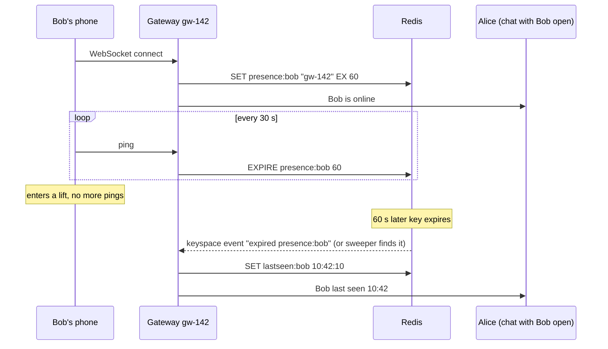

# Presence and Heartbeats

## 1. One-line summary

**Presence** is knowing whether a user is **online** right now, and if not, when they were **last seen**. It's built on **heartbeats**: small "I'm still alive" signals sent every few seconds; if they stop for longer than a timeout, the user (or server, or pod) is considered gone.

---

## 2. The problem it solves

**The pain:** a chat app wants to show "online" under a contact's name. The naive version:

- On WebSocket connect: `UPDATE users SET online = true`. On disconnect: `online = false`.
- But phones rarely disconnect *cleanly*. The user walks into a lift, the OS kills the app, the battery dies. The server never gets a "close" frame, so the TCP connection looks open for minutes (TCP itself may not notice a dead peer for a very long time). The user shows **online for hours**.
- And when it does work, each status change is pushed to everyone who has that user in their contacts. A user with 500 contacts going online/offline 40 times a day = **20,000 pushes/day for one person**.

**The fix:**

1. **Heartbeat + TTL**: the client pings every ~30 s; each ping refreshes a key in [Redis](../technologies/redis.md) that **expires** on its own (TTL = time to live) after ~60 s. No ping → key expires → offline. Dead connections clean themselves up.
2. **Subscribe-on-view**: only send presence updates to people who are **looking** at that user right now (have the chat open), not to all contacts.

> Infra analogy: you already run this. A Kubernetes **liveness probe** is a heartbeat: kubelet hits `/healthz` every `periodSeconds`; after `failureThreshold` misses, the container is restarted. Node heartbeats work the same: each kubelet renews a **Lease** object every 10 s, and the node is marked `NotReady` after ~40 s without renewal. Leader election in etcd/ZooKeeper uses **leases** too: the leader keeps renewing; if it stops, the lease expires and someone else takes over.

---

## 3. How it works

### 3.1 Heartbeat + TTL key



Choosing the numbers:

| Setting | Typical | Why |
|---|---|---|
| Heartbeat interval | 20-30 s | Must be below the [load balancer](../technologies/load-balancer.md) idle timeout (often 60 s), or the LB cuts the socket |
| TTL / timeout | 2-3 × interval (60-90 s) | One lost ping must not mark the user offline |
| Detection delay | ≤ TTL | "Offline" appears up to ~60 s late; acceptable for chat |

Load estimate, 100M concurrent connections, heartbeat every 30 s:

```
100,000,000 ÷ 30 s ≈ 3.3M heartbeats/s
Each heartbeat = 1 Redis EXPIRE → 3.3M ops/s
At ~100k-200k ops/s per Redis shard → ~20-35 shards (plus replicas)
```

Optimizations: the gateway can **batch** (pipeline) refreshes for all its 100k connections every few seconds, or skip the Redis write for users whose key was refreshed recently; any **real message** also counts as a heartbeat. Cheaper still: the gateway itself knows the socket is alive (WebSocket ping/pong) and only writes to Redis on connect, on disconnect, and a periodic "gateway alive" heartbeat; if the gateway dies, all its users' keys expire together.

**Last seen** is a separate, persistent value (`lastseen:bob = timestamp`), written when the user goes offline (or on every heartbeat, coarsened to the minute to save writes). Presence is volatile; last-seen survives Redis restarts if stored in the DB.

### 3.2 Flapping and debounce

**Flapping** = rapidly toggling between two states. A user on a train loses signal for 5 s every minute: online, offline, online, offline. Every toggle is pushed to viewers, the UI flickers, and you pay fan-out for nothing.

**Debounce** = wait for a state to be stable for some time before announcing it:

- Announce **online** immediately (people like seeing it fast).
- Announce **offline** only after the TTL expires **and** no reconnect within a grace period (e.g. 10-30 s). A reconnect within the grace window cancels the "offline" event.
- Rate-limit announcements per user (e.g. at most one change per 10 s).

Same idea as Prometheus `for: 5m` on an alert rule, or hysteresis on an autoscaler: don't react to every blip.

### 3.3 The fan-out cost, and why WhatsApp uses subscribe-on-view

Push-to-all-contacts ([fan-out](fan-out.md) on write) math, 500M daily active users, 200 contacts each, 20 status changes/day:

```
500M × 20 changes × 200 contacts = 2,000,000,000,000 = 2 trillion pushes/day
2 × 10^12 ÷ 86,400 s ≈ 23M pushes/s
```

Most of those go to people who aren't even looking at that contact. So real apps do **subscribe-on-view** (fan-out on read):

| Model | How | Cost |
|---|---|---|
| **Push to all contacts** | Every change sent to every contact's device | ~23M/s, mostly wasted, drains batteries |
| **Subscribe-on-view** | When Alice opens the chat with Bob, her client subscribes to `presence:bob`; unsubscribes when she leaves | Only active viewers: maybe 1-5% of the above |
| **Pull on view** | Opening the chat does `GET presence/bob` once, no live updates | Cheapest; stale while the screen is open |
| **Batch for contact list** | Contact list screen fetches presence of visible rows (e.g. 20) in one call | Bounded, paged |

This is why WhatsApp shows "online"/"last seen" **only at the top of an open chat**, not as green dots across your whole contact list. Large group chats usually show no member presence at all (1,000 members × updates = noise). The subscription itself is routed via [pub/sub](../technologies/pub-sub.md): Alice's gateway subscribes to Bob's presence channel and forwards changes over Alice's socket.

### 3.4 Privacy settings

Presence leaks real information ("he was online at 3 a.m. but didn't reply to me"). Typical controls, all enforced **server-side** before anything is sent:

- **Last seen / online visible to:** everyone / my contacts / nobody / everyone except a list.
- **Reciprocity:** if you hide your last seen, you can't see others' (WhatsApp's rule), which discourages lurking.
- **Blocked users** see nothing.
- Read receipts (blue ticks) are a separate toggle but follow the same pattern.

Implementation: on a subscribe request, check the viewer against the target's privacy setting (cached, since it changes rarely). Never send the data and let the client "hide" it; anyone can inspect the traffic.

### 3.5 Multi-device

A user with phone + laptop + tablet is **online if any device is**. Store presence as a **set** (`presence:bob → {phone@gw-142, web@gw-7}`), each member with its own expiry (e.g. a Redis sorted set scored by expiry time, cleaned by a sweeper). Offline = set empty.

---

## 4. When to use it

- Chat "online / last seen / typing", collaborative editors (who else is in this doc), multiplayer lobbies, support agent availability, ride-hailing driver availability.
- Heartbeats generally: health checks, service registry entries (Consul, Eureka), **leader leases** in [ZooKeeper / etcd](../technologies/zookeeper-etcd.md), session/connection registries for [WebSocket gateways](../technologies/websockets-and-sse.md).

## 5. When NOT to use it (and why it's a mistake)

| Situation | Why | Use instead |
|---|---|---|
| Presence pushed to all contacts / all group members | Trillions of pushes/day, battery drain | Subscribe-on-view or pull |
| Presence in the main SQL DB with `UPDATE` per heartbeat | 3.3M writes/s of throw-away data | In-memory store with TTL (Redis) |
| Exact "offline at 10:42:07.123" | Detection inherently lags by the TTL | Accept ~1 min precision; say so |
| Heartbeat interval of 1-5 s on mobile | Radio never sleeps, battery drain; 6-30× more load | 20-30 s plus OS push for wake-up |

---

## 6. Commonly confused with

| | **Presence** | **Liveness probe** | **Leader lease** | **Session registry** |
|---|---|---|---|---|
| Question answered | "Is this human around?" | "Is this container healthy?" | "Is the leader still alive, may it keep acting?" | "Which gateway holds user X's socket?" |
| On missed heartbeats | Show offline/last seen | Restart container | Lease expires, new leader elected | Entry expires, route to push instead |
| Who sees it | Other users (privacy rules) | kubelet | Cluster members | Backend services only |
| Precision needed | ~1 min is fine | Seconds | Must be safe (fencing tokens) | Seconds |

In chat designs, presence and the session registry are often the **same Redis key** (`userId → gatewayId` with TTL), used for two purposes.

---

## 7. Common mistakes / misuse

1. **Relying on disconnect events.** Mobile connections die silently; only a timeout catches them.
2. **TTL equal to the heartbeat interval.** One delayed ping = false offline. Use 2-3×.
3. **Broadcasting presence to every contact.** Do the fan-out math out loud; it kills the design.
4. **No debounce**: flapping users generate storms of updates.
5. **Storing presence in the primary DB.** It's high-churn, disposable data.
6. **Heartbeats slower than the LB idle timeout**: the LB silently closes sockets.
7. **Hiding presence client-side** instead of filtering server-side (privacy leak).
8. **Thundering herd on gateway restart**: 100k users go "offline" and "online" together. Delay offline announcements with a grace period.

---

## 8. Interview cheat-sheet

> "Presence is a heartbeat with a TTL. The client pings over its WebSocket every 30 seconds, and the gateway refreshes a Redis key like presence:bob with a 60-second expiry, which doubles as the session registry saying which gateway holds Bob. If the phone dies silently, the key just expires and we write last-seen. I'd debounce offline transitions by 10 to 30 seconds so flaky connections don't flicker. The big cost is fan-out: pushing every change to 200 contacts is trillions of messages a day, so I'd only send presence to people who have that chat open, subscribe-on-view, which is exactly why WhatsApp shows it only inside a chat. Privacy settings are enforced on the server before anything is sent."

---

## 9. Used in

- [Chat system](../interviews/chat-system/README.md): **online / last seen** via heartbeats and TTL keys in Redis, the user → gateway session registry, subscribe-on-view to avoid presence fan-out, debounce, privacy settings and multi-device presence.
- [Ride-sharing](../interviews/ride-sharing/README.md): **driver online/offline**: the driver app's location pings double as heartbeats; a TTL key per driver expires when pings stop, so a driver whose app died drops out of matching within seconds.
- Related: [Redis](../technologies/redis.md) (TTL keys, keyspace events), [WebSockets and SSE](../technologies/websockets-and-sse.md) (ping/pong, LB idle timeouts), [pub/sub](../technologies/pub-sub.md), [fan-out](fan-out.md), [ZooKeeper / etcd](../technologies/zookeeper-etcd.md) (leases), [load balancer](../technologies/load-balancer.md), [back-of-the-envelope](back-of-the-envelope.md).
