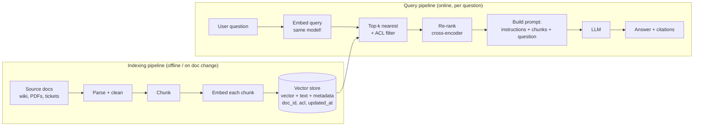

# RAG and Vector Search

## 1. One-line summary

**RAG (Retrieval-Augmented Generation)** means: before asking a large language model (LLM) a question, *look up* the most relevant pieces of your own documents and paste them into the prompt, so the model answers from that evidence instead of from memory. The lookup is usually **vector search**: every text chunk is turned into a list of numbers (an **embedding**) such that chunks with similar *meaning* get nearby numbers, and "find relevant chunks" becomes "find the nearest points".

💡 *LLM*: a model that predicts the next piece of text given the text so far. You send a **prompt** (instructions + context + question) and get text back. See [LLM gateway](../interviews/llm-gateway/README.md) for how companies serve and meter these calls.

---

## 2. The problem it solves

**The pain.** An employee asks the company chatbot: "Can I expense a taxi to the airport?" A bare LLM has three problems:

1. **Knowledge cutoff**: it was trained on data up to some date and knows nothing newer (this quarter's policy change).
2. **No private data**: your wiki, tickets and runbooks were never in its training set.
3. **Hallucination**: when it does not know, it still produces fluent, confident, *wrong* text. Nothing in the output tells you which sentences are guesses.

Fixes you might try, and why RAG usually wins:

| Option | Problem |
|---|---|
| Paste *all* docs in every prompt | Prompts have a size limit (the **context window**, measured in tokens: roughly word-fragments, ~0.75 English words each); you pay per token; long prompts are slower and models use the middle of long prompts less reliably 🟡 |
| **Fine-tune** (continue training the model on your docs) | Slow and costly to redo on every doc change; bakes knowledge into weights where you can't cite, update or delete it (or enforce who may see it) |
| **RAG** | Docs stay in a database you control; updating a doc = re-indexing one doc; every answer can cite its sources; access control is applied at lookup time |

Infra analogy: RAG is a **read-through cache for knowledge**. The model is a stateless service with no persistent store; the vector index is the datastore you query *per request* and inject into the request, much like fetching config from a config service rather than baking it into the image.

---

## 3. How it works

### 3.1 Embeddings in plain words

An **embedding model** takes text and returns a fixed-length list of floats, e.g. **768 to 1,536 numbers** (a *vector*; the count is its **dimensions**) 🟡 (common sizes; models vary from ~256 to 3,000+). The model is trained so that texts with similar meaning land close together, even with zero shared words: "reimburse my cab" and "taxi expense policy" end up near each other; "office dog" ends up far away.

"Close" is measured with **cosine similarity**: the cosine of the angle between two vectors. It is 1.0 when they point the same way, about 0 when unrelated. Formula: `dot(a,b) / (|a| · |b|)`. If vectors are pre-scaled to length 1 (normalised), cosine equals a plain dot product, which is why many systems normalise at write time.

A tiny runnable demo with 3 hand-made dimensions (money, animals, travel). Real embeddings have 1,000+ dimensions that no human can label, but the maths is identical:

```java
import java.util.*;

public class Topk {
    static double cosine(double[] a, double[] b) {
        double dot = 0, na = 0, nb = 0;
        for (int i = 0; i < a.length; i++) { dot += a[i] * b[i]; na += a[i] * a[i]; nb += b[i] * b[i]; }
        return dot / (Math.sqrt(na) * Math.sqrt(nb));
    }
    public static void main(String[] args) {
        // axes: [about-money, about-animals, about-travel]
        Map<String, double[]> chunks = new LinkedHashMap<>();
        chunks.put("Refund policy: money back in 30 days", new double[]{0.9, 0.0, 0.2});
        chunks.put("Our office dog is called Biscuit",     new double[]{0.0, 0.9, 0.1});
        chunks.put("Travel expenses are reimbursed",       new double[]{0.7, 0.0, 0.8});
        chunks.put("Cats are not allowed in the lab",      new double[]{0.0, 0.8, 0.0});
        double[] query = {0.8, 0.0, 0.5}; // "how do I get my trip costs paid back?"
        chunks.entrySet().stream()
            .sorted((x, y) -> Double.compare(cosine(query, y.getValue()), cosine(query, x.getValue())))
            .limit(2)
            .forEach(e -> System.out.printf("%.3f  %s%n", cosine(query, e.getValue()), e.getKey()));
    }
}
```

Real output from `javac Topk.java && java Topk` (Java 21):

```
0.957  Travel expenses are reimbursed
0.943  Refund policy: money back in 30 days
```

The query shares no words with "Travel expenses are reimbursed", yet it wins. That is the whole point of vector search; the loop over *every* chunk is "brute force", whose cost we price in section 3.5.

### 3.2 Chunking

You cannot embed a 200-page PDF as one vector: one point cannot represent 200 pages of meaning, and you could not fit it in a prompt anyway. So you cut documents into **chunks**.

| Strategy | How | Good for | Risk |
|---|---|---|---|
| **Fixed size** | e.g. 500 tokens | Simple baseline | Cuts mid-sentence or mid-table |
| **Overlap** | Next chunk starts ~10–20% before the previous ended (e.g. 500 tokens, 75 overlap) | Facts that straddle a boundary | More chunks to store (about +15%) |
| **By structure** | Split at headings/paragraphs/code blocks; keep the heading path as a prefix ("Travel > Taxis > Airport") | Docs, wikis, Markdown | Sections of wildly different length |
| **Semantic** | Split where consecutive-sentence similarity drops | Messy prose | Extra embedding cost at ingest 🟡 |

Rule of thumb: too small and a chunk lacks context ("it is allowed" - what is?); too big and the vector blurs several topics and wastes prompt budget. Start around 200–500 tokens, then *measure* with the evals in section 3.8.

### 3.3 The two pipelines



**Indexing:** ingest (connectors pull docs) → parse (strip HTML, extract PDF text) → chunk → embed (batch calls to the embedding model) → store the vector *plus* the chunk text *plus* metadata (`doc_id`, source URL, who may read it, timestamp, section path). Metadata is what makes citations, filtering and re-indexing possible.

**Query:** embed the question with the **same** model → fetch the top-k (say k=50) nearest chunks → **re-rank** them → keep the best ~5 → build the prompt → LLM answers and cites chunk ids.

💡 *Re-ranking*: vector search is a fast, coarse first pass because each chunk is embedded *alone*. A **cross-encoder** re-ranker reads the (question, chunk) pair *together* and scores relevance much more accurately, but is too slow to run on millions of chunks, so it only re-orders the 50 survivors.

Prompt shape (the "augmented" part):

```
Answer using ONLY the context below. If the answer is not there, say you don't know.
Cite chunk ids like [c17].
<context>
[c17] Travel > Taxis: Taxi to the airport is reimbursable up to $60 with receipt...
[c42] ...
</context>
Question: Can I expense a taxi to the airport?
```

### 3.4 Approximate nearest neighbour (ANN) indexes

Finding the exact nearest vectors means comparing the query to every stored vector. For large collections we accept "almost always the right ones" in exchange for speed. This is **approximate nearest neighbour (ANN)** search. The quality metric is **recall@k**: of the true top-k, what fraction did the index return? (0.95 = 95%.)

**HNSW (Hierarchical Navigable Small World)** in plain words: build a graph where each vector links to ~16 nearby vectors. Stack several layers: the top layer has few points with long-range links (like highways), lower layers have more points with short links (like local streets), the bottom has all. To search: enter at the top, greedily hop to whichever neighbour is closer to the query, drop down a layer when stuck, repeat. Like navigating from a continent to a street using ever-finer maps; you touch a few thousand vectors instead of millions.

**IVF (inverted file)**: run k-means clustering to split vectors into e.g. 4,096 clusters, each with a centroid. At query time compare to the centroids, then scan only the closest `nprobe` clusters (say 8). Name echoes the [inverted index](inverted-index.md): "cluster → its members", instead of "word → its documents". Often paired with **PQ (product quantization)**, which compresses each vector into a few bytes, trading accuracy for 10-30x less RAM 🟡.

| | Brute force (flat) | HNSW | IVF(+PQ) |
|---|---|---|---|
| Recall | 100% | ~95-99% tunable | ~85-95% tunable |
| Query speed | slowest | very fast | fast |
| RAM | vectors only | vectors + graph links (+~10-30%) | vectors, or tiny with PQ |
| Build/insert | none | slow build, inserts OK | needs training pass; drift as data changes |
| Knob | none | `M`, `efSearch` (higher = better recall, slower) | `nlist`, `nprobe` |

The trade-off is a dial, not a switch: raise `efSearch` or `nprobe` and recall rises along with latency. Pick the cheapest setting that meets your recall target on *your* data.

### 3.5 Worked numbers

**Storage.** 10 million chunks × 1,024 dimensions × 4 bytes (a 32-bit float):

```
10,000,000 × 1,024 × 4 B = 40,960,000,000 B ≈ 41 GB raw vectors
```

Plus HNSW links: ~16 neighbours × 2 (both directions, approx) × 4 B ≈ 128 B per vector → 10M × 128 B ≈ 1.3 GB. Plus chunk text (10M × ~2 KB = 20 GB) and metadata. A realistic footprint is **~65-70 GB**, and for speed the vectors and graph should sit in RAM. Cutting precision helps: 8-bit quantisation → 10.2 GB; 1-bit → 1.3 GB, usually with a re-score step on full vectors 🟡. With 2 replicas for availability, triple everything.

**Query cost, brute force.** Each comparison is 1,024 multiply-adds; 10M chunks → 10.24 billion multiply-adds ≈ 20 GFLOP (counting multiply and add separately). Reading 41 GB from memory at ~20 GB/s on one core takes **~2 s**. Spread over 16 cores, ~0.15 s; still too slow for hundreds of queries per second.

**Query cost, HNSW.** Say ~2,000 distance computations per query: 2,000 × 1,024 ≈ 2 million multiply-adds, a few ms at worst, often ~1 ms on a warm index. That is **~1,000x less work** than brute force, at ~95-99% recall 🟡 (workload-dependent).

Takeaway: below ~100k vectors, brute force is fine and simplest (a single SQL `ORDER BY`). Above a few million, you need ANN.

### 3.6 Where to store vectors

| Option | Fits when | Watch out for |
|---|---|---|
| **pgvector** (extension for [PostgreSQL](../technologies/postgresql.md)) 🟡 | Already on Postgres; up to low tens of millions of vectors; you want vectors + relational filters + transactions in one place | HNSW index must fit in RAM to stay fast; heavy writes and vector search compete on one box |
| **Elasticsearch / OpenSearch kNN** ([Elasticsearch](../technologies/elasticsearch.md)) 🟡 | You already run it; you want keyword + vector in one query (hybrid) | Memory-hungry; version-specific settings; tuning shards matters |
| **Dedicated vector DB** (Pinecone, Weaviate, Milvus, Qdrant, ...) 🟡 | Hundreds of millions of vectors, high QPS, built-in quantisation/sharding | One more system to operate; metadata filtering quality varies by product |
| **Library in the app** (FAISS, hnswlib) | Prototype, or read-only index rebuilt nightly | You own persistence, replication, updates |

Product features change fast: verify the current limits in each vendor's docs before quoting them in an interview. A strong default answer: "pgvector or the search cluster we already have, move to a dedicated store when scale or filtering needs force it".

### 3.7 Hybrid search

Embeddings are great at meaning but weak at **exact tokens**: error code `E4021`, a product SKU, a person's name, or a rare acronym may not embed distinctively. Classic keyword search (**BM25**, the standard relevance formula behind [inverted indexes](inverted-index.md): it rewards rare matching words and penalises overlong docs) is the opposite: precise on exact terms, blind to synonyms.

**Hybrid search** runs both and merges. Scores are not comparable (cosine ∈ [0,1], BM25 ∈ [0,∞)), so merge by **rank**, using **Reciprocal Rank Fusion (RRF)**:

```
score(doc) = Σ over each list of  1 / (60 + rank_in_that_list)
```

(60 is the conventional constant 🟡.) Example: chunk X is #1 in vector list and #3 in BM25: 1/61 + 1/63 = 0.01639 + 0.01587 = **0.03226**. Chunk Y is #2 in vector only: 1/62 = 0.01613. X wins because both retrievers like it. No score calibration needed, which is why RRF is popular.

### 3.8 Freshness, access control, evaluation

**Freshness.** Documents change. Store `doc_id` + `content_hash` per chunk; on a doc update (webhook or CDC, see [caching strategies](caching-strategies.md) for the same invalidate-on-write idea) delete that doc's old chunks and insert the new ones. Deleted docs must be deleted from the index too, or the bot keeps quoting them.

**Changing the embedding model** is the big one. Vectors from model A and model B live in different "coordinate systems" and **cannot be compared**, even if both have 1,024 dims. Re-embedding 10M chunks means paying the embedding API/GPU bill again and hours of work. Pattern: build a *second* index (blue/green), backfill, shadow-compare recall on test queries, flip the alias, delete the old one. Store `embedding_model_version` on every row so you never mix.

**Access control.** The #1 enterprise RAG leak: the retriever finds a chunk from the CEO's HR folder and the LLM happily summarises it for an intern. Rules:

- Store an ACL (user/group ids) as metadata on every chunk, copied from the source system.
- Filter **inside the search query** (pre-filter, so top-k comes only from allowed chunks), using the caller's identity from the verified token ([authentication](authentication-oauth-jwt.md)). Filtering *after* top-k can return zero results, and filtering in the LLM prompt ("don't reveal HR docs") is not a control at all.
- Re-sync ACL changes quickly: a user removed from a group should stop seeing chunks within minutes, not days.
- Selective filters (only 0.1% of chunks visible) can make ANN graphs return poor results 🟡; test it.

**Evaluation.** Measure retrieval and generation separately:

- **recall@k**: for a labelled set of questions with known source chunks, how often is the right chunk in the top-k? Fix this first; a missing chunk cannot be repaired by a better prompt.
- **MRR / nDCG**: reward ranking the right chunk *high*.
- **Groundedness (faithfulness)**: is every claim in the answer supported by the retrieved chunks? Checked by humans or an LLM judge (see [evals and guardrails](llm-evals-guardrails-and-prompt-injection.md)).
- **Answer relevance** and **citation accuracy**: does the answer address the question, and do the cited chunks really say that?

---

## 4. When to use it

- Q&A over a large, changing, private knowledge base (support, internal wiki, legal, code search).
- You need **citations** and an audit trail.
- Facts change faster than you can retrain.
- Semantic search where users don't know the exact words ([search](../interviews/search-autocomplete/README.md) family).

## 5. When NOT to use it

- **The corpus is small** (a few dozen pages): put it all in the prompt; a retrieval pipeline adds failure modes for nothing.
- **Questions need aggregation or exact lookup** ("total sales in March", "orders for customer 42"): use SQL / an API tool, not similarity. Retrieval returns a few passages, not a full scan.
- **You need to change the model's behaviour or style**, not its facts: that is prompting or fine-tuning.
- **Multi-hop reasoning across many documents** with a single retrieval pass: it will miss pieces; use an agent that retrieves iteratively.
- **Documents are mostly tables/images** and you only embed extracted text: the structure is lost.

## 6. Commonly confused with

| Pair | Difference |
|---|---|
| RAG vs fine-tuning | RAG injects knowledge per request (citable, updatable, ACL-able). Fine-tuning changes weights (good for style/format/task skill, bad for fast-changing facts). |
| Vector search vs keyword search | Meaning vs exact tokens. Combine them (hybrid). |
| Vector DB vs pgvector vs ES kNN | Same core idea (ANN index + metadata); differ in scale ceiling, operational burden and hybrid support. |
| Embedding model vs chat LLM | Embedding model outputs vectors (cheap, fast, fixed); the chat model outputs text. They are separate models; query and documents must use the *same embedding model*. |
| Exact kNN vs ANN | 100% recall and slow vs ~95-99% recall and fast. |
| Context window vs retrieval | A bigger window lets you paste more; it does not decide *what* to paste, nor cut cost or latency. |

## 7. Common mistakes / misuse

- **Different embedding models for indexing and querying**, or silently upgrading one: results become garbage with no error.
- **No metadata or ACL on chunks**, discovered only after a data leak.
- **Chunking by blind character count** and cutting tables or code in half.
- **Retrieving too much** (k=30 chunks into the prompt): cost and latency up, answer quality often *down*.
- **Skipping evals**: tuning chunk size and k by gut feeling. Build 50-200 labelled questions first.
- **Trusting the answer without grounding rules**: no "say I don't know" instruction, no citations.
- **Treating retrieved text as trusted**: a document can contain instructions aimed at the model; see [prompt injection](llm-evals-guardrails-and-prompt-injection.md).
- **Forgetting deletes and updates**, so stale chunks outlive the documents.
- **Using ANN defaults** and never measuring recall on your own data.

## 8. Interview cheat-sheet

"For Q&A over private docs I'd use RAG: chunk documents at heading boundaries into ~300-token pieces, embed each chunk, and store vector, text and metadata including ACLs. At query time I embed the question with the same model, run an ANN search with an ACL pre-filter for the top 50, re-rank with a cross-encoder, and put the best five in the prompt with an instruction to answer only from them and cite ids. I'd use hybrid search, BM25 plus vector merged with reciprocal rank fusion, because embeddings miss exact identifiers. Sizing: 10M chunks at 1,024 dims is about 41 GB of raw float32 vectors, so HNSW in RAM, sharded and replicated, tuned with efSearch against a recall@10 target. I'd version embeddings so a model change is a blue/green re-index, and I'd evaluate recall@k and groundedness on a labelled set before shipping."

## 9. Used in

- [LLM gateway](../interviews/llm-gateway/README.md): the layer in front of embedding and chat model calls (routing, caching, rate limits, cost).
- [Search autocomplete](../interviews/search-autocomplete/README.md): contrast classic prefix/keyword retrieval with semantic retrieval.
- [Inverted index](inverted-index.md): the keyword half of hybrid search.
- [LLM inference serving](../../under-the-hood/llm-inference-serving.md): how the generating model actually runs and why long prompts cost more.
- [LLM evals, guardrails and prompt injection](llm-evals-guardrails-and-prompt-injection.md): testing and securing a RAG feature.
- [Interviews in the AI era](../../guides/interviews-in-the-ai-era.md): how AI topics appear in current interview loops.
