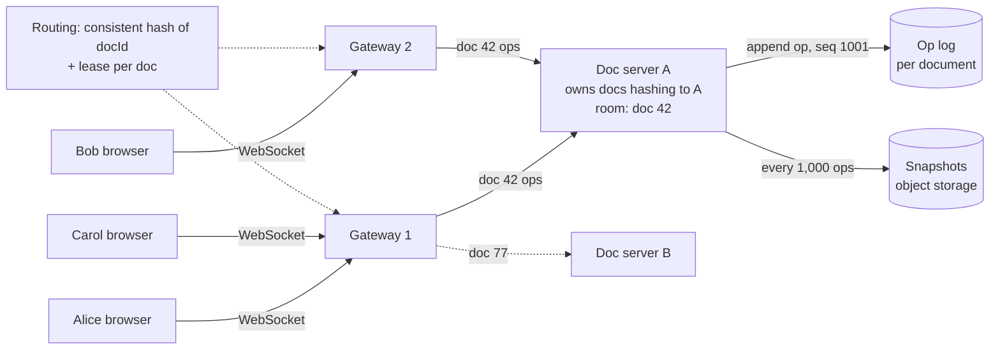
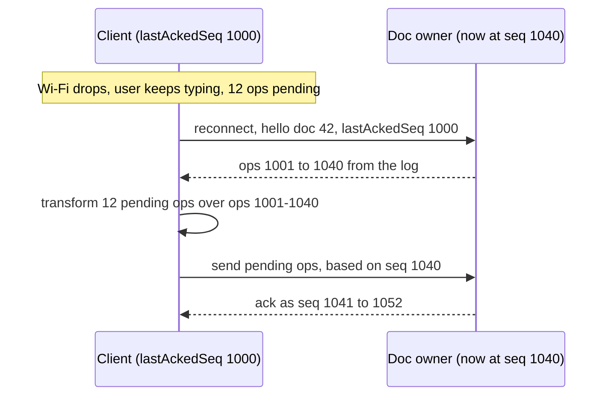

# Real-Time Collaboration and Presence (document rooms, op logs, cursors)

## 1. One-line summary

A collaborative editor keeps **one live "room" per open document**: every editor of that document holds a [WebSocket](../technologies/websockets-and-sse.md) to the **single process that owns the document**, which orders all edits, appends them to an **operation log**, broadcasts them to everyone in the room, and saves **periodic snapshots** so loading never replays the whole history; **cursors and selections** travel through the same room as **ephemeral presence data** that is throttled and never stored.

💡 **WebSocket** = a long-lived, two-way connection between browser and server, so the server can push edits to you without you asking. **Ephemeral** = lives only in memory, OK to lose.

> Infra analogy: a document room is like a partition with a single leader in Kafka or etcd: one owner orders all writes for its key, followers (here, browsers) receive the ordered stream, and if the owner dies another process takes over the key.

This file is about the **plumbing** around concurrent edits. How two concurrent edits are merged (transform functions, CRDTs) is in [Operational Transformation and CRDTs](operational-transformation-and-crdts.md).

---

## 2. The problem it solves

Without a room design, the obvious first attempt goes wrong in three ways:

1. **Edits through a normal REST API + database**: each keystroke is an HTTP request (💡 a one-shot request/response, with no way for the server to push) that writes a row; other users **poll** every few seconds. Typing feels laggy, and two servers handling edits for the same document in parallel each pick their own order, so replicas diverge.
2. **Storing the whole document on every change**: a 1 MB document saved on every keystroke at 5 keystrokes/s is 5 MB/s of writes for one typist, and concurrent saves overwrite each other.
3. **Treating cursors like edits**: persisting every cursor move ("Bob is at line 40") fills the log with millions of entries nobody will ever read.

What we need: one place that **orders** edits per document, a cheap way to **push** them to everyone viewing it, durable **history** that's cheap to load, and a **separate, lossy channel** for "who's here and where's their cursor".

---

## 3. How it works

### 3.1 Architecture: gateways, document owners, storage



- **Gateways** hold the WebSocket connections (connection-heavy, logic-light), as in the [gateway tier](../technologies/websockets-and-sse.md). They forward each message to the owner of that document.
- **Doc servers** each own a set of documents. Ownership is decided by [consistent hashing](consistent-hashing.md) on the document ID (💡 a way of mapping keys to servers so that adding or removing a server moves only a small share of keys). To be sure only one process owns a document even during a network glitch, the owner also holds a **lease** (a lock that expires unless renewed, see [distributed locks and leases](distributed-locks-and-leases.md)).
- **One owner per document** is the key decision: it gives a single place that assigns each edit a **sequence number** (the document's revision), which is exactly the central ordering OT needs (see [message ordering and sequencing](message-ordering-and-sequencing.md)).

Why not let any server handle any edit? Then two servers would assign the same revision number to two different edits, and you're back to distributed consensus for every keystroke.

### 3.2 Operation log + periodic snapshots (event sourcing)

The document's source of truth is the **ordered list of operations**, not the text. This is [event sourcing](../../LLD/concepts/ledgers-and-event-sourcing.md) (💡 store the changes, derive the current state by replaying them):

```
op log for doc 42:
  seq 1    ins(0,"H")   by alice   t=10:00:01
  seq 2    ins(1,"i")   by alice   t=10:00:01
  ...
  seq 1000 del(57)      by bob     t=10:14:09
snapshot @ seq 1000 → full text + metadata, stored in object storage
```

Loading a document = **latest snapshot + ops after it**. Arithmetic for why snapshots matter:

```
heavily edited doc: 2,000,000 ops over its life
replay cost ≈ 1 µs per op (in-memory apply, rough)  → 2,000,000 × 1 µs = 2 s just to open it
with a snapshot every 1,000 ops: replay ≤ 1,000 × 1 µs = 1 ms
op size ≈ 50–100 B  → 2,000,000 × 100 B = 200 MB of log for one doc
```

💡 **µs** = microsecond, a millionth of a second. **Object storage** = blob storage like S3, cheap for large files ([object storage](../technologies/object-storage.md)).

The op log can live in [Postgres](../technologies/postgresql.md) (one row per op, primary key `(doc_id, seq)`) or a log like [Kafka](../technologies/kafka.md) partitioned by `doc_id`. Old ops before a snapshot can be **compacted** into coarser **version history** entries ("Bob's edits, 10:00–10:15"), the same idea as named checkpoints in [Git's object store](../../under-the-hood/git-object-store.md).

Durability rule: the owner **appends the op to the log before acknowledging** it and before broadcasting, otherwise a crash loses an edit that other users already saw. The same "log first" rule as a database write-ahead log ([durability, WAL and snapshots](../../LLD/concepts/durability-wal-and-snapshots.md)).

### 3.3 Presence: cursors, selections, "who's here"

**Presence** in a document = avatars of who has it open, plus each person's cursor and selection. It reuses the heartbeat ideas from [presence and heartbeats](presence-and-heartbeats.md), with key differences:

| | Document edits | Presence (cursors, selections) |
|---|---|---|
| Persisted? | yes, op log | **no**, in memory in the room only |
| Ordered? | strictly, by seq | latest value wins, older ones dropped |
| Can be lost? | never | yes, the next update replaces it |
| Rate | as typed | **throttled** to ~10–20 updates/s per user |
| On disconnect | kept forever | removed after a heartbeat timeout (e.g. 30 s) |

Cursors are positions in the text, so they shift when someone else edits above them. Either transform cursor positions with the same rules as edits, or (with a CRDT) anchor a cursor to a **character ID** instead of an index so it never needs shifting.

**Throttling** (💡 sending at most N updates per second, keeping only the newest) matters because a mouse drag generates 60+ events per second. The client sends the latest cursor at most every 50–100 ms (10–20/s), and the server batches all cursor changes in a room into **one presence frame per tick** per recipient.

### 3.4 Fan-out arithmetic: the hot document

**Fan-out** = one incoming message turned into many outgoing ones (one per other person in the room).

A company all-hands doc with **500 people** open, 50 of them typing:

```
edits in:   50 typists × 5 ops/s                          = 250 ops/s
edits out:  250 ops/s × 499 recipients                    ≈ 125,000 messages/s from ONE owner process

cursors in: 500 users × 10 updates/s (throttled)          = 5,000/s
naive out:  5,000/s × 499 recipients                      ≈ 2,500,000 messages/s  ← won't fit
batched:    1 presence frame per recipient per 100 ms tick = 500 × 10 = 5,000 frames/s
```

Lessons:

- **Batch** by tick: one frame per recipient per 50–100 ms containing all ops and cursor changes since the last tick. Message count then scales with *recipients*, not *senders × recipients*.
- **Relay through gateways**: send each batch once per *gateway* holding room members, and let the gateway fan out to its local sockets. 500 users on 10 gateways = 10 sends per tick from the owner.
- **Degrade presence first**: above N viewers, show "and 450 others" instead of 500 cursors, or send cursors only of people near your viewport. Edits are never dropped; presence can be. Products also cap concurrent editors per document (Google Docs documents a limit of around 100 simultaneous editors in its help pages; verify the current number before quoting it).
- A single owner per hot doc is a scaling ceiling by design; it's acceptable because one document rarely exceeds a few hundred active users, and ordering needs one place anyway. Many documents spread across many owners.

### 3.5 Offline edits and reconnection: "send me ops since N"

Clients don't wait for the network to type. Each client tracks:

- `lastAckedSeq`: the last server revision it has applied (say 1000)
- `pending`: its own local ops not yet acknowledged



- If `lastAckedSeq` is older than the log the server still keeps (ops were compacted), the server sends the **latest snapshot** instead, and the client rebases its pending ops on that (or, after days offline, shows a "your changes conflict" view).
- Each pending op carries a **client op ID** so a resend after a dropped ack isn't applied twice ([idempotency](idempotency-and-delivery-semantics.md)).
- Long offline sessions are where CRDTs shine: merges need no server-side transform chain ([OT vs CRDT](operational-transformation-and-crdts.md)).

### 3.6 Owner failover

If doc server A dies, its lease expires (say after 10 s), the routing layer moves its documents to B, and B loads **snapshot + log tail**. Clients reconnect through their gateway and do the "since N" catch-up above. Because every acknowledged op was in the log before the ack, nothing acknowledged is lost; ops still pending on clients are simply resent.

---

## 4. When to use it

- Google-Docs-style editors, shared whiteboards, design tools, collaborative spreadsheets, code pair-programming tools.
- Any "many users looking at one live object" product: a shared playlist, a live dashboard with annotations, a multiplayer game lobby.

## 5. When NOT to use it

- **Single-author content with occasional sharing** (a blog post, a config in Git): save-and-reload with a version check is simpler and cheaper.
- **Huge audiences that only watch** (a live-blog read by 1 million people): that's broadcast, not collaboration; push snapshots through a [CDN](../technologies/cdn.md) or pub/sub instead of a room with 1 million members.
- **Persisting presence**: storing cursor moves in the op log is a mistake. It bloats storage and replay for data nobody will ever read.

## 6. Commonly confused with

| | **Document room (this)** | **Chat room** | **Pub/sub topic** | **Presence (online/offline)** |
|---|---|---|---|---|
| Ordering | strict, by one owner | per-conversation seq | per partition, maybe none | none |
| State | the document, rebuilt from log | message history | none | TTL key |
| Edits conflict? | yes, need OT/CRDT | no, messages only append | no | no |
| Fan-out per message | room size (tens to hundreds) | group size | subscribers | contacts viewing |

## 7. Common mistakes / misuse

1. **Any server can accept any edit**: no single order, replicas diverge.
2. **Acknowledging before the op is in the log**: a crash loses edits users already saw.
3. **Replaying the full history on every open**: seconds of load time; snapshot every N ops.
4. **Unthrottled cursor updates** sent one message per sender per recipient: millions of messages/s for one hot doc.
5. **No "since N" catch-up**: a reconnecting client reloads the whole document and loses unsent edits.
6. **Forgetting that cursors shift** when text above them changes.
7. **No client op ID**: retried ops get applied twice ("hellohello").

## 8. Interview cheat-sheet

> "Each open document is a room owned by exactly one doc server, chosen by consistent hashing on the doc ID and protected by a lease. Clients keep a WebSocket to a gateway, which forwards ops to the owner. The owner assigns each op the next sequence number, transforms it if needed, appends it to the per-document op log, then acks and broadcasts. The log is the source of truth, with a snapshot every thousand ops so opening a doc is snapshot plus a short tail. Cursors and selections are presence: in memory only, throttled to about ten updates a second, batched into one frame per tick per recipient, and dropped on disconnect. For a 500-person doc that batching is what takes us from millions of messages a second down to thousands. On reconnect the client says 'I'm at seq N', gets the missing ops, rebases its pending edits, and resends them with client op IDs so retries are idempotent."

## 9. Used in

- [Collaborative document editor](../interviews/collaborative-editor/README.md): the **real-time plumbing**: WebSocket rooms per document, one owner per document for ordering, op log plus snapshots for storage and version history, cursor presence, hot-document fan-out and offline reconnection.
- Related: [Operational Transformation and CRDTs](operational-transformation-and-crdts.md), [presence and heartbeats](presence-and-heartbeats.md), [WebSockets and SSE](../technologies/websockets-and-sse.md), [message ordering and sequencing](message-ordering-and-sequencing.md), [consistent hashing](consistent-hashing.md), [distributed locks and leases](distributed-locks-and-leases.md), [fan-out](fan-out.md), [ledgers and event sourcing](../../LLD/concepts/ledgers-and-event-sourcing.md), [durability, WAL and snapshots](../../LLD/concepts/durability-wal-and-snapshots.md), [Git's object store](../../under-the-hood/git-object-store.md).
