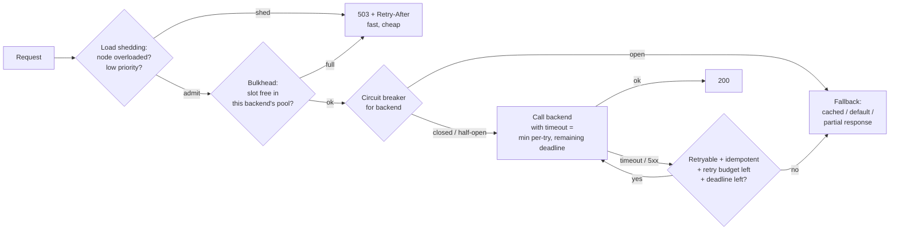

# Resilience Patterns: Timeouts, Retry Budgets, Circuit Breakers, Bulkheads, Load Shedding

## 1. One-line summary

Resilience patterns keep **one slow or failing dependency from taking the whole system down**: bound every wait (**timeouts**), retry carefully (**retry budgets**), stop calling what's broken (**circuit breakers**), keep failures in their own compartment (**bulkheads**), refuse work you can't finish (**load shedding**), and return something useful instead of nothing (**graceful degradation**).

> Backoff formulas, jitter, DLQs and the basic circuit-breaker state table are in [retries, backoff and DLQ](retries-backoff-and-dlq.md). This file builds on it for **synchronous request paths** like an API gateway.

---

## 2. The problem it solves

**The pain:** an API gateway node has 200 worker threads (or a fixed pool of connections) and serves 40 backends. The `recommendations` backend starts responding in 30 s instead of 50 ms.

- With no timeout, each request to it holds a thread for 30 s. At 100 req/s to that backend, after 2 s all 200 threads are stuck there.
- Now `/login` and `/checkout`, whose backends are perfectly healthy, can't get a thread. **The whole API is down because of a non-critical feature.** This is a **cascading failure**.
- Clients time out and retry, doubling traffic. The gateway retries too. `recommendations` gets 4× its normal load while already sick.
- When it recovers, the backlog of queued requests hits it at once and knocks it over again.

**The fix:** each pattern below cuts one link of that chain.

> Infra analogy: k8s `resources.limits` (one pod can't eat the node's memory) is a bulkhead; a PodDisruptionBudget is a "budget" for how much failure you allow; a readiness probe failing is load shedding at the pod level.

---

## 3. How it works



### 3.1 Timeouts and timeout budgets

Every network call needs a **connect timeout** (time to open the TCP connection, ~100–250 ms inside a data center) and a **request timeout** (time for the whole response).

How to pick the request timeout: from the backend's latency percentiles (p99 = the latency 99% of requests beat), e.g. **p99.9 × ~1.5**. If `orders` has p99.9 = 200 ms, use ~300 ms, not the library default of 30 s or infinity.

**Timeout budgets across hops (deadline propagation):** the user-facing deadline is what matters.

```
Client deadline: 2,000 ms
Gateway: spent 20 ms on auth/routing → remaining 1,980 ms → calls orders with timeout 1,900 ms
orders: spent 100 ms → calls payments with remaining ≈ 1,780 ms (minus margin)
```

- Pass the deadline downstream (gRPC does this natively via `grpc-timeout`; for HTTP use a header like `X-Request-Deadline`, Envoy uses `x-envoy-expected-rq-timeout-ms`).
- Each hop's timeout must be **smaller than its caller's**. If the gateway gives up at 1 s but `orders` waits 5 s for `payments`, `orders` keeps working on a request nobody will read.
- A hop that sees the deadline already passed should **stop immediately**.

### 3.2 Retries with retry budgets

Retry only **idempotent** requests (safe to repeat: GET, or POST with an [idempotency key](idempotency-and-delivery-semantics.md)), only on **retryable** errors (connect failure, 503, timeout on a GET), **to a different instance**, and with jittered backoff ([details](retries-backoff-and-dlq.md)).

The danger is **amplification**: 3 layers × 3 attempts = 27× load on the deepest service. Two controls:

- **Retry at one layer** (usually the gateway or the mesh, not also every client library).
- **Retry budget**: retries may be at most **~10–20% of requests** to that backend over a sliding window (Envoy: `retry_budget.budget_percent`; Finagle uses 20%). Normal day: 1,000 req/s, 1% fail, 10 retries/s: well within a 100/s budget. Backend down: 1,000 failures/s, but only 100 retries/s allowed, so load stays at 1.1× instead of 3×.
- Plus a **per-try timeout** smaller than the overall timeout, e.g. 2 tries × 300 ms within a 700 ms total.

### 3.3 Circuit breakers

Basics (closed / open / half-open, error-rate threshold) are in [retries, backoff and DLQ](retries-backoff-and-dlq.md#34-circuit-breaker). On a gateway, two forms coexist:

| Form | What it tracks | Example |
|---|---|---|
| **Error-rate breaker** (Resilience4j, Hystrix-style) | % failures over last N calls per backend | > 50% of last 100 calls fail → open 30 s → half-open, allow 10 trial calls |
| **Concurrency limits** (Envoy "circuit breakers") | Max in-flight requests / pending / connections per backend cluster | `max_requests: 1000`; request 1,001 fails fast with 503 |
| **Outlier detection** | Per **instance**, not per service | 5 consecutive 5xx → eject that pod for 30 s, max 50% of the pool ejected |

Breaker open means **fail fast** (~0 ms instead of a 300 ms timeout) and use a **fallback** if one exists.

### 3.4 Bulkheads

Named after ship compartments: a hole floods one compartment, not the ship. Give each dependency (or each tenant/priority) its **own limited pool** of threads, connections or concurrency slots.

```
Gateway node: 1,000 concurrent request slots total
  checkout cluster:         max 300 in flight
  search cluster:           max 300
  recommendations cluster:  max 100   ← when it hangs, only these 100 slots fill up
  everything else:          shared 300
```

`recommendations` hanging now costs at most 100 slots; `/checkout` keeps working. Implementations: separate thread pools (Resilience4j `ThreadPoolBulkhead`), semaphores (`SemaphoreBulkhead`), per-cluster connection pools and `max_requests` in Envoy, or separate gateway deployments for partner vs public traffic.

Sizing with **Little's law** (in-flight = arrival rate × time in system): 200 req/s × 0.1 s = **20** concurrent normally; allow ~3–5× headroom → limit 60–100.

### 3.5 Load shedding and admission control

When a node is past its capacity, accepting more work makes **every** request slow (queues grow, latency climbs, clients time out and retry, and the node does work whose results nobody reads). Better to **reject some requests early and cheaply** so the rest succeed.

- **Admission signals**: in-flight requests > limit, queue wait time > ~50–100 ms, CPU > ~85–90%, event-loop lag (how late a Node.js-style single thread runs its queued work).
- **Reject early**: before auth, body parsing or backend calls; return **503** (or 429 if it's per-client quota) with `Retry-After`. A rejection should cost ~microseconds.
- **Prioritise**: tag requests by criticality (e.g. `critical` = checkout, login; `default`; `sheddable` = prefetch, analytics, recommendations). Shed sheddable first. Health checks and on-call admin calls are never shed.
- **Adaptive concurrency limits**: instead of a fixed number, the limit adjusts like TCP congestion control (TCP slows its sending rate when it sees signs of a congested network), lowering when latency rises (Netflix `concurrency-limits` library, Envoy adaptive concurrency filter).
- **LIFO (last in, first out) / drop old requests**: if a request has waited longer than its deadline, drop it without processing.
- Difference from [rate limiting](../../LLD/interviews/rate-limiter/README.md): a rate limiter enforces **per-client fairness** ("API key X gets 100 req/s"); load shedding protects **the server's own capacity** regardless of who is asking. A gateway needs both.

### 3.6 Graceful degradation

Decide **in advance** what a degraded answer looks like, per feature:

| Dependency down | Degraded behaviour |
|---|---|
| Recommendations | Return the page without the carousel, or a static "popular items" list |
| Price service | Serve last cached price with a short TTL (time to live before it expires) (only if business accepts it) |
| Rate-limit store ([Redis](../technologies/redis.md)) | Fall back to local per-node limits (fail open, approximately) |
| Auth IdP (identity provider, the login service) | Keep validating JWTs (signed tokens, see [authentication](authentication-oauth-jwt.md)) with cached public keys; new logins fail |

Kill switches / feature flags let on-call turn off expensive features instantly.

### 3.7 Hedged requests (briefly)

For **read-only** calls with bad tail latency: send the request to one instance; if no answer by the **p95** latency (e.g. 20 ms), send a duplicate to a second instance and use whichever answers first. Cuts p99 dramatically for ~5% extra load (the hedge fires only for the slowest ~5%). Never for non-idempotent writes; cap hedges with a budget like retries.

---

## 4. When to use it

- **Timeouts**: every remote call, no exceptions.
- **Retries with budgets**: idempotent calls to replicated backends.
- **Circuit breakers + bulkheads**: any service calling several dependencies of different criticality (gateways, BFFs: backend-for-frontend APIs tailored to one client app, aggregator services).
- **Load shedding**: every front-door service that can be overloaded by traffic spikes or retry storms.
- **Hedging**: fan-out reads (search, caches) where p99 matters.

## 5. When NOT to use it (and why it's a mistake)

| Situation | Why it's a mistake |
|---|---|
| Retrying non-idempotent POSTs at the gateway | Double charges / duplicate orders. |
| Timeouts longer than the caller's timeout | Wasted work on abandoned requests. |
| A breaker per service when only one pod is bad | Opens for the whole service; use outlier detection per instance. |
| Hedging writes or expensive queries | Duplicates side effects or doubles DB load. |
| Fallbacks that are never tested | The fallback path breaks exactly during the incident. Test with fault injection / chaos experiments (deliberately adding delays and errors in staging or prod). |
| Unbounded queues instead of shedding | Converts overload into huge latency and OOM (out-of-memory crash). |

---

## 6. Commonly confused with

| | **Timeout** | **Retry budget** | **Circuit breaker** | **Bulkhead** | **Load shedding** | **Rate limiter** |
|---|---|---|---|---|---|---|
| Protects | The caller's thread/time | The callee from amplification | Caller + callee when dependency is broadly broken | Other dependencies sharing the caller | The server's own capacity | Fairness between clients |
| Scope | Per call | Per backend | Per backend (or instance) | Per dependency / tenant | Per node | Per client / key |
| Trigger | Elapsed time | Retry ratio | Error rate / in-flight count | Pool full | Overload signal | Client exceeds quota |
| Response | Error after N ms | No more retries | Fail fast / fallback | 503 for that dependency | 503 early | 429 |

---

## 7. Common mistakes / misuse

1. **Default timeouts** (Java `HttpURLConnection`: infinite; many clients: 30–60 s).
2. **Same timeout at every hop**, so inner hops outlive outer ones.
3. **Retries at every layer** with no budget.
4. **One shared thread/connection pool** for all backends (no bulkhead).
5. **Shedding too late**: after parsing, auth and a DB call, so rejection is as expensive as success.
6. **Treating 503 from shedding as retryable without `Retry-After`**: clients come straight back.
7. **Never testing**: no fault injection, so breaker thresholds and fallbacks are guesses.

---

## 8. Interview cheat-sheet

> "Every backend call from the gateway has a connect timeout and a per-route request timeout based on that backend's p99.9, and we propagate a deadline so inner hops never outlive the client. The gateway is the only layer that retries: idempotent requests only, on a different instance, with jitter, and with a retry budget of about 10% so a dead backend sees 1.1× load, not 3×. Each backend cluster gets its own concurrency limit, which acts as both bulkhead and circuit breaker, plus outlier detection to eject bad pods; an error-rate breaker gives fast failure and a fallback. When the node itself is overloaded we shed load early and cheaply, lowest-priority traffic first, returning 503 with Retry-After, separate from per-client rate limiting. And we decide upfront what a degraded response looks like for each non-critical feature."

---

## 9. Used in

- [API gateway](../interviews/api-gateway/README.md): **timeouts and deadline propagation, retries with budgets, circuit breakers and outlier detection per backend cluster, bulkheads per route/backend, load shedding with priorities**, and degraded behaviour when Redis or the IdP is down.
- [Web crawler](../interviews/web-crawler/README.md): **bulkheading the expensive path**: JavaScript rendering runs on its own queue and fleet with its own budget so it never blocks plain fetching; size and time limits on every fetch.
- [Video streaming](../interviews/video-streaming/README.md): live-event **load shedding** (cap the top rendition for everyone before anyone fails) and redundant live pipelines in two regions.
- [LLD: Thread Pool / Connection Pool](../../LLD/interviews/thread-pool/README.md): **bulkheads** as separate bounded pools per dependency, and jittered reconnects after a database failover.
- 📚 [Case study: Netflix](../../case-studies/netflix-open-connect-and-chaos-engineering.md): Hystrix (circuit breakers, bulkheads) giving way to adaptive concurrency limits, chaos experiments with a controlled blast radius, and 7-minute region evacuation.
- Related: [retries, backoff and DLQ](retries-backoff-and-dlq.md) (backoff, jitter, breaker basics), [idempotency and delivery semantics](idempotency-and-delivery-semantics.md), [rate limiter (LLD)](../../LLD/interviews/rate-limiter/README.md), [service mesh and Envoy](../technologies/service-mesh-and-envoy.md), [observability](observability.md) (alerting on breaker/shed events), [load balancer](../technologies/load-balancer.md) (health checks, outlier ejection).
