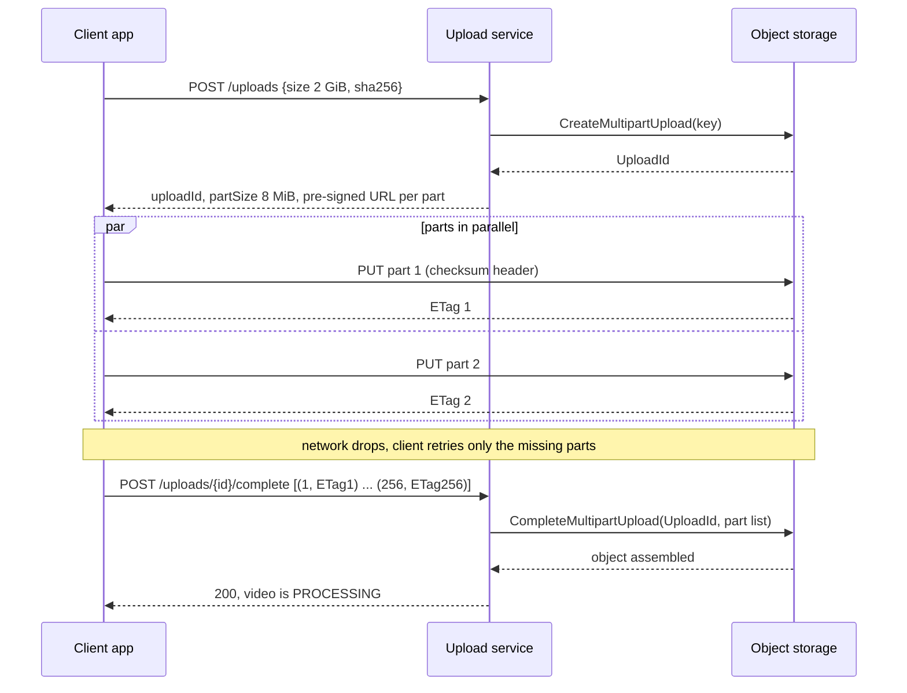
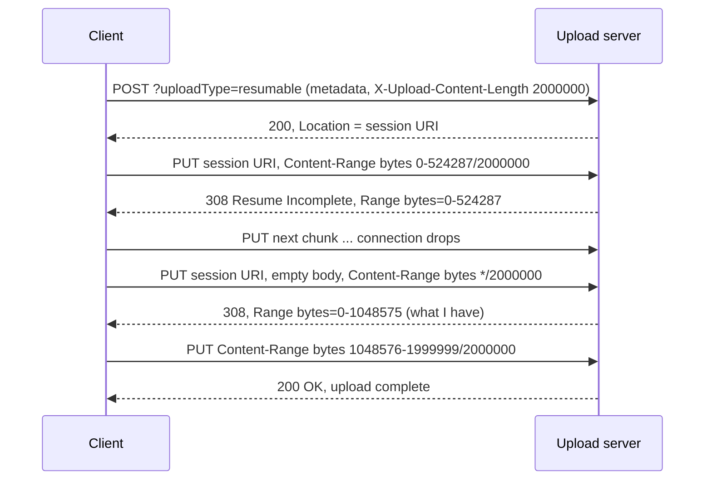

# Resumable and Chunked Uploads

## 1. One-line summary

Instead of sending a big file in **one HTTP request** that dies with the connection, the client sends it in **parts** (chunks) that are individually acknowledged, retried and checksummed, usually **straight to object storage** with pre-signed URLs; if the connection drops at 90%, the client asks "how much do you have?" and continues from there instead of starting again.

💡 **Object storage** (S3, GCS, Azure Blob) stores files ("objects") by key over HTTP and scales without you managing disks. See [object storage](../technologies/object-storage.md).

---

## 2. The problem it solves

**The pain:** a creator uploads a 2 GB video from a phone with one `POST /upload`:

- **Mobile networks drop.** Switching cell towers, entering a lift or a train tunnel resets the TCP connection. 💡 **TCP** is the transport under HTTP. When the connection resets, the half-sent request is lost, and with one big request the upload restarts from byte 0.
- **Timeouts everywhere.** Load balancers, API gateways and reverse proxies have idle and request timeouts (often 60 s, sometimes a few minutes). A 2 GB upload on a 10 Mbps uplink takes ~29 minutes (3.7).
- **Body size limits.** Proxies cap request bodies: NGINX's `client_max_body_size` defaults to 1 MB, API gateways have their own caps. You'd have to raise them for every hop.
- **Your servers become a pipe.** Streaming gigabytes through app servers ties up threads, memory and bandwidth for work that is just copying bytes.
- **No integrity check** until the end: a corrupted byte at minute 3 is found at minute 29.

**The fix:** three ideas, usually combined:

1. **Pre-signed URLs**: the client uploads directly to object storage, your API only hands out permission.
2. **Chunking**: split the file into parts, each its own request, each retried alone.
3. **Resumability**: the server remembers what it has, so the client can ask and continue.

> Infra analogy: it's `rsync --partial` versus `scp` over a flaky VPN, or a container registry pushing image layers separately: a failed push retries one layer, and layers that already exist (same digest) are skipped entirely. That last part is deduplication by content hash (§3.5).

---

## 3. How it works

### 3.1 Pre-signed URLs

A **pre-signed URL** is an ordinary object storage URL with a signature and expiry time in the query string, computed with your service's secret key. It means "the bearer may `PUT` to exactly this key until 10:15". The client never sees your credentials, and the bytes never touch your servers. Details and the sequence diagram are in [object storage: pre-signed URLs](../technologies/object-storage.md#34-pre-signed-urls-let-the-client-upload-directly).

### 3.2 S3 multipart upload



1. **Initiate** (`CreateMultipartUpload`) → an `UploadId`.
2. **Upload parts** (`UploadPart` with part number 1..10,000) in any order, in parallel. Each returns an **ETag** (an identifier of that part's content). Re-uploading part 7 simply replaces part 7.
3. **Complete** (`CompleteMultipartUpload`) with the list of part numbers and ETags. S3 stitches them into one object; until then nothing is visible.
4. Or **abort** (`AbortMultipartUpload`) to delete the parts.

To resume after the app restarts, `ListParts(UploadId)` tells you which parts S3 already has.

**Limits (AWS S3 user guide and the December 2025 AWS announcement, checked via search in October 2026):**

| Limit | Value |
|---|---|
| Part size | 5 MiB minimum (except the last part), 5 GiB maximum |
| Parts per upload | 10,000 |
| Max object size | 50 TB (raised from 5 TB in December 2025; the docs table lists 48.8 TiB = 10,000 × 5 GiB) |
| Single `PUT` without multipart | 5 GB |

The part-count limit means part size must grow with file size:

```
5 MiB parts × 10,000 = 50,000 MiB ≈ 48.8 GiB  → the biggest file 5 MiB parts can carry
part size = max(8 MiB, ceil(fileSize / 10,000))
```

Other object stores (GCS's XML multipart API, Azure block blobs with up to 50,000 blocks) work similarly with different numbers: check current docs.

### 3.3 Resumable session protocols

Multipart upload is "many independent parts". The other family is **one byte stream with a server-side offset**: the server records how many bytes it has, and the client continues from that offset.

**Google resumable uploads** (Google Cloud Storage, YouTube Data API):



- `Content-Range: bytes 0-524287/2000000` = "these are bytes 0 to 524,287 of a 2,000,000-byte file".
- `bytes */2000000` with an empty body is the "how much do you have?" query. The `Range` header in the reply says where to resume.
- Chunk sizes must be multiples of 256 KiB (except the last); sessions expire (GCS documents one week). Check current docs for exact rules.

**tus** (tus.io, an open protocol, v1.0) standardises the same idea for any server: `POST` with `Upload-Length` creates an upload and returns its URL, `HEAD` returns `Upload-Offset`, `PATCH` with `Upload-Offset` appends bytes. Extensions add checksums, expiry and parallel uploads. Libraries exist for most languages, so you don't invent your own protocol.

Telegram uses a fixed-part variant: the client cuts files into parts of at most **512 KB** and uploads each with its part number and the total part count, see [WhatsApp vs Telegram](../../case-studies/whatsapp-vs-telegram.md).

A server implementing offsets itself must make bytes **durable before acknowledging** the new offset (write and `fsync`, [file I/O and fsync](../../LLD/libraries/java/file-io-and-fsync.md)); otherwise a crash loses bytes the client was told are safe.

### 3.4 Checksums and parallel parts

- **Per-part checksums**: send `Content-MD5` or S3's `x-amz-checksum-crc32` / `-sha256` with each part. Storage rejects a corrupted part immediately, and you retry 8 MiB instead of 2 GiB.
- **Whole-file hash**: the client computes SHA-256 of the full file before uploading and sends it with the request. After completion, a worker verifies it. (S3's final multipart ETag is *not* an MD5 of the file, so don't use it as one.)
- **Parallel parts** (typically 3–6 at a time) help when a single connection can't fill the link: high latency limits how fast one TCP connection ramps up, and one slow part doesn't block the others. They **don't** make a 10 Mbps uplink faster than 10 Mbps. On a phone, use few connections and save battery.

### 3.5 Deduplication by content hash

If the client sends the file's hash first, the server can answer "already have it" and skip the upload. Dropbox does this per block, container registries per layer ([content fingerprinting and dedup](content-fingerprinting-and-dedup.md)).

Caveat: if dedup is global across users, "I have hash X" can become a way to claim someone else's file or to probe whether a file exists. Dedup per user, or require the uploader to prove possession (e.g. hash of a random byte range the server chooses).

### 3.6 Abandoned uploads: the hidden cost trap

Parts of a multipart upload that is never completed or aborted **stay stored and billed**, and they don't show up in a normal bucket listing.

```
10,000 uploads/day abandoned at 50% of 2 GiB on average = 10,000 × 1 GiB = 10,000 GiB ≈ 10 TB/day
after 30 days: 300 TB × $0.023/GB-month ≈ 300,000 GB × 0.023 ≈ $6,900/month, still growing
```

The fix is one **lifecycle rule** (an automatic bucket policy): `AbortIncompleteMultipartUpload` after e.g. 7 days. Pair it with a server-side expiry for your own upload sessions table.

### 3.7 Arithmetic: a 2 GiB video on a 10 Mbps uplink

```
parts:            2,048 MiB / 8 MiB = 256 parts
file in bits:     2 × 1,073,741,824 B × 8 = 17,179,869,184 bits ≈ 17.2 Gbit
upload time:      17.2 Gbit / 10 Mbit/s = 1,718 s ≈ 28.6 min
one part:         8 × 1,048,576 B × 8 = 67,108,864 bits / 10 Mbit/s ≈ 6.7 s
```

If the connection drops at 90%:

```
single POST:   restart, redo 28.6 min
multipart:     lose at most the parts in flight, e.g. 3 parallel × 6.7 s ≈ 20 s of work
```

256 small requests also fit comfortably under any proxy's per-request timeout.

---

## 4. When to use it

- **Any user upload above a few MB** over the public internet, especially from phones: video, photos in bulk, backups.
- **Large server-to-server transfers** to object storage (backups, data exports): SDK "transfer managers" use multipart automatically above a threshold (AWS suggests considering it from ~100 MB).
- **Unreliable or metered networks** where re-sending costs the user money.

## 5. When NOT to use it (and why it's a mistake)

| Situation | Why |
|---|---|
| Small files (avatars, documents of a few MB) | One pre-signed `PUT` is simpler. S3 parts must be ≥ 5 MiB anyway. |
| Tiny parts (e.g. 64 KB) on a fast link | Per-request overhead (TLS handshake, headers, round trips) dominates. Keep parts in the MBs. |
| Through your app servers when storage can take it directly | You pay for bandwidth and threads to copy bytes. Use pre-signed URLs. |
| Reinventing a resume protocol | tus and the cloud SDKs already solve the edge cases (offsets, expiry, checksums). |

---

## 6. Commonly confused with

| | **Single PUT / POST** | **Multipart upload (S3)** | **Resumable session (Google, tus)** | **Chunked transfer encoding** |
|---|---|---|---|---|
| Shape | one request | many independent numbered parts | one stream, server tracks offset | one request, body sent in pieces |
| Resume after drop | no | re-send missing parts | ask offset, continue | no |
| Parallel | no | yes | no (tus has an extension) | no |
| Purpose | small files | big files to object storage | big files, simple clients | streaming a body of unknown length |

**Chunked transfer encoding** (`Transfer-Encoding: chunked`) is an HTTP/1.1 feature for sending a body whose length isn't known up front. It does nothing for resumability: if the connection drops, the whole request is lost.

---

## 7. Common mistakes / misuse

1. **Routing gigabytes through the API servers** instead of pre-signed URLs.
2. **No lifecycle rule** for incomplete multipart uploads: invisible storage bills.
3. **Fixed 5 MiB parts for every file**: fine until someone uploads a 60 GB file and hits the 10,000-part limit.
4. **Trusting the client's "upload complete" message** without checking the object exists and its hash matches.
5. **Pre-signed URLs with long expiry and no size/type limits**: anyone holding the URL can upload anything for days.
6. **Acknowledging an offset before the bytes are durable** in a self-built resumable server.
7. **Treating "uploaded" as "ready"**: transcoding still has to run ([video transcoding pipeline](video-transcoding-pipeline.md)).

---

## 8. Interview cheat-sheet

> "The client asks our upload service for permission, and we start an S3 multipart upload and return pre-signed URLs per part, so the bytes go straight to object storage. A 2 GB file in 8 MiB parts is 256 parts, each a few seconds on a 10 Mbps uplink, each with its own checksum and retried alone, a few in parallel. If the app is killed, ListParts tells us what's there and we upload only the rest. Part size grows with file size because of the 10,000-part limit. On complete we verify the whole-file hash and fire an event that starts transcoding. A lifecycle rule aborts incomplete uploads after a few days, otherwise orphaned parts quietly cost money. For a simpler client, the Google resumable or tus protocol does the same with a server-side byte offset."

---

## 9. Used in

- [Video Streaming](../interviews/video-streaming/README.md): the creator upload path, from pre-signed multipart upload to the event that starts transcoding.
- [Case study: video upload, transcode and storage](../../case-studies/video-upload-transcode-and-storage.md): how real platforms accept large uploads.
- [WhatsApp vs Telegram](../../case-studies/whatsapp-vs-telegram.md): Telegram's 512 KB file parts.
- [File storage & sync](../interviews/file-storage-sync/README.md): uploading only the **missing blocks** of a file in parallel, each retried independently, committing the new version once all are present.
- Related: [object storage](../technologies/object-storage.md), [CDN](../technologies/cdn.md), [idempotency](idempotency-and-delivery-semantics.md), [retries, backoff and DLQ](retries-backoff-and-dlq.md), [content fingerprinting and dedup](content-fingerprinting-and-dedup.md), [file I/O and fsync](../../LLD/libraries/java/file-io-and-fsync.md), [adaptive bitrate streaming](adaptive-bitrate-streaming.md).
