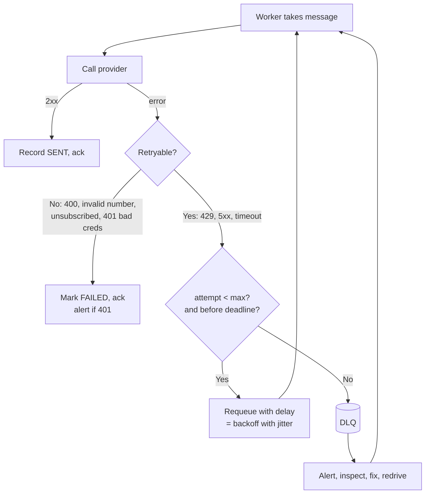

# Retries, Backoff and Dead-Letter Queues

## 1. One-line summary

When a call fails, **retry** only if the error is temporary, wait **exponentially longer with random jitter** between attempts, stop after a budget, stop calling a clearly broken dependency (**circuit breaker**), and park messages that keep failing in a **dead-letter queue (DLQ)** so they don't block everything else.

---

## 2. The problem it solves

**The pain:** an SMS provider has a 2-minute blip and returns 503. Your 200 SMS workers each retry immediately, in a tight loop:

- 200 workers × ~20 retries/s = **4,000 requests/s** at a provider that is already struggling. You prolong its outage (a **retry storm**).
- When it recovers, every worker retries at the same instant (**thundering herd**) and knocks it over again.
- One message has a malformed phone number. It fails, retries, fails, forever: a **poison message** that ties up a worker.
- Meanwhile, the OTP queue fills up behind it.

**The fix:** classify errors, back off exponentially with jitter, cap attempts, trip a circuit breaker on widespread failure, and move hopeless messages to a DLQ to inspect and **redrive** later.

> Infra analogy: Kubernetes `CrashLoopBackOff`. A failing pod is restarted after 10 s, 20 s, 40 s ... up to 5 minutes, instead of restarting 100 times a second. Same idea for calls.

---

## 3. How it works



### 3.1 Retryable vs non-retryable

| Retry (transient) | Don't retry (permanent) |
|---|---|
| Timeouts, connection reset | 400 Bad Request, validation errors |
| 429 Too Many Requests (honor `Retry-After`) | 401/403 auth errors (alert a human: rotated key?) |
| 500, 502, 503, 504 | 404 / provider "invalid phone number" |
| Provider "temporarily unavailable" codes | APNs 410 / FCM UNREGISTERED (delete token instead) |
| | User unsubscribed, email hard bounce |

A timeout is ambiguous: the provider may have sent it. Retrying is still right, but only with [idempotency](idempotency-and-delivery-semantics.md) in place.

### 3.2 Exponential backoff with jitter

Formula ("full jitter", recommended by the AWS architecture blog):

```
delay = random(0, min(cap, base × 2^attempt))
```

With `base = 1 s`, `cap = 5 min`:

| attempt | base × 2^attempt | delay range |
|---|---|---|
| 0 | 1 s | 0-1 s |
| 1 | 2 s | 0-2 s |
| 2 | 4 s | 0-4 s |
| 3 | 8 s | 0-8 s |
| 5 | 32 s | 0-32 s |
| 8 | 256 s | 0-256 s |
| 9+ | 512 s → capped | 0-300 s |

Why **jitter**: without it, 10,000 messages that failed at 12:00:00 all retry at exactly 12:00:01, 12:00:03, 12:00:07 in synchronized waves. Randomizing spreads them across the window.

```java
import java.util.concurrent.ThreadLocalRandom;

public final class Backoff {
    private final long baseMillis;
    private final long capMillis;

    public Backoff(long baseMillis, long capMillis) {
        this.baseMillis = baseMillis;
        this.capMillis = capMillis;
    }

    /** Full jitter: random in [0, min(cap, base * 2^attempt)]. attempt starts at 0. */
    public long delayMillis(int attempt) {
        // Clamp the shift so 2^attempt doesn't overflow a long for large attempt values.
        long exp = baseMillis << Math.min(attempt, 30);
        long ceiling = Math.min(capMillis, exp);
        return ThreadLocalRandom.current().nextLong(ceiling + 1);
    }

    public static void main(String[] args) {
        Backoff b = new Backoff(1_000, 300_000);
        for (int attempt = 0; attempt < 10; attempt++) {
            System.out.printf("attempt %d -> wait %d ms%n", attempt, b.delayMillis(attempt));
        }
    }
}
```

Where the delay lives: with SQS, set `ChangeMessageVisibility` to the delay (message reappears later); with RabbitMQ, publish to a delay/retry queue with a TTL that dead-letters back to the main queue. **Never `Thread.sleep()` inside a worker** for minutes: it holds a worker slot and the message lease.

### 3.3 Retry budgets and storms

- **Max attempts / deadline:** e.g. 8 attempts or 1 hour, whichever first. An OTP's deadline is ~5 minutes; a "weekly digest" can retry for a day.
- **Don't retry at every layer.** If the API retries 3×, the worker 3×, and the HTTP client 3×, one failure becomes 3 × 3 × 3 = **27 calls**. Retry at one layer (usually the queue).
- **Retry budget:** allow retries to be at most ~10% of total traffic per provider. If the ratio is exceeded, the dependency is broadly broken, so stop retrying and let the circuit breaker act.

### 3.4 Circuit breaker

A small state machine per dependency (e.g. per provider):

| State | Behavior | Transition |
|---|---|---|
| **Closed** | Calls go through, failures counted | Error rate > 50% over last 20 calls → Open |
| **Open** | Fail fast, don't call (or **fail over** to provider B) | After 30 s → Half-open |
| **Half-open** | Let a few trial calls through | Success → Closed; failure → Open |

In Java, Resilience4j provides this. Breaker + DLQ + second provider = graceful degradation instead of an outage.

### 3.5 DLQ and redrive

- After `maxReceiveCount` (SQS) or N rejections (RabbitMQ), the broker moves the message to the DLQ with its error context.
- **Alert when DLQ depth > 0** (or above a small threshold). A DLQ nobody watches is a silent data-loss bin.
- After a fix (bad template deployed, provider back up), **redrive**: move DLQ messages back to the main queue (SQS has a built-in redrive). First check whether they are still relevant: don't redrive 6-hour-old OTPs.
- A **poison message** (crashes or always fails due to its content) is exactly what the DLQ isolates.

---

## 4. When to use it

- Every call to a third party or across the network: providers, other services, DBs.
- Every queue consumer: configure max attempts and a DLQ on day one.
- Circuit breakers for dependencies that can fail as a whole (SMS provider, email provider).

## 5. When NOT to use it (and why it's a mistake)

| Situation | Why |
|---|---|
| Non-retryable errors (400, invalid number) | Wastes quota, never succeeds, delays the DLQ signal. |
| Non-idempotent operations without a dedup key | Each retry may double-send or double-charge. |
| Retrying synchronously inside a user request for long | User waits seconds/minutes; push it to a queue instead. |
| Immediate retry without backoff | Creates the retry storm you're trying to survive. |
| Retrying past the message's usefulness | A 2-hour-late OTP or "your ride is arriving" is worse than nothing. Set a deadline/TTL. |

---

## 6. Commonly confused with

| | **Retry with backoff** | **Circuit breaker** | **Rate limiter** | **DLQ** |
|---|---|---|---|---|
| Protects against | Transient failures of one call | A dependency that is broadly down | Overloading a dependency / abusing users | Messages that can never succeed |
| Scope | Per request/message | Per dependency | Per user / per provider / per key | Per queue |
| Action | Wait and try again | Stop calling for a while | Delay or reject excess calls | Park for humans |
| Example | 503 → retry in 0-4 s | Twilio 60% errors → switch to provider B | FCM ≤ 10k/s; ≤ 3 marketing pushes/user/day | Malformed template |

See the [rate limiter LLD](../../LLD/interviews/rate-limiter/README.md) for token bucket details.

---

## 7. Common mistakes / misuse

1. **Fixed delay retries** (every 1 s): synchronized waves, no relief for the dependency.
2. **Exponential without jitter**: still synchronized.
3. **No cap** on delay or attempts: `2^20` seconds is 12 days.
4. **Retrying at every layer** (multiplying calls).
5. **Ignoring `Retry-After`** on 429s.
6. **DLQ without alerting or redrive tooling**, so failed notifications disappear quietly.
7. **Redriving everything blindly** after an outage: stale OTPs and duplicate marketing.
8. **Sleeping in the worker thread** instead of delaying the message.

---

## 8. Interview cheat-sheet

> "Workers classify provider errors: 429, 5xx and timeouts are retried, while 4xx like an invalid number or an unsubscribed user are marked failed immediately. Retries use exponential backoff with full jitter, a random delay between zero and min(cap, base × 2^attempt), so thousands of failed messages don't retry in sync. The delay is implemented by the queue, through visibility timeout or a delay queue, not by sleeping. Each message has a max attempt count and a deadline that depends on priority, so an OTP gives up after about five minutes while a digest can retry for hours. If a provider's error rate spikes, a circuit breaker opens and we fail over to the secondary provider instead of building a retry storm. Messages that exhaust retries go to a DLQ that pages on-call, and after a fix we redrive only the ones still worth sending."

---

## 9. Used in

- [Notification system](../interviews/notification-system/README.md): **channel workers** retrying provider calls with exponential backoff and jitter, per-priority deadlines, circuit breakers with provider failover, and DLQs with redrive.
- [API gateway](../interviews/api-gateway/README.md): **gateway retries to backends** (idempotent requests only, jittered backoff, retry budgets) and **per-backend circuit breakers**; the synchronous-path extensions (deadlines, bulkheads, load shedding) are in [resilience patterns](resilience-patterns.md).
- [Web crawler](../interviews/web-crawler/README.md): **per-host backoff** on timeouts, 5xx and `429`/`503` with `Retry-After` (slow the whole host, don't retry URL by URL), and marking URLs dead after a few failures.
- [LLD: Task Scheduler](../../LLD/interviews/task-scheduler/README.md): retries implemented in code: **exponential backoff with full jitter**, a max-attempts limit, then a dead-letter list; recurring tasks keep their schedule after a dead letter.
- [Video streaming](../interviews/video-streaming/README.md): per-chunk retries in the transcoding DAG and a dead-letter queue for videos that crash every encoder.
- Related: [message queues](../technologies/message-queues.md) (visibility timeout, DLQ config), [idempotency and delivery semantics](idempotency-and-delivery-semantics.md), [push/email/SMS providers](../technologies/push-email-sms-providers.md), [rate limiter (LLD)](../../LLD/interviews/rate-limiter/README.md).
