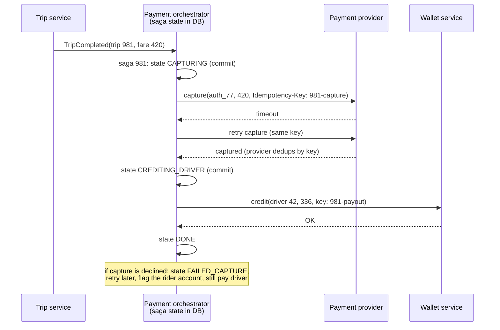

# Sagas and Distributed Transactions

## 1. One-line summary

When one business action touches **several services or companies** (trip service, payment provider, driver wallet), you can't wrap it in one database transaction; a **saga** does it as a **sequence of small local transactions**, each with a **compensating action** (an "undo") that runs if a later step fails.

> 💡 **ACID transaction**: what `BEGIN ... COMMIT` gives you inside one database: all-or-nothing (Atomic), rules kept (Consistent), concurrent transactions don't see each other's half-done work (Isolated), committed data survives crashes (Durable).

---

## 2. The problem it solves

**The pain:** a ride ends and we need to:

1. Mark trip `COMPLETED` with fare ₹420 (trip DB, ours).
2. Charge the rider's card ₹420 (Stripe / Razorpay, **someone else's** system).
3. Credit the driver's wallet ₹336 after 20% commission (wallet DB, another team's service).

In a monolith with one DB you'd write `BEGIN; ...; COMMIT;`. Here:

- Stripe won't join your Postgres transaction. It's an HTTPS API.
- The wallet service has its own DB; you can't hold its row locks from yours.
- Any step can fail, time out (did the charge happen or not?), or the pod running the code can die between step 2 and 3.

Naive code charges the card, crashes, and the driver never gets paid; or retries and **charges the rider twice**.

**The fix:** accept that the steps commit separately, make each one **idempotent** (safe to retry), record progress durably, and define how to **compensate** each step if the whole thing can't finish. The system becomes **eventually consistent**: briefly in between states, but always ending in a correct final state.

---

## 3. How it works

### 3.1 Two-phase commit (2PC) in plain words, and why we avoid it across services

**2PC** has a **coordinator** ask every participant two questions:

1. **Prepare**: "Can you commit? If yes, lock everything and promise you'll be able to." Each says YES/NO.
2. **Commit**: if all said YES, "commit"; otherwise "abort".

It gives real atomicity, and it exists (XA transactions in Java, Postgres `PREPARE TRANSACTION`). Why it's avoided between services:

| Problem | Effect |
|---|---|
| **Blocking** | Participants hold locks between prepare and commit. If the coordinator dies, they wait (maybe minutes) with rows locked. |
| **Availability multiplies** | 3 participants at 99.9% each → `0.999³ ≈ 99.7%` for every transaction. |
| **Latency** | 2 round trips to every participant while locks are held. |
| **Not supported** | Stripe, Kafka's HTTP clients, most SaaS APIs and many NoSQL stores don't speak XA. |

Infra analogy: a deploy that requires all 3 clusters to say "ready" and freezes them all until the controller says "go". One slow cluster stalls everyone.

### 3.2 Sagas: local transactions + compensations

A saga is `T1 → T2 → T3 ...`, each `Ti` a local commit in one service. If `Tk` fails, run compensations `Ck-1 → ... → C1` in reverse. Compensations are **semantic undos**, not rollbacks: you can't un-send an email, but you can send "sorry, cancelled"; you can't un-charge, but you can **refund**.

The ride payment saga:

| Step | Local transaction | Compensation if later steps fail |
|---|---|---|
| T1 at request | **Authorize** ₹500 hold on card (estimate + buffer); trip `REQUESTED` | **Void** the authorization (release the hold) |
| T2 | Match driver, trip `IN_PROGRESS` ... `COMPLETED`, fare = ₹420 | (cancel trip, apply cancellation fee policy) |
| T3 | **Capture** ₹420 of the ₹500 hold | **Refund** ₹420 |
| T4 | Credit driver wallet ₹336; ledger entries | Debit/reverse wallet entry |
| T5 | Send receipt | none needed (just informational) |

> 💡 **Authorize vs capture**: an *authorization* asks the card's bank to reserve money (it shows as "pending" on your statement) without moving it; a *capture* actually takes it, usually within ~7 days or the hold expires. Hotels and petrol pumps work this way.

Some steps should be **retried forward, never compensated**: once the rider has taken the ride, a failed capture is retried (with backoff for hours/days) rather than "undoing" the trip. Decide per step: compensatable, retriable, or a **pivot** (the point of no return, here the trip starting).

### 3.3 Orchestration vs choreography

| | **Orchestration** | **Choreography** |
|---|---|---|
| How | A central orchestrator tells each service what to do next and stores saga state | Each service reacts to events and emits the next event (`TripCompleted` → payment listens → `PaymentCaptured` → wallet listens) |
| Visibility | One place shows "saga 981 is at step 3" | Flow is spread across services; need tracing to see it |
| Coupling | Orchestrator knows every step | Services only know events |
| Good for | Money flows, 4+ steps, complex compensations | 2–3 simple steps, many independent listeners |
| Tools | Temporal, AWS Step Functions, Camunda, or a state table + workers | [Kafka](../technologies/kafka.md) topics |

For payments, orchestration is usually preferred: auditors and on-call want one row that says where each payment is.

### 3.4 Idempotency of each step

Every step will be retried (timeouts, crashes, redelivered messages), so each needs an **idempotency key** derived from the saga, not random per attempt: `981-authorize`, `981-capture`, `981-payout`. Payment providers accept an `Idempotency-Key` header and return the original result for a repeated key. Your own services store processed keys (unique constraint) and return the stored result. See [idempotency and delivery semantics](idempotency-and-delivery-semantics.md).

The scary case is a **timeout**: you don't know whether the capture happened. Never "assume failed and compensate"; retry with the same key, or query the provider by key, until you get a definite answer.

### 3.5 Outbox: don't lose the next step

"Update saga state to CAPTURING" and "publish a message to do the capture" must both happen or neither. Writing the DB then publishing to Kafka can crash in between. Use the **transactional outbox**: write the state change and an `outbox` row in **one local transaction**, and a relay publishes it (at-least-once, so consumers are idempotent). Described in detail in [fan-out → transactional outbox](fan-out.md#35-transactional-outbox).

### 3.6 Isolation is the price

A saga is atomic *eventually* but **not isolated**: other readers can see half-done states (trip `COMPLETED` but payment `PENDING`). Handle it with explicit states (`PAYMENT_PENDING`, shown as "processing" in the app), and with **semantic locks** (a flag like `payment_in_progress` that blocks, say, deleting the card until the saga ends).

---

## 4. When to use it

- A business action spans **multiple services or external providers**: ride payment, food order (restaurant + courier + payment), travel booking (flight + hotel).
- Steps are **long-running** (seconds to days): authorize at request, capture after a 40-minute trip.
- Each step can be made idempotent and has a sensible compensation or forward-retry.

## 5. When NOT to use it (and why it's a mistake)

| Situation | Why |
|---|---|
| All data lives in **one database** | Just use a local ACID transaction. A saga there adds states, workers and bugs for nothing. |
| Two microservices that always change together, same team | Maybe they should be one service with one DB; a saga papers over a bad boundary. |
| Strong isolation is required (two transfers must never see each other's intermediate state) | Sagas expose intermediate states; keep that ledger in one DB. |
| Steps with no possible compensation and no retry path | You need a pivot/approval design, not a naive saga. |

---

## 6. Commonly confused with

| | **Local ACID transaction** | **Two-phase commit (2PC / XA)** | **Saga** | **Outbox** |
|---|---|---|---|---|
| Scope | One DB | Several DBs that support XA | Several services / providers | One DB + a broker |
| Atomicity | Yes | Yes | Eventually, via compensations | Atomic "state + event" |
| Isolation | Yes | Yes (locks held) | **No**: intermediate states visible | n/a |
| Failure of coordinator | n/a | Participants block, locks held | Saga resumes from stored state | Relay resumes |
| Latency | ms | High, locks during 2 round trips | Each step independent | Small delay to publish |
| Use | Default inside a service | Rare, legacy, same-vendor DBs | Cross-service business flows | Building block of sagas and events |

---

## 7. Common mistakes / misuse

1. **Calling the payment provider inside a DB transaction**: the HTTP call takes 2 s while holding row locks; if the DB commit then fails, money moved with no record.
2. **New random idempotency key per retry**, so the provider sees each retry as a new charge: double charge.
3. **Compensating on timeout** (refund a charge that may never have happened, or void then capture races).
4. **Saga state only in memory**: pod restarts, saga forgotten, driver never paid. Persist state at every step.
5. **Dual write** to DB and Kafka instead of an outbox.
6. **No reconciliation**: a nightly job comparing our ledger with the provider's settlement report catches what slipped through (and auditors require it).
7. **Forgetting authorization expiry**: a hold expires after ~7 days; a long dispute must re-authorize or charge differently.

---

## 8. Interview cheat-sheet

> "We can't do one ACID transaction across the trip DB, the payment provider and the wallet service, and 2PC would block and isn't supported by providers, so payment is an orchestrated saga. At request time we authorize a hold for the estimated fare; when the trip completes we capture the actual fare and then credit the driver; if the rider cancels before pickup we void the hold. Each step uses a deterministic idempotency key like trip-ID plus step, so retries after a timeout never double-charge, and on a timeout we retry or query rather than compensate. Saga state lives in our DB and every transition writes an outbox row in the same transaction, so no step is lost. A nightly reconciliation against the provider's report catches anything left."

---

## 9. Used in

- [Ride-sharing](../interviews/ride-sharing/README.md): the **payment flow**: authorize at request, capture at trip end, driver payout, void/refund compensations on cancellation or failure, idempotency keys per step, outbox-driven events from the trip service.
- Related: [idempotency and delivery semantics](idempotency-and-delivery-semantics.md), [fan-out](fan-out.md) (transactional outbox), [retries, backoff and DLQ](retries-backoff-and-dlq.md), [distributed locks and leases](distributed-locks-and-leases.md), [CAP and consistency](cap-and-consistency.md), [Kafka](../technologies/kafka.md), [PostgreSQL](../technologies/postgresql.md).
