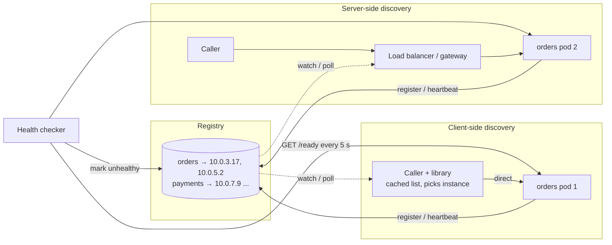

# Service Discovery

## 1. One-line summary

Service discovery is how a caller turns a **name** ("the `orders` service") into the **current list of healthy instances** (`10.0.3.17:8080`, `10.0.5.2:8080`, ...), even though instances are constantly created, moved and killed.

---

## 2. The problem it solves

**The pain:** in 2010 you hard-coded `orders.host=10.0.3.17` in a config file. Today `orders` runs as 30 pods that:

- get new IPs every deploy (several times a day),
- scale from 30 to 120 during peak and back,
- die at random (node drained, OOM-killed: killed by the kernel for using too much memory).

A static config is wrong within minutes. Callers send traffic to dead IPs, get connection timeouts, and new pods receive nothing.

**The fix:** a **registry**, a live directory of `service → [healthy instances]`, kept up to date by registration and **health checks** (periodic "are you alive and ready?" probes). Callers (or a proxy in front of them) look up the name, cache the answer briefly, and pick an instance.

> You use this daily: a k8s `Service` named `orders` plus its `EndpointSlice` (the list of ready pod IPs) **is** a service registry. kubelet's readiness probe is the health check. CoreDNS answers `orders.default.svc.cluster.local`.

---

## 3. How it works



### 3.1 Three styles

**1. DNS-based.** The name resolves to several IPs (A records = DNS entries mapping a name to an IPv4 address) or SRV records (name → host + port). Universal: every language can resolve DNS.
- Weakness: **caching**. Each answer has a **TTL** (time to live: how long a client may reuse it). Resolvers, OSes and especially the **JVM** cache answers, sometimes ignoring short TTLs (older JVMs with a security manager cached forever; set `networkaddress.cache.ttl`). Updates take seconds to minutes to reach callers.
- DNS has no load or health info beyond "this IP is listed".
- Good for coarse routing: which region, which external service.

**2. Client-side discovery (registry + smart client).** Instances register in **Eureka** (Netflix), **Consul** (HashiCorp) or etcd; the caller's library fetches the list, caches it, and load-balances itself (Spring Cloud LoadBalancer, gRPC's xDS client). (**gRPC** = typed RPC calls over HTTP/2; **xDS** = Envoy's streaming config API that pushes endpoint lists to clients.)
- Pros: no extra hop, the client can do smart balancing (least-requests, zone-aware).
- Cons: a discovery library per language; every client must be upgraded to change behaviour.

**3. Server-side discovery.** The caller sends to one stable address (a load balancer, a gateway, a k8s `ClusterIP`), and *that* component knows the instances.
- Pros: callers stay dumb; any language works.
- Cons: one more hop (~0.2–1 ms), the LB must be highly available.

A **service mesh** sidecar is a hybrid: server-side from the app's view (it calls `localhost`), client-side from the network's view (the sidecar holds the list via xDS, see [service mesh and Envoy](../technologies/service-mesh-and-envoy.md)).

### 3.2 Kubernetes as the everyday example

| Piece | Role in discovery |
|---|---|
| `Service` (ClusterIP) | Stable virtual IP (an address no machine owns; node rules redirect it) + DNS name for a set of pods |
| `EndpointSlice` | The registry entry: list of ready pod IPs, updated by the control plane |
| Readiness probe | Health check: a failing pod is removed from the slice |
| kube-proxy (iptables/IPVS) | Server-side LB on every node: rewrites packets for the virtual IP to a pod IP |
| CoreDNS | DNS front: `orders.prod.svc.cluster.local` → ClusterIP |
| Headless Service (`clusterIP: None`) | DNS returns pod IPs directly: client-side style (used for gRPC, Cassandra, Kafka) |

Under the hood the EndpointSlice data lives in [etcd](../technologies/zookeeper-etcd.md), and kube-proxy, ingress controllers and mesh control planes all **watch** it (a streaming subscription that pushes changes instead of polling).

### 3.3 Registration and health

- **Self-registration:** the instance registers itself on startup and sends **heartbeats** (e.g. Eureka: every 30 s; evicted after 90 s of silence). See [presence and heartbeats](presence-and-heartbeats.md).
- **Third-party registration:** an orchestrator (k8s, Nomad) registers instances for them. Better: an app that crashes can't "forget" to deregister.
- **Health checks:** **liveness** (is the process stuck? restart it) vs **readiness** (can it serve traffic now? remove it from discovery). Only readiness should affect discovery.
- **Graceful shutdown:** mark not-ready → wait until callers notice (k8s: a `preStop` sleep of ~5–15 s) → stop accepting → finish in-flight requests. Otherwise callers keep sending to a closing pod.

### 3.4 Staleness: the core trade-off

Every caller has a cached copy, so the list is always a little stale. How stale?

```
time to stop sending to a dead pod ≈ detection + propagation + caller cache
k8s example:  readiness 3 fails × 5 s period = 15 s
            + EndpointSlice update to kube-proxy ≈ 1 s
            + caller cache (kube-proxy has none) = 0
            ≈ 16 s
DNS + JVM cache of 30 s: up to 15 + 1 + 30 ≈ 46 s
```

During that window some requests hit a dead instance. That's why callers also need **fast connect timeouts** (~100–250 ms), **one retry to a different instance**, and **passive health checks / outlier detection** (eject an instance after N consecutive errors). See [resilience patterns](resilience-patterns.md).

**When the registry itself fails**: clients should keep using the last known list (**fail static**) rather than drop to zero instances. Eureka's "self-preservation mode" stops evicting when too many heartbeats are missing at once, assuming a network problem rather than mass death. This is an AP choice (keep serving, possibly stale) in [CAP](cap-and-consistency.md) terms.

---

## 4. When to use it

- Any time instances are dynamic: containers, autoscaling groups, rolling deploys. In k8s, you get it for free; use it.
- Gateways and proxies: the gateway resolves route targets (`cluster: orders`) to instances through discovery, not static IPs.
- Client-side discovery when you need per-request balancing (gRPC over HTTP/2) or zone-aware routing to save cross-zone traffic cost.

## 5. When NOT to use it (and why it's a mistake)

| Situation | Why it's a mistake |
|---|---|
| Running Eureka/Consul **inside** k8s just for k8s services | Duplicates what Services/EndpointSlices already do; two registries can disagree. |
| DNS with very low TTLs (1 s) for fast failover | Many clients ignore it, and you multiply DNS query load; use a real LB or watch-based discovery. |
| A deep health check (DB, Redis, downstreams) used for readiness | One dependency blip marks **every** instance unready; discovery returns an empty list. |
| Static IP lists for a handful of fixed, stable hosts (a DB primary with a VIP) | Fine as is; a registry adds a moving part with no benefit. |

---

## 6. Commonly confused with

| | **DNS discovery** | **Client-side registry** | **Server-side (LB)** | **k8s Service** |
|---|---|---|---|---|
| Who picks the instance | Client (from IP list) | Client library | LB / proxy | kube-proxy on the node |
| Freshness | Seconds–minutes (TTL + caches) | ~1–30 s (watch or poll) | ~1–10 s | ~1–2 s after readiness change |
| Extra hop | No | No | Yes | No real hop (kernel NAT: the packet's destination is rewritten in place) |
| Language support | Any | Per-language library | Any | Any |
| Examples | Route 53, CoreDNS | Eureka, Consul, gRPC xDS | ALB, Envoy, API gateway | ClusterIP, headless |

Also confused with **[load balancing](../technologies/load-balancer.md)**: discovery produces the list of healthy instances; load balancing picks one from it.

---

## 7. Common mistakes / misuse

1. **Forgetting JVM DNS caching** and wondering why traffic still goes to old IPs.
2. **No graceful shutdown**: pods get SIGTERM (the "please stop" signal) and die while still listed, causing 502s ("bad gateway": the proxy couldn't get a response) on every deploy.
3. **Liveness probe checks dependencies**: k8s restarts healthy pods in a loop when the DB blips.
4. **Assuming the list is always correct**: no timeouts or retry-to-another-instance for the staleness window.
5. **Registry as SPOF**: clients that fail when the registry is down instead of using their cached list.
6. **L4 Service for gRPC**: one long-lived HTTP/2 connection pins all calls to one pod; use a headless Service + client-side balancing or a mesh.

---

## 8. Interview cheat-sheet

> "Backends are dynamic pods, so the gateway never uses static IPs. It discovers instances through the platform's registry: in Kubernetes that's the Service's EndpointSlices, which only contain pods passing their readiness probe, and the gateway's control plane watches them and pushes updated endpoint lists to every gateway node within a second or two. The list is always slightly stale, around 15 seconds for a crashed pod, so the gateway uses short connect timeouts, retries once on a different instance, and ejects instances that return consecutive 5xx. If the registry is unavailable, nodes keep their last known list instead of failing. On deploys, pods go unready and wait a few seconds before shutting down so no traffic hits a closing instance."

---

## 9. Used in

- [API gateway](../interviews/api-gateway/README.md): **routing to backend services found via service discovery**: the control plane watches the registry and pushes endpoint lists to gateway nodes; staleness handling with timeouts, retries and outlier ejection.
- Related: [load balancer](../technologies/load-balancer.md), [service mesh and Envoy](../technologies/service-mesh-and-envoy.md) (EDS), [ZooKeeper / etcd](../technologies/zookeeper-etcd.md), [presence and heartbeats](presence-and-heartbeats.md), [resilience patterns](resilience-patterns.md), [CAP and consistency](cap-and-consistency.md).
