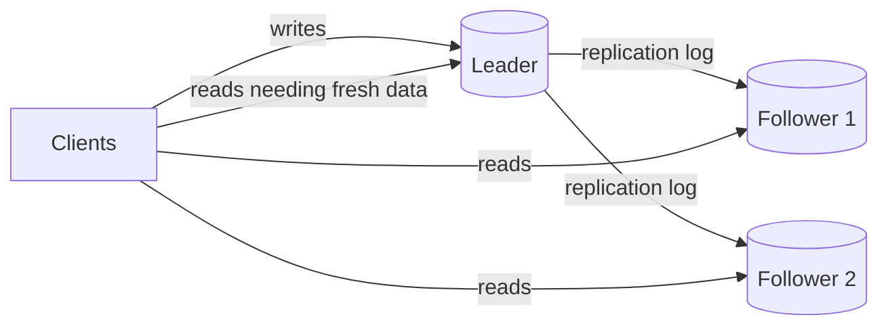
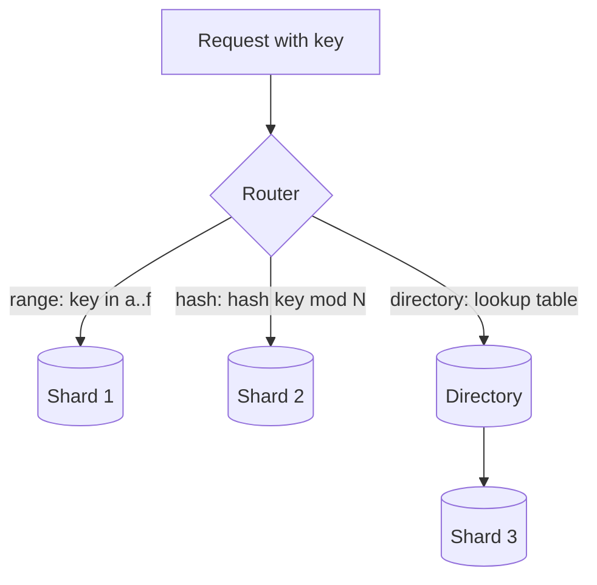

# Sharding and Replication

## 1. One-line summary

**Replication** = keeping copies of the *same* data on several machines (for availability and read scaling); **sharding** (partitioning) = splitting *different* data across machines (for write throughput and storage that one machine can't hold).

## 2. The problem it solves

A single database server eventually hits one of these walls:
- **It dies** → the whole product is down. (Single point of failure.)
- **Too many reads** → CPU/IO saturated.
- **Too many writes** → one primary can only commit so many transactions per second.
- **Too much data** → it doesn't fit on one disk, or backups/restores take a day.

Step one is usually **vertical scaling**: buy a bigger box. When that stops being enough (or affordable), you scale **horizontally**:
- Reads and availability problems → **replication**.
- Write throughput and data size problems → **sharding**.

Infra analogy: replication is like running 3 replicas of a k8s Deployment behind a Service (same thing, many copies); sharding is like splitting a monolith's tenants across separate clusters (each cluster owns different customers).

## 3. How it works

### 3.1 Vertical vs horizontal scaling

| | Vertical (scale up) | Horizontal (scale out) |
|---|---|---|
| How | Bigger CPU/RAM/disk | More machines |
| Code changes | None | Often significant (routing, consistency) |
| Limit | Biggest machine you can buy (today: hundreds of cores, TBs of RAM) | Practically none |
| Failure | Still one box | Survives node loss |
| Cost curve | Gets expensive at the top end | Roughly linear |

Don't underrate vertical: a single modern Postgres server comfortably handles thousands of writes/s and tens of thousands of reads/s, and several TB of data.

### 3.2 Replication models

**Leader-follower (primary-replica)** — one leader takes all writes and streams its change log to followers; followers serve reads. Default in Postgres, MySQL, MongoDB, Redis.

- **Synchronous** replication: leader waits for the follower before acknowledging → no data loss on failover, but slower and blocked if the follower is down.
- **Asynchronous**: leader acks immediately → fast, but a failover can lose the last few writes. Common compromise: one sync follower + others async ("semi-sync").
- **Failover**: promote a follower when the leader dies (Patroni, RDS Multi-AZ). Danger: **split brain** — two nodes both think they're leader. Prevented with consensus/leases (e.g., via [etcd](../technologies/zookeeper-etcd.md)).

**Multi-leader** — several nodes accept writes (typically one per region) and replicate to each other. Good for multi-region writes and offline clients. The cost: **write conflicts** (two regions edit the same row) must be resolved — last-write-wins (loses data), merge logic, or CRDTs. Avoid unless you truly need it.

**Leaderless** — any replica accepts writes; client (or coordinator) writes to N replicas and reads from several, using quorums (`R + W > N`, see [CAP and consistency](cap-and-consistency.md)). Background repair (read repair, anti-entropy) fixes divergence. Used by Dynamo, [Cassandra](../technologies/cassandra.md), Riak.

### 3.3 Replication lag and read-your-writes

With async followers, a follower may be milliseconds to seconds behind. Classic bug: user creates a short link, the page redirects to "your links", the read hits a lagging follower → the new link isn't there → user thinks it failed.

Fixes for **read-your-writes** consistency:
- Read from the **leader** for a short time after a user writes (e.g., 10 s, tracked by a cookie/session timestamp).
- Read the user's *own* data from the leader; everyone else's from followers.
- Track the replication position (LSN in Postgres): the client remembers the LSN of its write and only reads from a follower that has caught up to it.
- Return the created object in the write response so the client doesn't need to re-read.

Related guarantees: **monotonic reads** (don't go backwards in time — pin a user to one follower) and **consistent prefix** (see causes before effects).

### 3.4 Sharding strategies

**Range-based** — shard by key ranges: `a–f` → shard 1, `g–m` → shard 2... or by date.
- Range scans are efficient ("all events from March").
- Risk: **hot ranges** — sequential keys (timestamps, auto-increment ids) send *all* new writes to the last shard.
- Used by HBase, Bigtable, Spanner, CockroachDB (they split ranges automatically).

**Hash-based** — `shard = hash(key) % N` or [consistent hashing](consistent-hashing.md).
- Even spread, no hot range from sequential keys.
- No efficient range scans; resharding with `% N` moves most data (use consistent hashing or a fixed number of logical partitions).
- Used by Cassandra, DynamoDB, Redis Cluster (hash slots).

**Directory / lookup-based** — a lookup table maps key (or tenant) → shard.
- Total flexibility: move one big tenant to its own shard, rebalance one key at a time.
- The directory is an extra hop and must itself be highly available and cached.
- Common in multi-tenant SaaS (`tenant_id → shard`).

### 3.5 Choosing a shard key

The most important sharding decision. A good key:
1. **High cardinality** — many distinct values (user_id good; country bad; boolean terrible).
2. **Even distribution of load**, not just data — no single value receives a huge share of traffic.
3. **Matches the main query pattern** — most queries should include the shard key so they hit **one** shard. Queries without it become **scatter-gather** across all shards (slow, and the slowest shard sets your latency).
4. **Keeps related data together** — e.g., shard orders by `customer_id` so a customer's orders + items are on one shard and can be joined/transacted locally.

URL shortener: shard by **short code** (hash). Every redirect lookup has the code → single-shard read. "List my links" by user_id becomes scatter-gather — fix with a secondary table keyed by user_id.

### 3.6 Hot partitions

Even with a good key, one value can be hot: a celebrity's user_id, a viral short link, "today's" date in a time-range key.
- **Cache** the hot reads (most common fix for read hotspots).
- **Key salting / splitting**: write to `key#0..key#9` across 10 shards, read and merge all 10 (for write hotspots like counters).
- **Replicate** hot keys to more nodes.
- Detect them: per-partition metrics (DynamoDB/Cassandra expose these) — just like finding the one noisy pod.

### 3.7 Resharding pain

Going from 4 to 8 shards on a live system means: copy data while writes continue, keep the copies in sync (dual-writes or change-data-capture), switch routing atomically, verify, clean up — without downtime. It's weeks of careful work and a common source of incidents.

Ways to reduce the pain:
- **Many logical shards up front** (e.g., 1,024 logical partitions mapped onto 4 physical servers); later you move whole logical partitions, never re-hash keys.
- Consistent hashing / hash slots.
- Use a store that reshards for you (DynamoDB, Cassandra, Spanner, Vitess for MySQL, Citus for Postgres).

Cross-shard costs to mention: no cheap **joins** across shards, no simple **transactions** across shards (needs 2PC or sagas), **global unique constraints** and **auto-increment ids** stop working (see [ID generation](id-generation.md)).

## 4. When to use it

**Replication** — almost always in production: at least one standby for failover. Add read replicas when reads dominate and caching isn't enough or data must be fresher than a cache allows.

**Sharding** — when, *after* vertical scaling, indexing, caching and read replicas:
- Write throughput exceeds one primary, or
- Data size makes one node impractical (storage, backup/restore time, index size beyond RAM), or
- You need data locality (per-region / per-tenant isolation for compliance or blast radius).

## 5. When NOT to use it

- **Don't shard most applications.** A single primary + replicas + cache serves the vast majority of products. Sharding is a mistake when you don't need it because it permanently costs you joins, transactions, unique constraints and simple operations — and resharding later is painful. The URL shortener (40 writes/s, 3 TB in 5 years) does *not* need sharding for throughput; mention it as a growth path.
- **Don't add read replicas for write-bound problems.** Replicas copy every write — they don't reduce write load.
- **Don't use multi-leader for "more write throughput" in one region.** You get conflict resolution problems without real gains; shard instead.
- **Don't shard on a low-cardinality or monotonically increasing key** (country, created_at) unless you want hot shards.

## 6. Commonly confused with

| | Replication | Sharding (partitioning) |
|---|---|---|
| Each node holds | Same data | Different subset |
| Fixes | Availability, read scaling, durability | Write scaling, storage size |
| Adds | Replication lag, failover complexity | Routing, cross-shard queries, resharding |
| Usually combined? | Yes — each shard is replicated (e.g., RF=3) | Yes |

| | Leader-follower | Multi-leader | Leaderless |
|---|---|---|---|
| Writes go to | One leader | Any leader (per region) | Any replica (quorum) |
| Conflicts | None | Yes, must resolve | Yes, resolved by versioning / LWW |
| Example | Postgres, MySQL | Multi-region MySQL, CouchDB | Cassandra, DynamoDB |

Also: **partitioning** in Postgres (table partitions on *one* server) is not the same as **sharding** (across servers).

## 7. Common mistakes / misuse

- Jumping to "we'll shard the DB" before showing the numbers require it.
- Picking a shard key that doesn't match the main query → everything is scatter-gather.
- Sharding by timestamp or auto-increment → all writes hit the newest shard.
- Forgetting **replication lag** and promising read-your-writes from replicas.
- Async replication + automatic failover without acknowledging **possible data loss**.
- Ignoring **hot keys** ("hash sharding makes load even" — only across keys, not within one).
- No plan for resharding (use logical partitions from day one).

## 8. Interview cheat-sheet

> "First I'd scale vertically and add a replica for failover; with async replication I accept losing a few writes on failover, or use one synchronous standby. Read replicas plus a cache handle the read load, and I'd read from the leader right after a user's own write to get read-your-writes. I'd only shard when write throughput or data size outgrows one primary. Then I'd hash-shard on the short code because every redirect lookup includes it, so each read hits one shard, and I'd pre-split into many logical partitions so adding servers means moving partitions, not re-hashing. Hot links get handled by the cache, not the shard layout."

## 9. Used in

- [URL Shortener](../interviews/url-shortener/README.md) — storage deep dive: replicas for the 100:1 read load, read-your-writes after creating a link, when (and whether) to shard the URL table, and short code as the shard key.
- [Notification system](../interviews/notification-system/README.md) — sharding the **inbox / notification log by user_id**, and replicating the preferences DB for the read-heavy send path.
- [Chat system](../interviews/chat-system/README.md): **sharding the message store by conversation_id** (hot partitions for huge groups/channels), sharding the Redis session registry, and replication for durable message storage.
- [News feed](../interviews/news-feed/README.md): **sharding the follow graph and feed caches by user id** and the post store by author id; read replicas for the read-heavy post and graph lookups; hot shards for celebrities.
- Related: [PostgreSQL](../technologies/postgresql.md) (streaming replication, partitioning, Citus), [Cassandra](../technologies/cassandra.md) (leaderless, RF, token ring), [Consistent hashing](consistent-hashing.md), [CAP and consistency](cap-and-consistency.md), [ZooKeeper / etcd](../technologies/zookeeper-etcd.md) (leader election, shard maps).
