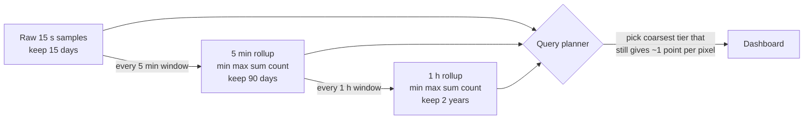

# Time-Series Compression and Downsampling

## 1. One-line summary

Metrics storage stays affordable thanks to two tricks: **compression** that exploits how boring metrics are (timestamps arrive at regular intervals, values barely change), shrinking a 16-byte sample to about **1–2 bytes**, and **downsampling** (rollups) that replaces old fine-grained points with per-5-minute or per-hour summaries (**min, max, sum, count**) kept in cheaper, longer **retention tiers**.

💡 A **sample** is one (timestamp, value) point of a time series. Raw it costs 8 bytes for the timestamp (`long`) + 8 bytes for the value (`double`) = **16 bytes**. See [Prometheus and TSDBs](../technologies/prometheus-and-time-series-databases.md) for the data model.

---

## 2. The problem it solves

**The pain:** a metrics platform with 2 million active series scraped every 15 s, kept for a year.

```
samples per series per day = 86,400 s / 15 s           = 5,760
samples per day            = 2,000,000 × 5,760         = 11.52 billion
raw bytes per day          = 11.52 B × 16 B            ≈ 184 GB/day
raw bytes per year         = 184 GB × 365              ≈ 67 TB
```

67 TB a year for one metrics cluster, and the hottest part (last few hours) must sit **in RAM** for fast dashboards and alerts. Worse, a "last 90 days" graph of 1,000 series would read `1,000 × 5,760 × 90 ≈ 518 M` points just to draw a line that is ~1,000 pixels wide.

**The fix:**
1. **Compress** recent data so it fits in memory and on disk: ~12× smaller.
2. **Downsample** old data: nobody needs 15-second resolution for last March.

> Infra analogy: you already do this with logs (hot SSD index for 7 days, then compressed archives in S3) and with Grafana, which silently picks a coarser `step` when you zoom out to 30 days.

---

## 3. How it works

### 3.1 Gorilla compression (Facebook, VLDB 2015)

Facebook's paper *"Gorilla: A Fast, Scalable, In-Memory Time Series Database"* (Pelkonen et al., VLDB 2015) describes an in-memory TSDB whose encoding compresses 16-byte points to **an average of 1.37 bytes per point, about 12× smaller** (figure from the paper's introduction, on Facebook's production data, using 2-hour blocks). Prometheus's chunk encoding (the "XOR chunk") is a variant of the same scheme. The paper itself credits earlier XOR-based floating-point compression work and adapts it to streaming.

Two independent tricks, one for each half of the sample:

#### Timestamps: delta-of-delta

Scrapes happen every 15 s, so timestamps are `1000, 1015, 1030, 1045...`

- **Delta** = difference from the previous timestamp: `15, 15, 15`.
- **Delta-of-delta** (DoD) = difference between consecutive deltas: `0, 0, 0`.

A DoD of 0 is stored as **a single `0` bit**. Small jitters (a scrape 1 s late) get a short code. The Gorilla encoding (timestamps in seconds):

| Delta-of-delta range | Bits written |
|---|---|
| 0 | `0` → **1 bit** |
| −63 to 64 | `10` + 7 bits = 9 bits |
| −255 to 256 | `110` + 9 bits = 12 bits |
| −2047 to 2048 | `1110` + 12 bits = 16 bits |
| anything else | `1111` + 32 bits = 36 bits |

The paper reports that about **96% of timestamps** compressed to a single bit on its data. Prometheus uses millisecond timestamps, so its buckets are wider (14, 17, 20 bits, then a full 64), but the idea is the same.

#### Values: XOR with the previous value

A `double` is 64 bits: sign, exponent, mantissa (the significant digits). Two close values like `12.0` and `12.5` share the sign, exponent and most leading mantissa bits. **XOR** (bitwise "different?": 1 where the bits differ, 0 where equal) of the two values is then mostly zeros:

- XOR = 0 (value unchanged): write **one `0` bit**. Very common for gauges like "pool max size" or a counter that didn't move.
- Otherwise write `1`, then only the **meaningful bits**: the middle run between the leading zeros and trailing zeros. Either reuse the previous value's leading/trailing window (control `0`, then just the bits) or write a new window (control `1`, then 5 bits for the leading-zero count, 6 bits for the length, then the bits).

The paper reports that roughly half of all values were identical to the previous one and so cost 1 bit (figure recalled from the paper's section 4, not re-verified here).

#### Runnable demo

Java 21, no dependencies: `java GorillaDemo.java`.

```java
public class GorillaDemo {
    public static void main(String[] args) {
        // Scrapes every 15 s, with one late scrape (+1 s jitter) at index 4
        long[] ts = {1_700_000_000L, 1_700_000_015L, 1_700_000_030L, 1_700_000_045L,
                     1_700_000_061L, 1_700_000_075L, 1_700_000_090L};
        System.out.println("timestamp    delta  delta-of-delta");
        for (int i = 2; i < ts.length; i++) {
            long delta = ts[i] - ts[i - 1];
            long dod = delta - (ts[i - 1] - ts[i - 2]);
            System.out.printf("%d  %5d  %5d%n", ts[i], delta, dod);
        }

        // A slowly changing gauge (e.g. memory in GB): XOR with the previous value
        double[] vals = {12.0, 12.0, 12.5, 12.5, 13.0, 24.0};
        System.out.println("\nvalue   XOR-with-previous (bits)   leading0 trailing0 meaningful");
        for (int i = 1; i < vals.length; i++) {
            long x = Double.doubleToLongBits(vals[i]) ^ Double.doubleToLongBits(vals[i - 1]);
            if (x == 0) {
                System.out.printf("%5.1f   identical -> store 1 bit ('0')%n", vals[i]);
            } else {
                int lead = Long.numberOfLeadingZeros(x), trail = Long.numberOfTrailingZeros(x);
                System.out.printf("%5.1f   %016x   %8d %9d %10d%n",
                        vals[i], x, lead, trail, 64 - lead - trail);
            }
        }
    }
}
```

Real output:

```
timestamp    delta  delta-of-delta
1700000030     15      0
1700000045     15      0
1700000061     16      1
1700000075     14     -2
1700000090     15      1

value   XOR-with-previous (bits)   leading0 trailing0 meaningful
 12.0   identical -> store 1 bit ('0')
 12.5   0001000000000000         15        48          1
 12.5   identical -> store 1 bit ('0')
 13.0   0003000000000000         14        48          2
 24.0   0012000000000000         11        49          4
```

Reading it: regular timestamps cost 1 bit, the jittery ones 9 bits (`10` + 7). Going from `12.0` to `12.5` leaves **1 meaningful bit** out of 64, so with a new window it costs `1 + 1 + 5 + 6 + 1 = 14 bits` instead of 64. Even doubling (`13.0 → 24.0`) only has 4 meaningful bits. Values with many decimal digits (e.g. `0.1 + 0.2` style noise, or a latency of `0.0123456`) have many meaningful bits and compress far worse, which is why real-world results vary (third-party benchmarks on noisy sensor data report several bytes per point, not 1.37).

**Trade-off:** you must decode a chunk from its start to read any point in it, which is why chunks are small (Prometheus: ~120 samples per chunk, i.e. 30 min at 15 s) and why bit-level encoding suits append-only, read-in-ranges data.

### 3.2 What compression buys, with arithmetic

Using the same 2M series:

```
compressed bytes/day = 11.52 B samples × 1.37 B   ≈ 15.8 GB/day   (vs 184 GB raw)
2-hour head in RAM   = 2,000,000 × 480 samples × 1.37 B ≈ 1.3 GB of sample data
                       (480 = 7,200 s / 15 s; the series index and labels cost more than this)
one year compressed  = 15.8 GB × 365              ≈ 5.8 TB
```

Better than 67 TB, but still a lot for data almost nobody looks at. Hence downsampling.

### 3.3 Downsampling (rollups)

Replace every window of raw points with **a few aggregates per window**:



**Why min, max, sum, count, and not "average":**

- **Average of averages is wrong.** Hour 1: 10 requests averaging 100 ms. Hour 2: 1,000 requests averaging 10 ms. Average of averages = `(100 + 10) / 2 = 55 ms`. True average = `(10 × 100 + 1,000 × 10) / 1,010 = 11,000 / 1,010 ≈ 10.9 ms`. Keep `sum` and `count`, and any coarser rollup can compute the right average: `Σsum / Σcount`.
- **min/max** keep spikes visible. A 30-second CPU spike to 100% disappears in a 1-hour average but survives in `max`.
- **Counters:** roll up the *increase* in the window (or keep the last value and handle resets), so `rate` still works.
- **Percentiles can't be rolled up** from percentiles (same reason as averaging p99s across pods, see [observability](observability.md)). Roll up **histogram bucket counts** (just add them) and compute p99 at query time.

Arithmetic per series per day, storing 4 aggregates per window:

```
raw 15 s:        86,400 / 15  = 5,760 values
5 min rollup:    86,400 / 300 = 288 windows × 4 aggregates = 1,152 values   (5× fewer)
1 h rollup:      24 windows × 4 aggregates                 = 96 values      (60× fewer)
```

### 3.4 Retention tiers, with arithmetic

Tiers from the diagram, 2M series, assuming ~1.37 B per stored value in every tier (rollups compress somewhat worse, so treat this as a lower bound):

```
raw, 15 days:     2M × 5,760 × 15  × 1.37 B ≈ 237 GB
5 min, 90 days:   2M × 1,152 × 90  × 1.37 B ≈ 284 GB
1 h, 2 years:     2M × 96   × 730 × 1.37 B ≈ 192 GB
total                                       ≈ 0.7 TB    (vs ~5.8 TB for 1 year at full resolution)
```

Thanos's compactor builds 5 m and 1 h downsampled blocks in [object storage](../technologies/object-storage.md); Mimir, VictoriaMetrics and M3 have equivalents. The rollup job itself is a batch or [stream processing](../technologies/stream-processing.md) job over closed time windows.

---

## 4. When to use it

- Any metrics/monitoring store: Gorilla-style compression is the default in modern TSDBs.
- Downsampling once retention goes beyond a few weeks, or for "zoomed out" dashboards.
- Same ideas show up elsewhere: delta encoding in column stores, IoT sensor data, financial tick data.

## 5. When NOT to use it (and why it's a mistake)

| Situation | Why it's a mistake |
|---|---|
| Downsampling data you need exact (billing, audits, SLA reports) | Rollups are lossy: you can't get the raw points back. Compute those reports from raw data first. |
| Downsampling too early (e.g. after 1 day) | Incident reviews a week later need full resolution to see a 30-second spike's shape. |
| XOR compression on random, high-entropy values | Few shared bits, compression gain disappears; general-purpose compression (zstd) may do better. |
| Rollups with only `avg` | Average-of-averages error and lost spikes (3.3). |

---

## 6. Commonly confused with

| | **Gorilla / XOR chunk compression** | **Downsampling** | **General compression (gzip, zstd)** | **Sampling (traces)** |
|---|---|---|---|---|
| Lossy? | No (exact values back) | Yes | No | Yes (drops whole events) |
| Works on | one series' consecutive points | windows of points | any bytes | individual requests |
| Gain | ~12× on regular metrics | 5–60× per tier | 2–10× on text | 100× at 1% |
| When | always, at ingest | for old data | files, logs, network | traces, logs at high volume |

---

## 7. Common mistakes / misuse

1. **Storing only averages** in rollups.
2. **Rolling up percentiles** instead of histogram buckets.
3. **Querying raw data for a 1-year graph**: the query layer should pick the coarsest tier that still gives roughly one point per pixel.
4. **Forgetting counter resets** when rolling up counters.
5. **Quoting 1.37 bytes as a law**: it was Facebook's data; noisy floats compress much worse. Measure your own bytes/sample (Prometheus exposes chunk and sample metrics).

---

## 8. Interview cheat-sheet

> "Raw, a sample is 16 bytes, so 2 million series at 15-second resolution is about 184 GB a day. Using Gorilla-style encoding, delta-of-delta timestamps, where a regular interval costs 1 bit, and XOR of each float with the previous one, where an unchanged value costs 1 bit, Facebook reported an average of 1.37 bytes per point, so roughly 16 GB a day. For retention I'd tier it: raw for 15 days, 5-minute rollups for 90 days, hourly for two years, each rollup storing min, max, sum and count, never just averages, and histogram buckets instead of percentiles, so any coarser view can still be computed exactly. That brings two years down to under a terabyte, stored as immutable blocks in object storage, and the query layer picks the tier based on the time range."

---

## 9. Used in

- [Metrics & Monitoring](../interviews/metrics-monitoring/README.md): storage sizing (bytes per sample), the in-memory head with compressed chunks, and the rollup/retention tiers for long-term storage.
- Related: [Prometheus and TSDBs](../technologies/prometheus-and-time-series-databases.md), [alerting and SLOs](alerting-and-slos.md), [observability](observability.md), [back-of-the-envelope](back-of-the-envelope.md), [LSM trees](lsm-trees-and-storage-engines.md), [object storage](../technologies/object-storage.md).
