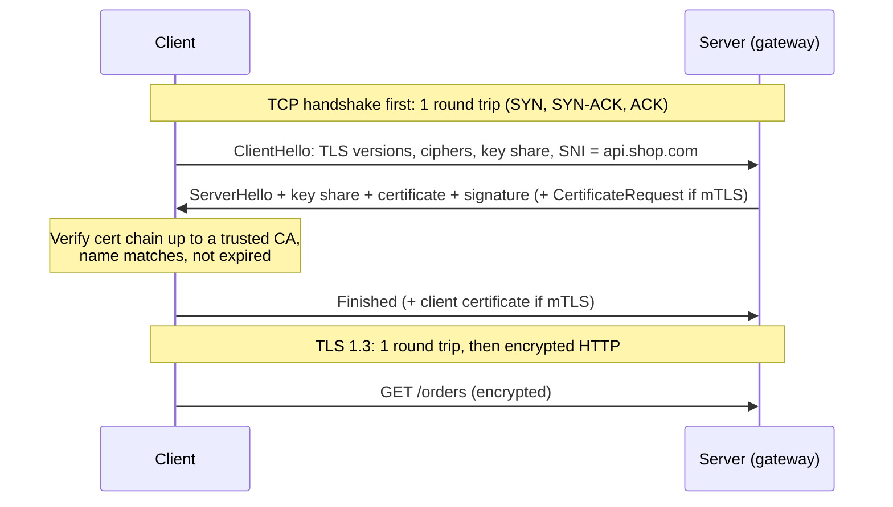

# TLS and mTLS

## 1. One-line summary

**TLS** (Transport Layer Security, the "S" in HTTPS) encrypts a connection and lets the client verify the **server's identity** through a certificate; **mTLS** (mutual TLS) makes **both sides** present certificates, so the server also knows exactly which client (which service) is calling.

---

## 2. The problem it solves

**The pain:** without TLS, every byte between a phone and your API crosses Wi-Fi routers, ISPs and cloud networks in plaintext.

- Anyone on the path can **read** passwords, JWTs (signed login tokens, see [authentication](authentication-oauth-jwt.md)) and card numbers.
- Anyone on the path can **change** responses (inject ads, swap a bank account number).
- A fake server can **pretend** to be `api.shop.com` (DNS spoofing, rogue Wi-Fi).

Inside the data center it's the same problem at a different scale: a compromised pod can sniff or impersonate other services, and "the internal network is trusted" is exactly the assumption attackers exploit. **Zero trust** is the opposite policy: every call must prove who it is, even inside the network.

**The fix:**
- **Encryption**: only the two endpoints can read the traffic.
- **Integrity**: any tampering is detected.
- **Authentication**: a **certificate** (a public key plus a name like `api.shop.com`, signed by a trusted **Certificate Authority (CA)**) proves the server is who it says. With mTLS, the client proves its identity too.

> Infra analogy: you've seen this with `kubectl`. Your kubeconfig contains a **client certificate**; the API server checks it (mTLS) and the certificate's name becomes your identity for RBAC (role-based access control). etcd peers also talk mTLS.

---

## 3. How it works

### 3.1 The handshake in plain words

Before sending any HTTP data, client and server agree on keys:



- **Round trip (RTT)** = time for a message to go there and back. Phone in Mumbai to a server in Virginia: ~200 ms.
- **TLS 1.3** needs 1 RTT; TLS 1.2 needed 2. Plus 1 RTT for the **TCP handshake** (the three-message exchange that opens a connection). So a new HTTPS connection costs **2 RTT ≈ 400 ms** from Mumbai to Virginia before the first byte of the request. That's why you terminate TLS at an edge close to the user (a [CDN](../technologies/cdn.md) PoP (point of presence: a small edge data center near users) or regional gateway: RTT ~20 ms → ~40 ms setup).
- **SNI** (Server Name Indication): the client says which hostname it wants in the first message, so one gateway IP can serve certificates for 500 domains.
- **Cipher** = the encryption algorithm pair agreed on (e.g. AES-GCM for data, ECDHE for key exchange).

### 3.2 CPU cost and resumption

- The expensive part is the **asymmetric crypto** (public/private key math) in the handshake: roughly **~1,000–3,000 full handshakes/s per core** for RSA-2048, several times more for ECDSA certificates.
- The **bulk encryption** after it (AES, with hardware AES-NI CPU instructions) is cheap: several GB/s per core.
- Example: 20,000 new connections/s ÷ ~2,000 handshakes/s/core ≈ **10 cores** just for handshakes. Reusing connections (HTTP keep-alive: leave the connection open for the next request; HTTP/2: many requests multiplexed on one connection) is what keeps this small.
- **Session resumption**: the server gives the client a **session ticket**; reconnecting within hours skips the certificate exchange and heavy crypto. TLS 1.3 **0-RTT** even lets the client send data in the first message, but that data can be **replayed** by an attacker, so allow it only for idempotent GETs (requests that are safe to run twice).

### 3.3 Where to terminate TLS

**Termination** = the point where traffic is decrypted.

| Option | How | Pros | Cons |
|---|---|---|---|
| **Terminate at edge, plain inside** | LB/gateway decrypts, forwards HTTP | Simple, cheap, gateway can read requests for routing/auth | Internal traffic readable by anyone inside |
| **Terminate and re-encrypt** | Gateway decrypts, inspects, opens new TLS/mTLS to backend | L7 features + encrypted everywhere | Two handshakes; certs on backends |
| **Passthrough (end-to-end)** | L4 LB forwards encrypted bytes; backend decrypts | Gateway never sees plaintext | Gateway can't route by path, auth, rate-limit by user |

An API gateway must see the request, so it **terminates**; most modern setups then **re-encrypt with mTLS** to backends.

### 3.4 mTLS for service-to-service

Each service gets its own certificate whose identity is the **service name**, not an IP. Example identity in **SPIFFE** format (a standard for naming workloads): `spiffe://prod.shop.com/ns/payments/sa/payments-api`.

- `orders` calls `payments`: both present certs, both verify against the internal CA.
- `payments` now knows **cryptographically** that the caller is `orders` and can enforce "only `orders` and `refunds` may call `POST /charge`".
- The gateway → backend hop works the same way: backends accept the `X-User-Id` header only from a caller whose cert says "gateway".

### 3.5 Certificate rotation and short-lived certs

Expired certificates are a classic outage cause (a cert renewed manually once a year, by someone who left).

- **Public certs** (for `api.shop.com`): issued by a public CA (Let's Encrypt, ACM), automated via **ACME** (the protocol that proves you control the domain and renews automatically). Let's Encrypt certs last 90 days; renew at ~60.
- **Internal certs**: your own CA issues **short-lived** certs (Istio default: 24 h). Short life means a stolen key is useless soon, and revocation lists become unnecessary.
- **cert-manager** (k8s operator) requests and renews certs and stores them as Secrets.
- **SPIFFE/SPIRE** (and mesh control planes like istiod) attest a workload ("this pod runs as service account X on node Y") and issue it an identity cert automatically, rotating every few hours. Envoy picks up new certs via SDS without restart.
- Alert on **expiry < 14 days** for anything not auto-rotated.

### 3.6 The certificate chain, and what Java does with it

A server rarely sends a cert signed directly by a root CA. It sends a **chain**:

```
api.shop.com cert      (signed by)  →  intermediate CA cert  (signed by)  →  root CA
sent by server                         sent by server                       already in the client's trust store
```

- The **trust store** is the list of root CAs a client trusts. In Java it is the `cacerts` file in the JDK (`$JAVA_HOME/lib/security/cacerts`), managed with `keytool`; the server's own cert + private key live in a **key store** (PKCS12 file).
- Classic on-call bug: the server forgets to send the intermediate cert. Browsers often fix it silently by fetching it; Java clients fail with `PKIX path building failed`.
- For mTLS in Java, the client needs a key store (its own cert + key) **and** a trust store (the internal CA). Spring Boot exposes these as `server.ssl.*` / SSL bundles.
- Debug tool: `openssl s_client -connect api.shop.com:443 -servername api.shop.com -showcerts` prints the chain the server actually sends.

---

## 4. When to use it

- TLS: every hop that crosses the internet, always. Inside the network too, where policy or compliance (PCI-DSS for card data, HIPAA for health data) requires it.
- mTLS: service-to-service authentication, gateway → backend, partner integrations that need strong client identity, anything "zero trust".
- Edge termination close to users to cut handshake latency.

## 5. When NOT to use it (and why it's a mistake)

| Situation | Why it's a mistake |
|---|---|
| mTLS for browsers / mobile end users | Distributing and rotating client certs to millions of devices is impractical; use OAuth tokens. |
| Hand-rolled mTLS in every app with yearly certs | Rotation will be forgotten; use a mesh or cert-manager with short-lived certs. |
| TLS passthrough when the gateway must authenticate and route by path | The gateway can't see the request. |
| 0-RTT for POST/payment requests | Replayable: an attacker can resend it. |
| Opening a new TLS connection per request between gateway and backend | Pays the handshake every time; pool and reuse connections. |

---

## 6. Commonly confused with

| | **TLS** | **mTLS** | **End-to-end encryption** | **JWT / OAuth** |
|---|---|---|---|---|
| Protects | One connection (hop) | One connection, both sides identified | Message content from sender app to recipient app | Proves the *user/app* identity in a request |
| Who is authenticated | Server | Server + client (service) | Users' devices | User / client app |
| Terminated by intermediaries? | Yes, at each proxy | Yes, at each proxy | No: servers can't read it | Token passes through proxies |
| Example | HTTPS to the gateway | Gateway → payments | WhatsApp messages | `Authorization: Bearer ...` |

See [end-to-end encryption](end-to-end-encryption.md) and [authentication, OAuth and JWT](authentication-oauth-jwt.md). TLS secures the pipe; tokens say who the user is; they are complementary.

---

## 7. Common mistakes / misuse

1. **"HTTPS means the backend is secure."** It ends at the terminator; plain HTTP behind it is readable inside.
2. **Ignoring handshake cost** in estimates and per-request connections.
3. **Disabling certificate verification** (`InsecureSkipVerify`, trust-all `TrustManager` in Java) "temporarily". It removes the authentication half of TLS.
4. **Manual cert renewals** → yearly outage.
5. **Using IPs as service identity** instead of cert identities; IPs are reused by other pods.
6. **Forgetting the gateway must strip client-supplied identity headers**, making mTLS to backends pointless.

---

## 8. Interview cheat-sheet

> "Clients connect over TLS 1.3 to the gateway, which terminates TLS at the edge close to users, since a new connection costs a TCP plus TLS round trip and that's 400 ms across an ocean. Keep-alive, HTTP/2 and session resumption keep handshakes rare, because the asymmetric crypto is the CPU-heavy part, a couple of thousand handshakes per second per core. The gateway needs plaintext to route and authenticate, then re-encrypts to backends with mTLS: both sides present short-lived certificates, issued and rotated automatically by cert-manager or the mesh using SPIFFE identities, so backends know the call really came from the gateway. Public certs are automated with ACME and we alert well before expiry."

---

## 9. Used in

- [API gateway](../interviews/api-gateway/README.md): **TLS termination** on the gateway fleet (SNI for many domains, handshake CPU sizing, resumption) and **mTLS to backends** so services trust only the gateway's identity headers.
- [Web crawler](../interviews/web-crawler/README.md): TLS setup is part of every fetch's latency, which is why crawlers **reuse keep-alive connections per host**.
- [Payment system](../interviews/payment-system/README.md): mTLS to bank payout APIs; HMAC-signed PSP webhooks.
- Related: [load balancer](../technologies/load-balancer.md) (TLS termination at the LB), [service mesh and Envoy](../technologies/service-mesh-and-envoy.md) (automatic mTLS, SDS), [CDN](../technologies/cdn.md) (edge termination), [authentication, OAuth and JWT](authentication-oauth-jwt.md), [end-to-end encryption](end-to-end-encryption.md).
