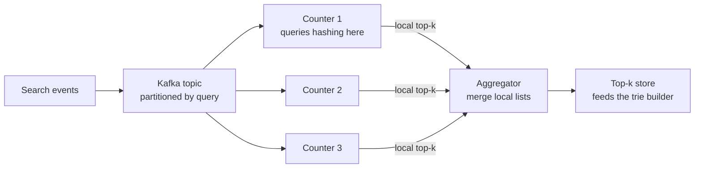

# Top-K and Heavy Hitters

## 1. One-line summary

**Top-k** is "the k most frequent items" (top 10 searches, top 100 IPs); **heavy hitters** are "items above some share of all traffic"; exactly you compute them with a **hash map of counts plus a min-heap of size k**, and on huge streams you approximate them in fixed memory with sketches like **Count-Min Sketch** or counter-based algorithms like **Space-Saving**, adding **time decay** when you want "trending now" instead of "popular ever".

💡 A **stream** here is an endless sequence of events (every search typed, every request served) that you see once, in order, and can't afford to store in full.

---

## 2. The problem it solves

**The pain:** autocomplete should suggest what people actually search for. You receive, say, **1 billion searches a day** over **100 million distinct queries**, and you want the top 10 completions for each prefix, refreshed often, plus a "trending" list that reacts within minutes.

Exact counting of everything:

```
100M distinct queries × (~20 B text + ~50 B map entry overhead) ≈ 7 GB of counts
```

That's fine for a nightly batch job, painful to hold per minute per stream processor, and it grows with the number of distinct keys (attackers or bots can make it unbounded). Two more traps: you can't just sort 100M entries every minute, and if the counting is spread across machines, **combining their local top-k lists gives wrong answers** (3.4).

> Infra analogy: you've met this as "top talkers" in network monitoring, or "which 10 endpoints cause most of the 5xx". A Prometheus `topk(10, ...)` query is fine on a few thousand series; it's not how you'd find the top 10 among 100M user IDs.

---

## 3. How it works



### 3.1 Exact top-k: hash map + min-heap of size k

1. Count every item in a hash map (`query → count`).
2. Walk the map with a **min-heap** of size k (smallest count on top, [PriorityQueue](../../LLD/libraries/java/treeset-and-priorityqueue.md)). Add each entry; if the heap grows past k, remove the top (the weakest).
3. What's left is the top k.

Cost: **O(n log k)** for n distinct items, versus O(n log n) to sort everything ([Big-O](../../LLD/concepts/big-o-complexity.md)):

```
n = 100M, k = 10:   n log2 k  ≈ 100M × 3.3  ≈ 330M heap steps
                    n log2 n  ≈ 100M × 26.6 ≈ 2.7B comparisons for a full sort
```

The heap also uses only O(k) extra memory. The hash map is still O(distinct items), which is what the sketches below remove.

### 3.2 Count-Min Sketch: approximate counts in fixed memory

A **Count-Min Sketch** (Cormode and Muthukrishnan, published 2005) is a small 2-D array of counters: `d` rows × `w` columns, with a different hash function per row.

- **Add(x)**: for each row, hash x to a column and increment that counter.
- **Estimate(x)**: take the **minimum** of x's d counters.

Other items that hash to the same counter only ever add to it, so the estimate is **never below the true count**, only above. Taking the minimum across rows picks the least polluted counter. The guarantee, with N = total number of events:

```
estimate ≤ true count + ε × N    with probability at least 1 − δ

width  w = ⌈e / ε⌉        (e ≈ 2.718)
depth  d = ⌈ln(1 / δ)⌉
```

Sizing for 1 billion searches a day, error at most 0.1% of N, 99% of the time:

```
ε = 0.001  →  w = ⌈2.718 / 0.001⌉ = 2,719
δ = 0.01   →  d = ⌈ln(100)⌉ = ⌈4.6⌉ = 5
counters = 2,719 × 5 = 13,595  × 4 bytes ≈ 54 KB
max error = 0.001 × 1,000,000,000 = 1,000,000 searches
```

54 KB instead of 7 GB, no matter how many distinct queries arrive. The price: an error of up to 1M sounds big, but a top-10 query has tens of millions of searches, so it ranks correctly. Rare items get large *relative* errors, which is fine because nobody asks for their rank.

A sketch only answers "how many for x?"; it doesn't list items. To get top-k, keep a **min-heap of candidates** next to it: on every event, estimate that item and, if the estimate beats the heap's minimum, insert or update it.

A runnable sketch with a smaller ε (Java 21, `java TopK.java`):

```java
import java.util.*;

public class TopK {
    // Exact: count everything, then keep a min-heap of size k. O(n log k) after counting.
    static List<Map.Entry<String, Long>> topK(Map<String, Long> counts, int k) {
        PriorityQueue<Map.Entry<String, Long>> heap =
                new PriorityQueue<>(Map.Entry.comparingByValue());      // smallest count on top
        for (Map.Entry<String, Long> e : counts.entrySet()) {
            heap.offer(e);
            if (heap.size() > k) heap.poll();                           // evict the weakest
        }
        List<Map.Entry<String, Long>> result = new ArrayList<>(heap);
        result.sort(Map.Entry.<String, Long>comparingByValue().reversed());
        return result;
    }

    // Approximate: Count-Min Sketch. depth rows x width counters, one hash per row.
    static class CountMinSketch {
        final long[][] table;
        final int width, depth;
        CountMinSketch(int width, int depth) {
            this.width = width; this.depth = depth;
            table = new long[depth][width];
        }
        private int bucket(String item, int row) {
            int h = (item.hashCode() ^ (row * 0x9E3779B9)) * 0x85EBCA6B;  // different seed per row
            h ^= (h >>> 13); h *= 0xC2B2AE35; h ^= (h >>> 16);             // mix the bits
            return Math.floorMod(h, width);
        }
        void add(String item) {
            for (int r = 0; r < depth; r++) table[r][bucket(item, r)]++;
        }
        long estimate(String item) {                                     // min over rows: never below the truth
            long min = Long.MAX_VALUE;
            for (int r = 0; r < depth; r++) min = Math.min(min, table[r][bucket(item, r)]);
            return min;
        }
    }

    public static void main(String[] args) {
        Map<String, Long> counts = new HashMap<>();
        CountMinSketch cms = new CountMinSketch(272, 5);                 // e/0.01 ~ 272, ln(1/0.01) ~ 5
        Random rnd = new Random(42);
        String[] hot = {"weather", "news", "java", "kafka", "redis"};
        for (int i = 0; i < 100_000; i++) {
            String q = rnd.nextInt(10) < 3 ? hot[rnd.nextInt(hot.length)]   // 30% of traffic: 5 hot queries
                                           : "q" + rnd.nextInt(5_000);      // 70%: long tail of 5,000
            counts.merge(q, 1L, Long::sum);
            cms.add(q);
        }
        System.out.println("exact top-3: " + topK(counts, 3));
        for (String q : List.of("weather", "q123")) {
            System.out.println(q + ": exact=" + counts.get(q) + " sketch=" + cms.estimate(q));
        }
        System.out.println("distinct keys in map: " + counts.size()
                + ", sketch counters: " + 272 * 5);
    }
}
```

Output:

```
exact top-3: [kafka=6055, weather=6039, redis=6031]
weather: exact=6039 sketch=6206
q123: exact=20 sketch=245
distinct keys in map: 5005, sketch counters: 1360
```

Check against the bound: ε × N = 0.01 × 100,000 = 1,000. Both errors (167 and 225) are within it, never negative, and the rare item's estimate is 12× its true count while the hot one is off by under 3%.

### 3.3 Counter-based algorithms: Misra-Gries and Space-Saving

These keep a fixed number `m` of **(item, counter)** pairs and directly produce the candidate list.

- **Misra-Gries** (1982): if the item has a counter, increment it; else if there's a free slot, start it at 1; else **decrement every counter** by 1 and drop those that hit 0. Every item that makes up more than `N / (m + 1)` of the stream is guaranteed to survive; counts are underestimated by at most that much.
- **Space-Saving** (Metwally, Agrawal and El Abbadi, 2005): if the item is tracked, increment it; otherwise **replace the item with the smallest counter** and set the new count to `min + 1`. Counts are overestimated by at most the replaced minimum, which is at most `N / m`.

```
m = 10,000 counters, N = 1B searches
any query with more than 1B / 10,000 = 100,000 searches is guaranteed to be tracked
```

Space-Saving is a popular choice for "top-k in a stream" because the tracked items *are* the answer (no separate heap), and memory is exactly m entries.

### 3.4 Why you can't merge top-k lists naively across shards

Suppose counting is split by **time or by server** (each web server counts what it saw), each shard sends its local top-2, and you merge.

```
Shard A counts:  a=100  b=90  c=85
Shard B counts:  d=100  e=95  c=85

Local top-2:     A → a(100), b(90)      B → d(100), e(95)
Merged top-2:    a(100), d(100)

True totals:     c = 85 + 85 = 170   ← the real #1, missing from both local lists
```

An item that is **consistently second-tier everywhere** can be the global winner. Fixes:

1. **Partition by key** (route each query to one counter by `hash(query)`, e.g. [Kafka](../technologies/kafka.md) partition key). Each query's full count lives on one shard, so the global top-k is guaranteed to be inside the union of local top-ks. This is the standard answer.
2. **Ask each shard for more than k.** Each shard returns its top `k' ≫ k` (e.g. 10× k); misses become unlikely but not impossible. [Elasticsearch](../technologies/elasticsearch.md)'s `terms` aggregation does this: by default each shard returns `size × 1.5 + 10` buckets and the response reports an upper bound on the count error.
3. **Merge mergeable summaries**, not lists: Count-Min Sketches of the same size merge by adding them cell by cell, and Space-Saving summaries can be merged with bounded error.

### 3.5 Time decay: "trending" instead of "all-time"

All-time counts make "weather" win forever; a news event should rise in minutes and fade in hours. Options:

- **Sliding window**: keep counts per minute bucket, sum the last 60 ([counters at scale](counters-at-scale.md)). Simple; the item drops off a cliff when it leaves the window.
- **Exponential decay**: every count fades continuously. On each event at time t:

  ```
  score = score × e^(−λ × (t − lastUpdate)) + 1
  λ = ln 2 / halfLife
  ```

  With a half-life of 1 hour, a burst is worth 1/2 after 1 h, 1/4 after 2 h, 1/64 after 6 h. Store just `(score, lastUpdate)` per item.

The trick that makes decay cheap: you don't want to touch every item every second. **Forward decay** adds `e^(λ × (t − t0))` per event instead of 1, relative to a fixed start time `t0`. Newer events simply add bigger numbers, so ranking is correct without ever updating old scores. Those weights grow exponentially, so you rebase (subtract a new t0, rescale all scores) before they overflow:

```
halfLife = 1 h  →  weight doubles every hour
double max ≈ 1.8e308 ≈ 2^1024  →  must rebase well before ~1,000 hours (~6 weeks); daily is plenty
```

"Trending" usually also compares against a baseline (now vs the same hour last week), so "weather" doesn't trend every morning.

---

## 4. When to use it

- **Autocomplete and trending searches**: which queries to suggest, which are spiking.
- **Monitoring**: top talkers by IP, top error-producing endpoints, hottest cache keys.
- **Abuse detection**: heavy-hitter IPs or API keys for rate limiting and blocking.
- **Product analytics**: most viewed items, top hashtags.

## 5. When NOT to use it (and why it's a mistake)

| Situation | Why |
|---|---|
| Small number of distinct keys (thousands) | An exact `HashMap` + heap is simple and exact; a sketch adds error for no gain. |
| Billing, quotas, anything someone pays for | Sketches overestimate; you'd overcharge. Count exactly. |
| You need counts of **rare** items | CMS error is relative to total traffic; small counts are mostly noise. |
| You need the full ranking (position 50,000) | Top-k structures only track the head. Run a batch job over exact counts. |

---

## 6. Commonly confused with

| | **HashMap + min-heap** | **Count-Min Sketch** | **Space-Saving / Misra-Gries** | **HyperLogLog** | **Bloom filter** |
|---|---|---|---|---|---|
| Answers | exact top-k | "how many x?" (approx.) | approx. top-k list | "how many distinct?" | "seen x before?" |
| Memory | O(distinct keys) | fixed (w × d) | fixed (m entries) | fixed (~12 KB in Redis) | fixed |
| Error | none | overestimates by ≤ εN | over/under by ≤ N/m | ~0.81% standard error (Redis) | false positives |
| Lists items? | yes | no (add a heap) | yes | no | no |

[HyperLogLog](counters-at-scale.md) (estimates how many *distinct* items there are) and [Bloom filters](bloom-filters.md) (answer "have I seen this?") are sketches too, but answer different questions.

---

## 7. Common mistakes / misuse

1. **Merging local top-k lists** from shards partitioned by time or server: see 3.4. Partition by key.
2. **Sorting all counts** to get 10 items: O(n log n) when O(n log k) with a heap does it.
3. **Max-heap instead of min-heap** for "keep the k largest": you need to evict the smallest quickly, so the smallest must be on top.
4. **Expecting a Count-Min Sketch to list the top items**: it only estimates counts you ask about.
5. **No decay or window**: "trending" that never forgets is just "popular".
6. **Counting bots and retries**: dedupe per user/session first, or a script owns your suggestions.

---

## 8. Interview cheat-sheet

> "Exactly, I'd count in a hash map and keep a min-heap of size k, which is O(n log k). At a billion events a day the map of distinct keys becomes the problem, so in the stream I'd use a Count-Min Sketch: width e over epsilon and depth ln of 1 over delta, so for 0.1% error with 99% confidence that's about 2,700 by 5 counters, roughly 54 KB, plus a small heap of candidates; or Space-Saving, which keeps m counters and directly gives the top list. I'd partition the stream by query key, because merging local top-k lists from shards split by time or server can miss an item that's second everywhere but first overall. For trending I'd use exponentially decayed counts with a half-life of about an hour, using forward decay so old scores never need updating."

---

## 9. Used in

- [Search Autocomplete](../interviews/search-autocomplete/README.md): aggregating search logs into per-prefix top-k suggestions, the trending layer with decayed counts, and the shard-merge pitfall in the counting pipeline.
- Related: [tries and prefix search](tries-and-prefix-search.md) (where the top-k lists are stored), [inverted index](inverted-index.md), [Elasticsearch](../technologies/elasticsearch.md), [stream processing](../technologies/stream-processing.md), [Kafka](../technologies/kafka.md), [counters at scale](counters-at-scale.md), [Bloom filters](bloom-filters.md).
