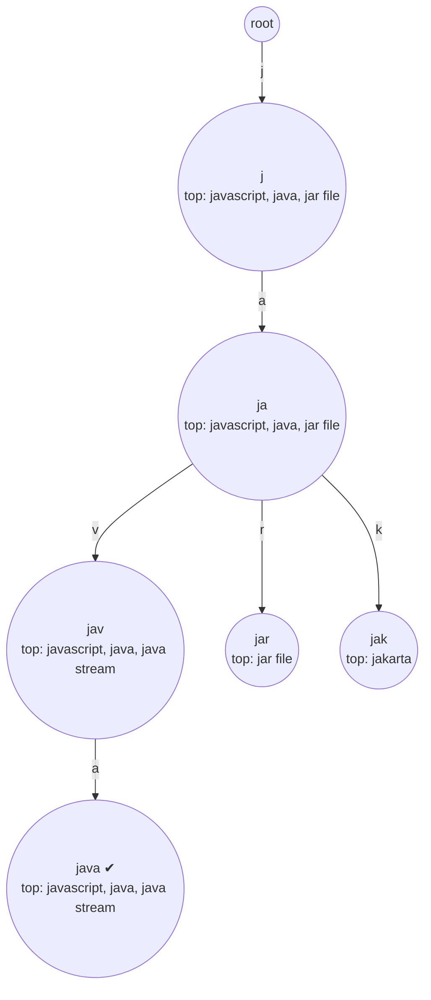
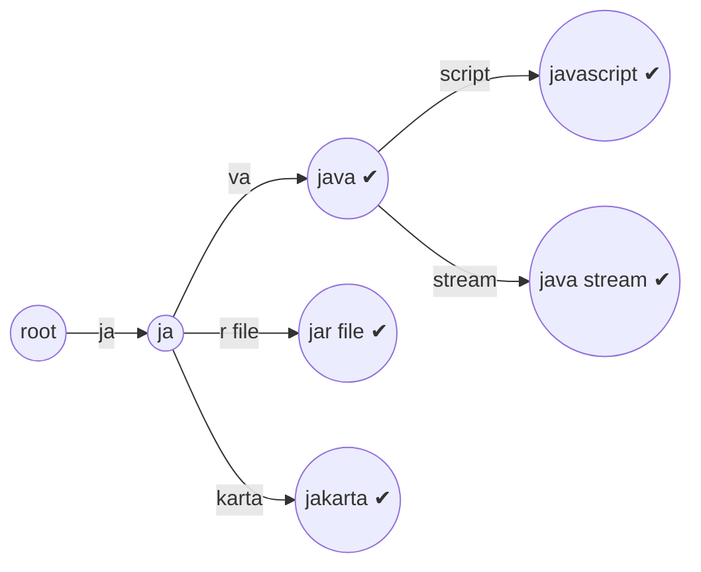
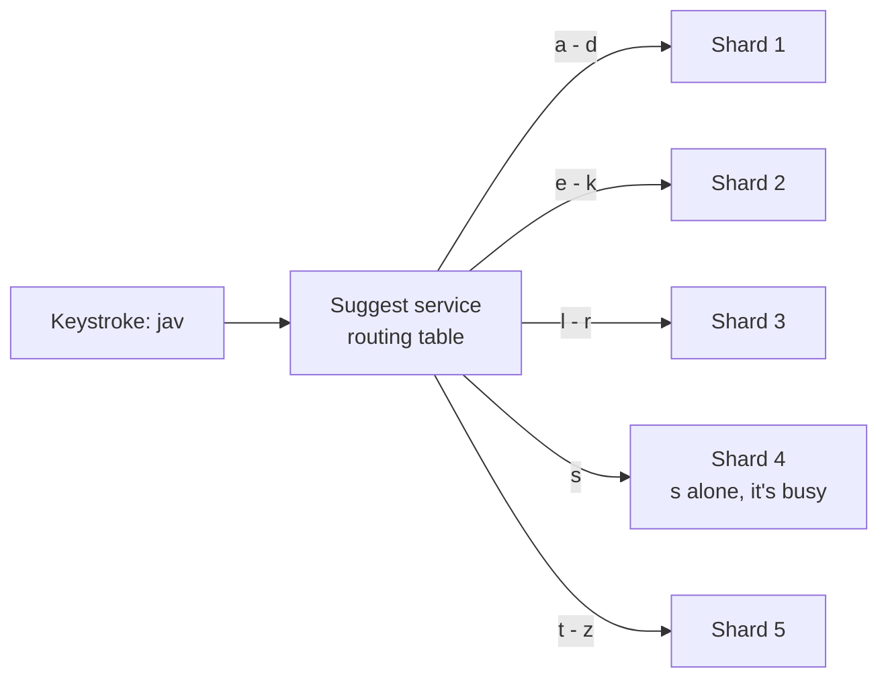

# Tries and Prefix Search

## 1. One-line summary

A **trie** (pronounced "try", from re*trie*val) is a tree where each edge is one character, so every string that starts with `jav` lives under the same node; for autocomplete you **store the top-k completions at each node in advance**, so answering "what starts with `jav`?" is just walking 3 edges and returning a ready-made list.

💡 **Prefix search** means "find all stored strings that begin with these characters". **Top-k** means "the k best results" (k is usually 5–10 for a suggestion box).

---

## 2. The problem it solves

**The pain:** a search box shows suggestions after every keystroke. You have, say, 10 million popular queries with counts. The user types `jav` and you have about **100 ms** for the whole round trip, so the lookup itself should take well under a millisecond.

The naive options:

| Approach | Cost per keystroke | Why it hurts |
|---|---|---|
| Scan all queries, keep those starting with `jav`, sort by count | O(n) = 10M string comparisons | ~10–50 ms of CPU per keystroke, per user |
| SQL `WHERE q LIKE 'jav%' ORDER BY count DESC LIMIT 10` | index range scan + sort of all matches | prefix `a` matches millions of rows, sorting them every time |
| Hash map `query → count` | O(1) for an exact query | can't answer "starts with" at all |

**The fix:** organise strings by their prefixes (a trie), and do the expensive "find the best k under this prefix" work **once, offline**, not on every keystroke.

> Infra analogy: this is the same move as precomputing a dashboard. Instead of running an expensive PromQL query on every page load, a recording rule computes it every minute and the dashboard just reads the result.

---

## 3. How it works

### 3.1 The basic trie

Each node has a map `char → child`. A string is a path from the root. Strings that share a prefix share the path.



`✔` marks a node where a complete query ends. Looking up a prefix of length `p` takes **O(p)** steps, no matter how many strings are stored ([Big-O](../../LLD/concepts/big-o-complexity.md)).

### 3.2 Getting the top-k: search at query time vs precompute

**Option A: DFS at query time.** Walk to the prefix node, then visit every node below it (**DFS**, depth-first search: go as deep as possible down one branch, then back up and try the next), collect all complete queries, and keep the best k with a min-heap ([top-k and heavy hitters](top-k-and-heavy-hitters.md)). Fine for `javascript fram`, terrible for `a`: with 10M queries, a single first letter covers on average 10M / 26 ≈ 385k queries (millions of nodes), on the busiest keystroke.

**Option B: precompute top-k at every node.** While building the trie, each node stores the k best completions under it. A lookup is then O(p) to walk + O(k) to copy the list. This is the standard answer for autocomplete.

| | DFS at query time | Top-k stored per node |
|---|---|---|
| Lookup | O(p + size of subtree) | O(p + k) |
| Memory | just the trie | + k references per node |
| Update a count | O(p) | O(p × k): every ancestor's list may change |
| Good for | small dictionaries, rare queries | high QPS suggestion boxes |

A minimal runnable version (Java 21, `java TopKTrie.java`):

```java
import java.util.*;

public class TopKTrie {
    static final int K = 3;

    static class Node {
        Map<Character, Node> children = new HashMap<>();
        List<String> topK = new ArrayList<>();   // precomputed best K completions under this prefix
    }

    private final Node root = new Node();
    private final Map<String, Long> counts = new HashMap<>();

    // Build step (offline): insert every query, updating top-K on each node along its path.
    void add(String query, long count) {
        counts.put(query, count);
        Node node = root;
        for (char c : query.toCharArray()) {
            node = node.children.computeIfAbsent(c, x -> new Node());
            node.topK.remove(query);
            node.topK.add(query);
            node.topK.sort((a, b) -> Long.compare(counts.get(b), counts.get(a)));
            if (node.topK.size() > K) node.topK.remove(K);
        }
    }

    // Query step (online): walk the prefix, return the stored list. O(length of prefix).
    List<String> suggest(String prefix) {
        Node node = root;
        for (char c : prefix.toCharArray()) {
            node = node.children.get(c);
            if (node == null) return List.of();
        }
        return node.topK;
    }

    public static void main(String[] args) {
        TopKTrie t = new TopKTrie();
        t.add("java", 900);
        t.add("javascript", 1200);
        t.add("java stream", 300);
        t.add("jakarta", 150);
        t.add("jar file", 400);
        System.out.println("j    -> " + t.suggest("j"));
        System.out.println("jav  -> " + t.suggest("jav"));
        System.out.println("jak  -> " + t.suggest("jak"));
        System.out.println("x    -> " + t.suggest("x"));
    }
}
```

Output:

```
j    -> [javascript, java, jar file]
jav  -> [javascript, java, java stream]
jak  -> [jakarta]
x    -> []
```

This only works as a **build-once** structure: if a count goes *down*, a query that was dropped from a node's list earlier can't come back. That's one reason production systems rebuild offline (section 3.6).

### 3.3 Memory arithmetic

Assume **10 million** distinct queries, **20 characters** on average, k = 10.

```
Worst case nodes (no shared prefixes):  10M × 20 = 200M nodes
Assume sharing cuts that to about a third:          ~70M nodes   (assumption; measure on real data)
```

A naive Java node (object header, a `HashMap` for children, an `ArrayList` of 10 references) costs very roughly 200 bytes:

```
70M nodes × 200 B = 14 GB      (too much for one ordinary JVM heap)
```

A compact layout (children as a sorted `char[]` + child index array, top-k stored as 10 `int` query IDs = 40 B) gets to roughly 70 B per node:

```
70M × 70 B ≈ 4.9 GB   +   query strings 10M × 20 B = 0.2 GB   ≈ 5 GB
```

💡 A **query ID** is a small integer pointing into one shared array of query strings, so each node stores 4 bytes per suggestion instead of a copy of the text.

Further cuts: only keep top-k on nodes up to depth ~10 (longer prefixes have small subtrees, DFS is cheap there), and use a compressed trie (next section).

### 3.4 Compressed tries (radix trees)

Most nodes deep in a trie have **exactly one child** (`j-a-v-a-s-c-r-i-p-t` is a chain). A **radix tree** (compressed trie, Patricia trie) merges each chain into one edge labelled with a whole string:



Every internal node now has at least two children (or ends a key), so a radix tree over `n` keys has **at most about 2n nodes**:

```
10M queries → at most ~20M nodes, vs up to 200M in a plain trie
```

The precomputed top-k still works: every prefix that ends in the middle of an edge (`javas`) has exactly the same completions as the node at the end of that edge (`javascript`), so you return that node's list. The same idea shows up in infra: Linux looks up IPv4 routes in a compressed trie (an "LC-trie"), and several HTTP routers match URL paths with a radix tree.

### 3.5 Other structures for the same job

**FST (finite state transducer).** A trie only shares **prefixes**. An FST also shares **suffixes** (`-ing`, `-tion`, ` near me`), turning the tree into a compact graph, and attaches an output (a weight or an ID) along the arcs. Apache **Lucene** uses FSTs for its term dictionary index and for the completion suggester in [Elasticsearch](../technologies/elasticsearch.md), which can find the top-weighted completions of a prefix directly in the FST. Mention it as "the compact, read-only version of a weighted trie"; you won't be asked to build one.

**Sorted array + binary search.** Sort all queries alphabetically. Every query starting with `jav` sits in one contiguous block:

```
start = lowerBound("jav")            first query ≥ "jav"
end   = lowerBound("jav￿")      first query past every "jav..."   (or "jaw")
```

Two binary searches, O(log n) each: `log2(10M) ≈ 23` comparisons. Very memory-friendly (one array of strings) and easy to rebuild. The catch: finding the **top-k inside the block** still means scanning it, which is huge for short prefixes. Common fix: precompute top-k only for short prefixes and binary-search for long ones.

**Flattened trie in a key-value store.** Store `prefix → top-k list` directly, e.g. in [Redis](../technologies/redis.md) or [Cassandra](../technologies/cassandra.md). That's a trie with the tree removed: every node becomes a key. Simple to shard and cache, but each update rewrites up to `p` keys, and the key count can be large:

```
10M queries × 20 prefixes each = 200M (prefix, list) rows before dedup
cap prefixes at 10 characters  → at most 10M × 10 = 100M, fewer after shared prefixes merge
```

### 3.6 Building and updating

| | Rebuild offline + swap | Update in place |
|---|---|---|
| How | batch job aggregates query logs (hourly/daily), builds a new trie, serialises it, servers load it and swap a reference atomically | each new search increments counts and fixes the top-k lists along the path |
| Freshness | as fresh as the last build (minutes to a day) | seconds |
| Concurrency | none: readers use an immutable snapshot | locks or careful copy-on-write on hot nodes (`a`, `s` get written constantly) |
| Correctness | lists are exact for the snapshot | decrements and evictions are hard (see the caveat in 3.2) |
| Typical use | the base suggestion set | a small "trending" layer on top |

Most real designs combine them: a big trie **rebuilt offline** and served read-only, plus a small **real-time trending layer** fed by a stream ([stream processing](../technologies/stream-processing.md), [Kafka](../technologies/kafka.md)) using decayed counts ([top-k and heavy hitters](top-k-and-heavy-hitters.md)), merged at query time.

> Infra analogy: the offline rebuild is a blue/green deploy for data. Build the new version on the side, health-check it, flip the pointer (`AtomicReference.set(newTrie)`), keep the old one for rollback.

### 3.7 Sharding by prefix range, and the hot-prefix problem

When the trie doesn't fit on one machine (or one machine can't take the QPS), split it by **prefix range** ([sharding and replication](sharding-and-replication.md)): shard 1 holds `a`–`d`, shard 2 `e`–`k`, and so on. A request for `jav` goes straight to the shard that owns `j`.



Problems and fixes:

- **Skew by first letter.** Far more English queries start with `s` or `c` than `x` or `q`. Split ranges by **measured traffic**, not alphabet (`s` alone, `sa`–`sh` vs `si`–`sz` if needed). Hashing the full prefix spreads load evenly but needs every prefix stored as its own key (the flattened layout above).
- **Hot prefixes.** Every search starts with a 1-character prefix. If users type on average 6 characters before picking a suggestion:

  ```
  1 in 6 suggestion requests is for a 1-character prefix  ≈ 17% of all traffic
  spread over only ~36 keys (a–z, 0–9)
  ```

  Those answers are the same for everyone (if not personalised), so **cache them**: in the service ([caching strategies](caching-strategies.md)), at the [CDN](../technologies/cdn.md), and in the browser with a short TTL. Replicate hot shards more than cold ones.
- **Client-side tricks** cut traffic before it reaches you: debounce (wait ~100–200 ms after the last keystroke), and filter the previous result locally when the user types one more character.

---

## 4. When to use it

- **Autocomplete / typeahead** over a known set of strings (queries, product names, usernames, cities).
- **Longest-prefix match**: IP routing tables, HTTP routers matching URL paths, phone-number prefix → country.
- **Dictionary and spell-check style lookups** where prefixes matter.
- When **latency per keystroke** must be tiny and the data can be prepared in advance.

## 5. When NOT to use it (and why it's a mistake)

| Situation | Why |
|---|---|
| Matching words in the **middle** of a string ("stream" should find "java stream api") | A trie only matches from the start. Use an [inverted index](inverted-index.md) with edge n-grams. |
| Typo tolerance ("jvaa") | A plain trie finds nothing. Use fuzzy search in a search engine, or add a spelling-correction step. |
| Small data (a few thousand strings) | A sorted list or even a linear scan answers in microseconds; a trie is extra code. |
| Exact-key lookups only | A hash map is simpler and faster. |
| Heavy write traffic with in-place top-k updates on hot nodes | Every write touches the root-level nodes, which become a lock hotspot. Rebuild offline instead. |

---

## 6. Commonly confused with

| | **Trie (+ top-k)** | **Radix tree / FST** | **Sorted array + binary search** | **Inverted index** |
|---|---|---|---|---|
| Matches | prefix of the whole string | prefix (FST: prefix, very compact) | prefix (contiguous block) | whole words anywhere in a document |
| Lookup | O(p + k) | O(p + k) | O(log n) + scan of block | O(postings length) |
| Memory | large (one node per char) | small | smallest | medium (compressed postings) |
| Update | in place possible | usually rebuild (FST is immutable) | rebuild / re-sort | append new segments, merge later |
| Typical home | custom suggestion service | Lucene, routers | quick in-memory index | Elasticsearch, Lucene |

---

## 7. Common mistakes / misuse

1. **DFS on every keystroke** for short prefixes: the 1-character prefix has the biggest subtree and the most traffic.
2. **Storing full strings in every node's top-k list**: 70M nodes × 10 strings × 20 B is 14 GB of duplicated text. Store IDs.
3. **Sharding by first letter and calling it done**: `s` and `x` differ by an order of magnitude in traffic.
4. **Updating the live trie in place under one lock**: readers stall behind writers. Build a new snapshot and swap.
5. **No caching for 1–2 character prefixes**: the most repeated, least personalised requests in the system.
6. **Forgetting filtering**: offensive or unsafe suggestions must be removed at build time (a blocklist step in the pipeline), not hoped away.

---

## 8. Interview cheat-sheet

> "I'd store popular queries in a trie and precompute the top 10 completions at every node, so a keystroke is a walk of p characters plus returning a list, independent of how many queries exist. DFS at query time is too slow for short prefixes, which are also the hottest. To keep memory down I'd use a compressed trie, at most about 2n nodes for n queries, and store query IDs rather than strings in the lists. The trie is rebuilt offline from aggregated logs and swapped in atomically, with a small real-time layer for trending queries. If it outgrows one box, I shard by prefix range sized by traffic, not alphabet, and cache 1–2 character prefixes at the CDN and in the browser because they're the same for everyone."

---

## 9. Used in

- [Search Autocomplete](../interviews/search-autocomplete/README.md): the core data structure for serving suggestions, with precomputed top-k per node, offline rebuild and swap, prefix-range sharding and caching of hot prefixes.
- Related: [top-k and heavy hitters](top-k-and-heavy-hitters.md) (how the counts and top-k lists are produced), [inverted index](inverted-index.md) (when you need matches inside the string), [Elasticsearch](../technologies/elasticsearch.md) (completion suggester built on FSTs), [sharding and replication](sharding-and-replication.md), [caching strategies](caching-strategies.md).
