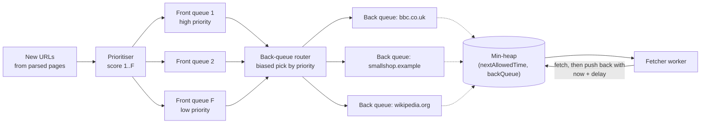

# URL Frontier and Politeness

## 1. One-line summary

The **URL frontier** is a web crawler's to-do list: the set of URLs discovered but not yet fetched, organised so that the crawler fetches **important pages first** (priority) while never hitting **any single website too often** (politeness).

💡 A **web crawler** (or spider, bot) is a program that downloads a page, extracts the links in it, and then downloads those links, over and over. Googlebot is the famous one.

---

## 2. The problem it solves

**The pain:** the naive crawler is a plain FIFO queue (first in, first out). Pop a URL, fetch it, push its links. Two things go wrong immediately:

1. **You DoS small websites.** A page on `smallshop.example` links to 500 other pages on the same site. They all land next to each other in the queue, and 200 crawler threads fetch them in parallel. The shop's tiny server falls over, and its owner blocks your crawler's IP range. 💡 **DoS** (denial of service) means overloading a server until it can't serve real users.
2. **You waste fetches on junk.** A FIFO treats the BBC homepage and page 9,000 of a calendar the same. With a fixed budget of fetches per day, the order matters.

How fast must we go? Say the target is **1 billion pages per month**:

```
1,000,000,000 pages / (30 days × 86,400 s) = 1e9 / 2,592,000 s ≈ 386 pages/s
```

If each host may receive **at most 1 request per second**, then at any moment we need **at least 386 different hosts** being fetched in parallel. At a gentler 1 request every 10 s per host, we need 386 × 10 ≈ **3,860 hosts in flight**. So politeness isn't just manners: it decides how many hosts the frontier must juggle at once.

**The fix:** split the frontier into two layers. **Front queues** decide *what is important*. **Back queues**, one per host, decide *when a host may be hit again*. A small heap tells workers which host is next allowed.

> Infra analogy: this is **per-tenant rate limiting plus fair queueing**. In a multi-tenant API you don't let one noisy tenant use all the capacity, and you give each tenant its own token bucket ([rate limiter](../../LLD/interviews/rate-limiter/README.md)). Here the "tenants" are websites, and the crawler limits *itself* on their behalf.

---

## 3. How it works

### 3.1 The Mercator frontier (front queues + back queues)

The classic design comes from the **Mercator** crawler at Compaq/DEC (Heydon & Najork, 1999), and the two-layer frontier is described in Najork & Heydon, *High-Performance Web Crawling* (2001). The textbook *Introduction to Information Retrieval* (Manning, Raghavan & Schütze, 2008) explains the same design.



Step by step:

1. **Prioritiser.** Each new URL gets a score (e.g. PageRank-like importance, where a page scores higher when many important pages link to it, plus how often the page changes and site quality) and goes into one of `F` **front queues**, one per priority level.
2. **Router.** When a back queue runs empty, the router refills it by pulling from the front queues, choosing high-priority queues more often (a weighted random pick, so low priority still moves a little and never starves).
3. **Back queues.** Each back queue holds URLs of **exactly one host**. A table `host → backQueueId` makes sure all URLs of `wikipedia.org` land in the same queue. If a URL's host has no queue yet, it waits in the front layer (or is parked) until a back queue frees up.
4. **Heap of next-allowed times.** A **min-heap** holds one entry per back queue: `(nextAllowedTime, queueId)`. 💡 A **min-heap** is a structure that always gives you the smallest item in O(log n) time; Java's `PriorityQueue` is one ([TreeSet and PriorityQueue](../../LLD/libraries/java/treeset-and-priorityqueue.md)).
5. **Fetcher loop.** A worker pops the heap top. If its time is in the future, it waits. Otherwise it takes one URL from that back queue, fetches it, then pushes the queue back into the heap with `nextAllowedTime = now + delay`.

Because a host has exactly one back queue and that queue is in the heap at most once, **no two workers ever fetch the same host at the same moment**. Politeness is enforced by the data structure, not by hoping.

**How many back queues?** The IR textbook suggests about **3× the number of fetcher threads**, so that workers rarely find every queue "not allowed yet". With 1,000 threads: 3 × 1,000 = 3,000 back queues, which matches the ~3,860 hosts in flight from section 2 in order of magnitude.

### 3.2 Choosing the delay

Common rules, from simple to adaptive:

| Rule | Example |
|---|---|
| Fixed gap per host | 1 request per second |
| Proportional to last fetch time (Mercator heuristic) | fetch took 200 ms → wait 10 × 200 ms = 2 s. A slow server is a busy server, so back off more. |
| Respect server signals | `429 Too Many Requests` or `503` → double the delay; honour `Retry-After` if present ([retries and backoff](retries-backoff-and-dlq.md)) |
| Per-IP, not only per-host | 5,000 small sites on one shared hosting IP are one physical server. Group by IP as well. |

### 3.3 robots.txt

**robots.txt** is a plain text file at the root of a site (`https://example.com/robots.txt`) where the owner says which paths crawlers may fetch. It's a convention from 1994 that became a standard only in **RFC 9309 (September 2022)**.

```
User-agent: *
Disallow: /cart/
Disallow: /search
Allow: /search/help

User-agent: BadBot
Disallow: /
```

- `Disallow: /cart/` means "don't fetch anything under /cart/". `Disallow: /` blocks the whole site.
- When rules overlap, the **longest (most specific) matching path wins**. `/search/help` above is allowed.
- **`Crawl-delay: 10`** ("wait 10 s between requests") is **not part of RFC 9309**. Google ignores it; some other crawlers (e.g. Bing) have documented support. Your crawler may honour it, but you can't rely on sites using it.
- **Cache it per host.** RFC 9309 says crawlers should not use a cached copy for **more than 24 hours** (unless the file is unreachable). Fetch it once, store it next to the back queue, refresh daily.
- **Error handling (RFC 9309):** a 4xx (file not found) means "no rules, crawl anything". A 5xx (server error) means "assume everything is disallowed" for now, because a broken server is exactly the one you shouldn't hammer.
- robots.txt is a **request, not access control**. Polite crawlers obey it; it hides nothing from bad ones.

### 3.4 URL normalisation

The same page has many spellings. Normalise before you check "seen?" ([content fingerprinting and dedup](content-fingerprinting-and-dedup.md)):

| Raw | Normalised |
|---|---|
| `HTTP://Example.COM:80/a/./b/../c` | `http://example.com/a/c` (lowercase scheme/host, drop default port, resolve `.` and `..`) |
| `https://example.com/page#section-2` | `https://example.com/page` (the `#fragment` never reaches the server) |
| `https://example.com/p?utm_source=x&id=7` | `https://example.com/p?id=7` (drop known tracking params, sort the rest) |

Be careful: dropping query params is a heuristic. `?id=7` and `?id=8` are different pages.

### 3.5 Spider traps

A **spider trap** is a site that generates infinite URLs: a calendar with a "next month" link forever, session IDs in every URL (`;jsessionid=...`), or `/a/b/a/b/a/b/...` from broken relative links. Defences:

- Max URL length (e.g. 2,000 chars) and max path depth.
- A **per-host page budget** (e.g. at most N pages per host per crawl cycle, larger for important hosts).
- Strip session-ID parameters during normalisation.
- Content dedup: if 1,000 "different" URLs return near-identical pages, stop expanding that pattern.

### 3.6 Recrawl scheduling

The web changes, so URLs come back into the frontier. A news homepage changes every few minutes; a 2009 blog post never does. Estimate each page's **change rate** from history: if 3 of the last 10 visits found a change (compare content fingerprints), it changes on ~30% of visits, so shorten its interval; if 0 of 10, double it (up to a cap). Recrawl entries are simply URLs re-inserted into the front queues with a "not before" time, which is a [timer / delay queue](../../LLD/concepts/timers-delay-queues-and-timing-wheels.md) problem. Conditional requests make an unchanged recrawl cheap: the crawler sends `If-Modified-Since: <last fetch time>` or `If-None-Match: <ETag>` (an **ETag** is a version tag the server put on the previous response), and if nothing changed the server replies `304 Not Modified` with no body.

---

## 4. When to use it

- Any **crawler** or **scraper** that hits third-party sites: search engines, price comparison, link checkers, archive bots.
- Any system that sends work to **many independent downstreams with their own limits**: webhook delivery (one queue per customer endpoint), outbound email (per receiving domain limits), API fan-out to partners.
- Whenever "fair share per key" matters more than global FIFO order.

## 5. When NOT to use it (and why it's a mistake)

| Situation | Why |
|---|---|
| Crawling one site you own (internal docs, a sitemap) | One host means one back queue; the whole structure collapses to a single rate-limited loop. Use the sitemap. |
| Small, one-off scrape of a few hundred URLs | A queue + `sleep(1s)` is enough. The two-layer frontier is engineering for millions of hosts. |
| Work with no per-target limit (internal jobs on your own autoscaled fleet) | Plain work queue ([Kafka](../technologies/kafka.md) or SQS) is simpler. |

---

## 6. Commonly confused with

| | **URL frontier** | **Plain FIFO work queue** | **Rate limiter** | **Priority queue** |
|---|---|---|---|---|
| Orders by | priority, then per-host readiness | arrival | n/a (allows/denies) | one score |
| Per-key fairness | yes (one back queue per host) | no | yes, per key | no |
| Who is protected | the *remote* sites | nobody | *your* service from callers | nobody |
| Waits until allowed? | yes, heap of next-allowed times | no | caller is rejected (429) | no |

---

## 7. Common mistakes / misuse

1. **Single global queue with a global rate limit.** 1,000 req/s total can still be 1,000 req/s to one host.
2. **Politeness per hostname only.** `a.blogspot.com` and `b.blogspot.com` may be one server farm; thousands of domains may share one IP.
3. **Fetching robots.txt before every page**, or never refreshing it. Cache per host, ~24 h.
4. **Forgetting DNS.** Every new host needs a DNS lookup before the first fetch, and that latency adds up ([DNS](../technologies/dns.md)).
5. **No trap defences.** One infinite calendar can eat a crawler's budget for days.
6. **Normalising too aggressively** (dropping all query params) and losing real pages.
7. **Treating robots.txt as security** in a design ("we put /admin in robots.txt").

---

## 8. Interview cheat-sheet

> "The frontier has two layers, like Mercator. Front queues hold URLs by priority, so important and fast-changing pages go first. Back queues are one per host, and a min-heap keyed by each host's next-allowed time tells a fetcher which host it may hit now; after a fetch the host goes back in with now plus a delay, for example 10× the last response time, so no host is ever hit concurrently. At 1 billion pages a month that's about 386 pages per second, so with one request per second per host we need hundreds to thousands of hosts in flight, and about 3× as many back queues as fetcher threads. We obey robots.txt, cached per host for up to 24 hours per RFC 9309, and back off on 429 and 503. Before enqueueing we normalise URLs and apply per-host page budgets to escape spider traps."

---

## 9. Used in

- [Web Crawler](../interviews/web-crawler/README.md): the **frontier design**: front queues for priority, per-host back queues and a next-allowed-time heap for politeness, robots.txt caching, traps and recrawl scheduling (see the [L4](../interviews/web-crawler/L4-mid.md), [L5](../interviews/web-crawler/L5-senior.md) and [L6](../interviews/web-crawler/L6-staff.md) answers).
- Related: [content fingerprinting and dedup](content-fingerprinting-and-dedup.md) (the "seen?" checks), [DNS](../technologies/dns.md) (host resolution), [consistent hashing](consistent-hashing.md) (a way to map keys to nodes that moves few keys when nodes change; here: assigning hosts to crawler nodes so one node owns each host's back queue), [Bloom filters](bloom-filters.md) (compact "probably seen" bit arrays for the seen-URL check), [timers and delay queues](../../LLD/concepts/timers-delay-queues-and-timing-wheels.md).
